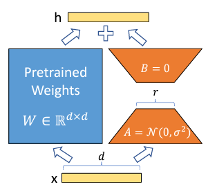

### PEFT 등장 배경
LLM은 그 크기가 커질 수록 정확도가 높아진다는 연구 결과가 발표된 후 pre-trained 모델의 크기를 점점 키우는 것이 유행(?)이 되었다. 하지만 이를 downstream task에 적용하기 위해서는 fine-tuning을 해야 하는데 많은 경우 가용한 자원은 제한적이기 때문에 모든 가중치를 전부 tuning하는 것은 불가능하다. 따라서 PEFT 기법이 등장하게 되었다.  
**PEFT**는 `Parameter Efficient Fine-Tuning`의 약자로, 사전 학습된 모델의 대부분의 가중치를 freeze한 뒤 일부 parameter만 fine-tuning 하는 방식이다. 이 방식은 **리소스를 절약**할 뿐만 아니라 fine-tuning 시 pre-trained 정보를 잊어리는 **catastrophic forgetting 또한 해결**할 수 있다고 한다.  
실제로 PEFT 기법을 적용하면 약 40GB 정도를 차지하는 모델의 체크포인트는 고작 몇 MB밖에 되지 않으며, 그 성능 또한 full fine-tuning 하는 것만큼의 효과가 있다.  

## PEFT 기법 종류
PEFT 기법에는 Knowledge Distillation, Pruning, Quntization, Low Rank Factorization, Knowledge Injection, Adapter Modules 등 다양한 방식이 있지만 LLM에서 주로 사용되는 **LoRA**, **Prompt Tuning**, **Prefix Tuning**에 대해서 다뤄보도록 하겠다.  

### LoRA
LoRA는 Low-Rank Adaption의 줄임말이다. 앞서 언급한 Low Rank Factorization 기법을 활용하여 LLM의 출력단과 가까운 linear layer에 대한 업데이트를 근사화하는 기술이다. 결과적으로 훈련 가능한 매개변수가 크게 감소하여 훈련 속도가 급증하고, 모델의 최종 성능에 거의 영향을 주지 않는다.  
  
<figcaption style="text-align:center; font-size:15px; color:#808080; margin-top:0px">출처: <a href="https://arxiv.org/pdf/2106.09685">LoRA: Low-Rank Adaptation of Large Language Models</a></figcaption>  

### Prompt Tuning
LLM이 특정 task를 수행하기 위해 자연어로 프롬프트를 주는 방법이다. 예를 들어 STS를 수행하기 위해서 <다음 두 문장이 의미적으로 얼마나 유사한지 0-5 사이의 float형으로 출력하시오>와 같은 가이드를 입력 sequence의 앞에 제공하는 것이다. 이 프롬프트에 해당하는 embedding은 task에 따라 바뀔 수 있고, 모델을 통과하며 모델이 잘 이해하는 형태로 학습된다. 결과적으로 모델이 프롬프트에 따라 수행해야 하는 task를 보다 잘 수행하게 되는 것이다.  

### Prefix Tuning
입력 sequence의 가장 앞에 `[CLS]` token과 같이 embedding block을 하나 추가하여 해당 블럭이 학습되게 하는 방식이다. 모델이 입력 데이터에 대한 압축적 표현 즉, 핵심 의미를 잘 파악하게 하는 효과가 있다. 

  
> **출처**  
Hugging Face: [PEFT: Parameter-Efficient Fine-Tuning on Billion-Scale Models on Low-Resources Hardware](https://huggingface.co/blog/peft)  
LoRA 논문: [LoRA: Low-Rank Adaptaion of Large Language Models](https://arxiv.org/pdf/2106.09685)  
tistory 포스팅: [LLM fine-tuning 전략 | PEFT - Parameter Efficient Fine Tuning](https://littlefoxdiary.tistory.com/120)  