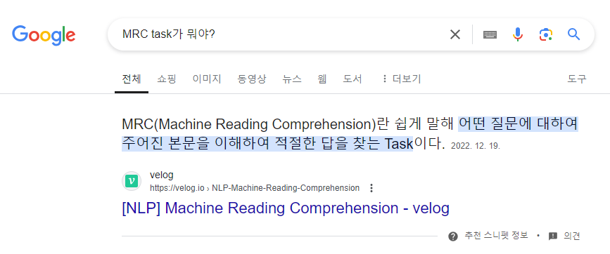
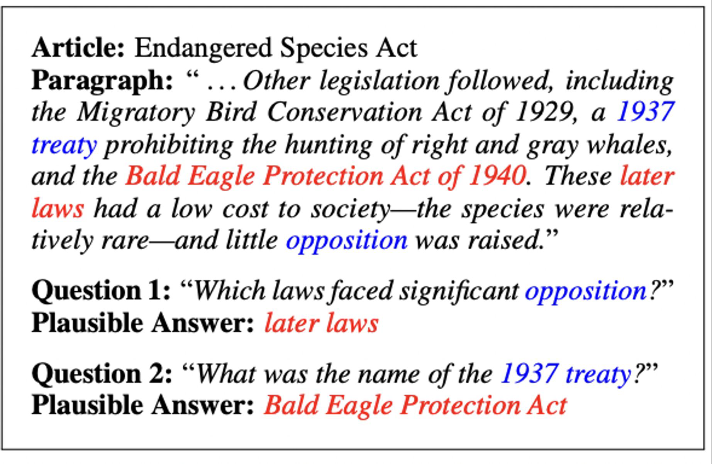

분명 며칠 전에 STS 프로젝트가 끝났는데.. 다시 또 시작이다. 이번에 MRC. 아자아ㅈ..🫠  

### MRC란?
MRC는 Machine Reading Comprehension이라고 하는 기계 독해 task이다. 사람이 document을 읽고 이해하는 것처럼 AI와 같은 기계가 document를 읽고 문맥을 이해하는 task를 말한다. 이때 기계가 잘 이해했는지 확인하기 위해 질문을 던지고, 기계가 대답하는 형식에 따라 몇 가지 세부 task들로 나뉜다.  
MRC는 일반적으로 계약서 조항 탐색, 뉴스 요약 및 질문 응답 등의 분야에서 다양하게 사용되고 있는 NLP의 아주 중요한 task이다. 아래 이미지에서 확인할 수 있는 검색 엔진 또한 MRC task의 일종이라고 할 수 있다.  

<figcaption style="text-align:center; font-size:15px; color:#808080; margin-top:0px">구글 검색 결과</figcaption>  

## MRC task의 종류  
MRC는 기계가 응답할 수 있는 방법에 따라 Extractive Answer, Descriptive/Narrative Answer, Multiple-Choice로 구분된다.  

### Extractive Answer  
question에 대한 답이 주어진 context의 segment 또는 span으로 존재하는 task이다. 간단히 말해 context라는 글을 제공하면, 해당 글에 등장하는 내용을 정확히 사용하여 응답하는 것이다.  
대표적인 데이터셋으로 SQuAD, KorQuAD, NewQA, Natural Questions 등이 있다.  

### Descriptive/Narrative Answer  
question에 대한 답이 주어진 context와 관련이 있지만, 정확한 표현이 존재하지 않는 경우이다. 주어진 context를 이해하고 기계가 질문에 해당하는 답을 자체적으로 만들어야 한다.  
대표적인 데이터셋으로 MS MARCO, Narrative QA가 있다.  

### Multiple-Choice  
question에 객관식 선지들을 함께 제공하고, 기계는 그 중 답을 선택한다. 일반적으로 자연스러운 상황과는 거리가 멀다. 하지만 답이 명확하기 때문에 모델을 명확히 평가할 수 있고, 실제 환경에서의 하위 능력에 해당하는 이해, 추론 등의 성능이 향상될 수 있다.  
대표적인 데이터셋으로 MCTest, RACE, ARC 등이 있다.  

## MRC task의 어려운 점  
MRC task에서는 context를 제공하기 때문에 기계가 해당 context를 얼마나 이해했는지에 대해서 어려움이 존재한다.  

### 의미의 유사성 이해
context가 question에 대해 직접적으로 언급하고 있는지, 의미적으로 포함하고 있는지에 대한 모델의 판단이 어렵다. 대표적으로 DuoRC, QuoRF라는 데이터셋이 있다. DuoRC는 question에 대한 응답이 context에 'A는 B이다'와 같이 명확히 존재하는 반면에, QuoRF는 'A는 C 했고, D 했다'라는 문장에서 C와 D를 통해 A는 B임을 추론해야 하는 형태이다.  
여담이지만 개인적으로 이건 국어, 영어 수능에서도 나오듯이 모델만의 문제가 아닌 것 같은데.. ㅎㅎ

### 답이 없는 문제  
question에 대한 answer를 context에서 찾을 수 없는 경우, 모델이 엉뚱한 답을 내놓을 때를 말한다. 주어진 보기에서 응답을 찾을 수 없다면 'No answer'이라는 출력을 하는 것이 더 자연스럽다. 하지만 아래 예시와 같이 context에서 반드시 응답을 출력하는 것 때문에 모델의 출력에 대한 후처리가 필요하다.  

<figcaption style="text-align:center; font-size:15px; color:#808080; margin-top:0px">출처: <a href="https://arxiv.org/pdf/1806.03822"
>SQuAD 논문</a></figcaption>  
사진의 출처인 SQuAD 논문의 데이터셋은 해당 어려움에 대한 대표적인 데이터셋이다.  

### Multi-hop Reasoning  
question에 대해서 여러 context, 또는 단계별 추론 과정을 거쳐 answer를 도출해내야 하는 경우가 있다. 이는 단일 context 내에서 모델이 한 번에 모든 관계를 파악하기 어렵기 때문에 MRC task의 어려움 중 하나가 된다. 대표적으로 HotpotQA, QAngaroo 데이터셋이 있다.  

## Metrics
### EM, F1-score
앞서 MRC task의 종류에서 언급했던 Extractive Answer, Multiple-Choice 문제에서는 Exact Match와 F1-score가 사용된다.  
Exact Match는 Accuracy라고도 하며, 모델이 출력 결과로 내놓은 문장과 정답이 완벽하게 일치하면 전체 점수를 부여하고, 한 단어라도 틀릴 경우 0점이 되는 평가 지표이다.  
$$\frac{\text{정답 sample의 수}}{\text{전체 sample의 수}}$$  

F1-score는 Precision과 Recall의 조화 평균을 계산한다. 이때 Precision은 예측한 답변 중 실제 정답인 단어의 비율을 말하고, Recall은 실제 정답 중 예측된 답변에 포함된 단어의 비율을 말한다.  
$$\text{F1} = 2 \times \frac{\text{Precision} \times \text{Recall}}{\text{Precision} + \text{Recall}}$$  

### ROUGE-L, BLEU  
ROUGE-L과 BLEU 모두 n-gram의 개념을 적용해서 최대 단어의 개수를 정한 뒤 겹치는 단어의 개수를 탐색한다. 이 지표는 주로 context에 직접 명시되어 있지 않은 answering에 적용되는데, 앞서 설명한 EM과 F1-score으로는 모델이 생성한 문맥의 자연스러움을 고려할 수 없기 때문에 이러한 방식을 사용한다.