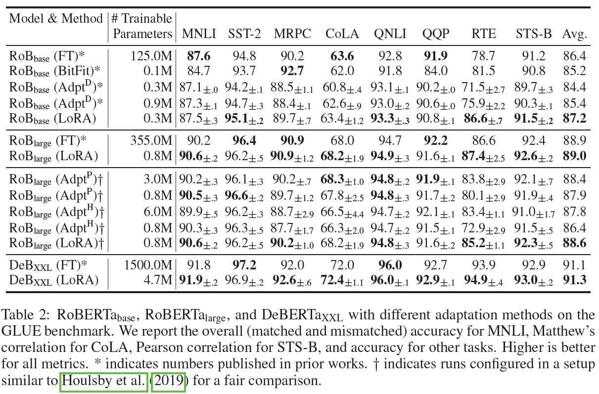
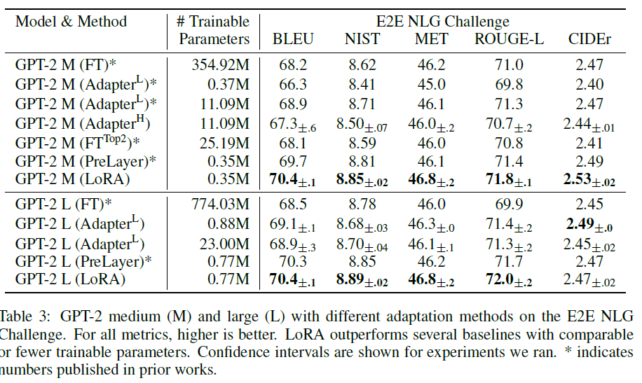

---
title: LoRA 논문 리뷰
date: 2024-10-02 00:00:00 +09:00
categories: [AI, 논문]
tags: [NLP, PEFT, LoRA]
use_math: true
--- 
# LoRA: Low-Rank Adaptation of Large Language Models  
> **citation**  
Hu, Edward J., et al. "Lora: Low-rank adaptation of large language models." arXiv preprint arXiv:2106.09685 (2021).  

인용 횟수가 무려 6800회  

### Abstract  
NLP에서 가장 중요한 패러다임 중 하나는 fine-tuning을 통해 특정 task나 도메인에 잘 맞는 형태로 변형하여 사용하는 것이다. full fine-tuning은 메모리와 리소스의 제약으로 인해 실현 불가능한 경우가 많은데, 본 논문에서 제안하는 LoRA는 학습 가능한 `rank decomposition matrices`를 삽입하여 리소스를 최소한을 사용하며 full fine-tuning과 같은 효과를 낼 수 있다. 이는 튜닝할 때는 물론 추론 시에도 추가적인 지연 발생이 없다.  

## 1. Introduction  
기존의 방식들은 주로 adapter 레이어를 사용하는 방식을 취하는데, 이는 fine-tuning 시 적은 양의 파라미터만 조정하면 된다는 장점을 갖는다. 하지만 새로운 레이어를 끼우는 것이기 때문에 추론 시 지연이 발생할 수 있으며, 가장 치명적인 단점은 수행하려는 task에 적합하지 않은 형태로 조정될 수 있다는 것이다.  
LoRA 또한 학습 가능한 새로운 가중치 벡터를 적용한다는 점에서 adapter와 아이디어가 비슷하지만, 대량의 가중치로 표현된 모델은 저차원의 공간에서 재현 가능하다는 개념을 접목했다. 이에 따른 LoRA의 장점은 아래와 같다.  

1. pre-trained 모델은 여러 개의 작은 LoRA 모듈을 교체하는 방식으로 다양한 downstream task를 수행할 수 있다.  
(여기서 LoRA 모듈이란, 저랭크로 분해된 A, B 행렬)
2. LoRA를 적용한 학습은 full fine-tuning에 비해 효율적이며, 하드웨어 사용량을 약 3배 가량 절약할 수 있다.  
3. 학습 가능한 행렬을 단순한 선형 연산(덧셈)만으로 기존의 가중치에 결합할 수 있다.  
4. prefix-tuning과 같이 다양한 학습 기법들과 함께 적용될 수 있다.  

**Technologies and Conventions**  
$d_{model}$: Transformer 레이어의 입출력 차원 수  
$W_q, W_k, W_v, W_o$: 각각 query, key, value, output 행렬  
$\Delta W$: adaptation 시 축적되는 gradient update 행렬  
$r$: rank  
이때 rank란, 행렬에서 독립인 행/열의 수를 의미하는데, LoRA에서 이 rank값에 해당하는 작은 가중치 update 벡터를 생성하여 해당 벡터를 학습한다.  
최적화 함수로는 $\text{Adam}$을 사용했고, Transformer의 MLP feedforward 차원은 $d_{ffn} = 4 \times d_{model}$을 적용했다.  

## 2. Problem Statement  
LoRA는 자연어 모델들에 한정되지 않고 deep neural network를 가진 구조의 모델이라면 어떤 분야에도 적용될 수 있다. 본 논문에서는 자연어 모델링에 집중하여 아래와 같은 수식을 통해 문제 정의를 수행했다. (현재 수식 블럭 작성이 안 되어 인라인 형식으로 대체합니다.)  

**full fine-tuning**  

$$\max_\Phi\sum_{(x,y)\in Z}\sum_{t=1}^{|y|}\log (P_{\Phi}(y_t|x, y<t))$$  

위 식은 full fine-tuning 시 계산되는 gradient 식이고, 해당 식을 통해 위 식을 통해 사전 학습된 가중치 $\Phi_0$는 $\Phi_0 + \Delta \Phi$로 업데이트 된다.  
이때 $|\Delta\Phi|=|\Phi_0|$이기 때문에 GPT-3과 같이 1750억 개의 파라미터를 갖는 경우 fine-tuning의 어려움이 발생한다.  
> $P_\Phi(y|x)$: 사전 학습 모델이 가중치 $\Phi$로 학습된 상태.  
$Z = {(x_i, y_i)}_{i=1,...,N}$: fine-tuning을 위해 사용되는 downstream task의 데이터셋  
위 식은 주어진 데이터셋 내에서 다음 생성한 단어가 맞을 확률을 log probability로 계산하여, 해당 값을 최대화하는 maximum likelihood  

**LoRA fine-tuning**  

$$\max_\Theta\sum_{(x,y)\in Z}\sum_{t=1}^{|y|}\log (p_{\Phi_0}+\Delta\Phi(\Theta)(y_t|x, y<t))$$  

task specific 가중치의 gradient인 $\Delta\Phi=\Delta\Phi(\Theta)$를 $\Theta$로 조정했다.  
(이때 $|\Theta|<<|\Phi_0|$)  
결과적으로 GPT-3의 1750억 개의 파라미터 중 0.01%의 양만 사용해도 미세 조정이 가능하다.  

## 3. Aren't Existing Solutions Good Enough?  
**Adapter Layers Introduce Inference Latency**  

1. 오리지널 디자인: Transformer 블럭 당 두 개의 adapter 레이어 적용  
2. 이후 등장한 디자인: 블럭 당 한 개의 adapter 레이어와 추가적인 LayerNorm  

해당 방식들은 모델의 중요하지 않은 레이어를 삭제하거나, 멀티태스크 학습에서 연산 자원을 공유하는 등 효율적인 형태로 변형할 수 있지만, adapter 레이어의 연산은 반드시 수행해야 하며, 병렬 처리가 아닌 순차 처리를 요구하기 때문에 때로 추론 지연을 보이기도 한다.  

**Directly Optimizing the Prompt is Hard**  
prefix tuning을 사용한 미세 조정 방식은 최적화가 어렵고, 성능 향상이 잘 이루어지지 않는다. 또한 입력 sequence의 일부를 prompt로 사용하는 것이기 때문에 downstream task에서 사용할 수 있는 입력 길이를 제한한다는 단점이 있다.  

## 4. Our Method  
### 4.1 Low-Rank-Parametrized Update Matricies  
사전 학습된 모델을 사용하여 특정 task에 적합한 형태로 만들 때(task adaptation) 실제로는 대규모 벡터보다 더 작은 차원(low intrinsic dimension)에서 동작한다는 발견이 있었다. 이로부터 업데이트되는 가중치 벡터 또한 저차원 내에서 동작할 것이라는 가설을 세우고, 아래와 같은 수식을 세웠다.  

$$h = W_0x + \Delta W_x = W_0x + BAx$$  

>$W_0 \in \mathbb{R}^{d \times k}$ , $B \in \mathbb{R}^{d \times r}$, $A \in \mathbb{R}^{r \times k}$ ($r << \text{min}(d, k)$)  
$W_0$는 frozen, $A$, $B$는 학습 가능한 가중치 벡터  
학습 과정에서 같은 입력 $x$를 사용해서 $W_0$과 $\Delta W=BA$에 곱하여 요소별 덧셈으로 업데이트  

$A$는 `Gaussian initialization` 적용, $B$는 0으로 초기화해서 초기 gradient를 의미하는 $AB$는 $\Delta W$와 동일하게 0에서 시작한다.  
$\Delta W$를 $\frac{\alpha}{r}$로 scaling하는데, 이때 Adam으로 최적화를 수행할 때 $\alpha$는 학습률을 조정하는 것과 같은 효과를 보였기 때문에 $r$에 대해 $\alpha$를 고정하는 것으로 결정했다고 한다. 결과적으로 하이퍼파라미터 튜닝 시 고려해야 하는 변수를 하나 덜게 되었다.  
```python
def forward(self, x: torch.Tensor):
    def T(w):
        return w.transpose(0, 1) if self.fan_in_fan_out else w
    if self.r > 0 and not self.merged:
        result = F.linear(x, T(self.weight), bias=self.bias)
        if self.r > 0:
            result += (self.lora_dropout(x) @ self.lora_A.transpose(0, 1) @ self.lora_B.transpose(0, 1)) * self.scaling
        return result
    else:
        return F.linear(x, T(self.weight), bias=self.bias)
```  
코드를 보면 $AB$를 계산하고 $\frac{\alpha}{r}$를 곱하는 방식으로, 기존의 $\Delta W$를 해당 값을 나눈 결과가 $AB$인 것을 알 수 있다.  

**A Generalization of Full Fine-tuning**  
LoRA가 적용된 위 식에서 $A$와 $B$는 전체 가중치 벡터를 분해한 작은 벡터들로, 모델의 전체 표현을 rough하게 대표한다는 의미를 갖는다.  

**No Additional Inference Latency**  
LoRA는 연산한 $AB$를 사전 학습된 가중치 $W_0$에 더해주는 방식이다. 따라서 추론 시 Adapter 레이어와는 다르게 추가적인 레이어를 거치는 등의 연산을 수행하지 않는다.  

### 4.2 Applying LoRA to Transformer  
LoRA는 agnostic하여 신경망 구조를 가진 모든 분야의 모델에 적용할 수 있으나, NLP task가 대세를 이루게 되며 초거대 모델들이 등장하여 본 논문에서는 자연어 모델에 적용한 예를 들었다.  
Transformer에는 attention을 연산하는 네 개의 가중치 벡터들($W_q, W_k, W_v, W_o$)과 두 개의 MLP feedforward 모듈이 있다. 본 실험에서는 attention을 연산하는 벡터들만 고려하였으며, 그 크기를 $d_{model} \times d_{models}$로 제한(head들로 쪼개지는 것 고려 X)하였다.  

**Practical Benefits and Limitations**  
- 장점 1: 메모리와 저장 공간의 절약  
    - Adam 사용  
    - $r << d_{model}$일 경우 기존의 VRAM 사용량의 약 $\frac{2}{3}$ 감소  
- 장점 2: 자유로운 task 전환  
    - 사전 학습된 가중치를 학습하지 않기 때문에 LoRA 가중치들만 교체하면 됨  
- 단점 1: batch마다 다른 task 또는 다른 특징의 데이터들이 있다면, LoRA 모듈들을 바꿔 끼워야 하기 때문에 빠르지 못함  
(full fine-tuning이든 어떤 방식이든 발생하는 일 아닌가 싶다. 아님 내가 잘못 이해했다거나..)  

## 5. Empirical Experiments  
모델은 RoBERTa, DeBERTa, GPT-2에 대해 사전 실험을 수행하고 1750억 개의 파라미터를 가진 GPT-3에 적용했다.  
데이터셋은 Natural Language Understanding, Natural Language Inference 수행을 목표로 했다. RoBERTa와 DeBERTa에는 GLUE를 사용했지만, GPT의 경우 동일한 환경에서의 비교를 위해 GPT-2에는 WikiSQL을 추가하고, GPT-3에는 SAMSum을 적용하였다.  
GPU 서버는 NVIDIA Tesla V100을 사용하였으며, 추가적인 세팅을 Appendix C를 참고하면 된다.  

### 5.1 Baselines  
LoRA 기법을 적용했을 때 성능 향상을 비교하고 평가하기 위해 기존의 여러 adaptation 방식을 소개한다. 아래 그림은 순서대로 RoBERTa와 DeBERTa, GPT-2, GPT-3에 LoRA를 적용하여 fine-tuning한 결과이다.  
  
  
  
**Fine-Tuning**: full fine-tuning 생각하면 된다. 다만, GPT-2와 같은 환경을 유지하기 위해 마지막 두 개의 레이어들에 대해서만 미세 조정을 수행했다.  
**Bias-only for BitFit**: 가중치 행렬에서 bias 벡터들만 조정한다. BitFit에서 소개된 적이 있다고 한다.  
**Prefix-embedding tuning**: 입력 token들에 special token들을 삽입한다. 해당 token들은 학습이 가능하고, 여기서는 prefixing과 infixing을 모두 고려했다. 학습 가능한 파라미터의 수는 총 $|\Theta|=d_{model} \times (l_p + l_i)$이다.  
**Prefix-layer tuning**: 각각의 Transformer 레이어 이후에 있는 모든 활성화 함수들을 튜닝한다. 따라서 학습 가능한 파라미터의 수는 총 $|\Theta|=L \times d_{model} \times (l_p + l_i)$  
**Adapter tuning**: self-attention 모듈과 residual connection 사이에 $\text{Adapter}^H$, MLP 모듈과 LayerNorm 이후에 $\text{Adapter}^L$, 이와 유사한 $\text{Adapter}^P$, 중간에 일부 레이어들을 drop하는 $\text{Adapter}^D$를 고려했다. 결과적으로 학습 가능한 파라미터의 수는 총 $|\Theta|=L_{Adpt} \times (2 \times d_{model} \times r + r + d_{model}) + 2 \times L_{LN} \times d_{model}$이다.  
**LoRA**: 단순함을 위해 실험의 대부분에 $W_q, W_v$에만 LoRA를 적용했다. rank값을 $r$이라고 하면, 학습 가능한 파라미터 수는 총 $|\Theta|=2 \times L_{LoRA} \times d_{model} \times r$이다. 

### 5.2 - 5.5  
RoBERTa-base/large, DeBERTa-XXL, GPT2-medium/large, GPT-3 175B에 대해 간략히 설명하고, 간단한 환경 설정과 함께 각 결과를 비교한다.  

## 6. Related Works  
관련 연구 소개인데 이게 6번으로 나올 줄은 몰랐다..  
Transformer Language Models, Prompt Engineering and Fine-Tuning, Paramete-Efficient Adaptation, Low-Rank Structures in Deep Learning에 대해서 설명하는데, 이 중 중요해 보이는 마지막 항목에 대해서만 간략히 설명하겠다.  

**Low-Rank Structures in Deep Learning**  
다양한 머신러닝 문제들은 특정 low-rank 구조 내에서 해결 가능하다.  
또한 몇몇의 연구에서 대규모의 파라미터를 가진 신경망 네트워크가 학습 이후 또는 학습 중에도 저랭크의 공간에서 활성화된다는 특징을 발견했다.  
하지만 실제로 downstream task 수행을 위한 adaptation 과정에서 저랭크 행렬을 사용한 적은 없었다.  

## 7. Understanding the Low-Rank Updates  
LoRA의 효용성을 증명하기 위해 아래와 같은 세 개의 질문에 응답할 수 있도록 실험을 수행했다.  

1. 파라미터 예산을 제한한 상태에서, 어떤 가중치 행렬에 LoRA를 적용해야 할까?  
2. 최적의 행렬 $\Delta W$가 실제로 rank-deficient한가? 그렇다면 최적의 rank값은 무엇인가?  
여기서 rank-deficient란, 선형 독립인 행과 열의 수가 원래 행렬이 가질 수 있는 최대 크기보다 작은 것을 의미한다. 즉, 해당 질문은 저랭크의 행렬 $A$, $B$로 쪼갰을 때 이 행렬이 adaptation에 유의미한 역할인지를 묻는 것이다.  
3. $W$와 $\Delta W$는 얼만큼의 상관관계를 갖고 있는가?  

### 7.1 Which Weight Matricies in Transformer Should We Apply to?  
  
<figcaption style="text-align:center; font-size:15px; color:#808080; margin-top:0px">손 필기 무시 바람..</figcaption>  

먼저 파라미터 수를 1800만 개로 제한했다(FP16이면 3500만 개). self-attention 모듈을 기준으로 확인한 결과, $W_q$와 $W_k$만을 사용했을 때 유독 낮은 성능을 보였다. 5에서 실험 할 때 $W_q$, $W_v$에만 적용한 근거는 여기에 있는 듯하다.  
왜..?  

### 7.2 What is The Optimal Rank $r$ for LoRA?  
앞서 결과가 좋았던 $W_q$와 $W_v$를 대부분의 경우에 포함하여 실험을 수행한 결과, r값이 매우 작아도 뛰어난 성능을 보이는 것을 알 수 있으며, 각 경우의 편차가 WikiSQL의 경우 0.5%, MultiNLI의 경우 0.1%임을 알 수 있다.  
이를 통해 2번 질문이었던 $\Delta W$가 실제로 rank-deficient함을 알 수 있다. 또한 $r$이 크면 $\Delta W$의 대부분을 커버할 수 있지만 반드시 좋은 결과를 도출할 수 있는 것은 아니다.  

**Subspace similarity between different $r$**과 **Subspace similarity between different random seeds**에서는 $r$을 8과 64로 지정하여 그 유사성을 살펴보고 그 부분 공간들이 상당히 유사함을 시사하지만.. 솔직히 제대로 이해 못했다.  

### 7.3 How does the Adaptation Matrix $\Delta W$ Compare to W?  
  

위 표에서 $||U^TWV^T||_F$는 가중치 벡터 $W$를 $\Delta W$의 $r$ 차원의 부분 공간으로 projection한 벡터이다.  
첫 번째 발견: 유클리디언 거리 계산 법을 적용하여 두 벡터의 유사도를 계산하면 랜덤한 값으로 초기화한 벡터와 비교했을 때 $\Delta W$와 보다 유사한 형태를 보인다.  
두 번째 발견: $\Delta W$는 $W$와 비교하여 방향 정보만을 강하게 증폭해서 담고 있다. 이 방향 정보라는 것은 데이터가 입력되었을 때 어느 방향으로 계산되어야 하는지를 얘기한다. $W$는 기존의 파라미터이기 때문에 기존 정보를 담고 있다면, $\Delta W$는 미세 조정 단계에서 습득한 gradient 정보만을 응축해서 담고 있다는 것이다.  

## 8. Conclusion and Future Work  
앞서 잔뜩 설명했던 LoRA의 장점을 생략하겠다..  
앞으로 더 나아가야 할 부분에 대해서 얘기하고 있다.  
1. 다른 adaptation 방식과 결합  
2. 학습 과정에서 LoRA의 보다 확실한 매커니즘 파악  
3. 적용해야 할 가중치 행렬을 고를 때 경험에 근거하여 수행했는데, 이에 대한 원칙 파악과 설립  
4. $\Delta W$의 rank-deficiency한 특징이 과연 $W$에도 적용될 수 있는지  

## 소감  
이해가 안 되는 내용이 세 가지가 있었다.  

1. LoRA의 아이디어는 overparmetrized model이 downstream task를 수행할 때, 파라미터들이 저랭크에서 활성화 된다는 것에서부터 시작됐다고 했다.  
파라미터들이 저랭크에서 활성화 된다는 것이, adaptation을 하는 과정에서 $\Delta W$가 저랭크에서 활성화 된다는 것인지, adaptation 이후 $W$가 저랭크에서 활성화 된다는 것인지 잘모르겠다. 이는 참고 문헌에서 언급한 논문들을 읽어봐야 할 것 같다.  
2. LoRA의 단점은 입력 batch들마다 수행하려는 task가 다를 경우 모듈 교체의 지연이라고 했는데, 모든 task에서 문제가 되는 점이라고 생각하여 왜 특히 이 부분이 문제인지 모르겠다.  
3. **7.2**의 그림. rank를 다르게 해도 활성화되는 부분이 유사하다는 것 같은데 정확히 그림과 대응하지 못했다.  

가설로부터 시작해서 실험으로 입증하였고, 현재 널리 사용되는 방법론으로 자리매김 한 것은 아주 높이 살 점이지만, LoRA의 내부 동작, 저랭크가 어디에 어떻게 적용되는지 등에 대한 이론적인 정답은 얻을 수 없어 개인적으로 아쉬웠다.