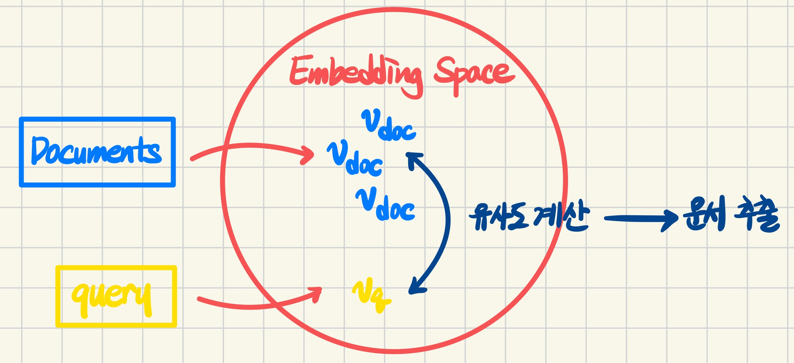

### MRC 개요  
MRC가 무엇인지에 대한 간략한 설명은 [여기](./https://ocean010315.github.io/posts/w8/) 참고하기~  
MRC는 크게 질문의 답을 해줄 문서를 찾는 Retriever과 문서에서 답을 찾는 Reader로 구분된다. 문서를 찾지 않고 바로 응답하는 생성형 기반도 있지만, 이건 나중에~  

# Passage Retriever  
많은 양의 문서, 데이터가 저장되어 있는 데이터베이스로부터 질문에 응답해줄 적절한 문서를 찾는 과정이다.  
먼저 사전 지식이 될 knowledge(문서)들을 임베딩 한다. 임베딩이란, 자연어를 모델 즉, 기계가 이해할 수 있는 벡터 형태로 변환하는 것을 말한다. 문서들을 임베딩하는 것은 특정 차원의 공간으로 projection 하는 것과 같다.  
다음으로 MRC task에서 질문이 되는 query를 이 공간으로 projection 한다. 문서들과 같은 유형으로 벡터화 되었으니 이들의 유사도를 측정하여 질문과 가장 유사한 문서들을 뽑아주는 것이 retriever의 역할이다.  
  

이때 문서들의 문장 임베딩 방식을 기준으로 Sparse Embedding과 Dense Embedding으로 구분할 수 있다.  

## Sparse Embedding  
과거에 주로 사용되던 방식으로, 간단하게 Bag-of-Words를 생각하면 된다. 문서 단위의 벡터는 전체 vocab의 크기를 가지고, 문서에 등장하는 vocab마다 특정 값을 가진다.  
단순히 유무만을 고려하여 0/1로 표기하는 것을 binary 방식, 몇 번 등장하는지를 표기하는 것을 TF(Term Frequency)라고 한다. 전체 vocab과 비교했을 때 대부분의 원소가 0이기 때문에 sparse embedding이라고 한다.  
이때 vocab은 한 단어일 수도 있지만, n-gram 개념을 적용할 수도 있다. 인접한 단어들을 포함하기 때문에 BoW의 크기가 보다 커지지만, 의미를 어느정도 반영할 수 있다.  
이러한 Sparse Embedding의 장점은 단어들의 겹침 정도를 계산할 때 유용하다. 하지만 각 vocab의 벡터를 내적하면 어느 경우에서든 0이 된다. 즉, 단어들의 의미적 유사도 등을 벡터화할 수 없다.  

### TF-IDF  
Sparse Embedding 방식을 사용한 대표적인 문장 유사도 측정 방법이다.  

**TF(Term Frequency)**  
말 그대로 단어의 빈도수를 측정한다. 어떤 단어가 특정 문서에 많이 등장할 수록 해당 문서의 키워드일 것이라는 아이디어에서 기반한 지표이다. 따라서 단어의 빈도수를 측정하는 대상을 전체 문서들이 아닌 특정 문서로 한정한다.  
이때 전체 문서들을 대상으로 각 vocab의 중요도를 측정해야 하기 때문에 문서의 길이를 고려하여 각 문서에서의 vocab의 TF를 normalization하기도 한다.  

**IDF(Inverse Document Frequency)**  
문서 빈도수의 역수이다. 어떤 단어가 특정 문서가 아니라 여러 문서에서 공통적으로 등장한다면 이는 보편적인 단어로, 특정 문서의 키워드가 될 수 없을 것이다. 예를 들면 `is`, `of`, `the`, `a` 등이 있다. 이를 전체 문서에 대한 비율로 표현 후 역수로 변환한다.  

$$\text{IDF}(t) = \log{\frac{\text{N}}{\text{DF(t)}}}$$  

> $\text{N}$: 전체 문서의 수  
$\text{DF(t)}$: Term $\text{t}$가 등장한 문서의 수  

**TF-IDF(Term Frequency-Inverse Document Frequency)**  
단순히 TF와 IDF를 곱한다. 수식으로 표현하면 아래와 같다.  

$$\text{TF(t, d)} \times \text{IDF(t)}$$

결과적으로 어떤 단어가 여러 문서에서 보편적으로 등장하지 않으면서, 특정 문서에서 많이 등장할 수록 그 중요도가 더 높다는 것이다.  
Ex. `a`, `the` 등의 관사는 낮은 값의 TF-IDF를 가질 것이고, 운영체제 전공 책에서는 `OS`라는 단어가 높은 값의 TF-IDF를 가질 것이다.  

파이썬으로 문서의 TF-IDF를 구하기 위해서 `scikit-learn`의 `TfidVectorizer`를 사용하면 간단히 적용할 수 있다.  

### TF-IDF를 retriever로 사용하기  
query를 토큰화하여 문서들의 임베딩 공간으로 projection한다. 이때 문서들의 임베딩 공간에 포함되지 않는 단어들은 삭제하여 불필요한 정보가 검색에 포함되지 않도록 한다.  
벡터화된 query는 하나의 문서로 간주할 수 있다. 따라서 이미 벡터화된 다른 문서들과 유사도를 비교하여 가장 높은 유사도를 가진 문서를 출력한다. 이때 유사도는 K-Nearest Neighbor와 같은 방식을 적용할 수도 있지만, 일반적으로 내적을 사용한다.    
또한 top-k 방식을 적용하여 유사도가 높은 여러 개의 문서들을 출력할 수도 있다.  

### BM25  
기본적으로 TF-IDF의 방식을 사용하지만, 각 문서들의 서로 다른 길이를 고려한다. 따라서 짧은 문서에 등장하는 단어의 중요도가 특히 낮게 측정되지 않도록 한다.  

$$\text{score(D, Q)} = \sum_{term \in Q}^{n} IDF(q_i) \cdot \frac{f(q_i, D) \cdot (k_1 + 1)}{f(q_i, D) + k_1 \cdot (1 - b + b \cdot \frac{|D|}{avgdl})}$$  

> $q_i$: query에서 i번째 token 즉, 대상이 되는 단어(term).  
$IDF(q_i)$: $q_i$에 대한 IDF 값. 여러 문서에 범용적으로 등장하는 단어에 대해 penalty를 부가하는 것.  
$\frac{|D|}{avgdl}$: 문서의 길이를 반영. $avgdl$은 문서들의 평균 길이, $|D|$는 해당 문서의 길이.  
$b$: 문서의 길이를 중요도에 얼만큼 반영할지 결정. 일반적으로 0.75 사용.  
$f(q_i, D)$: $q_i$의 TF 값.  
$k_1$: TF를 중요도에 얼만큼 반영할지를 결정. 일반적으로 1.2-2.0의 값 사용, elastic search에서는 1.2로 설정됨. (잘 이해가 되지 않지만 일단 pass)  

파이썬에서는 간단히 rank_bm25 모듈 설치 후 사용하면 된다.  

## Dense Embedding  
Sparse Embedding의 가장 큰 단점은 단어의 의미를 고려하지 못한다는 것이다. 서로 다른 문서에서 스펠링이 같은 특정 단어가 등장했을 때, 해당 단어가 다른 의미로 사용되었다면, 이를 반영하지 못한다. 또한 전체 문서들에 대한 vocab size가 각 문서 벡터의 차원이 되기 때문에 메모리 사용량이 크다는 것 또한 단점이 된다.  
Dense Embedding은 위와 같은 단점을 해소한다. 대표적인 특징으로 대부분의 요소가 0이 아닌 어떤 값을 갖는다는 것이 있다.  

### Dense Encoder  
Dense Embedding을 구축하기 위해서 일반적으로 신경망을 학습한다. 이 때 query와 문서에 대해 가중치를 공유하지 않는다. 문서들은 그 길이가 길고 많은 정보를 담고 있지만, query들은 그 길이가 짧고 비교적 압축적인 정보를 담고 있기 때문에 서로 다른 방식으로 학습하여 임베딩을 수행한다.  
BERT encoder의 입력을 압축하여 표현하는 `[CLS]` token을 사용한다. `[CLS]` token이 출력한 결과를 바탕으로 아래와 같은 목적 함수를 Negative Log Likelihood를 적용하여 vocab들의 벡터 표현을 학습하게 된다.  

$$\text{D} = \{\langle q_i, p_i^+, p_{i, 1}^-, ..., p_{i, n}^- \rangle\}_{i=1}^m \\
L(q_i, p_i^+, p_{i,1}^-,...,p_{i,n}^-) = -\log\frac{e^{sim(q_i,p_i^+)}}{e^{sim(q_i,p_i^+)} + \sum_{j=1}^n e^{sim(q_i, p_{i, j}^-)}}$$

갑자기 든 생각인데, Sentence BERT를 사용해보면 좋을 것 같다.  

**Negative Sampling**  
query와 문서를 임베딩하는 인코더를 각각 q-encoder, p-encoder(passage의 p)라고 하자. Dense Encoder의 학습 목표는 특정 query에 대해서 q-encoder의 출력 벡터와 정답인 문서에 대해서 p-encoder의 출력 벡터가 유사한 형태를 가지도록 하는 것이다. 반대로, query와 관련 없는 문서에 대해서 p-encoder가 출력한 벡터와는 거리가 멀어야 한다. 이를 negative sampling을 통해 학습한다.  
negative sample들을 뽑는 방법에는 두 가지가 있다.  

1. 전체 문서들(corpus) 내에서 랜덤한 문서(passage)를 뽑는다.  
2. 보다 헷갈리는 negative sample들을 뽑기 위해 점수(Ex. TF-IDF)가 높지만, query의 answer에 해당하는 phrase를 갖지 않는 문서를 뽑는다.  
일반적으로 모델 학습 시 헷갈리는 정보들을 잘 맞추도록 학습하면, 보다 높은 정확도를 보인다고 한다.  

### Dense Encoder를 Retriever로 사용하기  
먼저, q-encoder로 query를, p-encoder로 문서(passage)를 각각 encoding하여 벡터로 변환한다.  
각 벡터들의 유사도를 측정하여 벡터 거리가 가까운 순서대로 문서들의 순위를 지정한다. 이때 top-k 방식을 적용할 수 있다.  
출력한 문서들을 context로 사용해서 reader에 넘기고 answer를 찾는다. 이때 문서들에 대해서 각각 reader를 돌릴 수도 있고, top-k개의 문서들을 하나의 context로 사용해서 reader를 적용할 수도 있다.  
