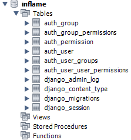

### MySQL
간단한 프로젝트이기 때문에 구조가 복잡하지 않고 무료로 사용이 가능한 MySQL을 사용하고자 한다.  
Django 프로젝트의 가상환경에 MySQL을 연결할 수 있는 Database Connector를 설치한다.  
```bash
pip install mysqlclient
```

### settings.py
프로젝트 생성 후 아무런 작업도 수행하지 않았다면 `settings.py`에 다음과 같이 기본적으로 설정되어 있을 것이다.  
```python
DATABASES = {
    'default': {
        'ENGINE': 'django.db.backends.sqlite3',
        'NAME': BASE_DIR / 'db.sqlite3',
    }
}
```

이를 아래와 같이 바꾼다.
```python
DATABASES = {
    'default': {
        'ENGINE': 'django.db.backends.mysql',
        'NAME': '{database_name}',
        'USER': '{user_name}',
        'PASSWORD': '{password}',
        'HOST': '127.0.0.1',
        'PORT': '3306',
    }
}
```

비밀번호는 프로젝트 최상단에 `my_settings.py`를 만들어 관리하고 Git이 추적하지 못하도록 해당 파일을 `.gitignore`에 추가하도록 한다. 나는 localhost, port 번호까지 전부 my_settings에서 관리했다.  
이 때 `NAME`에 해당하는 이름의 schema를 MySQL에 미리 생성해놔야 한다.  
Workbench를 이용하면 손쉽게 생성이 가능하니 생략!  

이제 migrate를 수행하면 생성한 DB에 Django 프로젝트 관련 테이블들이 생길 것이다.  
```bash
python manage.py makemigrations
python manage.py migrate
```



> **migrate란?**  
테이블 및 필드의 생성, 수정, 삭제 등과 같이 데이터베이스의 변경 사항들을 알려주는 것이다.
> - `makemigrations`: Django에서 database를 생성하기 위한 코드가 `migrations` 디렉토리에 생성된다.  
> - `migrate`: 생성된 코드를 통해 실제로 database에 테이블의 생성, 수정, 삭제 등의 변경 사항을 반영한다.