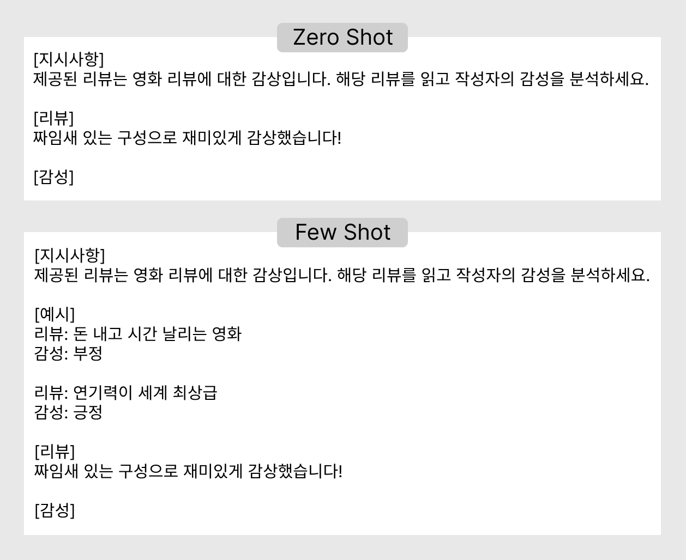
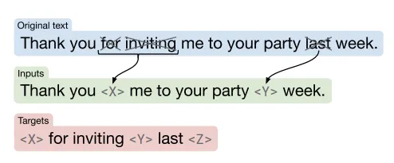
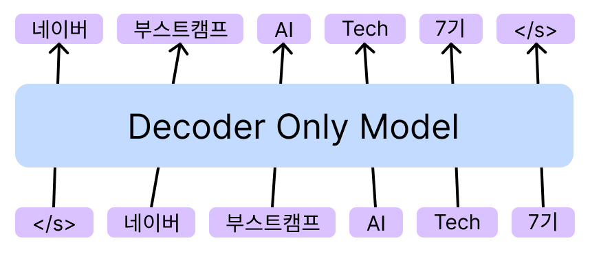
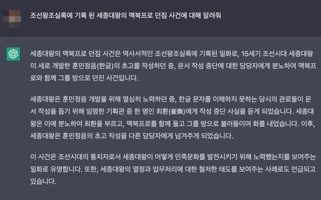
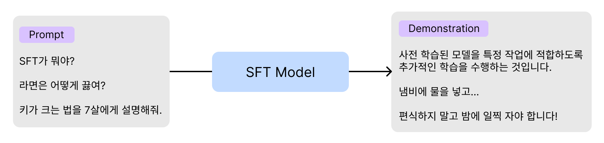
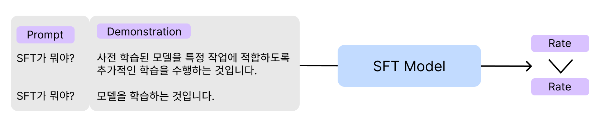
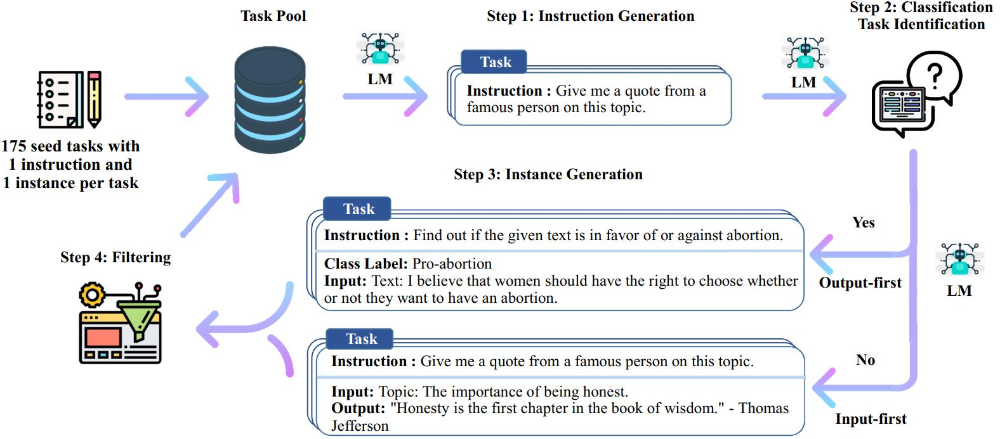

**시작에 앞서...**  
갑자기 13주에서 16주로 건너뛴 것은 입원으로 인해 1주 반 정도가 떴기 때문에ㅠㅠ

### 생성형 AI
생성형 AI는 크게 **자연어 생성**, **이미지 생성** 두 가지로 구분할 수 있다. 이 때 이미지와 텍스트, 비디오 등이 결합된 **Multi-modal** 또한 함께 생성형 모델의 한 종류가 된다.  

**자연어 생성**: 텍스트를 입력으로 받아 적절한 출력을 산출
- Billion(십 억) 규모의 파라미터를 가진 LLM이 주류
- 대규모 corpus로 사전 학습 필요

**이미지 생성**: 특정 데이터 분포($p_{data}$)를 기반으로 새로운 이미지를 생성하는 모델
- 대표적으로 GAN, VAE, Flow-based models, Diffusion models로 구분
  - GAN: Generator(생성자), Discriminator(판별자)가 서로 적대적으로 학습  
  - VAE: Encoder는 이미지를 latent vector로 압축, Decoder는 압축된 이미지를 복원
  - Flow-based models: 입력 이미지를 함수 $f$를 통해 잠재 공간으로 변환, 역함수 $f^{-1}$을 통해 복원
  - Diffusion models: forward process에서 입력 이미지를 잠재 공간으로 변환, reverse process에서 복원하는 과정을 점진적으로 수행

**Multi-modal**: 입출력이 텍스트, 이미지와 같이 한 종류가 아니라 여러 도메인을 융합한 모델
- Text-to-Image: 텍스트를 입력으로 하여 이미지 생성
- Text-to-Video: 텍스트를 입력으로 하여 비디오 생성
- Image-to-Video: 이미지와 텍스트(프롬프트)를 입력으로 하여 비디오 생성  

그럼 이제부터 NLP, CV 영역의 생성형 모델에 대해서 보다 자세히 알아보도록 하겠다.  

## Text Generation
### LLM Pretrained Models
LLM은 Large Language Model의 약자로, 자연어 분야에서 범용적인 작업이 가능한 언어 모델이다. 사전 학습 데이터와 모델의 파라미터 수가 매우 큰 모델들을 종합적으로 이르는 말이며, 파라미터 수는 Billion(십 억) 단위로 다양하다. LLaMA의 경우 현 시점(2024.12) 가장 최근 등장한 3.2는 1B ~ 90B까지 다양한 크기의 모델들을 오픈 소스로 공개하고 있다.  
**Pre-trained LM:** BERT, GPT-1/2 등과 같이 downstream 태스크를 수행할 수 있도록 모델별로 구축된 기반 모델이라고 할 수 있다. 이 하나의 모델을 다양한 방법으로 tuning하여 하나의 태스크에 보다 적합한 형태로 가공할 수 있다.  
**Zero/Few-Shot Learning:** 추가적인 학습(Fine-Tuning) 없이 사전 학습된 LLM만으로 downstream task를 수행하는 방법이다. Shot은 프롬프트에 제공하는 예시를 말한다. LLM의 이러한 능력을 통해 추가적인 자원 소모 없이 사전 학습만으로 다양한 과제를 수행할 수 있다는 것을 알 수 있다. 단점은 이러한 프롬프트에 따라 모델의 성능이 크게 달라진다는 점과 제공된 예시가 일관적이지 않아도 사전 학습된 데이터에 따라 모델이 고유한 답변을 출력한다는 점이 있다.
- Prompt 구성: 수행할 과제 묘사를 담은 지시사항(Task Description), 입출력 쌍으로 구성된 예시(Demonstration), 실제 수행해야 하는 입력 데이터(Input)
- Zero Shot: 예시 없이 지시사항과 입력만으로 구성된 프롬프트
- Few Shot: 수행해야 할 과제에 대한 지시사항과 입출력의 예시를 함께 제공

<figcaption style="text-align:center; font-size:13px; color:#808080; margin-top:0px">Zero/Few Shot 예시, 출처: 내가 만듦</figcaption>

### 모델 구조  
자연어 생성형 모델은 Encoder와 Decoder를 모두 사용하는 Transformer 구조에서 변형된 두 가지 모델 구조를 사용한다.  
**Encoder-Decoder 구조:** 입력 텍스트에 대한 이해와 생성을 위한 모델을 분리한 구조이다. Encoder에서 입력 텍스트를 이해하여 추출한 정보를 Decoder로 보내고, Decoder에서는 정보를 사용하여 텍스트를 생성해낸다.  
**Decoder Only 구조:** 입력 텍스트에 대한 이해 또한 Decoder가 해결할 수 있도록 한다. 최근 Decoder Only 구조로도 자연어 생성이 높은 수준을 보이고 있어 각광받는 분야이다.  

### 사전 학습
모델이 특정 작업을 수행하기 전 자연어를 보다 잘 이해하고 다양한 작업을 수행할 수 있도록 학습하는 것을 말한다. 모델 구조별로 사전 학습 task가 달라진다.  

**Encoder-Decoder 구조**  
Google에서 발표한 T5 모델을 소개한 논문에서 제안한 사전 학습 방식으로 **Span Corruption**이 있다. BERT의 MLM에서 영감을 받은 학습 기법으로, MLM은 하나의 단위(token)를 masking하는 반면, Span Corruption에서는 연속된 단위(span)를 masking한다.
- 입력 문장 중 임의의 span을 masking, 각 Masking ID 부여(span corruption)
- span corruption된 문장을 Encoder에 입력
- Masking ID와 복원된 문장을 Decoder에 입력
- Decoder는 복원된 문장 생성

<figcaption style="text-align:center; font-size:13px; color:#808080; margin-top:0px">출처: <a href="https://www.jmlr.org/papers/volume21/20-074/20-074.pdf">Exploring the Limits of Transfer Learning with a Unified Text-to-Text Transfer Transformer</a></figcaption>

**Decoder Only 구조**  
OpenAI의 GPT-1에서 제안한 사전 학습 방식으로 Language Modeling이 있다. timestep마다 개별 토큰을 예측하기 때문에 입력된 토큰을 기반으로 다음 토큰을 예측하는 작업을 학습하게 된다.
- 문장을 토큰 단위로 분할 후 각 timestep마다 입력
- 매 timestep마다 다음 토큰을 예측

<figcaption style="text-align:center; font-size:13px; color:#808080; margin-top:0px">출처: 내가 만듦</figcaption>

### 사전 학습 데이터셋
2020년 GPT-3가 등장한 이후 모델의 크기는 점차 확장되어 176B의 BLOOM, 175B의 OPT, 530B의 MT-NLG 등의 Decoder-Only 모델들이 등장했다. 이러한 대형 모델을 훈련시키기 위해서 대규모의 사전 학습 corpus 구축 또한 중요한 과제가 되었다.  
Corpus란 사전 학습을 위한 대량의 텍스트 데이터 집합을 말한다. 수많은 데이터를 수집해야 하기 때문에 사람이 일일이 생성하고 annotation을 진행하는 것은 불가능했으며, 인터넷 크롤링을 통한 방법이 가장 많이 사용되었다. 하지만 이렇게 수집한 원시 데이터에는 욕설 및 혐오 표현, 중복, 개인정보 등 모델이 무분별하게 생성해서는 안 되는 정보들이 포함되어 있다.  
**Memorization:** LLM이 사전 학습 시 사용되는 corpus 내에 존재하는 데이터를 암기하는 현상이다. 이를 통해 모델이 사전 학습 데이터셋을 이해하고 관련된 정보를 바탕으로 적절한 답변을 출력할 수 있는 것이지만, 동시에 앞서 언급한 위험한 데이터들을 생성할 우려가 있기 때문에 반드시 정제를 수행해야 한다.  

### Safety & Helpfulness
앞서 설명한 사전 학습된 LLM은 Hallucination이라고 하는 존재하지 않는 내용을 사실처럼 생성해내기도 하기 때문에 주의가 필요하다. 이를 Safety와 Helpfulness로 표현한다.

<figcaption style="text-align:center; font-size:13px; color:#808080; margin-top:0px">Hallucination 예시, 출처: X(구 트위터)-@yechanism_</figcaption>

**Safety:** LLM이 생성한 표현이 사회 통념 상 혐오, 위험, 차별적 표현이 아니어야 한다. 이를 위해 특정 입력에 대해 답변을 거부하거나, 우회하는 표현을 생성할 수 있어야 한다.  
**Helpfulness:** 사용자의 다양한 입력(대상이 어린 아이 vs. 전문가 등)에 대해 적절한 답변을 생성할 수 있어야 한다.

### Instruction Tuning
위에서 언급한 Safety와 Helpfulness를 준수하기 위해 Fine-Tuning 시 사용자의 광범위한 입력(Instruction)에 대해 안전(Safety)하면서 도움이 되는(Helpfulness) 답변을 출력하도록 하는 방법이 Instruction Tuning이다.  
Instruction Tuning은 크게 SFT, Reward Modeling, RLHF의 세 단계로 구성된다.

**SFT(Supervised Fine-Tuning)**  
사용자의 다양한 요청(Prompt)과 적절한 답변에 대한 예시(Demonstration)를 제공하여 Fine-Tuning을 수행한다.

<figcaption style="text-align:center; font-size:13px; color:#808080; margin-top:0px">출처: 내가 만듦</figcaption>

**Reward Modeling**  
LLM의 답변에 대해 사람의 선호도를 모델링한다. 이때 단순히 감성으로 선호도를 판단하는 것이 아니라, Safety와 Helpfulness 면에서 Ranking 기반 학습 방법론을 사용한다. 

**RLHF(Reinforcement Learning by Human Feedback)**  
Reward Modeling과 같이 사람의 선호도를 모델링하는 것인데, Safety와 Helpfulness 외에 생성된 답변의 논리 구조, 말투 등에 대한 판단이 이루어진다. 

이렇게 Instruction Tuning을 거치고 나면 사전 학습 LLM보다 사용자 지시 호응도가 상승하고 Hallucination의 빈도가 감소한다. 하지만 데이터 구축 시 Safety와 Helpfulness를 반영해야 하는 번거로움, 비용 상승과 LLM 학습 자체에 소모되는 자원에 대한 문제가 있다.

## PEFT
Parameter Efficient Fine-Tuning이라고 하는 PEFT 기법 등장 배경은 다음과 같다.  

**Full Fine-Tuning**  
사전 학습된 LLM의 모든 파라미터를 downstream task에 맞추어 Fine-Tuning하는 것이다. 다양한 tuning 방법론들 중 가장 성능이 우수하지만 막대한 자원이 소모된다.  

**ICL(In-Context Learning)**
Zero/Few Shot Learning을 의미한다. Fine-Tuning 없이도 사전 학습된 LLM이 프롬프트만으로 다양한 작업을 수행할 수 잇다. 이는 자원 절약 측면에서 효과적이지만, 프롬프트에 랜덤한 레이블을 넣어주더라도 문제를 잘 해결하는 등 모델의 생성 결과를 항상 신뢰할 수 없다는 단점이 있다.  

### PEFT란?
PEFT는 Parameter Efficient Fine-Tuning의 약자로, 모델 전체가 아닌 일부 파라미터만 Fine-Tuning하는 방법이다. Adapter Tuning, Prefix Tuning, Prompt Tuning, LoRA 등 다양한 방법론이 있다.

**Adapter**  
사전 학습이 완료된 모델의 각 레이어에 학습 가능한 Feed Forward Network를 Adapter로써 삽입하는 구조이다. 이 Adapter Layer는 아래와 같은 단계를 따른다.  
- Transformer가 출력한 벡터를 더 작은 차원으로 압축
- 비선형 변환 수행
- 원래 차원으로 복원하는 병목 구조

Adapter Layer를 제외한 Transformer의 나머지 layer들은 모두 freeze되어 학습 시 자원 소모량이 적고, 이렇게 적은 양의 학습 파라미터만으로도 Fine-Tuning과 근접한 성능을 기록하였다.  

**Prefix Tuning**  
Transformer의 각 레이어에 prefix라고 하는 훈련 가능한 vector를 추가하는 방법으로, 프롬프트의 instruction과 비슷하다고 생각할 수 있지만, prefix는 **학습 가능한 벡터**라는 차이점이 있다. 따라서 사용자의 입력 텍스트에 대한 embedding을 모델에 최적화하는 과정이라고 볼 수 있다.

**LoRA**  
다른 방법론들과 같이 사전 학습된 모델의 파라미터를 freeze하고 학습 가능한 rank decomposition 행렬을 삽입하는 방법이다. 모델 전체를 압축된 벡터로 표현하는 방식이며, 업데이트되는 low-rank decomposition의 입출력 차원이 동일하기 때문에 학습 완료 후 해당 벡터만 저장한 뒤 단순히 모델에 더하는 방식으로 적용이 가능하다. 결과적으로 학습 뿐만 아니라 저장, 적용 시에도 메모리 효율적인 방식이다. 현재 LLM의 PEFT 방법론 중 가장 널리 쓰이는 방법론이다.  

## sLLM
### Open-Source License
규모가 매우 큰 LLM은 일반적인 기업이 사용하기 어려울지라도 비교적 작은 규모의 모델들은 다양한 기업에서 개발하고, 공개하고 있기 때문에 누구나 쉽게 가져다 쓸 수 있는 경우가 많다. 이러한 LLM들은 Open-Source License를 가지는데, 모델마다 그 종류가 다양하기 때문에 사용 가능 범위를 잘 살피고 준수해야 한다. Machine Learning에는 **학습 데이터**, **학습/추론 코드**, **사전 학습 모델**에 대해 License가 적용된다. 예를 들어, 저작권이 존재하는 데이터로 학습된 모델이 있다면, 모델의 Memorization 능력으로 인해 해당 모델은 상업적으로 활용이 불가능하다. 특히, 크롤링을 통해 수집한 데이터로 학습된 모델들은 사용에 각별히 주의해야 한다.  
대표적으로 OpenAI의 ChatGPT는 모델의 구조, 파라미터 수 등 많은 정보가 가려져 있지만, 이를 활용할 수 있도록 GPT API를 제공한다. 하지만 상업적으로 이용하기 위해서는 그 기준을 잘 살펴야 한다. 반면, Meta에서 공개한 LLaMA는 그 구조와 파라미터 정보가 전부 공개되어 있고, 완전한 오픈 소스이기 때문에 누구나 자유롭게 활용이 가능하다.

### Alpaca, Self-Instruct
앞서 설명한 Instruction Tuning은 pre-train, SFT, RLHF의 세 단계를 필요로 한다. 이때 데이터셋 구축과 관련하여 인력과 비용이 막대하게 발생할 수 있다고 언급한 바 있다. 하지만 annotation 시 GPT API를 활용한 Self-Instruct라는 방법을 적용하면 보다 저비용으로 데이터 구축을 수행할 수 있으며, 이렇게 구축된 데이터로 LLaMA를 tuning한 모델을 Alpaca라고 한다. 데이터 생성 과정은 다음과 같다.

<figcaption style="text-align:center; font-size:13px; color:#808080; margin-top:0px">출처: <a href="https://github.com/yizhongw/self-instruct">Self-Instruct GitHub</a></figcaption>

**Prompt Pool**  
LLM으로 처음부터 모든 데이터를 구축할 수 없기 때문에 초기에는 인력으로 175개의 Pool을 확보한다. 각 데이터는 하나의 Instruction 당 하나의 Instance(입출력 예시)를 갖는다.

**Instruction Generation**  
Pool 내 Prompt(Instruction & Input) 8개를 샘플링하여 In-Context Learning 방법을 통해 새로운 Instruction을 생성한다.

**Classification Task Identification**  
생성된 Instruction을 바탕으로 분류 문제인지 아닌지를 우선 판단한다.  

**Instance Generation**  
생성된 Instruction에 해당하는 Input & Output 쌍을 출력한다.  
- 분류 O: Output → Input 순서로 생성한다. Input(질문)을 먼저 생성할 경우 '긍정' 또는 '1번'에 치우치는 경향이 있다고 한다.
- 분류 X: Input → Output 순서로 생성한다.

이후에는 기존의 데이터들과 중복인지, 데이터의 품질 등을 검수한 뒤 Pool에 포함하여 작업을 반복한다. 최종적으로는 Self-Instruct를 통해 생성한 데이터를 이용하여 SFT를 진행하면 된다.  
이러한 방식으로 LLaMA를 fine-tuning한 모델이 바로 **Alpaca**이다. Alpaca는 Self-Instruct 시 사용하는 모델의 품질에 따라 데이터의 품질이 달라지며, 데이터 생성 모델이 수행하지 못하는 작업(대학 수학 문제, 다국어 이해 능력 등)에 대해서는 관련 데이터를 생성하지 못한다는 단점이 있다. 하지만 코드 생성 문제와 같이 API가 잘 이해하는 영역에 대해서는 성능 개선이 가능하다는 가능성 또한 있다. 결과적으로 비교적 저비용으로 LLM fine-tuning을 진행할 수 있게 되며 다양한 Open-Source LLM에 대한 연구가 이루어졌고, Open-Source LLM과 Closed LLM의 성능이 근접해지기도 했다.

### LLM Evaluation
사전 학습된 LLM은 특정 작업에만 적합한 것이 아니고, 범용적인 작업을 수행할 수 있어야 하기 때문에 그에 대한 능력이 보다 요구된다. 또한 차별적이거나 위험한 발언은 없는지 판단하는 안정성이 중요한데, 어조의 다양성으로 인해 그 범위가 모호해지기도 한다.  
LLM의 이러한 능력을 평가하기 위해 MMLU, HellaSwag와 같은 벤치마크 데이터셋들이 등장하고, llm-evaluation-harness라는 자동화된 프레임워크 또한 등장했다.

> **참고**  
LLaMA 3.2: [Hugging Face meta-llama's Collections](https://huggingface.co/collections/meta-llama/llama-32-66f448ffc8c32f949b04c8cf)  
T5 논문: [Exploring the Limits of Transfer Learning with a Unified Text-to-Text Transfer Transformer](https://www.jmlr.org/papers/volume21/20-074/20-074.pdf)  
Self-Instruct: [GitHub](https://github.com/yizhongw/self-instruct)

## Image Generation은 다음 포스팅으로...