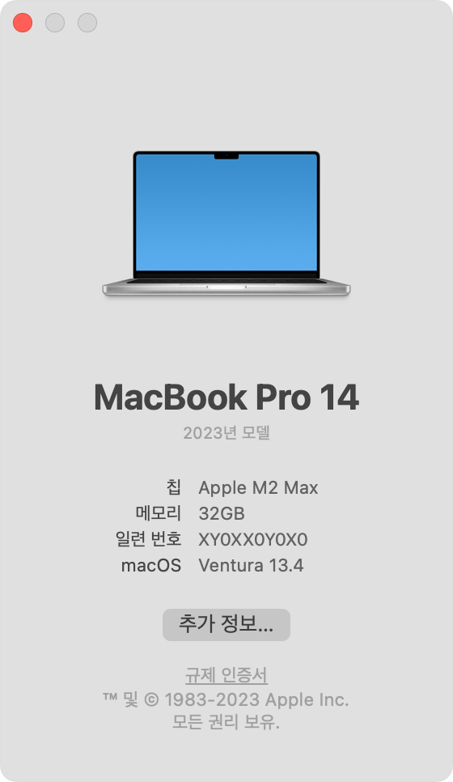

나! 드디어! 맥북 샀다!!!  
이렇게 빨리 살 생각이 없었는데 기존에 쓰던 노트북이 죽어가서 어쩔 수 없었음. 충전기를 꽂지 않으면 켜지지 않는단 말이다..  
단축키나 사용 환경은 많이 써봐야 아는 거라서 시간이 지나면 적응될 것이고, 환경 세팅을 차근차근 해보도록 하자.  
우선 나는 파이썬을 주로 사용하고, 지금 쓰고 있는 github.io를 우선으로 설정해야 하기 때문에 관련된 설정만 설명하도록 하겠다. 추후 C 컴파일러가 필요해지면 그 때 다시 작성하는 걸로!

### Homebrew 설치  
**Homebrew란?**  
Homebrew란 맥 터미널에서 사용 가능한 패키지 관리 시스템이다. `Ruby`, `Git`을 기반으로 Apple 공식 앱스토어에서 제공하지 않는 패키지들을 설치할 수 있다. 종종 최신 버전이 없는 경우도 있다고 하는데, 웹에 겁색 한 번 해보고 설치하면 되니 문제 없다.  
Homebrew를 사용해서 터미널에서 패키지를 설치하면 `/opt/homebrew` 위치에 설치된다. 물론 지정하는 위치에 설치할 수도 있지만 난 귀찮아서 패스.  
보다 자세한 설명은 [홈페이지](https://brew.sh/ko/)에서 확인하기

**Homebrew 설치**  
홈페이지에 접속하면 맥 터미널에서 실행할 수 있는 Homebrew 설치 명령어가 있다. 아래 그대로 복사해왔으니 이거 써도 돼요.  
```zsh
/bin/bash -c "$(curl -fsSL https://raw.githubusercontent.com/Homebrew/install/HEAD/install.sh)"
```
그리고 아래 명령어를 실행해서 설치가 잘 됐는지 확인한다.  
```zsh
brew --version
# Homebrew 4.4.11
# zsh: command not found: brew
```
첫 번째 주석과 같이 버전이 뜨면 설치가 완료된 것이고, 두 번째 주석과 같이 뜨면 아직 PATH 설정이 되지 않은 것이므로 아래 명령어를 입력한다.  
```zsh
# zshrc에 homebrew path 추가
$ echo 'export PATH=/opt/homebrew/bin:$PATH' >> ~/.zshrc
# zshrc 반영
$ source ~/.zshrc
```
여기서 zshrc는 bashrc와 같이 맥에서 사용하는 쉘의 이름이다. MacOS는 Catalina 이후로 쉘을 zsh로 바꿨다고 한다. bash와 유사하지만 더 많은 확장성을 제공하고 복잡한 설정을 지원하는 등 보다 고급 기능을 제공한다.

**패키지 설치 관련 명령어**  
- `brew update`: brew를 최신 버전으로 업데이트
- `brew search {package_name}`: 설치 가능한 프로그램 검색
- `brew install {package_name}[@version]`: 특정 버전의 패키지 설치, 지정 안 할 수도 있음
- `brew upgrade {package_name}`: 패키지 업그레이드, 패키지 이름을 지정하지 않으면 모든 패키지 업그레이드

**패키지 정보 확인**  
- `brew list`: 설치된 패키지 목록 확인
- `brew info {package_name}`: 패키지 정보 확인
- `brew outdated`: 업그레이드가 필요한 패키지 확인

**삭제**  
- `brew cleanup {package_name}`: 해당 패키지의 최신 버전 외 버전들 제거
- `brew uninstall {package_name}`: 해당 패키지 삭제

**설치 예제**  
우선 brew를 한 번 업데이트 후 가장 많이 쓰는 git을 한 번 설치해보자.  
```zsh
brew update
brew search git
```
위 명령어를 실행하면 Formulae, Casks가 나온다.  
- Formula: 패키지를 다운로드하고 컴파일하는 방법
- Cask: Formulae와 유사하지만, 컴파일이 아닌 바이너리를 설치
오픈 소스의 경우 Formula의 비중이 높고, 패키지 설치 파일이나 바이너리로 배포되는 경우에는 Cask를 이용하는 경우가 많다고 한다.
즉, Formula는 바로 설치가 가능하고, Cask는 `--cask`와 같은 옵션이 붙는 것처럼 설치 후 추가 세팅을 진행해야 하는 것으로 이해하면 편하다.  
아무튼 검색을 하면 다양한 패키지들이 나올 텐데 설치하고자 했던 패키지 이름을 사용해서 아래 명령어를 실행하면 된다.  

```zsh
brew install git
git --version
# git version 2.47.1
```

### Python 개발 환경 세팅하기
나는 지금 AI를 공부하고 있기 때문에 Python을 가장 많이 사용한다. 따라서 우선 Python 환경을 세팅해주도록 하겠다.  

**VS Code 설치**  
[VS Code 사이트](https://code.visualstudio.com/Download)에서 환경에 맞는 VS Code를 설치한다.  
맥의 경우 2020년 이후로 일부 모델을 Intel에서 Silicon으로 전환했다고 한다. 확인 방법은 다음과 같다.  
왼쪽 상단의 애플 로고를 클릭하고 `이 맥에 관하여`를 누른다.  

  
<figcaption style="text-align:center; font-size:13px; color:#808080; margin-top:0px">출처: <a href="https://support.apple.com/ko-kr/116943">애플 공홈</a></figcaption>

위 이미지와 같이 '프로세서'라는 항목이 없는 경우 Silicon이고, 있으면 Intel 프로세서 이름이 표시된다.  

**아나콘다 설치**  
맥북은 파이썬이 기본으로 깔려 있지만, 맥북 설정과 관련 있을 수 있기 때문에 나는 따로 설치하고자 한다. 이때 다양한 프로젝트에 맞는 환경을 커스텀하기 위해 가상환경 사용을 사용할 것이다.  
- Anaconda
  - linux, window, mac에서 사용 가능한 파이썬 버전 관리 시스템이다.
  - 데이터 분석, ML을 위한 numpy, pandas가 디폴트로 포함되어 있기 때문에 무거울 수 있다.
  - 또한 Anaconda는 팀, 회사에서 사용할 때는 라이선스를 구매해야 한다는 단점도 있다고 한다.
- pyenv
  - linux 환경에서 사용하는 파이썬 버전 관리 시스템이다(윈도우에서도 사용 가능하긴 함).
  - Anaconda에 비해 가볍다는 장점이 있다.

얕은 내 지식으로 결론을 내려보자면, 데이터와 ML 관련 작업을 수행할 것이고, 조금 무거워도 괜찮다면 Anaconda, 그렇지 않다면 pyenv를 사용하면 될 것 같다. 나는 numpy, pandas를 꽤나 많이 사용하기도 하고, 기존에 Anaconda를 사용하며 불편함이 없었기 때문에 그대로 Anaconda를 사용하고자 한다.  
무려 Homebrew를 깔았지만 최신 버전이 아닐 수도 있기 때문에 웹에서 설치했다. [여기](https://www.anaconda.com/download/success)! CLI를 설치해도 되지만 난 익숙한 Graphical Installer를 사용했다. 둘 다 똑같다.  
이제 터미널에 들어가보면 `(base)`가 추가됐을 것이다. 간단한 명령어를 몇 개 소개하도록 하겠습니다~
- `conda env list`: 생성한 가상환경 목록 확인
- `conda create -n {env_name} python={version}`: 특정 버전의 가상환경 생성, 버전 지정 안 하면 해당 가상환경에서 python을 따로 설치해줘야 함
- `conda activate {env_name}`: 생성한 가상환경 활성화, `(base)`가 해당 이름으로 바뀔 것  
- `conda deactivate`: 현재 활성화된 가상환경 비활성화  
- `conda env remove -n {env_name}`: 특정 가상환경 삭제  

### GitHub.io 환경 세팅
환경 세팅에 앞서 내가 사용한 테마는 chirpy이다. 설치해야 할 항목들은 `ruby`, `jekyll`이다.  
맥북에는 Ruby 또한 기본적으로 설치되어 있기 때문에 업데이트만 해주면 된다. 이 때는 터미널에서 brew 사용!  

**Ruby 설치**  
Ruby 가상환경 rbenv를 사용한다.
```zsh
brew install rbenv
rbenv versions
rbenv insall -l
rbenv install {version} # 난 가장 최신 버전을 설치했다.
rbenv versions
rbenv global {version}
```

**Ruby 설정**  
~/.zshrc에 다음 내용을 추가한다. (`vim ~/.zshrc`로 파일 열기)  
```zsh
# ~/.zshrc를 VS Code로 열 수 있도록 설정
code () { VSCODE_CWD="$PWD" open -n -b "com.microsoft.VSCode" --args $* ;}

# Ruby 설정
[[ -d ~/.rbenv  ]] && \
export PATH=${HOME}/.rbenv/bin:${PATH} && \
eval "$(rbenv init -)"
```

**git clone github.io**  
기존에 만들어뒀던 github.io가 있기 때문에 해당 레포를 클론하고 해당 경로로 접속한다. 맥의 터미널이 익숙하지 않으면 이 때 VS Code를 켜서 해당 터미널을 사용해도 된다.

**jekyll 설치**  
```bash
gem install jekyll bundler
rbenv rehash
bundle install
bundle exec jekyll serve
```
이렇게 실행하고 localhost 링크로 접속했을 때 잘 뜨면 끝! 이후로는 `jekyll serve`만으로 로컬에 띄울 수 있다.  

**`.gitignore` 수정**  
맥에서 개발할 때 워크스페이스에 `.DS_Store`가 생기곤 한다. 이는 Desktop Service Store의 약자로, Mac OS X 시스템이 폴더에 접근해서 메타 데이터를 생성할 때 생기는 폴더이다. `.gitignore`에 추가해서 git이 추적하지 못 하도록 하자.  
이제 진짜 끝~!

> **참고**  
[Formula, Cask의 차이](https://www.hahwul.com/2023/03/19/homebrew-formulae-and-cask/)  
[Mac 프로세서 확인](https://support.apple.com/ko-kr/116943)  
[github.io 세팅](https://skylarcoding.tistory.com/139)