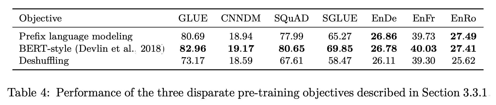
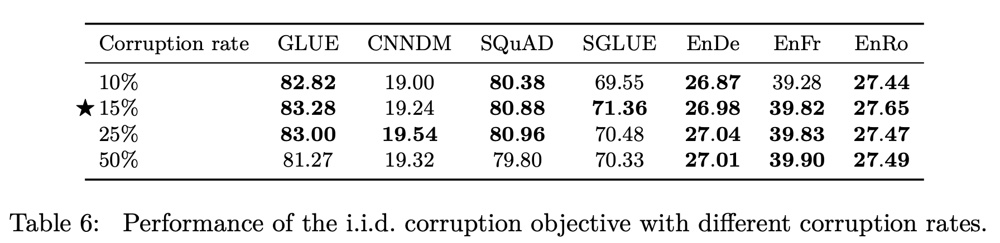
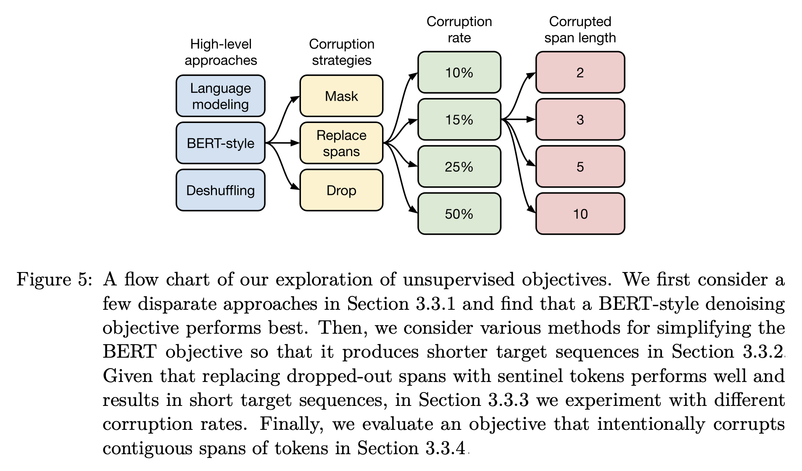

### Exploring the Limits of Transfer Learning with a Unified Text-to-Text Transformer
> **Citation & Link**  
Raffel, Colin, et al. "Exploring the limits of transfer learning with a unified text-to-text transformer." Journal of machine learning research 21.140 (2020): 1-67.  
[PDF Link](https://www.jmlr.org/papers/volume21/20-074/20-074.pdf)  

### 연구 배경  
다양한 방법들의 혼재
- Attention is All You Need 논문을 발표한 뒤 NLP 분야의 모델 구조는 Transformer로 획일화됨
- Encoder, Decoder, Encoder-Decoder 등의 큰 구조를 갖는 다양한 형태의 모델들이 등장  
- Pre-training 방법론, Fine-Tuning 방법론과 더불어 다양한 task의 데이터셋 등 NLP 분야에 적합하다고 하는 여러 연구 등장

이렇게 다양한 모델 구조와 데이터셋, 학습 방법론들이 등장하는 시점에 Google은 NLP 분야에 가장 적합한 모델 구조와 방법론을 하나로 통일하고 싶었던 듯하다. 하지만 논문을 읽다 보면 모델 구조, 데이터셋 구성, 실험 과정에 대해서 왜 그런 방식을 선택했고, 그 영향을 어땠는지를 수학적으로든 논리적으로든 자세히 알기 어렵다. 이 때 아래 배경을 이해하면 논문이 쓰여진 방식에 대한 이해가 보다 쉽다.
- 논문이 최초로 발표된 2019년 경에는 GPU가 1000번대의 시절
- 모델 구조, 데이터셋의 크기, pre-training task 종류 등 다양한 방법들을 실험하고자 했지만 넉넉한 상황이 아니었음
- 따라서 최적의 방법을 찾고자 각 분야에서 best인 선택지를 선택해가는 Greedy Search를 수행한 결과가 이 논문

### Introduction
최근(논문 발표 시점 2019-2020년) NLP 트렌드
- pre-training objectives
- unabeled data sets(비지도학습)
- fine-tuning methods(주로 지도학습)

본 논문의 주요 아이디어
- 모든 텍스트 문제를 "text-to-text" 문제(입출력이 모두 텍스트인 문제)로 변환
- 서로 다른 작업일지라도 모두 통일된 구조의 모델로 학습 가능
- 통일된 구조이기 때문에 서로 다른 learning objectives, unlabeled data sets를 포함한 다른 접근 방식들의 비교가 용이해질 것

본 논문의 아이디어 구현 방식
- 모델: T5(Text-to-Text Transfer Transformer)
- 데이터셋: C4(Colossal Clean Crawled Corpus)

## 적용한 방법들
### T5 모델 구조
T5는 text-to-text 방식을 사용하기 위해 입력 텍스트의 임베딩을 Encoder로, 답변 생성을 Decoder로 하는 Encoder-Decoder 구조를 채택했다. 기존의 Transformer와의 주요 차이점은 Layer Normalization, Positional Embedding이다.

**Simplified Layer Normalization**
- Layer Normalization의 활성화 함수에 포함된 추가적인 bias 항을 삭제
- Layer Normalization을 Residual Path 바깥으로 이동  

**Relative Positional Embedding**  
- 기존의 Sinusoidal Embedding 방식은 각 token의 절대 위치 정보를 반영
- 각 위치의 embedding을 스칼라로 간주하여 positional embedding을 수행
- 이 때 기준이 되는 위치로부터 앞, 뒤 각각 2 이상의 거리 차이가 나면 추가적인 거리를 반영하지 않음

### C4 데이터셋
본 논문에서는 비지도학습에 사용되는 unlabeled data의 질, 특성, 크기에 대한 효과를 실험하기 위해 C4 데이터셋을 구축했다.  
대규모 데이터셋 구축에 있어서 Common Crawl 프로젝트의 데이터셋을 사용했으며, heuristic한 방식으로 저품질 데이터들을 골라냈다.  
- 구두점(마침표, 느낌표, 물음표, 따옴표)으로 끝나는 문장만 사용
- 다섯 문장 이하의 페이지 삭제, 최소 세 단어 이상이 포함된 문장만 사용
- "List of Dirty, Naughty, Obscene or Otherwise Bad Words"에 포함된 단어가 있는 페이지 삭제
- "Javascript"라는 글자가 포함된 페이지 삭제(경고 문구가 포함된 경우가 있음)
- "lorem ipsum"이라는 문구가 포함된 페이지 삭제
- 코드가 포함되어 있는 경우가 있기 때문에 "{"가 포함된 페이지 삭제
- 세 번 이상 반복되는 데이터에 대해서 한 개만 유지

마지막으로 영어 task에 집중했기 때문에 `langdetect`를 사용해서 영어가 아닐 확률이 0.99 미만인 페이지를 삭제했다.  
최종적으로 750GB의 데이터셋을 구축했고, 이를 사전 학습에 사용했다.  

### Downstream Tasks
다양한 벤치마크 데이터셋으로 downstream task를 얼마나 잘 수행하는지 평가했다.
- GLUE, SuperGLUE: classification
- CNN/Daily Mail: abstractivate summarization
- SQuAD: question answering
- WMT English to German, French, Romanian: translation

### 입출력 형식
앞서 설명한 대로, "text-to-text"라는 단일 구조로 통일하기 위해 다양한 방식으로 데이터셋을 변형했다.

**task-specific prefix**  
- 번역: "translate English to German: That is good"
- MNLI: "mnli premise: I hate pigeons. hypothesis: My feelings towards pigeons are filled with animosity"

prefix를 사용함에 따라 Encoder는 fully visible 형태의 마스크를, Decoder는 Causal with prefix 형태의 마스크를 사용했다.

위와 같이 텍스트로 된 prefix의 차이는 하이퍼파라미터와 같은 옵션이며, 큰 성능 차이를 보여주지 않았기 때문에 논문에 포함하지 않았다고 한다.  

**STS task**  
- 1-5 사이의 점수를 갖는 regression 형태
- 각 점수들이 0.2 간격으로 분포한다는 것을 파악 → 0.2 단위로 반올림 한 뒤 string 형식으로 출력
- 점수가 아닌 형태의 출력은 전부 오답으로 간주했다.  

이 외에도 WNLI, WSC, DPR 등의 task들을 text-to-text 형태로 맞추기 위해 일부를 포함하지 않기도 하고, 강조 효과를 주기도 했다.  

## 실험
### 베이스라인
앞서 설명한 T5 모델을 C4 데이터셋으로 사전 학습을 수행했다.
- 토큰화 방식: SentencePiece 알고리즘
- 비지도학습 방식: Language Modeling, Denoising

  
<figcaption style="text-align:center; font-size:13px; color:#808080; margin-top:0px">Language Modeling</figcaption> 

<figcaption style="text-align:center; font-size:13px; color:#808080; margin-top:0px">Denoising, 출처: <a href="https://www.jmlr.org/papers/volume21/20-074/20-074.pdf">BART 논문</a></figcaption>  

### 구조에 따른 비교

- Encoder-decoder: 본 논문에서 제안하는 구조
- Enc-dec, shared: Encoder와 Decoder 간 파라미터 공유
- Enc-dec, 6 layers: 레이어 개수를 반으로 줄인 모델
- Language model: Decoder-only 모델
- Prefix LM: Decoder-only prefix LM

결론적으로 본 논문에서 제안한 T5 구조의 성능이 가장 좋으며, Language Modeling 방식보다는 Denoising 방식의 Pre-training이 더 좋은 성능을 보여준다.  
이 때 layer 개수를 줄이면 성능이 감소하는 것을 통해 모델의 크기가 클수록 성능이 좋다는 것이 검증되었다.  

### 비지도학습 방법론에 따른 비교
**방법론**  
  

- Prefix language modeling: 텍스를 인코더에 대한 입력, 디코에 대한 타겟 두 부분으로 구분
- BERT-style: MLM 기법. 15%의 토큰을 오염, 그 중 10%는 랜덤 토큰으로 대체, 나머지 90%는 스페셜 토큰으로 대체
- Deshuffling: 문장을 구성하는 단어의 순서를 임의로 섞음

BERT-style의 MLM 방식의 성능이 가장 뛰어남을 알 수 있었고, 해당 방식에 대해 보다 다양한 옵션을 주어 추가적인 실험을 진행하였다.

- MASS-style: 랜덤 토큰으로 대체하는 과정 없이 전부 스페셜 토큰으로 대체
- Replace corrupted spans: 개별 토큰을 각각 스페셜 토큰으로 대체하는 대신, span에 해당하는 토큰을 하나의 스페셜 토큰으로 대체
- Drop corrupted tokens: 스페셜 토큰으로 대체하는 과정 없이 선택된 토큰 삭제

결과적으로 네 방식의 성능은 비슷했다. 위 방식들의 예시는 아래 표에서 확인할 수 있다.

**Corruption Rate & Corruption Spans**  

<figcaption style="text-align:center; font-size:13px; color:#808080; margin-top:0px">Corruption Rate</figcaption> 

<figcaption style="text-align:center; font-size:13px; color:#808080; margin-top:0px">Span Length</figcaption> 

오염도와 span의 길이에 따른 비교 실험 진행 결과, 오염도는 15%일 때, span의 길이는 고정하지 않고 1, 2, 3 중 독립항등분포를 통해 결정하는 것의 성능이 좋다고 한다.  

**비지도학습 방법론 비교 실험 결과**  

비교 실험 결과, 위 이미지와 같이 BERT-style의 MLM 방식으로, span을 하나의 토큰으로 대체하며, corruption rate는 15%로 하며 span의 길이는 랜덤하게 선택하는 것이 pre-training의 성능을 가장 높일 수 있는 방법이다.  

### 사전 학습 데이터셋
사전 학습 데이터셋의 크기, 품질 등에 대한 비교를 위해 실험이 진행됐다.  

**데이터셋의 품질**  
  
- C4: Common Crawl 프로젝트에 heuristic한 방법과 langdetect로 정제를 수행한 데이터셋
- C4, unfiltered: heuristic한 방법론을 제외하고 langdetect만 적용. langdetect는 natural English를 제외하고 전부 제거하는 경향이 있기 때문에 어느정도의 정제가 적용되었을 것이 명시되어 있다.
- RealNews-like: 뉴스 웹사이트에서 추출한 데이터셋
- WebText-like: 웹 페이지에서만 추출한 데이터셋
- Wikipedia: 영어로 된 Wikipedia 문서
- Wikipedia + TBC: 백과사전이라는 한정된 분야에 대한 단점을 보완하기 위해 Toronto Books Corpus(eBook에서 추출) 데이터를 Wikipedia에 결합

heuristic하게 정제하지 않은 C4는 유의미한 성능 감소를 보였으며, 다양한 도메인의 데이터로 구성된 경우 C4에 비해 나은 성능을 보이기도 했다.  

**데이터셋의 크기**  

<figcaption style="text-align:center; font-size:13px; color:#808080; margin-top:0px">Dataset Size</figcaption> 

<figcaption style="text-align:center; font-size:13px; color:#808080; margin-top:0px">Training Loss</figcaption> 

적은 양의 데이터셋의 경우, 반복적으로 학습할 수록 loss가 감소하지만 downstream task에서 점점 떨어지는 성능을 확인할 수 있다. 이는 과적합을 의미하며, 결론적으로 적은 양의 데이터셋으로 여러 번 학습하는 것에 비해 많은 양의 데이터셋으로 학습하는 것이 더 나은 성능을 보여준다.  

### 학습 전략
**Fine-Tuning 전략**  
  
- All parameters: 모든 가중치를 업데이트
- Adapter layers: 각 레이어에 학습 가능한 추가적인 레이어를 두는 것
- Gradual unfreezing: 학습이 진행될 수록 점점 더 많은 파라미터를 업데이트

리소스가 충분하다고 할 때, 모든 가중치를 업데이트하는 것이 가장 뛰어난 성능을 보여준다.

**Multi-Task Learning**  

Multi-Task Learning과 기존의 pre-training + fine-tuning을 비교했을 때, 다양한 비율로 MTL을 수행했음에도 pre-training + fine-tuning의 방식이 보다 나음을 알 수 있다.  

  
또한 MTL과 Pre-training, Fine-Tuning을 적절히 조합한 경우에도 기존의 방식의 성능이 뛰어나며, 일부 경우 Multi-task pre-training + Fine-tuning 방식의 성능이 보다 낫거나 비슷한 성능을 보여준다.  

### 모델 크기
  
모델의 크기와 더불어 batch size, step size, ensemble도 함께 고려하였는데, 큰 모델을 오래 학습할 수록 좋은 성능을 보인다. 하지만 표의 결과와 같이 항상 4배 큰 step size와 batch size로 학습해야 한다는 것을 의미하지는 않는다.  

### 모든 방법론 결합

- **Objective**: i.i.d denoising 방식, 평균 span 길이 3, 15%의 corruption rate  
- **Longer Training**: 100만 steps, batch size $2^{11}$, sequence length 512. 이 때 학습량이 늘었기 때문에 보다 큰 데이터셋 활용을 위해 C4 데이터셋 사용  
- **Model Size**: Base(2억 2천만), Small(6천만), Large(7억 7천만), 3B, 11B  
- **Multi-task pre-training**: 사전 학습 시 MTL 방식 사용  

이 외에도 GLUE&SuperGLUE 데이터셋에 대한 학습법, 추론 시 Beam Search 사용, 적절한 Test set 구성 등에 대한 방법도 소개되어 있다.  

최종적으로 24개의 task 중에 18개의 task에서 SoTA를 달성했다. 11B의 가장 큰 모델이 대부분의 가장 좋은 성과를 달성할 수 있었다. 하지만 번역 task에 있어서는 기존의 SoTA를 이기지 못했는데, 이는 학습 데이터셋을 영어로 한정했기 때문이라고 추측했다.  

## 결론
### 핵심
**Text-to-Text**  
서로 다른 task에 대해서 동일한 손실 함수와 디코딩 과정을 적용한 하나의 모델을 학습하는 가장 단순한 프레임워크이다.  

**Architecture**  
다양한 변형 구조가 등장하고 있지만, 기존의 Encoder-Decoder 구조가 text-to-text 프레임워크에서 가장 효과가 좋다.  

**Unsupervised Objectives**  
사전 학습 전략으로 denoising objectives를 적용하며, 가능한 짧은 시퀀스를 생성하게 하는 것이 효율적이다.  

**Data sets**  
C4와 같이 규모가 큰 데이터셋으로 학습하는 것이 모델의 일반적인 언어 이해 능력을 향상시킨다.  

**Training Strategies**  
MTL 방식으로 사전 학습 후 Fine-tuning하는 것의 성능이 가장 좋았다.  

**Scaling**  
무조건 큰 모델이 아니라 작은 모델로도 보다 많은 데이터를 학습한다면 성능이 증가함을 알 수 있었다.  

### 견해
**The inconvenience of large models**  
리소스가 부족한 환경에서는 큰 모델을 사용할 수 없는 것이 현실적이다. 상황에 따라 보다 저비용으로 효과적으로 학습이 가능한 방식을 적용할 수 있어야 한다.

**More efficient knowledge extraction**  
본 연구에서 수행한 사전 학습 방법론인 denoising objecives는 1 trillion에 해당하는 텍스트를 학습해야 하므로 비효율적일 수 있다. 따라서 보다 적은 데이터로도 좋은 성능을 낼 수 있는 방법론이 필요하다.  

**Formalizing the similarity between tasks**  
수행하고자 하는 downstream task의 도메인을 잘 파악하여 적절한 사전 학습 데이터셋을 구성하면, 보다 나은 성능을 낼 수 있다.  

**Language-agnostic models**  
언어의 경계 없는 모델을 만들기 위해 어떤 언어를 어떻게 더 학습해야 하는지 연구하고자 한다.  

본 연구를 통해 SuperGLUE 벤치마크에서 인간 수준에 가까운 성능 결과를 얻었으며, 통합된 text-to-text 프레임워크, 새로운 C4 데이터셋, 체계적인 연구를 통해 전이 학습의 잠재력을 확장했다고 평가한다.