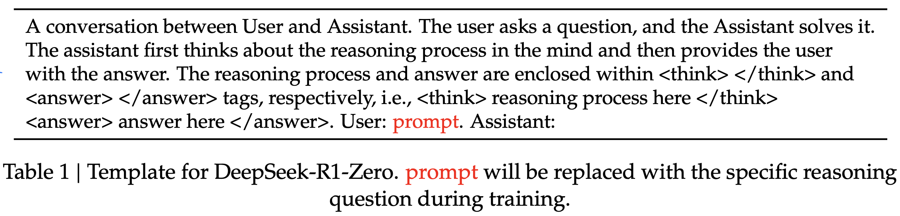
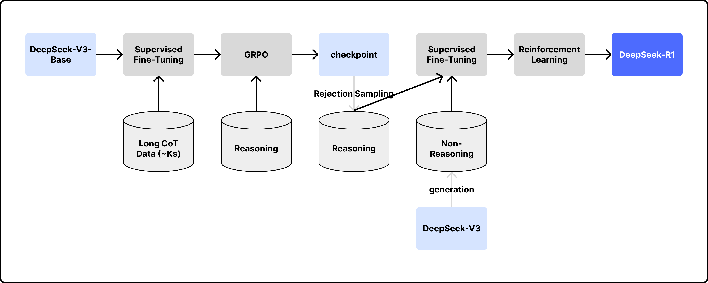
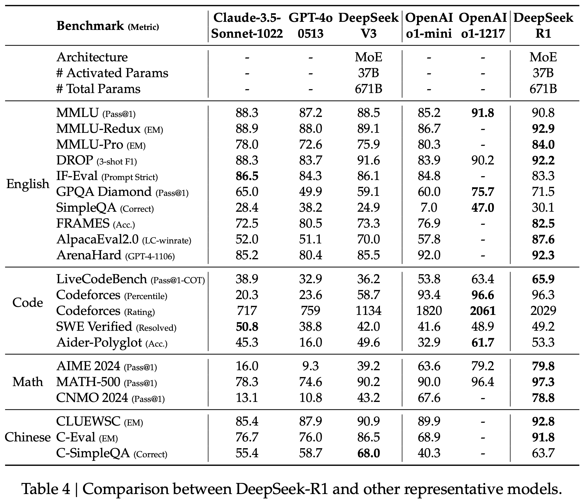
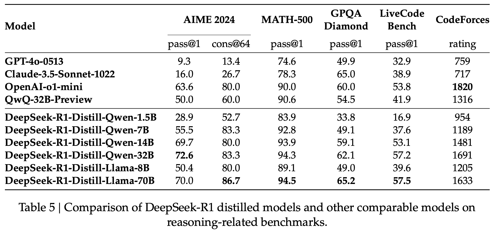

> **Citation & Link**  
Guo, Daya, et al. "Deepseek-r1: Incentivizing reasoning capability in llms via reinforcement learning." arXiv preprint arXiv:2501.12948 (2025).  
[PDF Link](https://arxiv.org/pdf/2501.12948)  

늦은 감이 있지만 그래도 정리를 안 할 수는 없기에 시작.  
본 문서의 구성 및 제목은 원본 논문의 구조와 관련이 없습니다.  

## Abstract
- Post Training 방법론으로 Supervised Fine-Tuning (SFT)가 우세한 현대에 Reinforcement Learning (RL)을 사용하여 OpenAI-o1-1217과 대결할 만한 성능 달성
- `DeepSeek-R1-Zero`: SFT 없이 순수하게 RL만으로 학습한 모델
- `DeepSeek-R1`: cold start 데이터를 사용하여 SFT 사전 수행, 이후 RL 적용
- `Distilled Models`: Qwen과 Llama 모델들에 대해 distillation 적용, 1.5B, 7B, 8B, 14B, 32B, 70B 모델들의 성능 향상

## Approach
### 배경
- OpenAI에서 reasoning 성능 향상을 위해 Chain-of-Thought (CoT) 길이 조절, thinking step의 수 늘림
- 추론 시간을 길게 배정할 수록 성능이 증가하는 경향을 확인
  - 수학, 코딩, 과학 추론 태스크에서 성능 향상 확인
- 베이스 모델로 `DeepSeek-V3-Base` 채택, `DeepSeek-R1-Zero`, `DeepSeek-R1`, `DeepSeek-R1-Distill` 시리즈 개발

### Reinforcement Learning
- 본 연구에서 처음으로 순수 RL만을 Post Training 기법으로 적용
  - 목적: 지도 학습 데이터 없이 모델의 자체 발전 잠재력 확인, 추론 성능 향상
- RL 프레임워크로 Group Relative Policy Optimization (GRPO) 채택(아래 설명)

**Group Relative Policy Optimization (GRPO)**  
- 기존에 사용되던 policy model과 같은 크기의 critic model 제거
  - policy model: 정책에 따라 행동을 출력하는 모델
  - critic model: 보상을 담당하는 모델
- 다음 정책 결정 방법
  - 각 질문 $q$에 대해 여러 개의 답변 확보
  - 출력 그룹 $\{o_1, o_2, ..., o_G\}$을 종합하여 이전 정책 $\pi_{\theta_{old}}$에 따라 점수 부여
  - 아래 목적 함수를 기반으로 다음 정책 $\pi_{\theta}$ 결정

$$
J_{GRPO}(\theta) = \mathbb{E}[q \sim P(Q), \{o_i\}^G_{i=1} \sim \pi_{\theta_{old}}(O|q)] \quad (1)-1
$$

$$
\frac{1}{G}\sum\limits_{i=1}^G(min(\frac{\pi_{\theta}(o_i|q)}{\pi_{\theta_{old}}(o_i|q)}A_i, clip(\frac{\pi_{\theta}(o_i|q)}{\pi_{\theta_{old}}(o_i|q)}, 1-\epsilon, 1+\epsilon)A_i) - \beta\mathbb{D}_{KL}(\pi_{\theta}||\pi_{ref})), \quad (1)-2
$$

$$
\mathbb{D}_{KL}(\pi_{\theta}||\pi_{ref}) = \frac{\pi_{\theta}(o_i|q)}{\pi_{\theta_{old}}(o_i|q)} - log\frac{\pi_{\theta}(o_i|q)}{\pi_{\theta_{old}}(o_i|q)} - 1, \quad (2)
$$

수식 설명

- $J_{GRPO}$는 (1)-1과 (1)-2로 표현됨
- (1)-1
  - 분포 $P(Q)$에서 질문 q 샘플링
  - 이전 정책 $\pi_{\theta_{old}}$을 따르는 $G$개의 응답 $o_i$생성
  - 해당 결과들로부터 기댓값 정의
- (1)-2
  - PPO 스타일의 손실 함수로, 기댓값을 표본 평균으로 근사화
  - $\frac{\pi_{\theta}(o_i|q)}{\pi_{\theta_{old}}(o_i|q)}A_i$: 새로운 정책이 이전 정책 대비 특정 행동을 얼만큼 반영할지에 대한 비율 계산
  - clip을 통해 비율이 너무 커지거나 작아져 정책이 급격히 변화하는 것을 방지
  - KL Divergence 규제 항 $\mathbb{D}_{KL}(\pi_{\theta}||\pi_{ref})$을 통해 새로운 정책이 기존 정책과 크게 달라지는 것을 방지
- (2)
  - KL Divergence 규제 항
  - 기존의 PPO 알고리즘에도 KL Penalty를 부여하지만, GRPO에서는 명시적으로 규제
  - 이전 정책으로부터 크게 변화하는 것을 방지

**Reward Modeling**  
- GRPO 알고즘을 통해 다음 policy를 결정, rule-based reward 방식으로 보상 방식 결정
- 복잡한 설계와 학습 과정을 피하기 위해 neural reward model 대신 rule-based 리워드 시스템 적용
- Accuracy rewards
  - 수학일 경우 모델이 출력한 'box' 안의 답과 실제 답이 정확히 일치하는지
  - LeetCode과 같은 문제에서는 컴파일러를 사용하여 코드의 출력이 정확한지
- Format rewards
  - DeepSeek-R1 시리즈 또한 생성형 모델이기 때문에 출력의 형태가 일관적인지 확인
  - `<think>`와 `</think>` 사이에 추론 과정이 포함되도록 함

**학습 템플릿**  

<figcaption style="text-align:center; font-size:13px; color:#808080; margin-top:0px">DeepSeek-R1-Zero 튜닝 시 사용된 Template</figcaption>  

- 추론 과정에서 task별로 특정 프롬프트에 치우쳐져 결과를 생성하지 않도록 단순한 프롬프트를 적용
- RL 과정에서 프롬프트의 영향을 제외한 모델의 자연적인 추론 능력 향상을 확인할 수 있음

**결과**    
- 추론 분야의 벤치마크 데이터셋에서 OpenAI-o1보다 높거나 비슷한 성능을 보임
  - AIME에서 pass@1와 cons@64를 비교하면 majority voting을 했을 때 보다 높은 성능을 보이는 것을 확인
- 학습 step이 증가할 수록 thinking의 길이가 증가
  - RL만으로도 즉, 정답 데이터셋이 없어도 보다 많은 단계별 추론 과정을 수반하여 문제 해결 능력을 향상시킴
- Aha Moment: 추론 중 명시적으로 깨달았다는 표현을 사용하며 추론 과정 내 접근법을 다시 검토
- Drawback
  - 가독성이 낮고, 언어를 섞어서 응답하는 경우가 발생
  - 사람 친화적인 cold-start 데이터를 활용하여 DeepSeek-R1 개발

### DeepSeek-R1: Reinforcement Learning with Cold Start

<figcaption style="text-align:center; font-size:13px; color:#808080; margin-top:0px">DeepSeek-R1 학습 파이프라인</figcaption>

**Cold-Start Data**  
- Post Training 초반에 소량의 지도 학습 데이터를 사용하여 SFT 수행, 이후 RL 적용
- CoT 데이터 확보 방식
  - 긴 CoT 예시를 포함한 few-shot 프롬프팅
  - 직접 추론 과정에 대한 검증을 포함한 상세한 답변을 생성하도록 하는 프롬프팅
  - DeepSeek-R1-Zero의 출력 결과를 가독성이 좋은 형태로 가공
  - 사람의 수동 검수 작업
- Readability: 출력 형태를 `|special_token|<reasoning_process>|special_token|
`와 같이 지정함으로써 추론 과정 뒤에 요약을 덧붙이도록 함

**추론 기반 RL**  
- SFT 이후, DeepSeek-R1-Zero와 동일한 과정의 RL 수행
- RL 과정에서 언어 일관성에 대한 보상을 추가
  - ablation study에서 해당 방법이 가독성은 좋지만, 모델 자체의 성능은 떨어짐을 확인
  - 가독성 일관성에 대한 점수를 최종 reward 점수에 더하여 RL 수행

**Rejection Sampling**  
- 추론 기반 RL 이후 checkpoint를 활용하여 SFT 데이터를 확보
  - 작문, 역할극, 기타 범용 태스크 등 다양한 분야의 성능 향상을 도모
  - `DeepSeek-V3`를 활용한 합성 데이터 생성
- Reasoning data
  - Rejection Sampling 수행: checkpoint로부터 여러 개의 응답을 출력, 해당 출력과 정답을 DeepSeek-V3에 입력하여 올바른 출력만을 골라냄
  - 출력된 CoT에 다국어가 섞이는 등 문제가 있는 경우들을 필터링
  - 학습 샘플과 관련된 총 60만 개의 reasoning 샘플 확보
- Non-Reasoning data
  - 작문, 사실 기반 QA, 자기 인지, 번역 태스크에 대해 `DeepSeek-V3`로 생성한 데이터
  - 총 20만 개의 데이터 확보
- DeepSeek-V3-Base에 총 80만 개의 데이터로 2 epochs 동안 SFT 수행

**RL for All Scenarios**  
- reasoning 도메인: DeepSeek-R1-Zero와 동일한 방식의 rule-based reward 적용
- general 도메인: reward 모델이 사람의 선호를 반영하도록 함
- helpfulness: 템플릿으로 지정했던 `
`에 집중하여 응답의 유용성, 연관성을 확인
- harmlessness: `<reasoning_process>`와 `
`를 모두 고려하여 위험한 발언을 골라냄

**결과**  

<figcaption style="text-align:center; font-size:13px; color:#808080; margin-top:0px">DeepSeek-R1 성능 평가 결과</figcaption>

### Distillation
- 오픈 소스 모델인 Qwen, Llama 사용
  - Qwen2.5-Math-1.5B, Qwen2.5-Math-7B, Qwen2.5-14B, Qwen2.5-32B
  - Llama-3.1-8B, LLama-3.3-70B
- DeepSeek-R1으로부터 80만 개의 데이터 확보

**결과**  

<figcaption style="text-align:center; font-size:13px; color:#808080; margin-top:0px">DeepSeek-R1 distilled models 성능 평가 결과</figcaption>