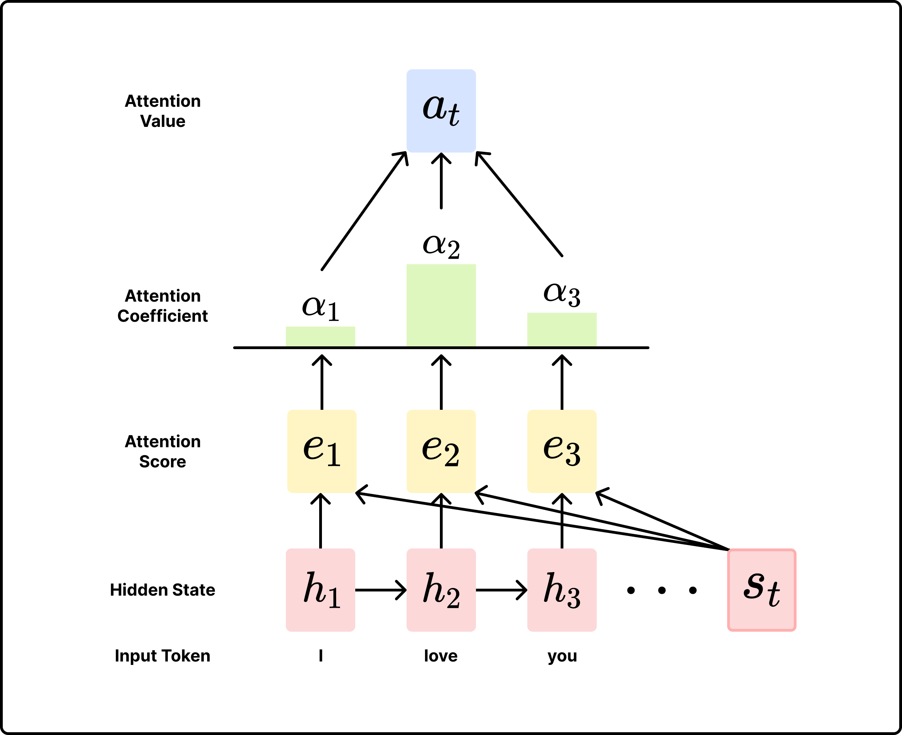

> **도입**  
자연어 처리의 기본이 되는 attention 개념과 transformer를 알아보기 위해 RNN부터 Seq2Seq 등 배경부터 알아보겠다.

## Recurrent Neural Network (RNN)
### 기본 RNN 구조
- Transformer 등장 이후 sequential한 데이터를 처리하는 방식은 주로 RNN 기반의 모델들
- recurrent한 구조를 통해 이전 단계의 정보를 hidden state에 저장하여 과거 데이터를 기반으로 output을 추론
- RNN은 다양한 구조로 조합되어 다양한 태스크에 활용됨
  - one-to-one: 일반 신경망 (Ex. 이미지 분류)
  - one-to-many: 이미지 캡셔닝
  - many-to-one: 감성 분석
  - many-to-many: 기계 번역

- $W_{hh}$, $W_{xh}$, $W_{hy}$는 timestep별로 공유됨
- 즉, $x_{t-1}$과 $x_{t}$는 동일한 $W_{xh}$와 내적 연산 수행

### Vanishing/Exploding Gradient Problem
$h_t = \text{tanh}(W_{hh}h_{t-1}+W_{xh}x_{t})$는 back propagation 단계에서 다음과 같이 미분된다.  

$$\frac{\partial h_{t}}{\partial h_{t-1}} = \text{tanh}'(W_{hh}h_{t-1}+W_{xh}x_{t})W_{hh} \ \ \ \ (\because \frac{\partial}{\partial x}\text{f}(\text{g}(x))=\text{f}'(\text{g}(x))\text{g}'(x))$$  

- 가장 마지막에 곱해지는 $W_{hh}$는 timestep(시퀀스의 길이)이 $t$일 때 총 $t-1$번 곱해짐
- $W_{hh} > 1$이면, exploding gradient problem 발생
  - clip으로 방지할 수 있지만, 이 또한 값을 강제로 제한하는 것이기 때문에 학습이 불안정해짐
- $W_{hh} < 1$이면, vanishing gradient problem 발생
  - 정보의 소실 발생

| 구분 | 특징 |
| --- | :---: |
| 장점 | 과거 정보를 hidden state에 저장하여 sequential한 데이터 처리에 유리함 |
| 단점 | long-term dependency problem, exploding/vanishing gradient problem |

---

## Long Short-Term Memory (LSTM)

- Cell State ($c_t$)
  - 기존의 RNN의 구조에 현재 timestep의 상태를 대표하는 cell state 추가
  - cell state는 forget gate, input gate, output gate라고 하는 세 개의 gate들에 의해 제어됨

- Forget Gate ($f_t$)
  - 과거 정보인 $c_{t-1}$을 $c_t$로 얼만큼 전달할지 결정
  - $f_{i}$의 값이 클수록 과거 정보의 반영 비율이 커짐

- Input Gate ($i_{t}$)
  - 현재 timestep $t$의 입력 $x_t$를 현재의 cell state인 $c_t$에 얼만큼 반영할지 결정
  - $i_{t}$가 클수록 현재 입력의 반영 비율이 커짐

- Output Gate ($o_{t}$)
  - 현재의 cell state인 $c_{t}$를 $y_t$에 얼만큼 반영할지를 결정
  - 즉, 현재 timestep $t$의 최종 출력의 형태를 결정

LSTM에서 $f_t = 1$이고, $i_t = 0$이면, 과거 정보를 온전히 유지하고 현재 정보를 전혀 반영하지 않아 과거 현재 상태에서 과거 정보인 $c_{t-1}$을 무한히 보존하겠다는 뜻이 된다.

| 구분 | 특징 |
| --- | :---: |
| 장점 | cell state를 통해 주요한 과거 정보를 RNN보다 잘 전달할 수 있음 |
| 단점 | 여전히 vanishing gradient problem과 같은 위험이 있으며, 여러 개의 gate로 인해 연산량이 증가 |

---

## Gated Recurrent Unit (GRU)

LSTM의 연산량이 많아진다는 단점을 보완하기 위해 GRU는 hidden state만으로 cell state를 표현하고 gate의 개수 또한 두 개로 줄였다.

- Reset Gate ($r_t$)
  - LSTM의 forget gate와 같은 역할
  - $h_t$로 $h_{t-1}$을 얼만큼 반영할지 결정
  - $r_t$가 클수록 과거 정보의 반영 비율이 커짐

- Update Gate ($z_t$)
  - $h_t$로 $h_{t-1}$과 $\text{convex combination}$ ($x_t$와 $h_{t-1}$로부터 계산된 값으로, 현재 timestep의 cell state와 유사한 역할)을 얼만큼 반영할지 결정
  - $z_t$가 클수록 $\text{cnvx}$를 더 많이 반영

| 구분 | 특징 |
| --- | :---: |
| 장점 | LSTM보다 적은 연산량으로 빠른 처리가 가능 |
| 단점 | vanishing gradient problem이 완전히 해소되지 않음 |

---

## Seq2Seq

### Encoder-Decoder 구조

**[ RNN Many-to-Many 구조의 문제 ]**  

- Machine Translation 상황 가정
  - 영문: I love you.
  - 한글: 나는 너를 사랑해.
  - 어순이 다르기 때문에 'love'가 입력된 timestep에서 '너를'이라는 단어를 예측하여 출력할 수 없음
- Encoder-Decoder 구조 등장

**[ Encoder-Decoder 구조 ]**  

<figcaption style="text-align:center; font-size:13px; color:#808080; margin-top:0px">좌: encoder, 우: decoder</figcaption>  

- Encoder
  - 입력 데이터 전체를 하나의 임베딩 벡터로 변환 (bottleneck)
  - RNN 모듈의 최종 출력 벡터를 decoder로 전달
- Decoder
  - auto-regreesive: decoder의 현재 timestep의 입력은 이전 timestep의 출력(첫 번째 timestep에는 \<sos>와 가은 special token 사용)
  - teacher forcing: 학습 시에는 현재 timestep 이후의 토큰들을 masking해두고 이전 timestep의 출력이 아닌 ground truth를 입력

| 구분 | 특징 |
| --- | :---: |
| 장점 | 입력 시퀀스의 순서에 대응되지 않고 자유로운 출력이 가능 |
| 단점 | 입력 시퀀스 하나의 고정 크기 벡터로 임베딩되어 bottleneck 발생   (입력 시퀀스가 길수록 정보의 소실이 발생) |

---

## Seq2Seq w. Attention

Seq2Seq의 bottleneck 문제를 해소하기 위해 Attention 개념이 도입되었다.

### Attention이란?
- decoder의 특정 timestep $t$에서 입력의 모든 timestep의 정보를 고려함
- 기존의 구조와 같이 encoder의 최종 출력을 사용하는 것이 아닌, 모든 timestep의 RNN 모듈의 hidden state를 고려함
- `Query`, `Key`, `Value` 개념 도입
  - `Query`: timestep $t$에서의 decoder의 hidden state
  - `Key`: 모든 timestep에 대한 encoder의 hidden state
  - `Value`: 모든 timestep에 대한 encoder의 hidden state
  - `Q`와 `K`, `V`와 `Q` $\cdot$ `K`는 동일한 dimension을 가져야 함

### Dot-Product Attention

다양한 종류의 Attention 연산 방법이 존재하지만, 가장 간단하고 효율적인 Dot-Product Attention으로 알아보도록 하자.  

[ 입력 및 정의 ]
- 입력 시퀀스의 길이: $T$
- hidden state 차원: $h$
- encoder의 hidden state: $h_1, ..., h_T \in \mathbb{R}^h$
- timestep $t$에서 decoder의 hidden state: $s_t \in \mathbb{R}^h$

[ 과정 ]  
1. step $t$의 attention score: `Query`와 각 `Key`와의 similarity score를 내적을 통해 구함

    $$e_t = [s_t^\top h_1, ..., s_t^\top h_T] \in \mathbb{R}^T$$

2. step $t$의 attention coefficient: $\text{softmax}$ 함수를 사용해서 각 `Key`와의 유사도 점수를 확률 분포로 변경

    $$\alpha_t = \text{softmax}(e_t) = \frac{\text{exp}\{e_t\}}{\sum_i\text{exp}\{[e_t]_i\}} \in \mathbb{R}^T$$

3. step $t$의 attention value: attention coefficient를 weight로 하여 `Value`와의 weighted sum 구하기

    $$a_t = \sum\limits_{i=1}^T[\alpha_t]_ih_i \in \mathbb{R}^h$$

4. decoder와 attention value 연결

    $$[a_t;s_t] \in \mathbb{R}^{2h}$$

5. 이후 기존의 RNN과 동일한 과정 수행

위 과정 중 첫 번째 단계에서 similarity score를 구할 때 학습 가능한 $W$, concat & linear 방법 등 다양한 옵션이 있다.   Dot-Product Attention은 추가적인 매개변수가 없어 연산과 학습히 빠르면서도 의미를 효과적으로 유지하기 때문에 주로 사용되는 방식이며, Transformer에서도 Dot-Product가 사용된 self-attention 개념이 도입되었다.