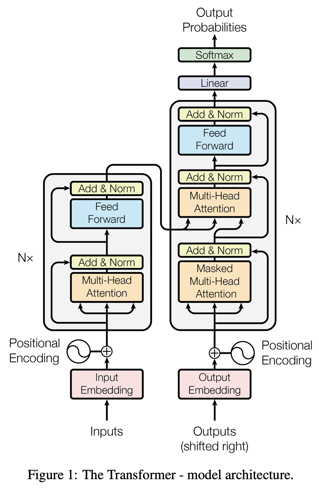
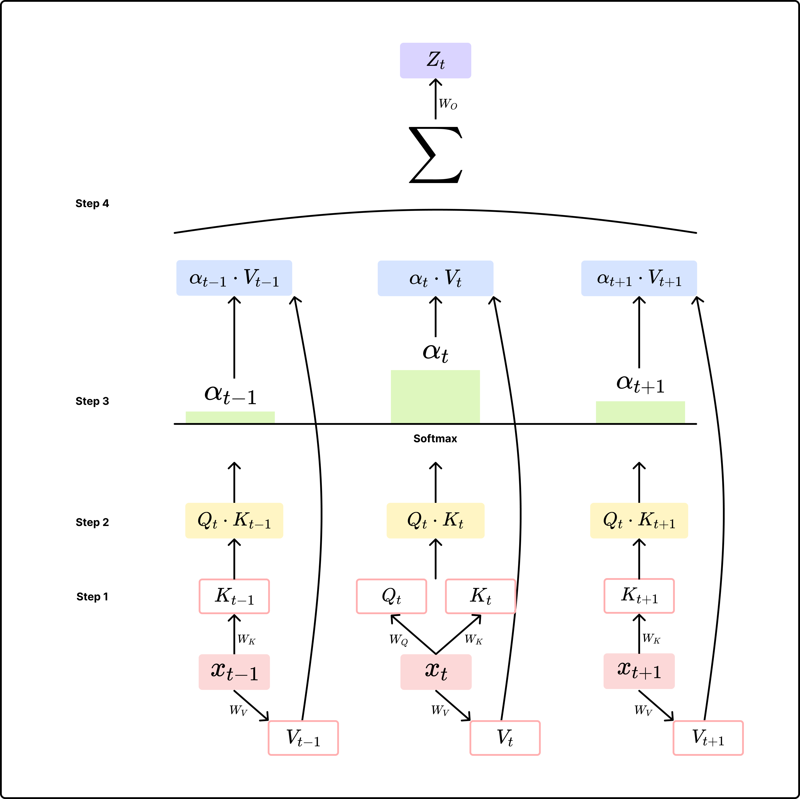

> **도입**  
저번 포스트에 이어서 self-attention을 도입하여 attention만으로 자연어 처리 태스크를 수행할 수 있는 transformer에 대해서 알아보자.  
Attention is All You Need의 내용을 베이스로 하여 작성하였다.  

### Architecture

Seq2Seq w. Attention과 가장 큰 차이점은 RNN 모듈을 사용하지 않는다는 것이다. 따라서 RNN 모듈로 인한 연산량이 감소된다. 하지만 Encoder-Decoder 구조와 Attention Mechanism은 그대로 유지하며, Self-Attention을 사용한다.

- RNN 모듈로 인한 연산량 감소, 구조의 단순화
- $W_Q$, $W_K$, $W_V$: hidden state가 없기 때문에 `Query`, `Key`, `Value` 벡터를 생성하기 위한 학습 가능한 가중치
- $W_O$: Multi-Head Attention으로 dimension이 증가한 attention 벡터를 다시 input token과 같은 공간으로 매핑하기 위한 벡터

<figcaption style="text-align:center; font-size:13px; color:#808080; margin-top:0px">출처: <a href="https://arxiv.org/pdf/1706.03762">Attention is All You Need</a></figcaption>  

---

### Positional Encoding

self-attention 연산 과정에서 확인하겠지만, 해당 연산 과정만으로는 입력 데이터의 위치 정보가 반영되지 않는다. 하지만 자연어는 어순에 따라 의미가 달라질 수 있기 때문에 transformer에는 positional encoding을 통해 별도의 위치 정보를 임베딩 벡터에 더해준다. 이때 사용되는 방법은 **Sinusoidal Encoding**이라고 하며, 아래의 식을 따른다.

$$ \text{PE}_{(pos, 2i)} = \text{sin}(\frac{pos}{10,000^{2_i / d_{model}}}) \\ 
\text{PE}_{(pos, 2i+1)} = \text{cos}(\frac{pos}{10,000^{2_i / d_{model}}}) \\ 
$$

- sin, cos 함수는 주기 함수이며, 10,000을 곱하여 그 주기를 늘림 ($2\pi \sim 10,000 \cdot 2 \pi $)
- 긴 시퀀스가 입력되더라도 효과적으로 위치 정보를 벡터화
- 위치 간 상대적인 정보를 포착할 수 있기 때문에 현재 timestep $t$를 기준으로 하는 모델의 학습 방식에 효율적임

---

## Encoder

우선 위 그림의 encoder를 기준으로 단계별 모듈 내부 과정을 살펴보자.

### Scaled Dot-Product Attention

Tansformer에서는 decoder의 벡터가 자기 자신과 입력 벡터들 간의 관계에서 자신에 대한 표현을 학습할 수 있는 Self-Attention이 적용된다.

위 그림을 하나의 식으로 나타내면 다음과 같다.  

$$Z_i = \text{Attention}(Q, K, V) = \text{softmax}(\frac{QK^T}{\sqrt{d_k}})V$$

[Step 1] `Query`, `Key`, `Value` 벡터 생성
- 현재 timestep $t$의 입력에 대해 $W_Q$를 사용해서 `Query` 벡터 생성
- 각 timestep의 입력에 대해 $W_K$, $W_V$를 사용해서 `Key`, `Value` 벡터 생성

[Step 2] similarity score 구하기  
- 현재 timestep의 `Query` 벡터 $Q_t$를 사용해서 각 timestep의 `Key` 벡터와의 유사도 점수를 구함
- Dot-Product를 사용하며, 이 때 $\sqrt{d_k}$(`Key` 벡터의 dim.)로 나누어 scaling을 수행
  - `Key` 벡터의 크기 즉, $d_k$가 클수록 유사도 점수가 무한대에 수렴하며, 이는 $\text{softmax}$의 gradient 값을 0에 수렴하게 하기 때문에 scaling이 필요

[Step 3] 각 입력 token들 간의 확률 분포 구하기
- $\text{softmax}$ 함수를 사용해서 유사도 점수들을 바탕으로 확률 분포 구하기
- 현재 timestep $t$의 시점에서 각 timestep의 토큰들 간의 관계라고 할 수 있음

[Step 4] Attention Value 구하기
- softmax값을 바탕으로 각 timestep의 `Value` 벡터와 내적하여 weighted sum 구하기
- weighted sum 결과를 입력 벡터 공간으로 projection하기 위해 $W_O$와 내적 → attention value

이렇게 구한 attention value는 현재 timestep $t$의 입력 벡터 $x_t$와 유사한 경향이 있는데, 유사도 점수를 구할 때 자기 자신을 Query로 하여 유사도 점수를 구하고, softmax를 취하여 자기 자신에 대한 확률값이 가장 크게 나오기 때문이다.  
이렇게 자기 자신을 Query로 하여 자신과 주변 token들 간의 관계를 파악한다고 하여 self-attention이라고 부른다.

### Multi-Head Self-Attention
Transformer에서는 Scaled Dot-Product Attention을 병렬적으로 여러 번 수행하여 현재 timestep $t$의 토큰이 주변 토큰들과의 다양한 관계를 파악할 수 있도록 한다.

- 단순히 Scaled Dot-Product Attention을 $h$번 수행한 뒤 concat
- linear layer를 거쳐 입력 벡터와 같은 공간으로 projection
- 병렬적으로 수행되는 각각의 attention 연산 모듈을 'head'라고 함

### Add & Normalization
Transformer는 Multi-Head Self-Attention 외에도 attention 연산을 여러 번 거치는데, 정보의 소실을 방지하고 안정적인 학습을 위해 residual connectiondmf 적용했다.

- Add: $\text{f}(x) + x$와 같이 입력 벡터와 attention value를 더하는 residual connection 수행
  - 반복적인 연산을 통한 정보의 소실 방지
- Normalization
  - Layer Normalization을 적용하여 각각의 hidden state가 일정한 분포를 유지하도록 조정

Layer Normalization이란?

> 'I am fine'이라는 입력이 주어졌을 때, Batch Normalization은 'I'를 표현하는 벡터와 'fine'을 표현하는 벡터의 같은 feature에 대해 정규화를 수행한다.  
Layer Normalization은 I를 표현하는 벡터 자체에 대해 정규화를 수행한다.  
이는 입력의 길이가 가변적인 자연어의 특성을 고려한 것이다.

### Position-wise Feed-Forward Network (FFN)

Multi-Head Self-Attention은 현재 timestep $t$의 토큰과 입력 시퀀스 각각의 데이터 간의 관계를 파악했다면, FFN은 timestep별로 독립적으로 수행되어 자기 자신에 대한 표현을 학습하는 단계이다. 아래의 식을 따른다.  

$$max(0, xW_1+b_1)W_2+b_2$$

- linear → ReLU/GeLU → linear 구조
- ReLU 함수를 사용하여 비선형적인 특징을 포착
- 이후 Add & Normalization 단계 한 번 더 수행

---

## Decoder

디코더의 내부적으로 수행되는 Multi-Head Self-Attention, Add & Norm., FFN의 개별 연산 방식은 encoder와 동일하지만, 전체적인 구조가 조금 다르다.

### Masked Multi-Head Self-Attention
- decoder에서는 현재 timestep의 입력으로 이전 timestep의 출력을 사용
- 학습 시에는
  - 현재 timestep 이후의 입력들이 정답값이 되기 때문에 학습 단계에서는 해당 값들을 masking
  - 이전 timestep의 출력($\hat{y}_t$)이 아닌, ground truth($y_t$)를 입력으로 사용
- 즉, 지금까지의 출력을 참고하여 다음에 올 단어를 예측하겠다는 의미

### Encoder-Decoder Attention Layer
- 지금까지의 출력뿐만 아니라 입력에 대한 정보를 활용
- `Query` 벡터: Masked Multi-Head Self-Attention으로 계산한 결과
- `Key`, `Value` 벡터: encoder의 출력 벡터를 사용해서 `Key`, `Value` 벡터 생성
- 입력 데이터를 출력 예측에 반드시 필요한 요소이므로 masking을 수행하지 않음

### Output
- 이후 encoder와 동일하게 FFN, Add & Norm. 과정을 거침
- 최종적으로 linear 레이어를 거쳐 후보 토큰들에 대한 logits값 생성
- softmax 함수를 거쳐 확률 분포로 변경
- 최종 출력을 선택할 때 Greedy Search, Beam Search 등의 알고리즘 적용
- [EOS]와 같은 special token이 생성되면 출력 중단

> Citation  
Vaswani, Ashish, et al. "Attention is all you need." Advances in neural information processing systems 30 (2017).