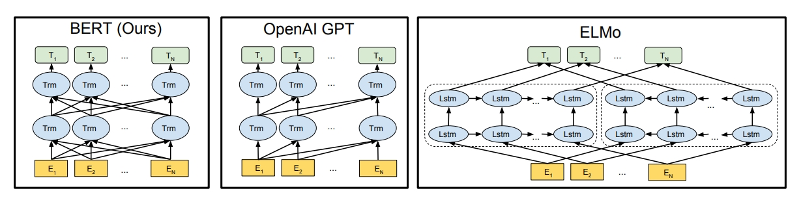
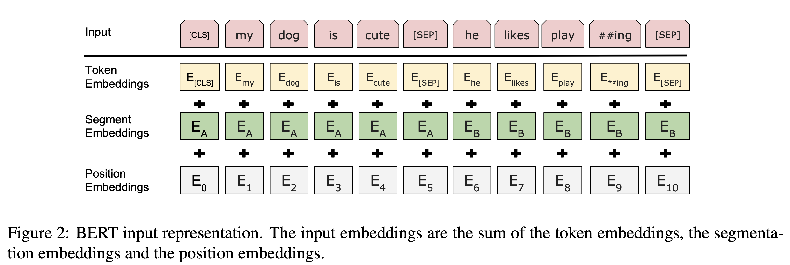
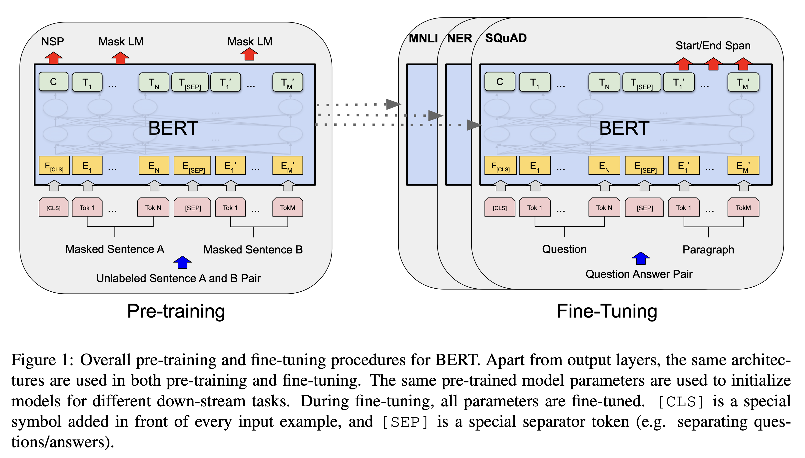
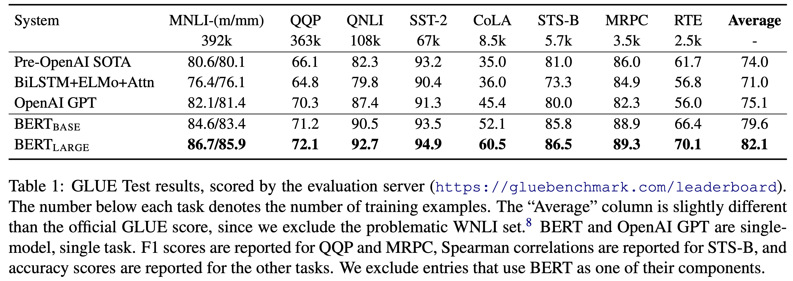
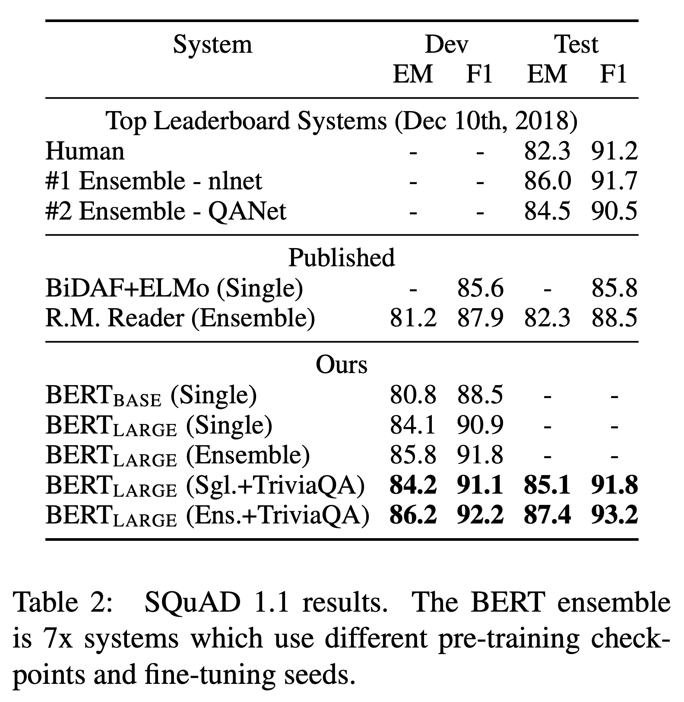
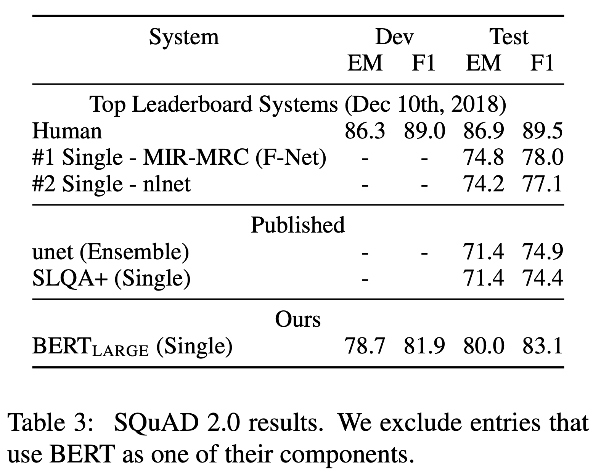
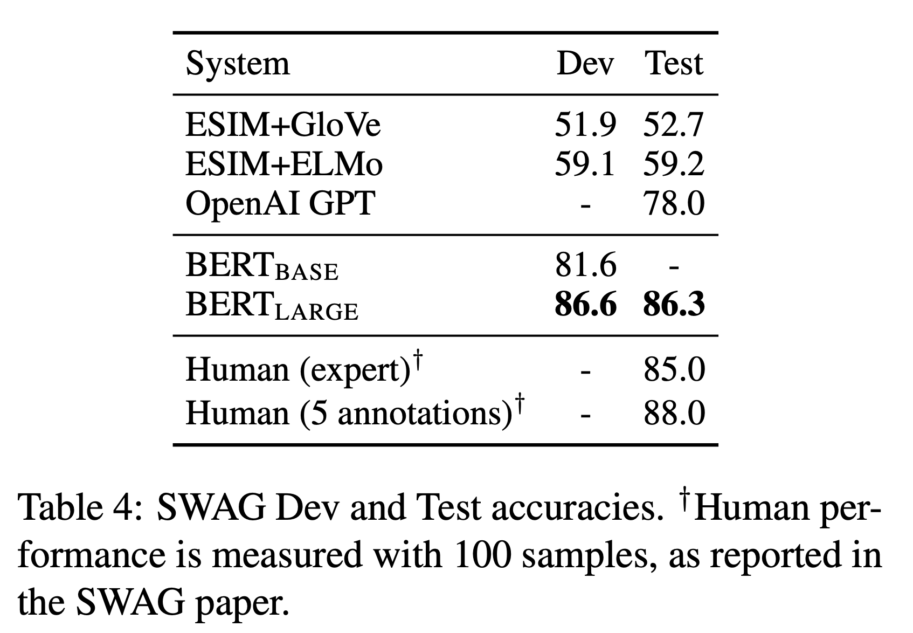

> citation  
Devlin, Jacob, et al. "Bert: Pre-training of deep bidirectional transformers for language understanding." Proceedings of the 2019 conference of the North American chapter of the association for computational linguistics: human language technologies, volume 1 (long and short papers). 2019.

### 개요
- BERT: Bidirectional Encoder Repreesentation from Transformers

**[ 전이 학습, 사전 학습 모델 ]**  
- 비지도 학습 방식으로 사전 학습 → downstream task를 위해 fine-tuning
- 적은 컴퓨팅 리소스로 다양한 작업 수행, 11개의 영역에서 SOTA 달성
- 사전 학습된 BERT는 Word2Vec, Glove, Fasttext를 능가하는 단어 임베딩 모델로 꼽힘

**[ Deep Bidirectional Representation ]**  

- 다른 모델들과의 차이점
    - GPT: 단방향으로 학습
    - ELMo: 단방향으로 학습한 결과들(left-to-right + right-to-left)을 결합 → shallow bidirectional
    - BERT: 입력 시퀀스의 각 토큰들에 대해서 주변 토큰들과의 관계를 양방향으로 학습
- Masked Language Modeling (MLM) 방식
    - 문장 쌍의 표현을 학습하기 위해 Next Sentence Prediction (NSP) 방식도 추가로 적용
- 최종 출력 layer만 추가로 학습하여 다양한 task에 적용 가능

 

### 입력 구조

**[ Token Embeddings ]**  
- Word Piece 방식 적용, 토큰별로 768차원으로 변환
- `[CLS]` 모든 시퀀스의 처음에 오는 토큰
  - 마지막 hidden state의 CLS 토큰은 입력 시퀀스 전체의 의미를 함축적으로 포함
  - classification task에 사용됨

**[ Segment Embeddings ]**
- `[SEP]` 문장의 끝에 오는 토큰
  - 여러 문장이 입력될 때 서로 다른 문장을 구분해주는 역할
  - 각각의 토큰이 문장 A, 문장 B에 해당하는 학습된 임베딩으로 변환됨

**[ Position Embeddings ]**
- transformer의 sinusoidal positional encoding: 함수를 정의하여 위치별로 벡터 생성
- BERT의 position embedding: 위치별 표현을 학습하여 임베딩 벡터를 생성

 

### 학습 방식

**[ 사전 학습 1: Masked Language Modeling (MLM) ]**
- 입력 시퀀스의 15%를 다른 token으로 대체
  - 80%를 [MASK] 토큰으로 대체
  - 10%를 랜덤한 다른 토큰으로 대체
  - 10%는 대체하지 않음 (올바른 토큰도 수정 없이 올바른 토큰으로 출력할 수 있도록 학습)

**[ 사전 학습 2: Next Sentence Prediction (NSP) ]**
- 필요성
  - Question Answering, Natural Language Inference의 경우, 문장 쌍이 입력됨
  - Language Modeling만으로 두 문장의 관계를 학습할 수 없음
- IsNext, NotNext 레이블 사용, CLS 토큰으로 판단
- 전체 데이터의 50%는 IsNext, 나머지는 NotNext

**[ 사전 학습 데이터셋 ]**
- BooksCorpus: 8억 개 단어
- English Wikipedia: 25억 개 단어
   - 리스트, 표, 헤더는 제외하고 순수 텍스트만 사용
- 긴 시퀀스에서 의미를 추출하기 위해서는 문서 단위의 말뭉치를 사용하는 것이 문장 단위의 말뭉치를 사용하는 것보다 유리함

**[ Fine-Tuning ]**
- 특정 task의 데이터셋을 입출력으로 하여 모든 파라미터를 튜닝
  - paraphrase: 문장 쌍
  - entailment: 가설 - 전제 쌍
  - question answering: question - passage 쌍
  - text cls, sequence tagging: 두 번째 문장이 없는 text-$\phi$ 쌍

### 결과
- 11개 분야에서 SOTA 달성
- SQuAD, SWAG에서 사람과 비슷한 수준의 점수 달성

Task별 결과

**The General Language Understanding Evaluation (GLUE)**

 

**The Stanford Question Answering Dataset (SQuAD) v1.1, v2.0**

<figure class="half" align="center">
    
    
</figure>

 

**The Situation With Adversarial Generations (SWAG)**

