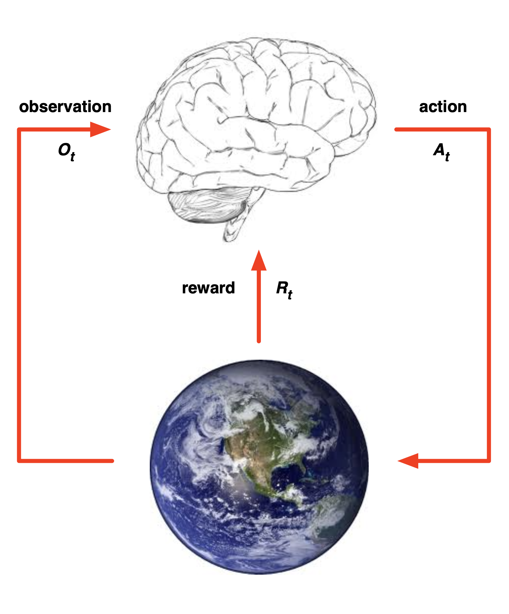

> 이 포스팅은 David Silver의 RL 강좌를 기반으로 작성되었습니다.  
- [강의 링크](https://youtu.be/2pWv7GOvuf0?si=OQO7z4fhV2Vyn26z), [강의 자료 링크](https://davidstarsilver.wordpress.com/teaching/)  
- 이미지 출처: David Silver, RL Course (CC-BY-NC 4.0)

## About Reinforcement Learning
### RL의 특성
- **no *supervisor*, only a *reward* signal**: trial and error를 반복하며 보상을 최대화하는 방향으로 나아감
- **Feedback is delayed, not instantaneous**: 현재 state에서 행한 action의 결과가 여러 스텝이 지나고 나서야 보상/피해의 형태로 나타남 e.g. 미로 찾기 생각해보기
- ***Time* really matters**: state와 action이 순차적으로 진행되어야 함 즉, i.i.d가 아님
- **Agent's action affect the subsequent data it receives**: environment로부터 state와 reward 정보를 받고, action을 취함으로써 envrionment를 변화시킴 (이때, real world를 변경하는 것이 아니라, agent가 처한 환경이 변화하는 것 e.g. 로봇이 방향을 틀면 세상이 돌아가는 게 아니라 로봇의 시야가 바뀜)

## The Reinforcement Learning Problem
### Reward
- $R_t$: 현재 timestep $t$에서 agent가 얼마나 잘했는지를 측정할 수 있는, 스칼라로 표현되는 피드백 시그널
- agent의 목표는 이 reward의 총합을 최대화하는 것
- reward는 지연(여러 스텝 이후에 알게)될 수 있음
  - actions가 여러 sequence를 포함할 수 있음
  - 즉각적인 reward를 포기하고 이후의 long-term reward를 추구하는 것이 나은 action일 수 있음

`Reward Hypothesis`: 모든 목표는 예측되는 reward의 총합을 최대화하는 것으로 설명될 수 있다.

> **QnA**  
Q. 최종적으로 가장 좋은 reward를 얻었다면, 이전의 reward들을 굳이 축적할 필요가 있는가? Ex. 보스를 죽이는 게임에서 최종적으로 잘 물리치기만 했다면, 이전에 몇 명의 쫄들이 죽었는지 알아야 할 필요가 있는지?  
A. 목표는 '보스를 잡는 것'이 맞지만, agent의 학습 과정에서 중간 reward들이 필요하다. Feedback is delayed라고 했던 것처럼, 결과적으로 보스를 잡기 위해 특정 state에서 어떤 action이 필요한지를 알아야 한다.  

### Environment

- 각 timestep $t$에서 agent는:
  - action $A_t$ 수행
  - observation $O_t$ 수신
  - reward $R_t$ 수신
- 각 timestep $t$에서 agent는:
  - action $A_t$ 수신
  - observation $O_{t+1}$ 출력
  - reward $R_{t+1}$ 출력

### State
- **History**: observation, action, reward들의 sequence  
  - 다음에 발생할 일은 history에 기반함
  - agent: action 수행
  - environment: objservation, reward 출력  

$$ H_t = O_1, R_1, A_1, ..., A_{t-1}, O_t, R_t $$  

- **State**: 다음 일어날 일을 예측하기 위해 사용되는 정보

$$ S_t = f(H_t) $$

- Environment State
  - $S^e_t$: environment의 private한 표현으로, 다음 observation/reward 계산에 이용됨
  - agent는 environment를 알지 못하는 경우가 대부분이며, 알더라도 불필요한 정보를 많이 포함하고 있을 수 있음
    - Ex. 로봇이 내 방을 돌아다닐 때 방 외부의 요인들은 로봇의 학습에 필요하지 않음
- Agent State
  - $S^a_t$: agent의 내부적 표현으로, 다음 action을 결정하기 위해 사용됨
  - 강화학습 알고리즘을 통해 학습되며, 다음 수식으로 표현됨 $S^e_t=f(H_t)$

### Markov
- ⭐️ Information State (Markov state)  
  - 과거의 모든 유용한 정보를 포함하는 상태
  - state $S_t$가 Markov일 필요충분조건: $\mathbb{P}[S_{t+1}|S_t]=\mathbb{P}[S_{t+1}|S_1,...,S_t]$
  - "현재가 주어졌을 때 미래는 과거와 독립적이다": $H_{1:t} \to S_t \to H_{t+1:\infty}$
  - $S^e_t$와 $H_t$는 Markov
- Fully Observable Environments
  - $O_t = S^a_t = S^e_t$: agent가 environment로부터 state를 직접 발견
  - ⭐️ **`Markov Decision Process (MDP)`**
- Partially Observable Environments
  - agent가 직접적으로 environment를 알 수 없음 (agent state $\neq$ environment state)
    - Ex. 카메라 기반의 로봇은 자신의 위치 좌표를 알 수 없음
  - ⭐️ **`Partially Observable Markov Decision Process (POMDP)`**
  - 따라서 agent는 반드시 자신의 state $S^a_t$를 정의해야 함
    - complete history: $S^a_t = H_t$
    - beliefs of environment state (동일하지 않으니 예측해야 함)
      - 특정 환경에 대한 확률 분포로 표현: $S^a_t=(\mathbb{P}[S^e_t=s^1], ..., \mathbb{P}[S^e_t=s^n])$
      - Neural Net을 활용한 다음 state 예측: $S^a_t = \sigma(S^a_{t-1}W_s+O_tW_o)$

## Inside an RL Agent
### Policy
- agent가 현재 state를 기반으로 action을 결정하는 정책
- state를 action으로 변환하는 함수
- Deterministic: $a=\pi(s)$
- Stochastic: $\pi(a|s)=\mathbb{P}[A_t=a|S_t=s]$

### Value Function
- 각 state가, 또는 action이 얼마나 좋은지를 판단
  - environment로부터 받는 reward를 계산하는 게 아니라, 현재 state에서 action을 취했을 때 이후 step에서 얻을 수 있는 모든 예상되는 reward의 총합을 말함 → 현재 state, 또는 현재 state에서 행할 특정 action의 가치를 판단하여 다음 action을 결정
- 미래에 받을 수 있는 reward들에 대한 예측값
- state들의 value를 계산 → action의 가치를 판단

$$V_{\pi} = \mathbb{E}_\pi[R_{t+1}+\gamma R_{t+2} + \gamma ^2 R_{t+3} + ... | S_t=s]$$

### Model
- agent가 생각하는 envrionment (실제와 같지 않을 수 있음)
  - 실제 environment는 노이즈와 불필요한 정보들이 많을 수 있기 때문에 모델링을 수행
  - Ex. 헬기의 움직임을 모델링하여 강화학습 진행
- environment의 다음 행동을 예측
- $\mathcal{P}$: 다음 state를 예측
- $\mathcal{R}$: 바로 다음 reward를 예측 (value function과 달리 누적이 아님)

$$ \mathcal{P}^a_{ss'} = \mathbb{P}[S_{t+1}=s'|S_t=s, A_t=a] $$
$$ \mathcal{R}^a_s = \mathbb{E}[R_{t+1}=s'|S_t=s, A_t=a] $$

### RL Agent 분류
- Value Based
  - Value Function의 출력을 기반으로 현재 state에서 수행할 다음 action을 결정 (greedy algorithm이랑 비슷)
  - `No Policy (implicit)`, `Value Function`
- Policy Based
  - 각 state마다 정의된 policy들을 분석, 조합해서 다음 action을 결정
    - Ex. 미로의 각 칸에 정의된 움직일 수 있는 방향들의 조합을 어떤 데이터 구조로 저장, 분석
  - `Policy`, `No Value Function`
- Actor Critic
  - policy와 value function을 적절히 조합
  - `Policy`, `Value Function`

(TBU)

## Problems within Reinforcement Learning
