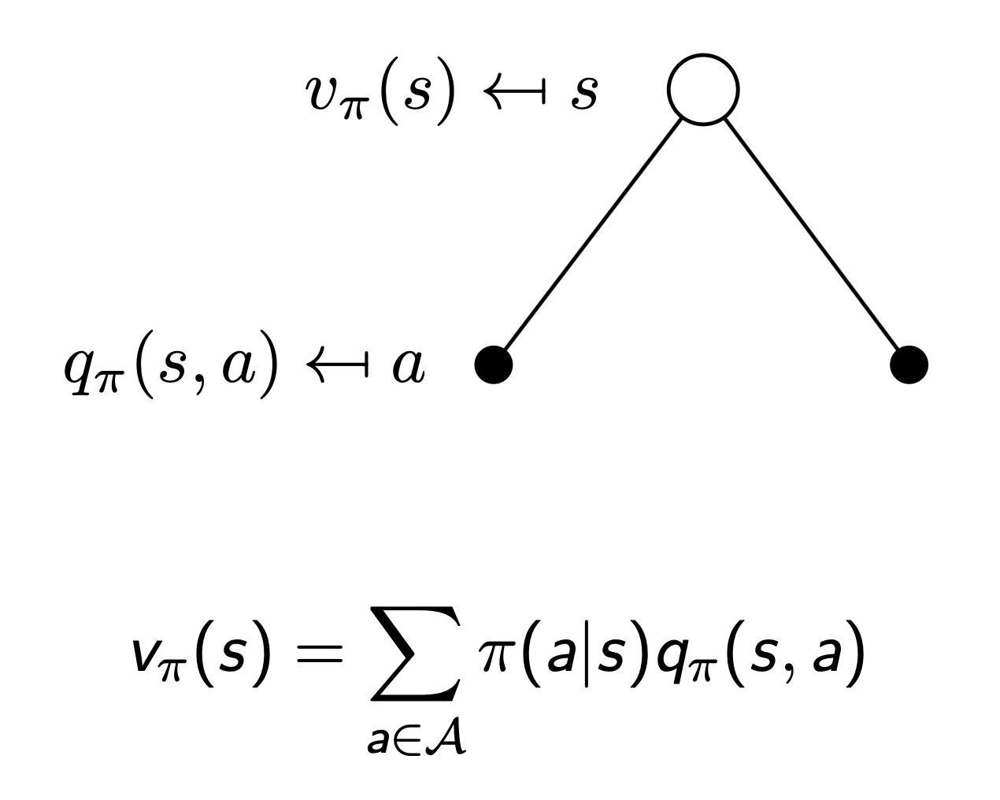
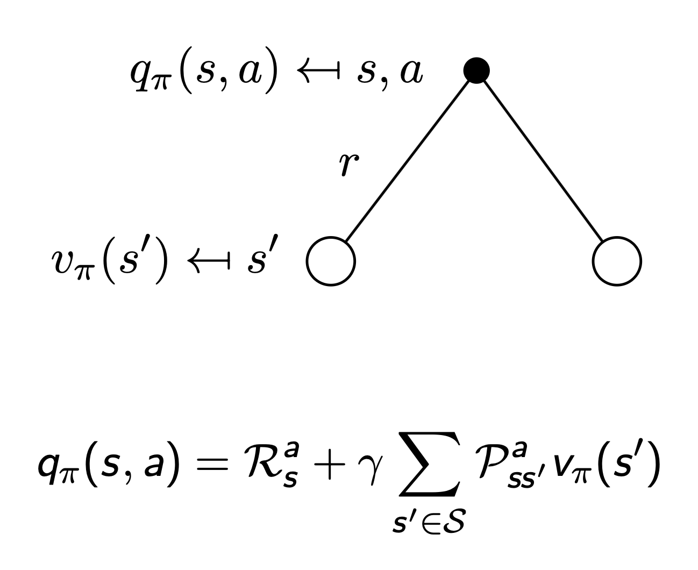
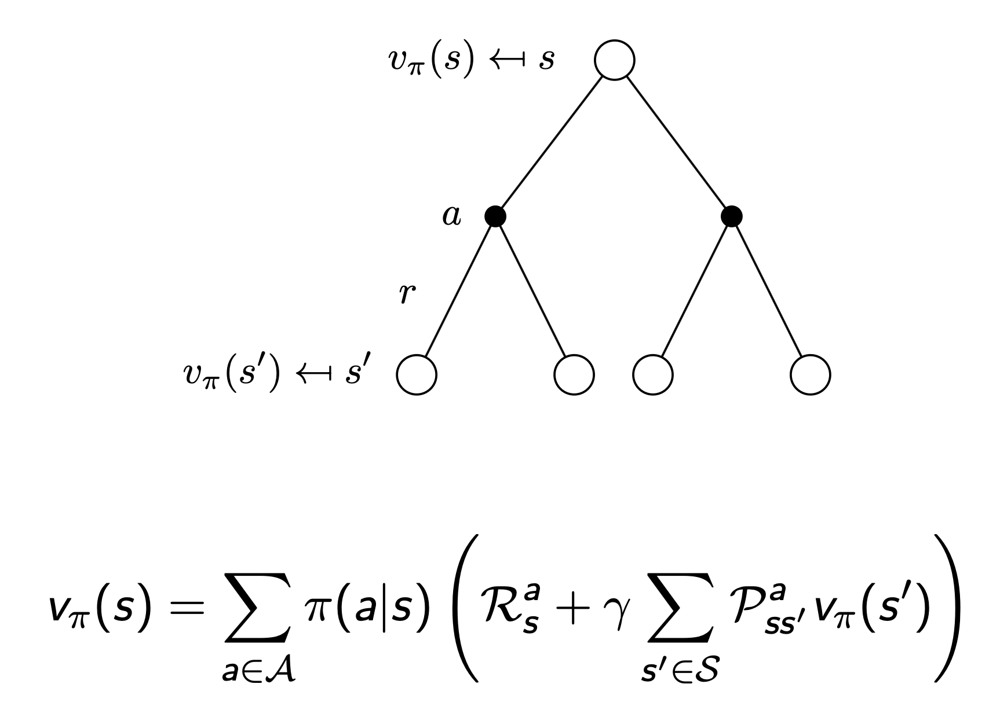
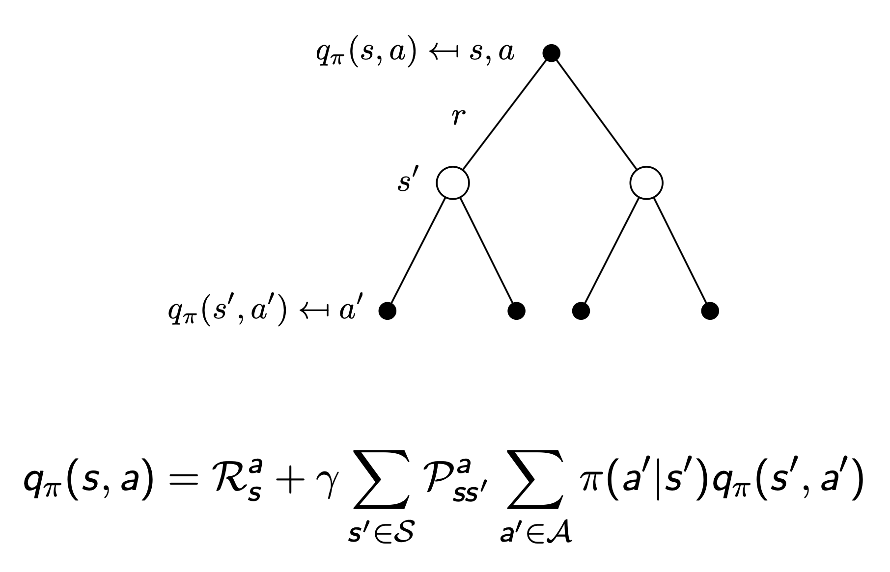

> 이 포스팅은 David Silver의 RL 강좌를 기반으로 작성되었습니다.  
- [강의 링크](https://www.youtube.com/watch?v=lfHX2hHRMVQ&list=PLqYmG7hTraZDM-OYHWgPebj2MfCFzFObQ&index=2), [강의 자료 링크](https://davidstarsilver.wordpress.com/teaching/)  
- 이미지 출처: David Silver, RL Course (CC-BY-NC 4.0)

## Markov Processes
### Introduction
- Markov decision processes는 강화학습에서 environment를 묘사 (where the environment is fully observable)
- 거의 모든 RL 문제들을 MDP로 표현 가능
  - optimal control은 continuous MDP로 해결
  - partially observable problem도 MDP로 변환해서 해결 가능
  - bandit(action → get feedback)은 state가 하나인 MDP

### Markov Property
```"The future is independent of the past given the present"```  

$$ \mathbb{P}[S_{t+1}|S_t] = \mathbb{P}[S_{t+1}|S_1,...,S_t] $$

- state는 history로부터 모든 관련 있는 정보를 포함 → state를 알면, history를 전혀 몰라도 됨
- The state is sufficient statistic of the future

**[ State Transition Matrix ]**  

$$ \mathcal{P}_{SS'} = \mathbb{P}[S_{t+1}=s'|S_t=s] $$

- $s$: Markov state
- $s'$: 전이 결과 state
- $\mathcal{P}$: state 전이 확률
- 전이 행렬 $\mathcal{P}$ 는 state $s$ 로부터 전이 결과 state $s'$ 으로의 전이 확률을 표현하며, 각 행의 총합은 1

$$
\mathcal{P} = \text{from}
\begin{bmatrix}
\mathcal{P}_{11} ... \mathcal{P}_{1n} \\
... \\
\mathcal{P}_{n1} ... \mathcal{P}_{nn}
\end{bmatrix}
$$

### Markov Chains
**[ Markov Process ]**  
```이 자체로 강화학습을 수행하는 것이 아니라, 어떤 state가 Markov Property를 만족하는 프로세스에 대한 정의```  
Markov Process (or Markov Chain) 튜플 $<\mathcal{S}, \mathcal{P}>$ 에 대하여
- $\mathcal{S}$: state들의 유한 집합
- $\mathcal{P}$: state 전이 확률 행렬  

$$\mathcal{P}_{ss'} = \mathbb{P}[S_{t+1}=s' \mid S_{t}=s]$$

(+ sample: 특정 state에서 terminate/goal state까지의 sequence)  

## Markov Reward Processes
```MP에서 value(가치)를 추가한 프로세스```  
Markov Process (or Markov Chain) 튜플 $<\mathcal{S}, \mathcal{P}, \mathcal{R}, \gamma>$ 에 대하여  
- $\mathcal{S}$: state들의 유한 집합
- $\mathcal{P}$: state 전이 확률 행렬  

$$\mathcal{P}_{ss'} = \mathbb{P}[S_{t+1}=s' \mid S_{t}=s]$$

- $\mathcal{R}$: reward 함수

$$\mathcal{R}_s = \mathbb{E}[R_{t+1}|S_t=s]$$

- $\gamma$: discount factor (시간적 요소를 반영), $\gamma \in [0, 1]$

### Return
```time-step $t$에서 얻을 수 있는 모든 할인(by discount factor)된 reward의 총합```  

$$G_t = R_{t+1} + \gamma R_{t+2} + ... = \sum_{k=0}^{\infty}\gamma^kR_{t+k+1}$$

- $\gamma$는 미래 reward에 대한 현재의 값
- 현재 timestep에서 지연된 reward들에 대해 즉각적인 reward를 구할 수 있음
  - $\gamma \to 0$: "myopic" 평가
  - $\gamma \to 1$: "far-sighted" 평가

### Why Discount?
- 수학적 편의성 (수렴)
- cyclic MP에서의 무한 루프 회피
- 미래에 대한 불확실성: reward를 예측하는 model이 불완전할 수 있기 때문에 timestep이 멀어질 수록 불확실성이 커짐
- reward가 금전적인 문제와 관련이 있다면, 미래보다 즉시 받을 수 있는 reward가 더 가치있음
- 동물/사람은 즉각적인 reward에 더 크게 반응 (agent를 cognitive model처럼 생각)
- 모든 sequence에 대해 종료 조건이 존재한다면 $\gamma=1$ 사용도 가능

### Value Function
```MRP에서 value 함수 $v(s)$ 는 state $s$ 로부터의 return에 대한 기댓값을 제공```  

$$ v(s) = \mathbb{E}[G_t | S_t=s] $$

- goal state까지만이 아니라 미래에 받을 수 있는 모든 누적 보상
- 기댓값인 이유: environment가 stochastic
- $v(s)$ 자체는 maxmize의 개념이 없고, agent의 action에 따라 $v(s)$ 를 통해 구한 reward를 최대화하는 것이 목표

### Bellman Equation for MRPs
value 함수는 두 개의 요소로 분해 가능: 즉각적인 reward $R_{t+1}$, 다음 state에서 얻을 보상인 $\gamma v(S_{t+1})$  

$$
v(s) = \mathbb{E}[G_t | S_t=s] \\
= \mathbb{E}[R_{t+1} + \gamma R_{t+2} + \gamma^2 R_{t+3} + ... | S_t=s] \\
= \mathbb{E}[R_{t+1} + \gamma (R_{t+2} + \gamma R_{t+3} + ...) | S_t=s] \\
= \mathbb{E}[R_{t+1} + \gamma G_{t+1} | S_t=s] \\
= \mathbb{E}[R_{t+1} + \gamma v(S_{t+1}) | S_t=s] \\
$$

<div align="center">

</div>

- 엣지가 한 개인 트리로 표현 가능

$$ v(s) = \mathcal{R}_s + \gamma \sum_{s' \in S}\mathcal{P}_{ss'}v(s') $$

**[ Bellman Equation in Matrix Form ]**  

$$ v = \mathcal{R} + \gamma \mathcal{P}v $$

- $v$ 는 각 요소가 state에 해당하는 열벡터

$$
\begin{bmatrix}
v(1) \\
... \\
v(n)
\end{bmatrix} =

\begin{bmatrix}
\mathcal{R}_1 \\
... \\
\mathcal{R}_n
\end{bmatrix} +

\gamma \begin{bmatrix}
\mathcal{P}_{11} ... \mathcal{P}_{1n} \\
... \\
\mathcal{P}_{1n} ... \mathcal{P}_{nn}
\end{bmatrix}

\begin{bmatrix}
v(1) \\
... \\
v(n)
\end{bmatrix}
$$

**[ Solving the Bellman Equation ]**  
- Bellman Equation은 선형식이기 때문에 아래와 같이 해결 가능

$$ v = \mathcal{R} + \gamma \mathcal{P}v \\
(I-\gamma \mathcal{P})v = \mathcal{R} \\
v = (I-\gamma \mathcal{P})^{-1}\mathcal{R}
$$

- $n$ 개의 state들에 대한 시간 복잡도는 $O(n^3)$ → $n$ 이 너무 커지면 오래 걸릴 수 있음
- 역행렬이 존재해야 함
- 매우 큰 $n$ 에 대해서 반복적으로 접근하는 방식
  - dynamic programming
  - monte-carlo evaluation
  - temporal-difference learning

## Markov Decision Processes
```MRP에서 결정의 개념을 추가한 프로세스로, 결정이 가능한 상황에서 agent가 action을 수행할 수 있음 (당연히 모든 state가 Markov)```  
Markov Decision Process 튜플 $<\mathcal{S}, \mathcal{A}, \mathcal{P}, \mathcal{R}, \gamma>$ 에 대하여  
- $\mathcal{S}$: state들의 유한 집합
- $\mathcal{A}$: action들의 유한 집합
- $\mathcal{P}$: state 전이 확률 행렬  

$$\mathcal{P}_{ss'}^a = \mathbb{P}[S_{t+1}=s' \mid S_{t}=s, \mid A_t=a]$$

- $\mathcal{R}$: reward 함수  

$$\mathcal{R}_s^a = \mathbb{E}[R_{t+1}|S_t=s, A_t=a]$$

- $\gamma$: discount factor (시간적 요소를 반영), $\gamma \in [0, 1]$  

### Policies
```state가 주어졌을 때 action에 대한 분포```  

$$ \pi (a|s) = \mathbb{P}[A_t=a|s_t=s] $$  

- policy는 agent의 행동을 완전하게 정의
- MDP의 policy는 현재 state에 의존 (history가 아니라 $\because$ Markov)
- policy는 stationary (시간에 독립적) $\because$ Markov이기 때문에 현재 state만 확인하면 됨  
$A_t~\pi (\cdot | S_t), \forall t > 0$
- 주어진 MDP $\mathcal{M} = <\mathcal{S}, \mathcal{A}, \mathcal{P}, \mathcal{R}, \gamma>$와 policy $\pi$ 에 대해서
  - state들의 시퀀스 $S_1, S_2, ...$ 는 Markov process $<\mathcal{S}, \mathcal{P}^\pi>$
  - state와 reward들의 시퀀스 $S_1, R_2, S_2, ...$ 는 Markov reward process $<\mathcal{S}, \mathcal{P}^\pi, \mathcal{R}^\pi, \gamma>$ 이며, $\mathcal{P}$ 와 $\mathcal{R}$ 은 아래를 따름

$$
\mathcal{P}^\pi_{S, S'} = \sum_{a \in \mathcal{A}}\pi(a|s)\mathcal{P}^a_{SS'} \\
\mathcal{R}^\pi_S = \sum_{a \in \mathcal{A}}\pi(a|s)\mathcal{R}^a_{S}
$$

### Value Function
```MDP에서의 state-value function이란, state s에서 뒤따르는 policy pi에 대해 return에 대한 기댓값```  

$$ v_\pi(s) = \mathbb{E}_\pi[G_t | S_t = s] $$

```MDP에서의 action-value function이란, agent가 state s에서 action a를 취했을 때, 뒤따르는 policy pi에 대해 return에 대한 기댓값```  

$$ q_\pi(s,a) = \mathbb{E}[G_t | S_t=s, A_t=a] $$

### Bellman Expectation Equation
- 즉시 받을 수 있는 reward와 다음 state에서의 reward의 합으로 표현 가능

`state-value function`  

$$ v_\pi(s) = \mathbb{E}_\pi[R_{t+1} + \gamma v_\pi(S_{t+1}) | S_t = s] $$

<div align="center">

</div>

`action-value function`  

$$ q_\pi(s,a) = \mathbb{E}[R_{t+1} + \gamma q_\pi(S_{t+1}, A_{t+1}) | S_t=s, A_t=a] $$

<div align="center">

</div>

- two step state-value & action-value function
  - value의 action reward에 action-value function을 적용
  - action의 state reward에 state-value function을 적용
<div align="center">

</div>

<div align="center">

</div>

### Optimal Value Function  
```optimal state-value function이란, 모든 policy 중에서 기댓값이 최대가 되는 경우의 value function```  

$$ v_*(s) = \max_\pi v_\pi(s) $$

```optimal action-value function이란, 모든 policy 중에서 기댓값이 최대가 되는 경우의 action-value function```  

$$ q_*(s, a) = \max_\pi q_\pi(s, a) $$

- MDP는 최적의 value fn.을 찾았을 때 비로소 "해결"됨

### Optimal Policy

$$ \pi \ge \pi' \ \text{if} \ v_\pi(s) \ge v_{\pi'}(s), \forall s $$

- 모든 MDP에 대해서 이론적으로
  - 다른 모든 policy $\pi$ 와 같거나, 더 나은 policy $\pi_*$ 가 반드시 존재
  - 모든 최적의 policy들은 최적의 value fn.을 만족 → $v_{\pi_*}(s) = v_*(s)$
  - 모든 최적의 policy들은 최적의 action-value fn.을 만족 → $q_{\pi_*}(s, a) = q_*(s, a)$
- $q_*(s, a)$ 를 최대화 함으로써 최적의 policy를 찾을 수 있음
  - 즉, $q_*(s, a)$ 를 알면 최적의 policy를 찾은 것과 마찬가지

$$
\pi^{*}(a \mid s) =
\begin{cases}
1 & \text{if } a = \arg\max\limits_{a \in \mathcal{A}} q^{*}(s, a) \\
0 & \text{otherwise}
\end{cases}
$$

- Bellman eq.을 적용해서 동일하게 recursive한 방식으로 해결 가능

### Solving the Bellman Optimality Equation
- Bellman Optimality Equation은 비선형적이며, 일반적으로 closed form solution이 없음
- 다양한 iterative 방식을 적용
  - Value Iteration
  - Policy Iteration
  - Q-learning
  - Sarsa
