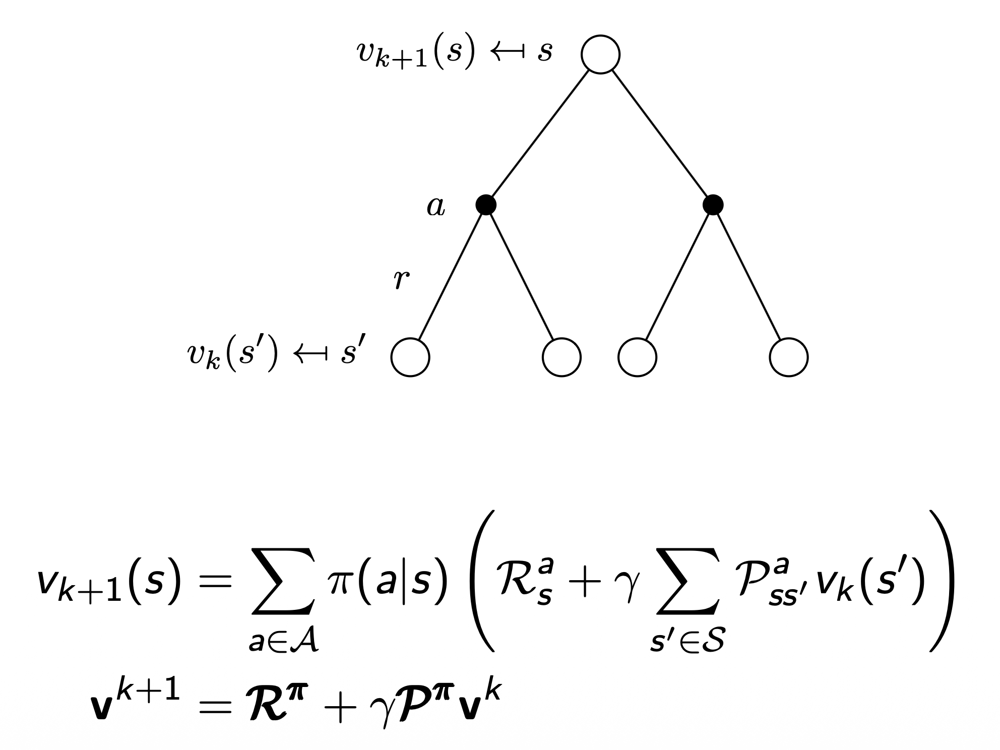
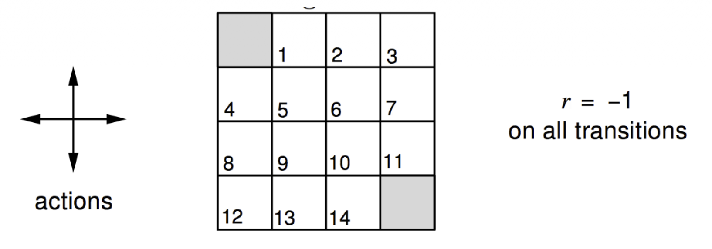
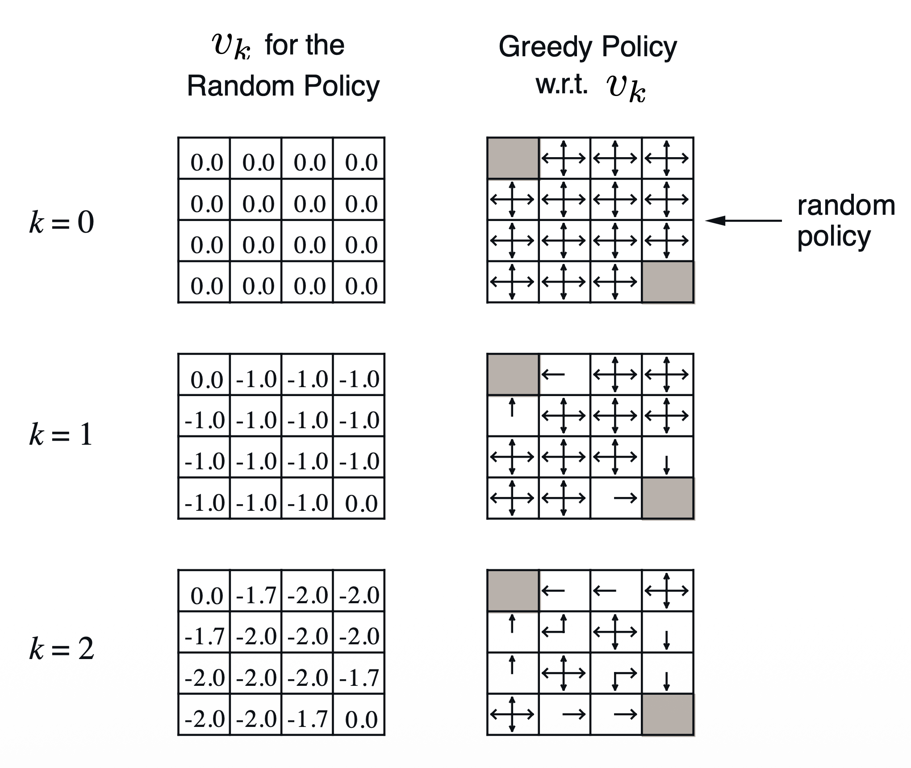
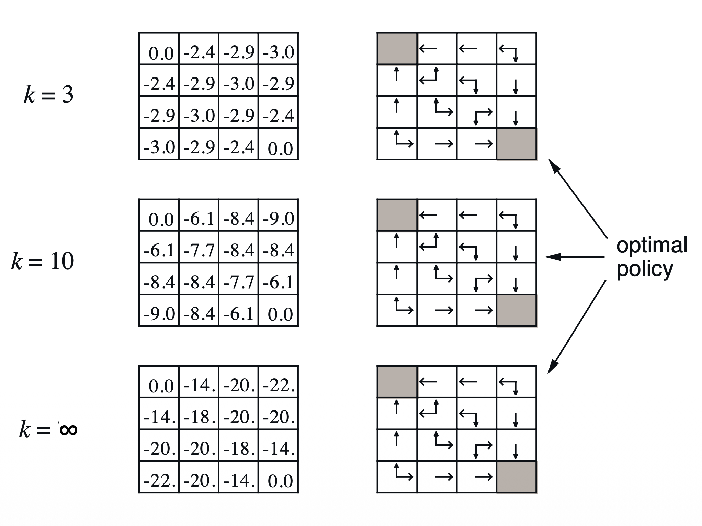
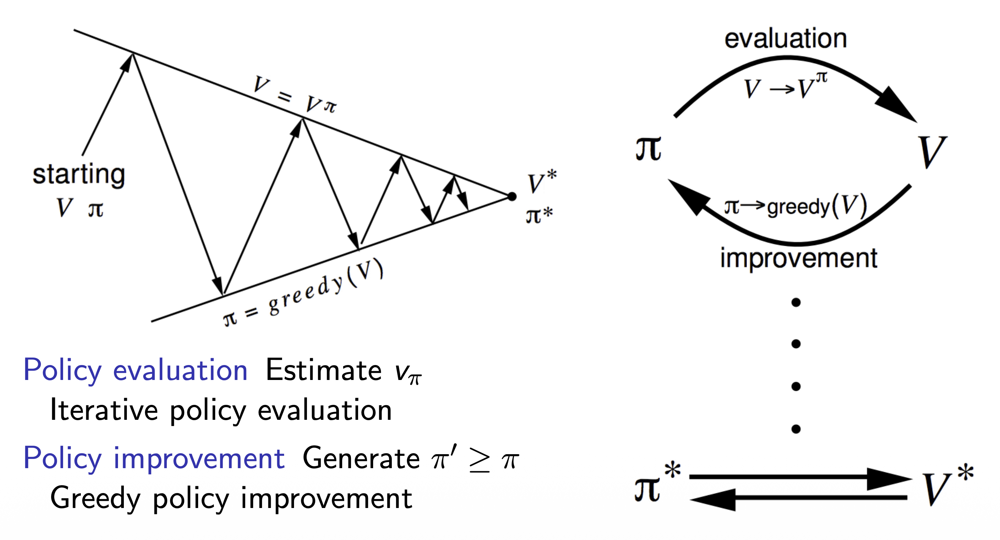
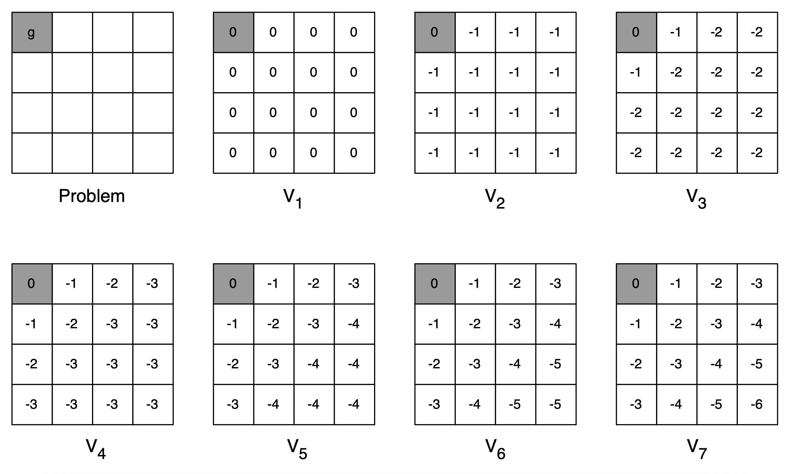
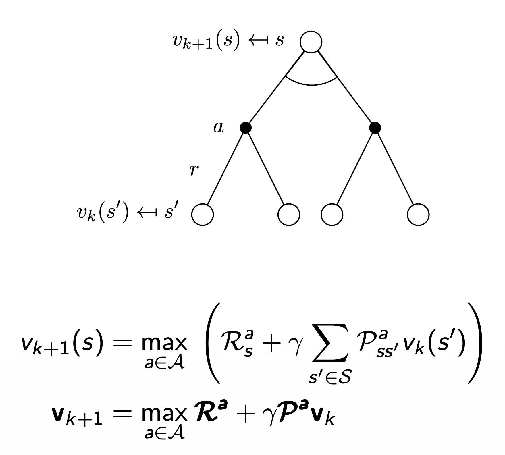

> 이 포스팅은 David Silver의 RL 강좌를 기반으로 작성되었습니다.  
- [강의 링크](https://www.youtube.com/watch?v=Nd1-UUMVfz4&list=PLqYmG7hTraZDM-OYHWgPebj2MfCFzFObQ&index=3), [강의 자료 링크](https://davidstarsilver.wordpress.com/teaching/)  
- 이미지 출처: David Silver, RL Course (CC-BY-NC 4.0)

## Introduction
**[ Dynamic Programming이란? ]**  
```복잡한 문제를 단순한 subproblem으로 쪼개어 해결하는 방법```  

**[ Requirements for DP ]**  
- 두 가지 요소를 충족해야 함
  - 최적의 해결방법은 subproblem들로 쪼개질 수 있어야 함
  - 쪼개진 subproblem들에 겹치는 부분이 있어 caching이 가능해야 함
- MDP는 두 가지 요소를 모두 충족
  - Bellman Equation을 통해 반복적으로 문제를 쪼갤 수 있음
  - value fn.은 저장되고, 재사용 가능

**[ Planning by DP ]**  
- DP는 MDP의 모든 상황을 알고 있음을 가정
  - model-free: env가 어떤지 모르며, 완전한 정보를 얻을 수 없음 → DP 적용 X (모든 state에 대해 backup하는 게 아닌, sample backups는 model-free 환경이 적용될 수 있음)
  - model-based: env에 대한 model이 있어 모든 상황을 아는 경우 → DP 적용 O

`for Prediction`  
- Input: MDP $<\mathcal{S}, \mathcal{A}, \mathcal{P}, \mathcal{R}, \gamma>$ & policy $\pi$ or MRP $<\mathcal{S}, \mathcal{P}^\pi, \mathcal{R}^\pi, \gamma>$  
- Output: value fn. $v_\pi$ (즉, 목표가 value fn.을 예측하는 것)

`for Control`  
- Input: MDP $<\mathcal{S}, \mathcal{A}, \mathcal{P}, \mathcal{R}, \gamma>$
- Output: 최적의 value fn. $v_*$ 와 최적의 policy $\pi_*$  

DP는 RL에서 뿐만 아니라 다양한 문제 해결에 사용되지만, 본 강의와는 관련 없기 때문에 생략!

## Policy Evaluation
### Iterative Policy Evaluation
`Problem`  
policy $\pi$ 가 주어졌을 때, 해당 policyd의 reward를 계산하는 것

`Solution`  
반복적으로 Bellman Expectation을 적용 ($v_1 \to v_2 \to ... \to v_\pi$)  
이때, synchronous backups(caching)를 활용 (asynchronous backups는 아직 고려하지 않음)
- 각 iteration step $k+1$ 일 때,
- 모든 state $s \in S$ 에 대해서,
- $v_k(s')$ 를 활용해서 $v_{k+1}(s)$ 를 업데이트 (이때, $s'$ 은 $s$ 로부터 도달 가능한 다음 state)

$v_\pi$ 로 반드시 수렴하는 것을 본 강의에서 증명

<div align="center">

</div>

state $s$ 에서 action $a$ 수행 → 다음 모든 state $s'$ 들의 값을 사용해서 현재 state의 value fn. $v_{k+1}(s)$ 를 정확히 예측  
- $\pi(a \mid s)$: 현재 state $s$ 에서 수행할 수 있는 action $a$ 에 대한 policy
- $\mathcal{R}_s^a$: 현재 state $s$ 에서 action $a$ 를 수행할 때 받는 immediate reward
- $\gamma$: discount factor  
- $\mathcal{P}^a_{ss'}$: 현재 state $s$ 에서 다음 state $s'$ 로의 전이 확률(action $a$ 를 수행했을 때)  
- $v_k(s')$: 다음 state $s'$ 에서의 value fn.

### Example: Small Gridworld  

<div align="center">

</div>

**[ 조건 ]**  
- undiscounted episodic MDP ($\gamma = 1$)  
- 1, ..., 14는 nonterminal state들
- 회색 박스들이 terminal state들
- 그리드 밖을 나가는 action을 수행할 경우, 원래의 위치로 되돌아오게 됨
- terminal state에 도달하기 전까지 모든 transition의 reward는 -1
- agent는 아래의 랜덤 policy를 따름 (랜덤 policy에서부터 시작하더라도, 결국 최적의 policy에 도달)

$$ \pi(n|\cdot) = \pi(e|\cdot) = \pi(s|\cdot) = \pi(w|\cdot) = 0.25 $$

<div align="center">
  
  
</div>

계산 예시: north, east, south, west 순서대로 계산  
`k=2, box 1` 0.25(-1.0-1.0) + 0.25(-1.0-1.0) + 0.25(-1.0-1.0) + 0.25(-1.0+0.0) = -1.75 $\approx$ **-1.7**  
`k=2, box 5` 0.25(-1.0-1.0) + 0.25(-1.0-1.0) + 0.25(-1.0-1.0) + 0.25(-1.0-1.0) = **-2.0**  
`k=3, box 1` 0.25(-1.0-1.7) + 0.25(-1.0-2.0) + 0.25(-1.0-2.0) + 0.25(-1.0+0.0) = -2.425 $\approx$ **-2.4**  
(그림을 보면, value fn.이 전부 업데이트가 되지 않았음에도 policy는 최적을 찾은 상태인데, 이는 뒤에 더 자세히 설명될 것~)

## Policy Iteration
### How to Improve Policy  
policy $\pi$ 가 주어졌을 때, 해당 policy의 value fn. $v_\pi$ 를 계산  

$$v_\pi(s) = \mathbb{E}[R_{t+1} + \gamma R_{t+2} + ... | S_t=s ]$$

계산해서 얻은 $v_\pi$ 에 따라서 매 스텝마다 greedy하게 policy를 업데이트

$$\pi ' = \text{greedy}(v_\pi)$$

Small Gridworld에서 봤던 예제에서도 $\pi ' = \pi^*$ 로 수렴함을 확인  
실제 문제들에 접목했을 때는 더 많은 iteration을 거쳐야 하지만, 어떠한 경우에도 policy iteration은 반드시 최적의 policy $\pi^*$ 로 수렴함

<div align="center">
  
</div>

policy evaluation과 policy improvement를 반복적으로 수행  
- policy evaluation: $v_\pi$ 를 계산
- policy improvement: 계산한 $v_\pi$ 를 통해 greedy하게 policy를 업데이트

### Policy Improvement
**[ 반드시 최적의 value fn. & policy로 수렴하는 것을 증명 ]**  
- deterministic policy 가정: $a = \pi(s)$  
- 매 스텝마다 greedy하게 policy를 업데이트: $\pi'(s) = \operatorname*{argmax}\limits_{a \in \mathcal{A}} q_\pi(s,a)$  
  - $q_\pi(s, a)$: 특정 action $a$를 수행했을 때 얻는 value fn.
  - 즉, 수행 가능한 여러 action들 중에 argmax를 통해 최적의 action을 다음 policy $\pi'$ 으로 선택하겠다는 것
- policy를 업데이트함에 따라 value 또한 업데이트: $q_\pi(s, \pi'(s)) = \operatorname*{max}\limits_{a \in \mathcal{A}} q_\pi(s, a) \ge q_\pi(s, \pi(s)) = v_\pi(s)$
- 결과적으로 value fn.의 값을 향상하는 격: $v_{\pi'}(s) \ge v_\pi(s)$  

$$
v_\pi(s) \le q_\pi(s, \pi'(s)) = \mathbb{E}_{\pi'}[R_{t+1} + \gamma v_\pi(S_{t+1}) | S_t=s] \\
\le \mathbb{E}_{\pi'}[R_{t+1} + \gamma q_\pi(S_{t+1}, \pi'(S_{t+1})) | S_t=s] \\
\quad\quad\quad\quad \le \mathbb{E}_{\pi'}[R_{t+1} + \gamma R_{t+2} + \gamma^2 q_\pi(S_{t+2}, \pi'(S_{t+2})) | S_t=s] \\
\le \mathbb{E}_{\pi'}[R_{t+1} + \gamma R_{t+2} + ... | S_t=s] = v_{\pi'}(s) \\
$$  

- improvement가 멈추면, 결과적으로 아래 식이 성립

$$ q_\pi(s, \pi'(s)) = \operatorname*{max}\limits_{a \in \mathcal{A}} q_\pi(s, a) = q_\pi(s, \pi(s)) = v_\pi(s) $$  

- Bellman optimality equation 성립  

$$ v_\pi(s) = \operatorname*{max}\limits_{a \in \mathcal{A}} q_\pi(s, a) $$  

- 결과적으로 모든 $s \in \mathcal{S}$ 에 대해서, $v_\pi(s) = v_*(s)$ 성립 → $\pi$ 는 최적의 policy로 수렴

### Extensions to Policy Iteration
**[ Modified Policy Iteration ]**  
- 문제: policy iteration이 반드시 $v_\pi$ 로 수렴한 뒤에 policy를 결정해야 하는가? (Small Grid World에서도 value fn.이 수렴하지 않았음에도 policy는 수렴함)  
  - 정지 조건 만들기 (e.g. value fn.에 대해서 $\epsilon$-convergence 적용)
  - 단순히 $k$ 번의 반복 이후 종료 (e.g. Small Grid World에서는 $k=3$ 으로 충분했음)
- 해결: policy를 각 반복 스텝마다 업데이트
  - 한 스텝마다 policy를 업데이트 하는 것은 결국 value iteration과 동일
  - value fn. 관점에서 그저 주어진 policy에 따라 reward를 계산하면 될 뿐임

## Value Iteration

### Value Iteration in MDPs

**[ Principal of Optimality ]**  
어떠한 최적의 policy라도 아래의 두 요소로 분해 가능
- 최적의 첫 번째 action $A_*$
- 뒤따르는 state $S'$ 의 최적의 policy  
(즉, 첫 action을 optimal하게 시작한 이후, 다음 state에서 또 최적의 policy를 찾으면, 최적으로 수렴함)  

policy $\pi_(a|s)$ 가 state $s$ 에서 최적의 value $v_\pi(s) = v_*(s)$ 를 달성할 필요충분조건:  
- state $s$ 에서 도달 가능한 모든 state $s'$ 에 대해서
- $\pi$ 는 state $s'$ 에서 최적을 달성: $v_\pi(s') = v_*(s')$ ($s'$ 에서 최적의 policy에 도달 가능할 때)

**[ Deterministic Value Iteration ]**  
subproblem의 해인 $v_*(s')$ 을 알고 있으면, 전체 해 $v_*(s)$ 는 one-step lookahead로 알 수 있음  

$$v_*(s) \gets \operatorname*{max}\limits_{a \in \mathcal{A}} \mathcal{R}^a_s + \gamma \sum_{s' \in \mathcal{S}} \mathcal{P}^a_{ss'} v_*(s')$$

- value iteration의 핵심은 위 업데이트를 스텝마다 반복적으로 적용하는 것
- 최종 reward로부터 한 스텝씩 거꾸로 적용하는 직관에서 출발
- loopy MDP, stochastic MDP에도 적용이 가능함

**[ Example: Shortest Path ]**  

<div align="center">
  
</div>

- 모든 transition reward는 -1로 가정
- 모든 state의 reward를 one-step lookahead로 계산
  - $v_1$ 에서 모든 칸은 0, $v_2$ 에서 모든 칸은 -1인 것이, 한 step에 대해서만 예측하기 때문임
  - $v_7$ 이 되어서야 최종적으로 전부 업데이트가 된 상태  

**[ Value Iteration ]**  
(Iterative Policy Evaluation과 동일)  

`Problem`  
policy $\pi$ 가 주어졌을 때, 해당 policyd의 reward를 계산하는 것

`Solution`  
반복적으로 Bellman Expectation을 적용 ($v_1 \to v_2 \to ... \to v_\pi$)  
이때, synchronous backups(caching)를 활용 (asynchronous backups는 아직 고려하지 않음)
- 각 iteration step $k+1$ 일 때,
- 모든 state $s \in S$ 에 대해서,
- $v_k(s')$ 를 활용해서 $v_{k+1}(s)$ 를 업데이트 (이때, $s'$ 은 $s$ 로부터 도달 가능한 다음 state)

<div align="center">
  
</div>

- Policy Iteration과의 차이점: $\text{max}$ 가 붙었으며, greedy하게 매 step마다 최적의 value fn.을 찾겠다는 것

### Summary of DP Algorithms
**[ Synchronous dynamic Programming Algorithms ]**  

|Problem|Bellman Equation|Algorithm|
|---|---|---|
|Prediction|Bellman Expectation Equation|Iterative Policy Evaluation|
|Control|Bellman Expectation Equation + <br> Greedy Policy Improvement|Policy Iteration|
|Control|Bellman Optimality Equation|Value Iteration|

- 알고리즘은 state-value function $v_\pi(s)$ 또는 $v_*(s)$ 에 기반함
- $m$ 개의 action, $n$ 개의 state가 있을 때 iteration 마다 시간복잡도: $O(mn^2)$  
  - 특정 state $s$ 에서 특정 action $a$ 를 수행한다고 할 때, $n$ 개의 state에 대해 synchronous하게 evaluation 수행 → $O(n)$  
  - 모든 행동 $m$ 개에 대해 해당 evaluation을 동일하게 수행 → $O(mn)$  
  - 전체 state $n$ 개에 대해 위와 같은 과정을 반복 → $O(mn^2)$  
- action-value fn. $q_\pi(s, a)$ 또는 $q_\*(s, a)$ 에도 적용 가능
  - iteration 마다 시간복잡도: $O(m^2n^2)$  

## Extensions to Dynamic Programming
### Asynchronous Dynamic Programming
- 지금까지의 DP는 synchronous를 기반으로 설명함
  - 매 step마다 모든 state가 한 번에 업데이트 됨
- asynchronous DP는 어느 순서에서든 각 state가 독립적으로 업데이트 됨
  - 즉, 순서가 전혀 상관 없음
  - 선택된 state마다 적절한 backup을 알아서 적용
- 계산량이 현저히 저하됨
- 모든 state가 연속적으로 선택될 수 있다면, 최적으로 수렴이 보장됨

**[ 업데이트 할 state를 선택하는 세 가지 방식 ]**  
- In-place dynamic programming
- Prioritized sweeping
- Real-time dynamic programming

`In-Place Dynamic Programming`  
- synchronous value iteration의 경우, 두 가지 value fn.을 저장해야 함
- 아래 식과 같이 어떤 state $s$ 를 업데이트하기 위해 이전 state의 successor state들에 대해서 sweep하면서 모든 값들을 trajectory에 넣고, 해당 값들을 활용해서 최적의 value fn.으로 업데이트 해야 함
- 결과적으로 old와 new에 대한 두 가지 value fn.을 저장해야 함 ($v_{old} \gets v_{new}$)

$\quad \quad \text{for all} \ s \ \text{in} \ \mathcal{S}$

$$
v_{new}(s) \gets \operatorname*{max}\limits_{a \in \mathcal{A}} (\mathcal{R}^a_s + \gamma \sum_{s' \in \mathcal{S}} \mathcal{P}^a_{ss'} v_{old}(s')) \\
$$

- in-place value iteration의 경우, 하나의 value fn.만 저장하면 됨
- 어느 시점에서 업데이트 된 value fn.일지라도 최신의 value fn.로 저장하고, 해당 값을 어느 state에서든 newest value fn.으로 간주하고 사용하는 것

$\quad \quad \text{for all} \ s \ \text{in} \ \mathcal{S}$

$$
v(s) \gets \operatorname*{max}\limits_{a \in \mathcal{A}} (\mathcal{R}^a_s + \gamma \sum_{s' \in \mathcal{S}} \mathcal{P}^a_{ss'} v(s')) \\
$$

`Prioritized Sweeping`  
- priority queue를 두고 어떤 state부터 방문하는 것이 좋을지 생각해보자는 아이디어
- Bellman error의 척도를 priority의 기준으로 정함

$$ |\operatorname*{max}\limits_{a \in \mathcal{A}}(\mathcal{R}^a_s + \gamma \sum_{s' \in \mathcal{S}} \mathcal{P}^a_{ss'}v(s')) - v(s)| $$

- 위 식의 값이 가장 큰 state일 수록 업데이트 시 최적으로 도달하는 속도가 빠를 것
- 이전 state의 결과값을 사용하기 때문에 reverse dynamics에 대한 정보가 필요
- 결국 모든 state에 대한 계산값이 필요한 게 아닌가 싶었지만.. 우선 순위의 state $s$ 를 선정해서 점점 좁혀 들어간다고 볼 수 있는 듯함 (아니라면 omg)

`Real-Time Dynamic Programming`  
- 가장 직관적인 방식으로, agent가 real-world에서 실제로 동작하게 한 다음, 직접적으로 영향을 주고받는 state에 대해서만 업데이트를 수행
- 각 timestep에서 $\mathcal{S}_t, \mathcal{A}_t, \mathcal{R}_{t+1}$ 을 수행한 후, state $\mathcal{S}_t$을 업데이트  

$$ v(\mathcal{S}_t) \gets \operatorname*{max}\limits_{a \in \mathcal{A}} (\mathcal{R}^a_{\mathcal{S}_t} + \gamma \sum_{s' \in \mathcal{S}} \mathcal{P}^a_{\mathcal{S}_ts'}v(s')) $$

### Full-Width and Sample Backups  
**[ Full-Width Backups ]**  
- DP는 full-width backups를 사용
  - sync이든 async이든 간에 각각의 backup은 가능한 모든 state와 action을 전부 고려해서 reward의 기댓값을 계산
  - MDP의 전이와 reward fn.을 알아야 함
- 이러한 DP는 너무 크지 않은, 적절한 중간 사이즈(수백만 개의 state)의 문제들에 적합함
- 너무 큰 문제들에 대해서는 Bellman's curse of dimensionality를 겪게 됨
  - state 개수( $n = \mid \mathcal{S} \mid$ )에 따라서 지수적으로 증가
  - 단 하나의 backup조차 비용이 클 수 있음

**[ Sample backups ]**  
- reward fn. $\mathcal{R}$ 과 transition dynamics $\mathcal{R}$ 대신에 특정 state와 transition을 샘플링해서 수행 $<\mathsf{S}, \mathsf{A}, \mathsf{R}, \mathsf{S}'>$
- 장점
  - model-free: action이든 transition이든 샘플링해서 사용할 것이기 때문에 dynamics를 알려줄 env에 대한 model이 필요없음
  - 샘플링하기 때문에 curse of dimensionality 회피 가능
  - backup의 비용이 일정함 즉, $n=\mid\mathcal{S}\mid$ 에 독립적  

<div style="display: flex; justify-content: center; gap: 50px;">
  
  
</div>

- 왼쪽 (sample backups)
  - 어떤 state 하나에서 시작
  - policy에 따라 action 하나를 샘플링해서 수행
  - dynamics에 따라 하나의 transition을 샘플링
  - 이 샘플링 예제에 따라 backup 수행
- 오른쪽 (full-width backups)
  - 특정 state에서 실행 가능한 모든 action에 대한 모든 transition을 고려하게 되어있음

## Contraction Mapping Theorem  
DP를 적용한 RL의 해가 반드시 유일한지, 최적으로 수렴하는 것을 증명
- value iteration to $v_*$
- policy evaluation to $v_\pi$
- therefore, polity iteration to $v_*$

강의에서도 스킵되어 있고, 이해를 못했으므로.. 추후에 공부해보기로!