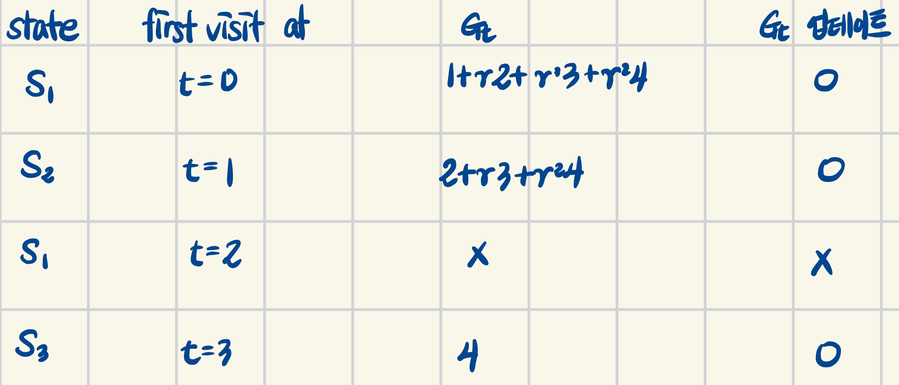
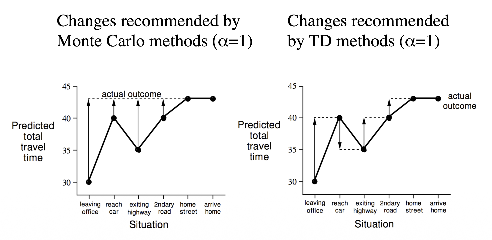
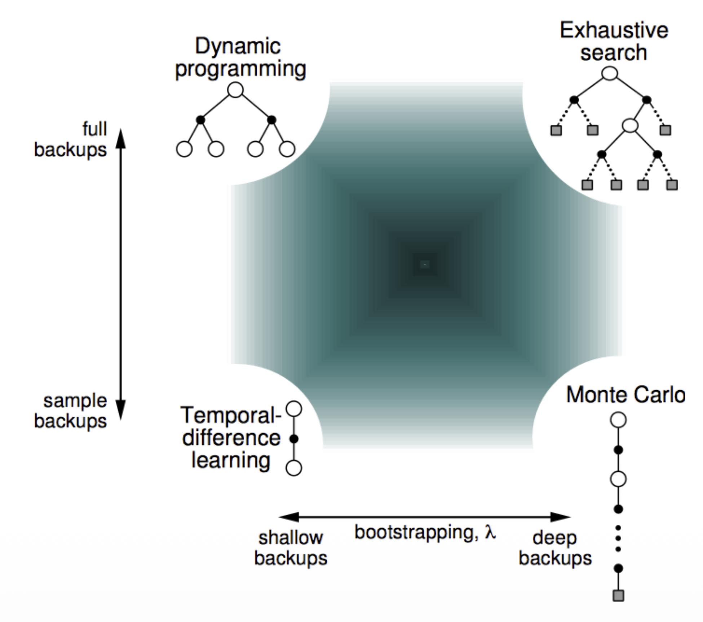
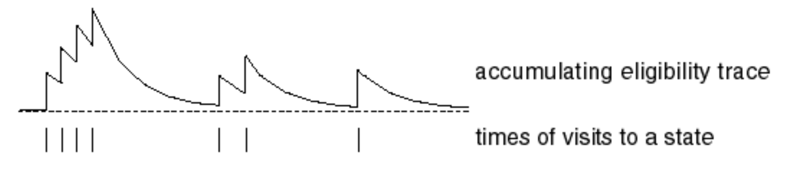
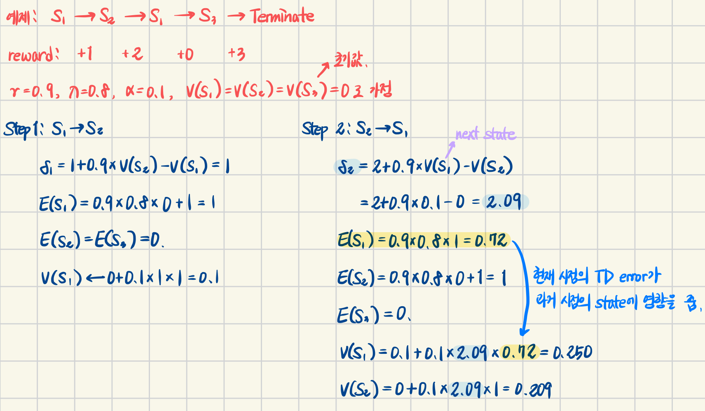
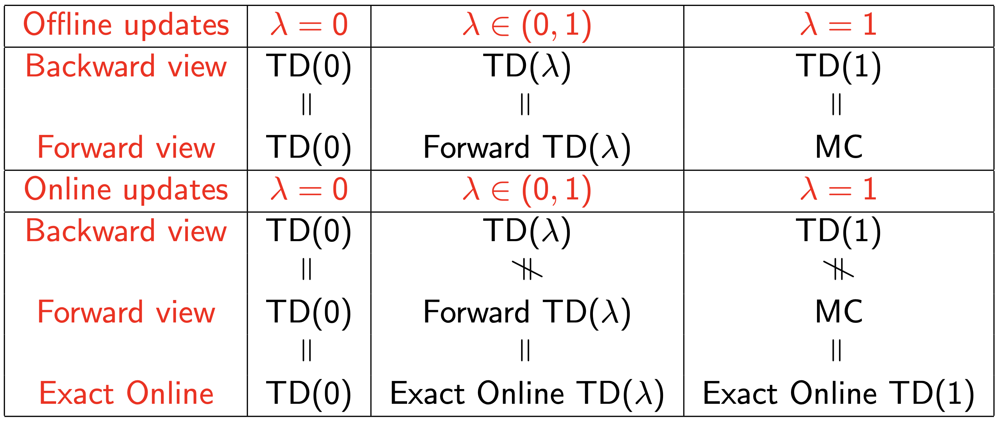

> 이 포스팅은 David Silver의 RL 강좌를 기반으로 작성되었습니다.  
- [강의 링크](https://youtu.be/PnHCvfgC_ZA?si=0FJPh8eQ-F8tNpO4), [강의 자료 링크](https://davidstarsilver.wordpress.com/teaching/)  
- 이미지 출처: David Silver, RL Course (CC-BY-NC 4.0)

## Introduction
지난 강의에서,  
- Planning by DP
- MDP를 아는 상황을 가정함  
  - 즉, environment를 대변하는 model이 있음을 가정
  - model은 $\mathcal{P}$ (transition prob.)를 알기 때문에 next state와 reward의 정보를 제공

이번 강의에서,
- Model-free Prediction을 공부
- 즉, unknown MDP의 상황에서 value fn.을 구하는 방법
- offline method: 하나의 episode가 완전히 terminate 되었을 때 업데이트하는 방식, `Monte-Carlo`
- online method: 하나의 episode 내의 step마다 업데이트하는 방식, `Temporal-Difference`

다음 강의에서,
- Model-free control을 공부
- 즉, value fn. 예측을 기반으로 최적의 value fn.을 구하는 방법

## Monte-Carlo Learning (Offline Method)

**[ Monte-Carlo Reinforcement Learning ]**
- MC는 episode의 경험으로부터 직접 파악함
- MDP의 transition과 reward를 몰라도 적용 가능
  - environment 전부를 아는 것이 아니라, 일부 state와 action을 샘플링하여 정보를 얻는 것
  - Ex. 원의 넓이를 구하는 방법이 무지하게 복잡하다고 했을 때, 원에 해당하는 공간에 무수히 많은 점을 찍어 원의 넓이를 추정하는 것 → 점을 찍는 경험(experience)을 통해 원의 넓이(value)를 구함
- 하나의 완전한 episode로부터 학습
  - offline 방식이라고 부름
  - no bootstrapping
- $\text{value} = \text{mean return}$ 이라는 가장 단순한 아이디어를 적용
- 하나의 episode가 완전히 종료되어야 하기 때문에 terminate state가 반드시 정의되어야 함

**[ Monte-Carlo Policy Evaluation ]**  
목표: policy $\pi$ 가 주어졌을 때, 여러 episode로부터 $v_\pi$ 를 학습하는 것

$$ S_1, A_1, R_2, ..., S_k \sim \pi $$

- 기존의 value fn.: 현재 state로부터 return에 대한 <u>기댓값</u> ($\because$ 모든 전이 확률과 reward를 알고 있음)
- MC의 value fn.: 샘플링된 경험들 중 return에 대한 <u>평균값</u>

$$ v_\pi(s) = \mathbb{E}_\pi[G_t | S_t=s] $$

- Monte-Carlo policy evaluation은 기댓값 대신에, **경험적으로** episode들을 탐색 후 얻는 reward들의 평균값을 의미

### first-visit MC vs. every-visit MC
state $s$ 를 평가하기 위해 특정 state $s$를 방문한 순서에 따라 reward의 평균을 다르게 구함  
기본적으로, 아래의 알고리즘을 따름

- when visit $s$,
- increment counter: $N(s) \gets N(s)+1 $
- increment total return: $S(s) \gets S(s)+G_t $
- value is estimated by mean return $V(s) = S(s) / N(s) $
- by law of large numbers(큰 수의 법칙), $V(s) \to v_\pi(s)$ as $ N(s) \to \infty $  

```
episode: S1 → S2 → S1 → S3 → terminal
rewards: 1  → 2  → 3  → 4  → 0
```

**[ First-Visit Monte-Carlo Policy Evaluation ]**  
- 각 episode 내에서 어떤 상태 $s$ 가 처음 등장했을 때만 이후의 return을 계산해서 해당 state의 value fn.을 업데이트

<div align="center">

</div>

**[ Every-Visit Monte-Carlo Policy Evaluation ]**  
- 각 episode 내에서 어떤 상태 $s$ 가 등장할 때마다 이후의 return을 계산해서 해당 state의 value fn.을 업데이트

<div align="center">

</div>

### Incremental Monte-Carlo
모든 episode들이 끝난 뒤에 sum을 평균내지 않고, episode가 끝날 때마다 online방식처럼 update 할 수 있음

**[ Incremental Monte-Carlo Updates ]**  

<details>
<summary>Incremental Mean (산술 평균)</summary>

LaTeX이 귀찮아 손필기로 대체...  
<div align="center">

</div>

</details>

- Incremental Mean에 의해 모든 episode들을 수집한 뒤에 업데이트하지 않고, 하나의 episode가 종료되었을 때 업데이트 할 수 있음
- 각 state $S_t$ 의 return이 $G_t$ 일 때
  - $N(S_t) \gets N(S_t)+1$
  - $V(S_t) \gets V(S_t) + \frac{1}{N(S_t)} (G_t - V(S_t))$
  - $\frac{1}{N(S_t)}$ 로 나누는 단순 평균이기 때문에 시간 정보를 반영하기 어려움 (stationary에 적합)
- 시간에 따라 변하는 환경(non-stationary)에 경우, 과거의 정보를 점점 잊는 것이 중요함
  - running mean을 적용
  - $V(S_t) \gets V(S_t) + \alpha (G_t - V(S_t))$
  - $\alpha$ 는 learning rate로써, 1보다 작을 경우 시간에 따라 서서히 과거 정보를 잊게 하는 역할

|environment|$\alpha$|의미|
|:--:|:--:|:--:|
|stationary|$\frac{1}{N(S_t)}$|모든 episode에 대해 동일한 가중치로 평균|
|non-stationary|고정된 작은 상수 (e.g. 0.1)|최근 episode의 중요도를 더 높임(과거 서서히 잊기)|

## Temporal-Difference Learning (Online Method)
- episode의 경험으로부터 직접 학습
- MC와 같이 model-free 방식
- episode가 종료되지 않아도 즉, 불완전한 episode로부터 학습이 가능
  - bootstrap: episode가 끝날 때까지 기다리지 않고, 다른 estimated value를 활용해서 현재 state를 eval
  - 즉, guess로부터 guess를 업데이트

**[ Monte-Carlo & Temporal-Difference ]**  
- 잠깐 MC recap
  - MC가 offline method인 이유: $G_t$ 는 최종 return이기 때문에 현재 state로부터 terminal state까지의 값을 모두 알아야 함

$$ V(S_t) \gets V(S_t) + \alpha(G_t - V(S_t)) $$

- 반면에 Temporal-Difference learning에서는... (TD(0) 기준으로)
  - episode가 종료될 때까지 기다리는 게 아니라, 현재 state에서 다음 state의 결과만 확인한 뒤 업데이트를 수행
  - $G_t$ 대신에 Bellman Expected Equation을 사용

$$ V(S_t) \gets V(S_t) + \alpha(R_{t+1}+\gamma V(S_{t+1}) - V(S_t)) $$

- $R_{t+1} + \gamma V(S_{t+1})$: TD target
- $\delta_t = R_{t+1}+\gamma V(S_{t+1}) - V(S_t)$: TD error

**[ MC vs. TD: Driving Home Example ]**  

|State|Elapsed Time (minutes)|Predicted Time to Go|Predicted Total Time|
|:--:|:--:|:--:|:--:|
|leaving office|0|30|30|
|reach car, raining|5|35|40|
|exit highway|20|15|35|
|behind truck|30|10|40|
|home street|43|0|43|

<div align="center">

</div>

- 왼쪽: Monte-Carlo
  - 하나의 episode가 종료되었을 때, 각 state를 최종값으로 업데이트
  - episode가 종료되었을 때가 되어서야 비로소 모든 state를 동시에 업데이트 할 수 있음 (state별 업데이트가 느림)
- 오른쪽: Temporal-Difference
  - 현재 state에서 다음 state의 Predicted Total Time을 보고, 해당 값으로 업데이트
  - 오직 다음 step만 확인하고 현재 state를 업데이트 할 수 있음 (state별 업데이트가 빠름)
    - 다음 state에서의 **예측값**으로 업데이트 하기 때문에 expectation으로부터 expectation을 업데이트 (bootstrapping)

**[ MC vs. TD: advantages & disadvantages ]**  

||TD|MC|
|--|--|--|
|When to Update|- 한 step 이후에 value를 알 수 있음 <br> - 불완전한 sequence 내에서도 value를 알 수 있음 <br> - non-terminating 환경에도 적용 가능|- episode가 종료되고 return을 알아야 함 <br> - 완전한 sequence 내에서만 value를 알 수 있음 <br> - episodic 환경에서만 적용 가능|
|Bias&Variance|low variance, some bias <br> - 주로 MC보다 효율적임 <br> - TD(0)는 $v_\pi(s)$ 로 수렴이 보장됨 <br> - 초기값에 영향을 크게 받음|high vairance, zero bias <br> - 항상 최적으로 수렴을 보장 <br> - 초기값의 영향이 작음 <br> - 단순하고 적용이 쉬움|
|Makrov|Markov property를 탐색 <br> ($\because$ next state를 확인해야 함)|non-Markov에 더 적합 <br> ($\because$ 모든 가능한 state들을 직접 탐색)|
|Bootstrapping|O|X|
|Sampling|O|O|

- bias: 실제 기댓값과 현재의 추정값이 다른지 (예측이 포함되었는지, 경험적인 결과인지)
- variance: 데이터 자체의 값의 변동이 큰지 (실세계의 값일 수록 noisy한 경향이 있음)
- bootstrapping: 업데이트가 예측을 동반하는지 (DP는 O)
- sampling: 모든 경우를 대표하는 기댓값을 활용하는지 (DP는 X)

<div align="center">

</div>

### Batch MC & TD
- $k$ step을 사전에 정의해두고, 해당 episode 또는 step만큼 샘플링한 뒤, MC/TD error를 계산해서 업데이트를 수행하는 방법

## TD($\lambda$)
### n-step TD
- 앞서 설명한 TD(0)는 one-step lookahead로, 빠르지만 bias 존재
- MC는 bias가 없지만 terminate state까지 기다려야 함
- 둘을 조합하여 n-step lookahead를 수행하는 TD를 구현한다면?

**[ n-Step Return ]**  
- n-step return은 다음과 같음
  - n=1: $G_t^{(1)} = R_{t+1} + \gamma V(S_{t+1})$
  - n=2: $G_t^{(2)} = R_{t+1} + \gamma V(S_{t+2}) + \gamma^2V(S_{t+2})$
  - ...
  - n=$\infty$ (MC): $G_t^{\infty} = R_{t+1} + \gamma V(S_{t+2}) + ... + \gamma^{T-1}R_T$
- n-step return: $G_t^{(n)} = R_{t+1} + \gamma V(S_{t+2}) + ... + \gamma^nV(S_{t+n})$
- n-step TD learning: $V(S_t) \gets V(S_t) + \alpha (G_t^{(n)} - V(S_t))$  

**[ Averaging n-Step Returns ]**  
- n-step return에 대해서 step이 달라질 때마다 정보량이 다름
- $\lambda$-return: 모든 n-step들의 return인 $G_t^{(n)}$ 을 결합

$$G_t^{\lambda} = (1-\lambda)\sum_{n=1}^\infty \lambda^{n-1}G_t^{(n)}$$

- $1-\lambda$: normalizing factor로, 가중치항만 볼 때 총합이 1이 되도록 보정하는 역할
- $\lambda$: weight decay parameter로, n-step에 따라 그 영향력을 조정

### Forward-View TD($\lambda$)

$$V(S_t) \gets V(S_t) + \alpha (G_t^\lambda - V(S_t))$$

- 현재 state $S_t$ 에서 다음 state, 또 그 다음 state를 순차적으로 살펴보는 방식 → MC처럼 완전한 episode일 때 적용 가능
- 1-step부터 terminate state까지 누적해야 하기 때문에 이론적으로만 가능함

### Backward-View TD($lambda$)
- backward-view TD는 forward-view TD와 동치이지만, 실현 가능한 방법
- online으로, 매 step마다, 불완전한 episode에 적용 가능한 방법

**[ Eligibility Traces ]**  
frequency heuristic과 recency heauristic을 결합하여 방문한 state의 상태를 기록하는 방법  
- `frequency heuristic` 자주 방문한 state의 중요도를 높임
- `recency heuristic` 최근에 방문한 state의 중요도를 높임

$$
E_0(s) = 0 \\
E_t(s) = \gamma \lambda E_{t-1}(s) + 1(S_t=s)
$$

- $\gamma \lambda$: timestep이 멀어질 수록 영향력이 감소 (recency hearistic)
  - $\gamma$: discount factor, 미래 보상의 중요도는 감소되어야 함 (TD error를 구할 때도 사용됨)
    - discount factor를 과거의 Eligibility Trace에 곱하는 이유
      - 현재 timestep에서 특정 state의 eligibility trace 값이 바뀌면, 해당 값을 과거 timestep의 해당 state에 반영해야 함
      - 이때, 현재 timestep에서 멀수록 그 영향력을 작게 전달해야 함
  - $\lambda$: weight decay parameter, 시간이 지나면 과거의 정보는 점점 희미해져야 함
- $1(S_t=s)$: timestep $t$ 에 방문한 state가 현재 state $s$ 와 동일하면 +1 (frequency hearistic)

<div align="center">

</div>

**[ Backward-View TD($\lambda$) ]**  

$$
\delta_t = R_{t+1} + \gamma V(S_{t+1}) - V(S_t) \\
V(S) \gets V(s) + \alpha \delta_t E_t(s)
$$

- 앞서 정의한 eligibility traces($E_t(s)$)를 TD($\lambda$)에 반영
- 현재 timestep $t$ 에서 발생한 TD error($\delta_t$)가 eligiblity traces로 인해 과거 발생한 value fn.에도 영향을 줌 (아래 예제로 확인)

<div align="center">

</div>

### Forward and Backward Equivalence
(교안에는 근사를 통해 증명하는 과정이 있지만, 강의에서도 스킵했으니 나도 패스...0_<)  

Offline updates...  
- episode 내에 업데이트를 누적해둠
- episode가 종료되었을 때 배치로 업데이트

Online updates...
- TD($\lambda$)는 각 episode 내의 매 step마다 업데이트
- forward & backward-view TD($\lambda$)는 살짝 다를 수 있음
- eligibility trace를 활용한 정확한 online TD($\lambda$)는 완벽하게 동치

**[ Summary of Forward and Backward TD($\lambda$) ]**  

<div align="center">

</div>