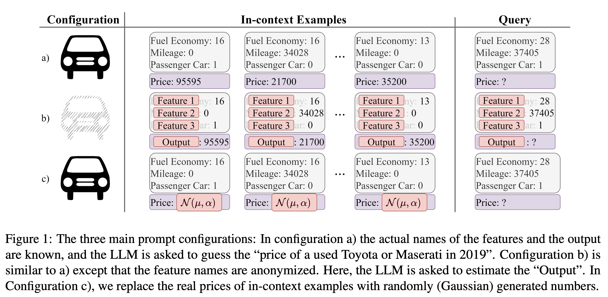
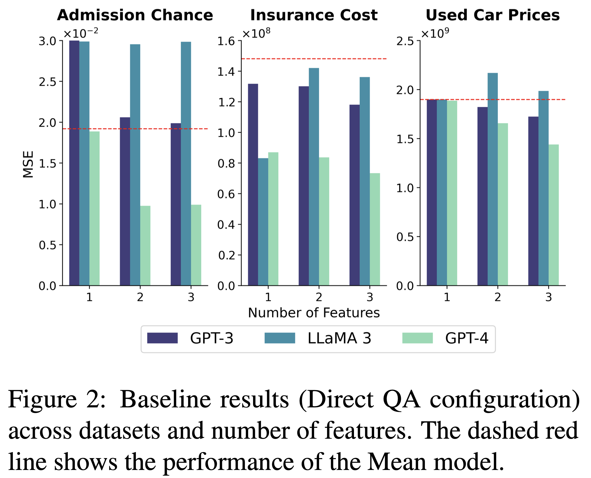
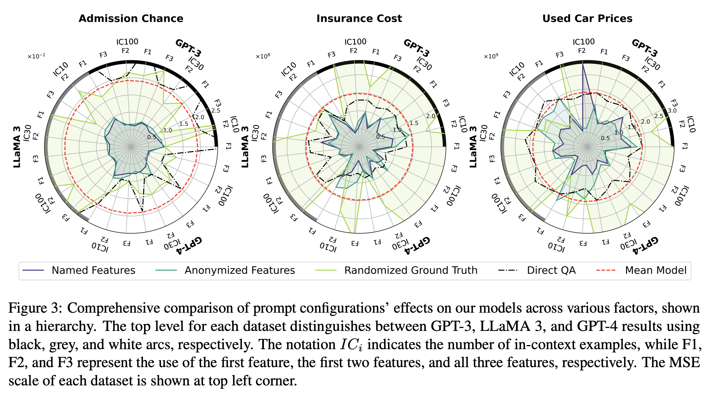
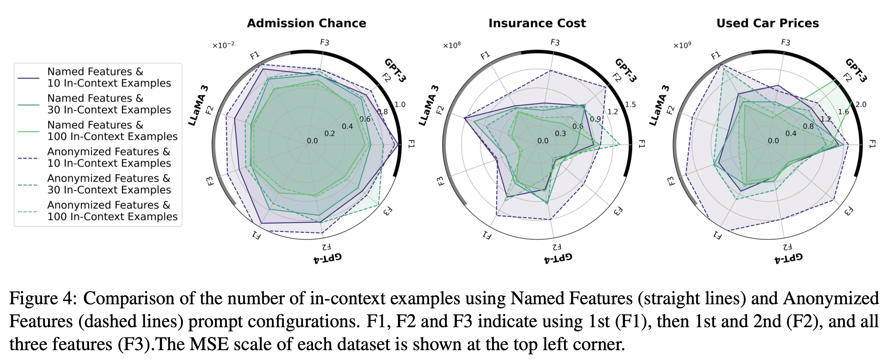
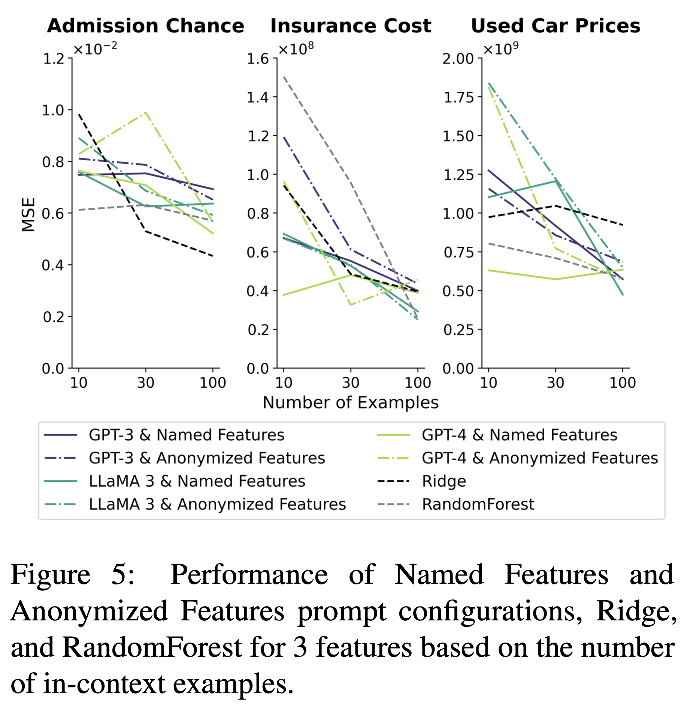
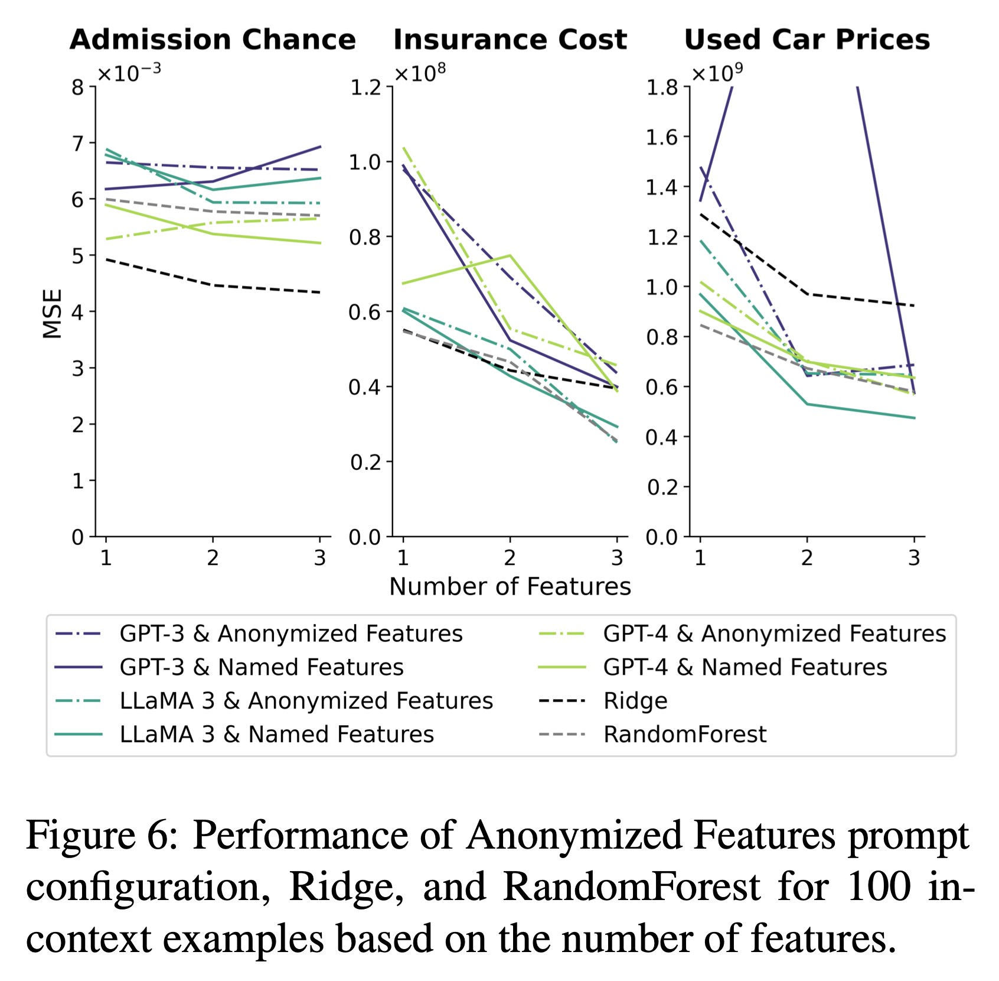
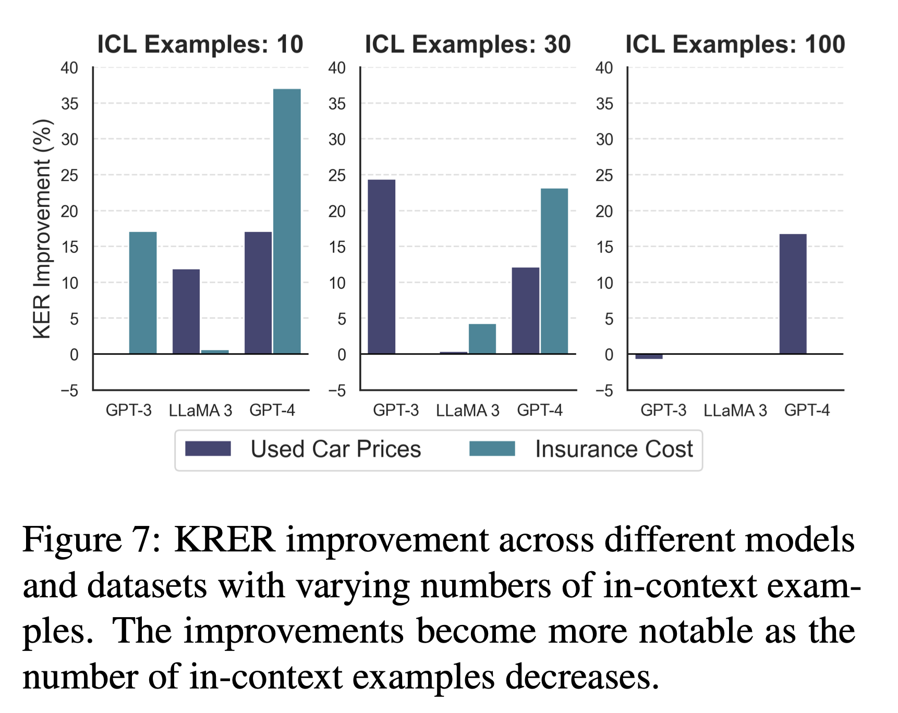

## Introduction
**[ Problem Definition ]**  
- 모델의 zero-shot 성능에 비해 In-Context Learning (ICL)을 적용하면 더 나은 성능을 보임
- 내부 메커니즘에 대한 이해는 부족한 상태

**[ Preliminaries ]**  
- ICL의 메커니즘에 대한 두 가지 메인 아이디어

`Meta-Learning`  
- in-context example들로부터 패턴을 포착
- 일반화된 패턴을 포착하여 새로운 입력에 대한 결과를 출력 (regression task)
- regression을 수행하는 machine learning 모델들처럼 일련의 sequence로부터 패턴을 파악하는 것과 유사함

`Knowledge Retrieval`  
- in-context example들을 힌트로 사용, 모델 내부 정보를 활용하여 입력에 대한 결과를 출력
- feature name (label)들을 제공했을 때, 해당 feature의 정보를 활용하여 문제를 해결하는 것

```markdown
본 연구에서는 ICL은 두 방식 중 하나의 메커니즘으로 동작하는 것이 아니라,
두 방식 사이의 스펙트럼 어딘가에 있는 것처럼 행동하며,
여러 요인에 의해 그 위치가 달라진다고 주장한다.
```

**[ Solution ]**  
- regression task를 대상으로 실험 설정
  - 본 연구에서 소개한 Meta Learning 관련 연구의 실험과 대응할 만함
  - regression task를 통해 LLM의 출력 모듈을 대체한 연구를 포함할 수 있음
  - 단순히 숫자만 출력해야 하는 regression task에 대해서, LLM은 출력 형태가 자연어이기 때문에 복잡한 output space 중에서 정답을 골라야 하는 어려운 task로 볼 수 있음
- synthetic data가 아닌 실제 데이터를 활용함으로써 편향을 줄이도록 함

**[ Key Contributions ]**  
1. 실제 데이터를 활용하여 기존 연구들이 synthetic data에 의존했던 것을 보다 현실적인 시나리오에 적용함으로써 LLM이 in-context를 통해 regression을 효과적으로 수행할 수 있음을 밝힘

2. ICL은 meta-learning와 knowledge retrieval을 결합한 방식으로 동작한다는 메커니즘을 주장

3. ICL 메커니즘에 대해, 다양한 LLM과 데이터셋, 프롬프트 구성에 따라 평가할 수 있는 평가 체계 제안

4. LLM이 knowledge retrieval과 meta learning의 균형을 어떻게 잡는지 프롬프트 엔지니어링 방식으로 확인

## Experiment Setting

**[ 데이터 구성 ]**  

$$
\mathcal{D} = \{(x_1, y_1), (x_2, y_2), ..., (x_n, y_n)\}
$$  

- $\mathcal{D}$: 데이터셋
- $x_i$: $(f_{ij}, v_{ij})$ 쌍들의 집합을 포함하는 입력
  - $f_{ij}$: feature name
  - $v_{ij}$: feature에 해당하는 값 (숫자)
- $y_i$: 출력에 해당하는 값 (숫자)

`step 1` 데이터셋 $\mathcal{D}$로부터 일부를 선택하여 $m$개의 입출력 예시들을 in-context에 포함함  
`step 2` 데이터셋 $\mathcal{D}$로부터 출력 $y$를 얻기 위해 feature $x$를 입력

**[ Prompt Configuration ]**  

<div align="center">

</div>

- 기본 구성
  - task 소개
  - in-context examples (입출력 예시들, 시퀀스)
  - query

`Named Feature`  
- 각 feature들의 이름과 출력해야 하는 타겟의 feature 이름 제공  
  - Ex. 주어진 "City fuel Economy", "Mileage", "Passenger Car Classification"을 통해서 "Used Car Price"를 예측해야 함
- input-output 예시들을 제공

`Anonymized Feature`  
- 각 feature들의 이름과 출력해야 하는 타겟 feature 이름이 각각 "Feature #", "Output"으로 대체됨
- 오직 제공된 숫자로만 입출력의 관계를 파악해야 하기 때문에 Knowledge Retrieval을 수행할 수 없음 → 오직 Learning from the Context만 발생함

`Randomized Ground Truth`  
- feature들의 이름은 유지
- 출력값을 가우시안 분포를 따르는 랜덤한 변수로 대체
- LLM이 feature들 간에 어떤 관계를 인식해서 출력을 내려고 하는지를 파악할 수 있음

`Direct QA`  
- feature들의 이름과 출력해야 하는 타겟 feature의 이름은 제공
- input-output 예시들을 제공하지 않음
  - 대신, 출력의 범위를 평균과 표준 편차를 통해서 제한함
- Ex. "Estimate the insurance cost of this person given the information. An inssurance cost is typically around 13270.42 with a standard deviation of 12110.01"

**[ Models and Metrics ]**  
`Models`  
- LLaMA 3 70B, GPT 3.5, GPT 4
  - Mistral 7B와 같은 작은 모델들은 regression 성능이 충분하지 않아서 제외함
- 비교를 위해 고전적인 머신러닝 모델들을 선정
  - Ridge regression, RandomForest

`Factors`  
- 네 가지 프롬프트 구성: 앞서 설명한 프롬프트 설정들
  - Named Feature
  - Anonymized Feature
  - Randomized Ground Truth
  - Direct QA
- in-context 예시의 개수: 0, 10, 30, 100
- (feature, value) 쌍의 개수 즉, 제공할 feature의 개수: 1, 2, 3개로 제한했으며, 각 feature의 중요도에 따라 feature를 제공함
  - <span style="color:rgb(95, 154, 209);">중요한 feature 3개를 골라내는 방식이 있었는데 뭐였을까요..?</span>

`Metrics`  
- Mean Squared Error (MSE)
- appendix에
  - 결정계수 $R^2$ (추정한 선형 모형이 주어진 자료에 적합한 정도를 재는 척도)
  - Mean Absolute Error (MAE)

**[ Datasets ]**  
1. Admission Chance
- 인도 학생들이 대학원 프로그램을 들을 확률
- 총 세 개의 큰 상관관계를 보이는 feature들 존재
- LLM의 사전 학습 데이터에서 거의 발견하지 못하는 데이터셋

2. Insurance Cost
- 인구통계학에 근거하여 미국의 건강 보험 회사에서 청구한 개인의 연례 의료 비용의 분포를 예측
- 첫 번째 feature 만이 가장 중요한 요소였음

3. Used Car Prices
- 2019년의 중고 토요타, 마세라티의 가격을 예측
- 처음 두 개의 feature가 가장 중요한 요소였음

- 각 데이터셋을 100개의 in-context subset과 300개의 test subset으로 구분

## Experiment Results

**[ Knowledge Retrieval Assessment ]**  

<div align="center">

</div>

- Direct QA 설정을 통해 Knowledge Retrieval 성능만을 측정
- feature 개수가 증가할 수록 성능이 향상되는 형태 (MSE 감소)
  - LLaMA 3 빼고...
  - 성능 향상과 feature 개수의 상관관계가 없음: feature의 중요도와 성능 향상 정도의 관계가 보이지 않음
  - pre-train되지 않은 데이터셋인 Admission Chance의 점수가 전체적으로 가장 낮음
- Direct QA 설정에 결과를 도출한 과정을 설명하라고 지시
  - 추가적인 성능 향상은 없었다고 함
  - <span style="color:rgb(95, 154, 209);">해당 설명을 통해 모델의 추론 과정을 분석해볼 수도 있었을 것 같은데..? Ex. feature들에서 어떤 특징을 포착했는지 등</span>

**[Learning/Knowledge Retrieval Interplay ]**  

<div align="center">

</div>

- 각 프롬프트 설정을 통해 어떤 상황에서 Learning과 Knowledge Retrieval이 발생하는지를 탐구

`The Randomized Ground Truth (라임색)`  
- 최저 점수 기록
- 프롬프트에 제공된 데이터의 패턴이 모델의 내부 지식에 혼란을 야기
- Ex. 담배를 많이 피우는 사람들의 그룹에 높은 보험금을 청구하는 경향 속에서 일부 데이터에 한해 해당 그룹에 낮은 보험금을 청구하는 경우가 발생
- 이러한 특징은 제공한 input-output 예시가 많을 수록 더 두드러지게 드러남

```
in-context example 수가 증가할 수록 knowledge retrieval로부터 learning 쪽으로 넘어간다.
```

`Named Features (보라색) & Anonymized Features (초록색)`  
- Anonymized Features: learning을 위해 오직 숫자 정보밖에 활용하지 못함
  - Direct QA나 평균 값을 내는 모델보다는 성능이 좋았음
- Named Features
  - Anonymized Features에 비해 성능이 좋음
  - in-context example들의 개수를 다르게 했을 때도, feature 수를 다르게 했을 때도 Named Feature의 성능이 압승이었음

```
in-context example들은 learning을, feature name과 같은 단서들은 knowledge retrieval을 가능하게 한다.
```

**[ Knowledge Retrieval Compensates for In-context Examples ]**  

<div align="center">

</div>

- Randomized Ground Truth 설정에서는, 일반적으로 알려진 바와 달리 in-context example 개수가 증가할 수록 오히려 성능이 떨어지는 모습을 보임 → 
- AF와 NF를 비교했을 때, 적은 수의 in-context example들일 수록 성능 차이가 더 큼 (직선과 점선)
  - 적은 수의 in-context example이 10개일 때는 성능 차이가 비교적 큰 형태 (보라색 직선과 점선)
  - in-context example이 100개일 때는 성능이 비슷한 수준으로 수렴하는 형태 (연두색 직선과 점선)

```
feature name과 같은 task-specific 정보를 제공함으로써 더 적은 수의 in-context example들을 사용할 수 있다.  
이는 learning보다는 knowledge retrieval을 하도록 유도하는 효과가 있다.
```
<span style="color:rgb(95, 154, 209);">feature name을 제공하는 것만으로 task-specific 정보를 제공한다고 할 수 있을까..? 오히려 domain specific task를 수행하기 위해서는 모델이 기존에 모르던 정보를 제공함으로써 learning을 도모하는 것이 바람직하지 않을까?</span>

<div align="center">

</div>

- Named Features와 Anonymized Features 설정을 Ridge, RandomForest와 비교한 것
- feature는 세 개로 고정, in-context example의 개수를 다르게 설정
- in-context example들이 10개, 30개일 때 NF 설정의 모델들이 성능이 가장 높음

```
knowledge retrieval이 가능한 LLM은 NF와 같은 조건의 regression에서 보다 데이터 효율적인 성능을 보인다.
```

**[ More Features Help Knowlege Retrieval ]**  

<div align="center">

</div>

- learning만 향상시키는 in-context example들과는 달리, feature의 개수는 learning과 knowledge retrieval을 둘 다 향상시킴
- in-context example을 100개 제공했을 때, Anonymized Features 설정에서 이상 현상 발생: 아래의 조건임에도 feature 개수를 추가하기만 하면 성능이 향상됨
  - feature 이름이 제공되지 않음
  - 추론을 위해서 숫자 데이터만 활용할 수 있음
  - LLM의 성능 향상이 feature의 중요도와 관련이 없음
  - **결과적으로, data contamination을 의심**
    - data contamination: test set의 일부가 train set에 포함된 것을 말함
  - Admission Chance에서는 해당 현상이 발견되지 않음
  
<span style="color:rgb(95, 154, 209);">이건 어케 알았을까? reasoning 과정에서 파악한 것인지?</span>

- Named Features 설정에서 in-context example 100개를 제공했을 때, feature 수가 증가할 수록 그 성능 향상 및 하락이 단조롭지 않음

```
feature 수가 증가할 수록 knowledge retrieval이 learning을 대체함
```

**[ Quantitative Analysis ]**  

$$
\text{KER} = \frac{|Y_{AF}-Y_{GT}| - |Y_{NF}-Y_{GT}|}{Y_{AF}-Y_{GT}} \times 100
$$

- Knowledge Effect Ratio (KER) 제안
  - knowledge에 대한 영향을 파악하기 위한 목적
  - feature name을 제공하기 전후에 대한 성능 향상률을 계산

<div align="center">

</div>

- Admission Chance에 대해서만 0점에 가까운 점수 → knowledge로부터의 영향이 없음
- 다른 두 개의 데이터셋에 대해서는 in-context example 개수에 따라 점수 차이를 보임
  - 특히 in-context example의 수가 적을 때 큰 차이를 보였음
  - in-context example의 수가 적을 때, feature name을 통해 knowledge retrieval을 더 활발하게 하도록 유도하는 효과

## Discussion
**[ Controlling ICL Mechanisms ]**  
- 일반적으로 in-context example들을 추가하면 모델이 learning을 하도록 유도하고, 반대로 feature들을 추가하면 모델이 knowledge retrieval을 하도록 유도함
- 다만, 이 사항은 성능 향상의 여지가 있을 때로 제한됨
- 100개 이상의 in-context example을 사용했을 때 모델의 성능이 향상되지 않음
- Admission Chance 데이터셋에서 또한 높은 상관관계가 있는 feature들을 추가했음에도 성능이 향상되지 않았음 (pre-trained 정보가 없기 때문에 knowledge retrieval을 해올 것이 없다는 것)
  - <span style="color:rgb(95, 154, 209);">상관관계가 있는 feature들이라면 feature들 간의 특성을 파악하는 learning이 일어나야 하는 것이 아닐까?</span>

**[ Practical Applications ]**  
- 효과적으로 ICL을 적용할 수 있는 방법을 제안
- 수행해야 하는 task가 모델의 pre-trained weight와 연관이 높은 경우
  - in-context example을 줄이기
  - 관련 있는 feature의 수를 추가하며 knowledge retrieval이 일어나도록 유도
- 반대로, 수행해야 하는 task가 모델의 pre-trained weight와 연관이 낮은 경우 (e.g., Admission Chance)
  - 덜 중요한 feature의 종류를 줄이기
  - in-context example (input-output pair)들을 추가하여 learning을 하도록 유도

**[ Traditional ML Models vs LLMs ]**  
- 적은 수의 in-context example로도 knowledge retrieval을 통해 효과적으로 regression을 수행할 수 있음
- ML의 경우, 데이터의 수가 희소한 환경에서 feature의 수가 많아지면, 과적합의 경향이 있었으나, LLM은 그렇지 않음
- 또한 제공한 feature들 중에서도 중요한 feature를 더 잘 파악하는 경향이 있음

**[ Data Contamination ]**  
(앞서 `More Features Help Knowlege Retrieval`에서 언급한 내용)  
- feature의 이름을 가렸음에도 regression의 성능이 향상되었으며, 이는 feature의 중요도와 상관관계가 없었음
- 숫자 단위에서도 data contamination이 발생했음을 시사함

**[ Order of Features & In-Context Examples ]**  
- Direct QA 설정에서 feature 순서를 재구성했을 때는 미세한 정도의 차이만 있었음
- Anonymized Features 설정에서 in-context example들을 크기순으로 정렬, 10개일 때와 100개일 때로 나누어 실험
  - 내림차순 정렬일 경우, 출력의 평균이 작았고, 오름차순 정렬일 경우 출력의 평균이 컸음
  - 10개일 때와 100개일 때 모두 성능 하락을 보였지만, 100개일 때 보다 눈에 띄는 하락을 확인, GPT-4가 가장 크기순 정렬의 영향이 작았음
  - feature들 간의 관계보다 정렬 관계를 더 우선시 하게 됨
  - LLM의 정렬 패턴을 발견하고 해당 패턴을 유지하려는 경향으로 인한 현상

```markdown
# Comment
- zero-shot일 때에 비해 In-Context Learning을 통해 모델의 성능이 향상되는 이유를 learning과 knowledge retrieval로 나누어 구분하고, 각각을 분석하는 것을 통해 LLM의 출력 메커니즘을 이해할 수 있었음
- regression이라는 태스크는 단순한 작업인데, ICL을 통해서는 보다 복잡한 작업들을 수행하기 때문에 해당 실험이 다양한 태스크를 커버할 수 있는 요소인지 궁금함
- 
```