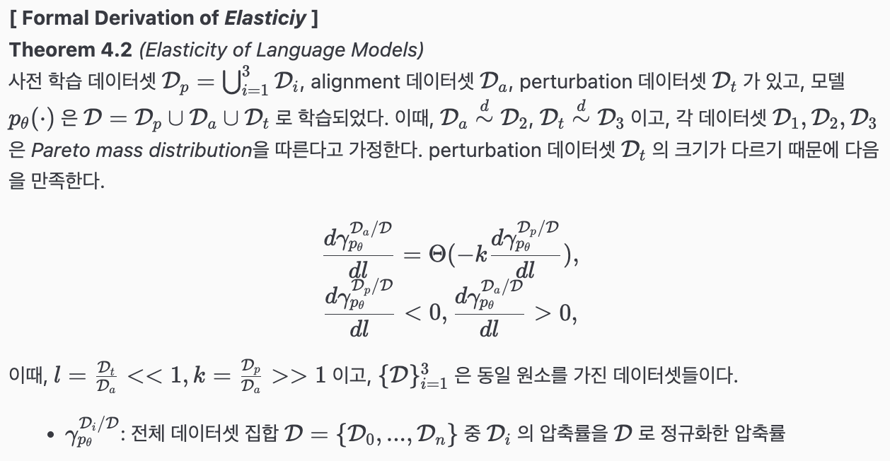

> **[ 개요 ]**  
- 의의: 사전 학습된 언어 모델들에 post training을 할 때, 데이터의 크기와 분포에 따라 tuning의 목적을 잘 따르지 않는 경향(misalignment)을 확인
  - 모델의 성능과 동치인 데이터 압축률(compression rate)을 통해 수식적으로 설명
  - 벤치마크 데이터셋들을 활용해서 실험적으로 설명
- 한계: 모델의 성능과 compression rate이 동치임을 설명한 내용과 실험 간의 alignment가 빈약함 (최하단 comment 참고)

## Introduction
- 현대에는 언어 모델들이 뛰어난 성능을 보여주고 있는 반면, 학습 데이터셋의 편향, 위험한 요소 등이 불가피하게 포함되어 있기 때문에 인간의 의도와는 다른 출력을 낼 때가 존재
- 이를 개선하기 위해 supervised fine-tuning (SFT), reinforcement learning with human feedback (RLHF) 등의 기법들이 적용되고 있음
- 하지만 해당 기법들은 모델 전체를 통제하지 못하고 사전 학습의 분포에 머물러 있거나, 되돌아가려는 성질을 가져 결과적으로 misalignment를 야기함
- 이를 모델의 탄성(elasticity)이라 부르며 데이터 압축률(compression rate)의 개념을 활용하여 설명함

## What is *Elasticity*
> 해당 파트에서는 LM의 성능을 데이터 압축률, LM의 성질을 elasticity로 설명하고, elasticity를 활용해서 모델의 데이터 압축을 설명함  
어려워서 생략한 수식들과 증명들이 있는데, 이해 가능한 선에서, 또한 논문을 이해할 수 있는 선에서 최대한 서술해봄

**[ Preliminaries ]**  
`elasticity` alignment를 거부하고 원래의 분포로 되돌아가려는 성질  

`Compression Rate`  
- 정보 이론에 근거하여 중요한 정보일 수록 적은 비트수를 할당하여 정보의 최대 압축률을 달성하는 것이 목적
  - 자주 발생하는 정보에 낮은 비트수를 할당, 전체 정보에 해당하는 총 비트수의 크기를 작게 유지
  - 특정 정보에 할당된 비트수가 곧 소스 코드의 길이, 엔트로피를 의미함
  - "엔트로피가 낮을 수록 정보의 중요도가 작다" ex. 해는 동쪽에서 뜬다 (당연하기 때문에 정보량 적음, 더 적은 비트수를 할당) vs. 내일 NVIDIA의 주식이 상승할 것이다 (모르기 때문에 정보량 높음, 더 많은 비트수를 할당)
- Shannon's source coding theorem을 이용하며 언어 모델의 학습 과정에서 Cross Entropy Loss를 줄여나가 최종적으로 얻은 Cross Entropy가 정보의 압축률과 동일함
- 정리: LLM의 관점에서 Next Token Prediction을 수행할 때, 모델의 성능이 높다는 것은 정답에 해당하는 토큰의 확률이 가장 높다는 것 = 확률이 높다는 것은 당연한 정보라는 것 = 더 적은 엔트로피를 필요로 한다는 것 = 더 적은 엔트로피라는 것은 필요한 비트수가 적다는 것 = 최종적으로 압축률이 높은 것

`The Compression Protocol of LLMs`  
- 모델의 성능과 압축률이 동치이기 때문에 LLM의 데이터 압축 프로토콜을 해당 정의에 근거하여 설명하는 파트

**Definition 3.1** *(Token Tree $\tau$)*  
데이터셋 $\mathcal{D} = \lbrace z_i, \in \lbrace 0 \mid 1 \rbrace^\infty \mid i=1,2, \dots \rbrace$ 

`The Formal Definition of Elasticity`  
**Definition 3.6** *(The Elasticity of LLMs)*  
변환 $p_{\theta_0} \xrightarrow{\, f(D_a)\,} p_{\theta_1}$ 에 대해서, 어떤 단순한 *inverse operation* $g$ 와 데이터셋 $\mathcal{D_b}$ 가 있을 때, $(p_{\theta_0}, \mathcal{D_a})$ 사이에 *elasticity*가 존재한다. 이때, $|\mathcal{D_b}| \ll |\mathcal{D_a}|$ 이다.

$$
p_{\theta_0} \xrightarrow{\, g(D_b)\,} p_{\theta'_0} \ \text{and} \ \rho(p_{\theta'_0}, p_{\theta_0}) \leq \epsilon_0.
$$

- $p_{\theta_0}$: pre-trained model
- $f$, $g$: fine-tuning과 같은 post training을 의미하는 변환 함수
- $\rho$: 두 분포의 유사도를 측정하는 단순한 함수, 본 논문에서는 압축률을 사용함
- $\epsilon_0$: 고정 상수로, 두 분포의 유사도가 해당 값 이하면 동일 분포라고 가정함

```markdown
즉, 사전 학습 모델에 대한 fine-tuning 이후 작은 크기의 데이터셋으로 추가 학습(perturbation)을 수행하면,
최종 학습 이후의 모델의 분포가 기존의 사전 학습 분포로 근사한다.
```

## Why Elasticity Affects Alignment
<!--
> 해당 파트에서는 모델의 elasticity를 compression rate를 사용해서 표현하고, Hooke's Law와 연관지어 alignment에 주는 영향을 설명함
- 모델의 elasticity를 compression rate를 사용해서 설명
- 모델의 elasticity가 alignment에 미치는 영향을 Hooke's Law와 관련지어 설명
-->

> TeX 문법 수식 렌더링이 안 돼서 직접 정리한 캡쳐본으로 대체 ㅠㅠ 

<div align="center">

</div>

<!-- 여기 수식 렌더링 안 됨
**[ Formal Derivation of *Elasticiy* ]**  
**Theorem 4.2** *(Elasticity of Language Models)*  
사전 학습 데이터셋 $\mathcal{D}_p = \bigcup^3_{i=1} \mathcal{D}_i$, alignment 데이터셋 $\mathcal{D}_a$, perturbation 데이터셋 $\mathcal{D}_t$ 가 있고, 모델 $p_{\theta}(\cdot)$ 은 $\mathcal{D} = \mathcal{D}_p \cup \mathcal{D}_a \cup \mathcal{D}_t$ 로 학습되었다. 이때, $\mathcal{D}_a \overset{d}{\sim} \mathcal{D}_2$, $\mathcal{D}_t \overset{d}{\sim} \mathcal{D}_3$ 이고, 각 데이터셋 $\mathcal{D}_1, \mathcal{D}_2, \mathcal{D}_3$ 은 *Pareto mass distribution*을 따른다고 가정한다. perturbation 데이터셋 $\mathcal{D}_t$ 의 크기가 다르기 때문에 다음을 만족한다.  

$$
\frac{d \gamma^{\mathcal{D_a}/\mathcal{D}}_{p_\theta}}{dl} = \Theta (-k \frac{d \gamma^{\mathcal{D_p}/\mathcal{D}}_{p_\theta}}{dl}), \\
\frac{d \gamma^{\mathcal{D_p}/\mathcal{D}}_{p_\theta}}{dl} < 0, \frac{d \gamma^{\mathcal{D_a}/\mathcal{D}}_{p_\theta}}{dl} > 0,
$$

이때, $l = \frac{\mathcal{D}_t}{\mathcal{D}_a} << 1, k = \frac{\mathcal{D}_p}{\mathcal{D}_a} >> 1$ 이고, $\{\mathcal{D}\}^3_{i=1}$ 은 동일 원소를 가진 데이터셋들이다.

- $\gamma^{\mathcal{D}_i/\mathcal{D}}_{p_\theta}$: 전체 데이터셋 집합 $\mathcal{D} = \{\mathcal{D_0}, ..., \mathcal{D_n}\}$ 중 $\mathcal{D}_i$ 의 압축률을 $\mathcal{D}$ 로 정규화한 압축률
-->

```markdown
즉, perturbation이 증가할 수록, 사전 학습 모델에 대한 정규화된 압축률은 감소하고,
alignment 데이터셋에 대한 정규화된 압축률은 증가한다.
이때, Pareto mass distribution을 따른다고 가정했기 때문에, 모델이 보다 큰 크기의 데이터셋(pre-train 데이터셋)의 분포를 따르게 되고,
비교적 작은 크기의 alignment 데이터셋과 perturbation 데이터셋의 효과는 거의 없음을 알 수 있다.
(Pareto mass distribution: 상위 소수 패턴이 압축률에 지배적으로 기여하며, 강도가 작은 꼬리 쪽은 길게 퍼짐)
```

---
```markdown
# Comment
### 의의와 강점
**[ 언어 모델의 misalignment를 수식적으로 유도하고 증명함 ]**  
- 모델의 misalignment를 단순히 벤치마크 성능 점수로 파악하는 것이 아니라, compression rate를 활용해서 모델의 성능에 대한 수식적 증명을 수행하여 보다 효과적으로 설명함
- 여러 모델을 선정했을 뿐만 아니라 모델의 크기, 사전 학습 데이터셋의 크기, post training 방식 등에 따라 misalignment에 영향을 주는 요인들을 세세하게 분석함

**[ AI Safety의 관점에서 우려되는 점과 지향해야 하는 바를 명확히 시사함 ]**  
- 모델의 성능과 활용도가 강조되고 있는 현대에 tuning을 통해 모델에서 발생할 수 있는 우려점들을 시사함
- 본 연구의 한계(데이터 혼합 특성, 비용 제약)와 향후 과제(OOD 데이터에서의 탄성 검증, 스케일링 법칙과의 정량적 연결, 멀티모달 확장)를 스스로 명시하였으며, 이론적 가정(토큰 트리, 모델 규모-깊이 단조성)에 대해 후속 검증을 요청하는 구도가 투명함

### 의문점
**[ 수식적으로 설명한 내용과 실험의 alignment가 부족함 ]**  
- 모델의 성능과 compression rate가 동치이기 때문에 실험에서 eval metric으로 compression rate를 사용하지 않았으나, sentiment 점수나 safety score를 측정하는 등 모델 답변의 유용성은 측정하지 않음 → 결과적으로 safety score의 비교만으로 모델의 분포가 fine-tuning 이전과 동일하다고 할 수 있는 것인지 궁금함(Appendix에서 KL Divergence에 대한 언급이 있지만, 압축률과 동등한지에 대한 설명은 부족함)

**[ 실험 상황 가정이 현실적이지 않음 ]**  
- resistance: 동일한 데이터셋의 데이터를 3등분해서 forward/reverse alignment를 측정했으나, 실제 환경에서 동일한 데이터셋을 사용하여 reverse alignment를 시도하는 경우는 적을 것이라고 생각됨
- rebound: resistance와 동일하게 하나의 데이터셋 내에서 pos/neg와 safe/unsafe의 레이블을 나누어 실험했는데, 해당 학습 방식은 편향된 fine-tuning 방식인 것으로 생각되며, 현실적으로 특정 목적으로 fine-tuning된 모델에 대해 jailbreaking을 시도할 때 동일한 형태의 레이블만 반대로된 데이터를 활용할 수 있는 상황이 많지 않을 것 같음
- 결과적으로 동일하지 않은 데이터셋을 사용했을 때 즉, fine-tuning 이후에 뒤따르는 tuning을 통해 모델의 성능이 저하되는지, 사후 분포가 pre-trained 모델의 분포로 수렴하는지 궁금함
```