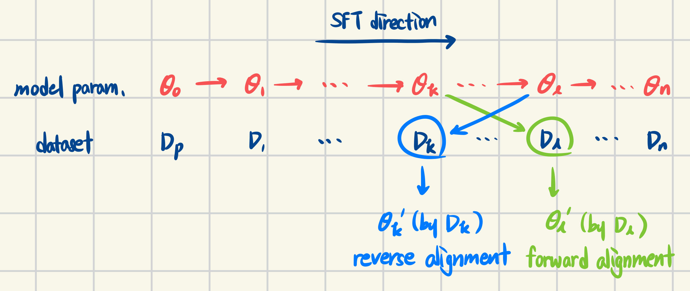
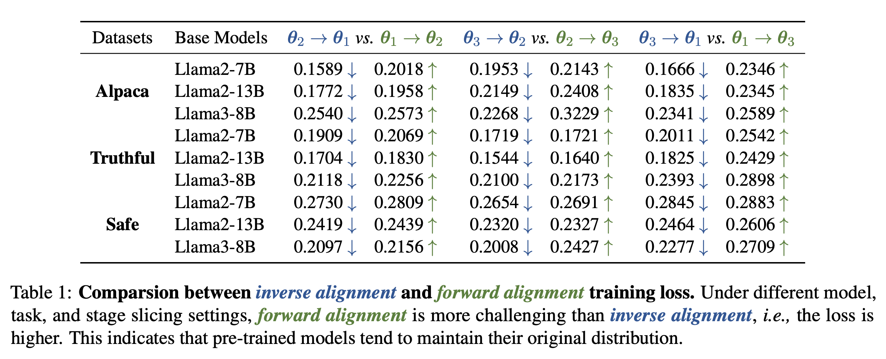
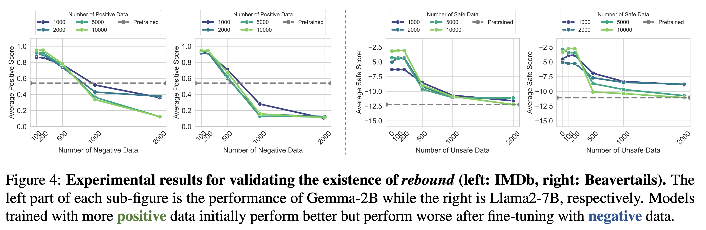
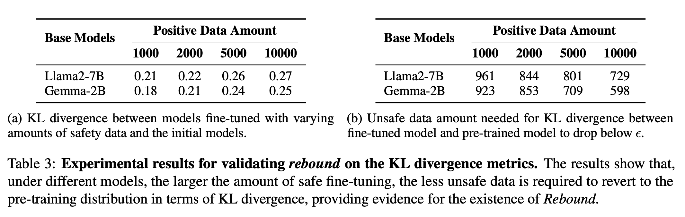
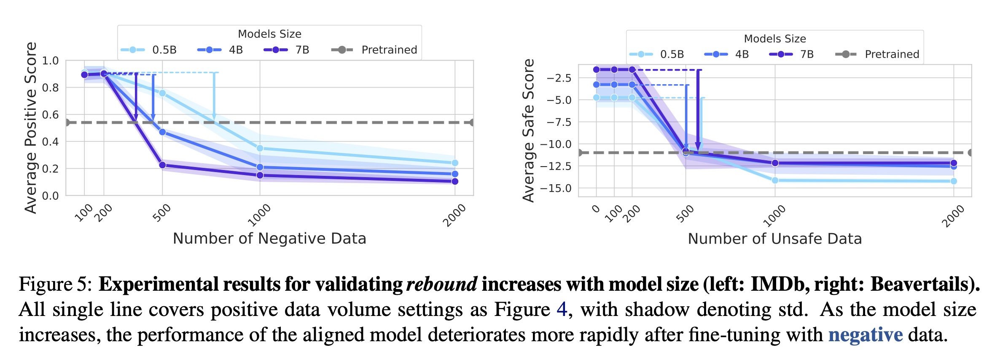
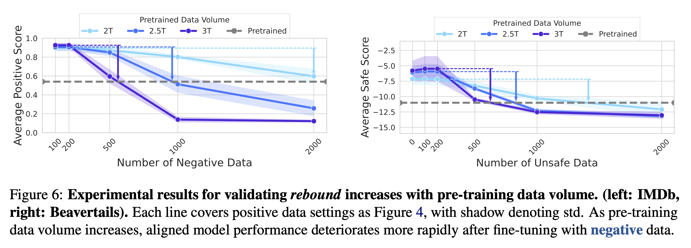

> **[ 개요 ]**  
- 의의: 사전 학습된 언어 모델들에 post training을 할 때, 데이터의 크기와 분포에 따라 tuning의 목적을 잘 따르지 않는 경향(misalignment)을 확인
  - 모델의 성능과 동치인 데이터 압축률(compression rate)을 통해 수식적으로 설명
  - 벤치마크 데이터셋들을 활용해서 실험적으로 설명
- 한계: 모델의 성능과 compression rate이 동치임을 설명한 내용과 실험 간의 alignment가 빈약함 (최하단 comment 참고)

## Introduction
- 현대에는 언어 모델들이 뛰어난 성능을 보여주고 있는 반면, 학습 데이터셋의 편향, 위험한 요소 등이 불가피하게 포함되어 있기 때문에 인간의 의도와는 다른 출력을 낼 때가 존재
- 이를 개선하기 위해 supervised fine-tuning (SFT), reinforcement learning with human feedback (RLHF) 등의 기법들이 적용되고 있음
- 하지만 해당 기법들은 모델 전체를 통제하지 못하고 사전 학습의 분포에 머물러 있거나, 되돌아가려는 성질을 가져 결과적으로 misalignment를 야기함
- 이를 모델의 탄성(elasticity)이라 부르며 데이터 압축률(compression rate)의 개념을 활용하여 설명함

## What is *Elasticity*
> 해당 파트에서는 LM의 성능을 데이터 압축률, LM의 성질을 elasticity로 설명하고, elasticity를 활용해서 모델의 데이터 압축을 설명함  
어려워서 생략한 수식들과 증명들이 있는데, 이해 가능한 선에서, 또한 논문을 이해할 수 있는 선에서 최대한 서술해봄

**[ Preliminaries ]**  
`elasticity` alignment를 거부하고 원래의 분포로 되돌아가려는 성질  

`Compression Rate`  
- 정보 이론에 근거하여 중요한 정보일 수록 적은 비트수를 할당하여 정보의 최대 압축률을 달성하는 것이 목적
  - 자주 발생하는 정보에 낮은 비트수를 할당, 전체 정보에 해당하는 총 비트수의 크기를 작게 유지
  - 특정 정보에 할당된 비트수가 곧 소스 코드의 길이, 엔트로피를 의미함
  - "엔트로피가 낮을 수록 정보의 중요도가 작다" ex. 해는 동쪽에서 뜬다 (당연하기 때문에 정보량 적음, 더 적은 비트수를 할당) vs. 내일 NVIDIA의 주식이 상승할 것이다 (모르기 때문에 정보량 높음, 더 많은 비트수를 할당)
- Shannon's source coding theorem을 이용하며 언어 모델의 학습 과정에서 Cross Entropy Loss를 줄여나가 최종적으로 얻은 Cross Entropy가 정보의 압축률과 동일함
- 정리: LLM의 관점에서 Next Token Prediction을 수행할 때, 모델의 성능이 높다는 것은 정답에 해당하는 토큰의 확률이 가장 높다는 것 = 확률이 높다는 것은 당연한 정보라는 것 = 더 적은 엔트로피를 필요로 한다는 것 = 더 적은 엔트로피라는 것은 필요한 비트수가 적다는 것 = 최종적으로 압축률이 높은 것

**[ The Compression Protocol of LLMs ]**  
- 모델의 성능과 압축률이 동치이기 때문에 LLM의 데이터 압축 프로토콜을 해당 정의에 근거하여 설명하는 파트

**Definition 3.1** *(Token Tree $\tau$)*  
데이터셋 $\mathcal{D} = \lbrace z_i, \in \lbrace 0 \mid 1 \rbrace^\infty \mid i=1,2, \dots \rbrace$ 에 대하여, $\mathcal{D}$ 의 토큰 트리는 $\tau_{\mathcal{D}}$ 라고 표기하고, 다음과 같이 정의한다: 각 노드는 0 또는 1로 레이블된 자식 노드를 가지며, 그 끝에는 end-of-sequence (EOS)를 리프 노드로 가진다. 루트 노드로부터 리프 노드까지의 경로 각각은 응답 $z_i$ 에 해당하고, 해당 EOS 노드의 가중치가 곧 해당 응답의 확률이 되며, 리프 노드가 없는 경우에는 모든 자식 노드들이 가진 가중치의 합이 확률이 된다.  

```markdown
즉, 데이터셋의 각 데이터를 Next Token Prediction 관점에서 트리 형태로 형상화하고,
각 경로의 가중치에 대한 값들을 해당 데이터의 확률로 본다는 것이다. 
결과적으로 모델의 학습 과정이란 데이터셋의 토큰 트리의 노드별 가중치들을 학습하는 것이라고 볼 수 있다.
```

- 하지만 임의의 깊이를 가진 트리의 노드들을 정확히 캡쳐하기 어렵기 때문에 다음을 가정한다.

**Assumption 3.2** *(Scale of $\tau$ is Monotone with Model Size)*  
모델 $p_\theta$ 와 데이터셋 $\mathcal{D}$ 에 대해서, $p_\theta$ 가 완벽히 모델링 할 수 있는 $\tau_{\mathcal{D}}$ 의 일부의 깊이는 파라미터 크기 $\theta$ 에 따라 단조 증가한다.  

```markdown
즉, 모델이 학습할 수 있는 token tree의 고정 깊이는 모델의 크기에 좌우된다는 것이다.
이를 바탕으로 아래 정의가 도출된다.
```

**Definition 3.3** *(The Compression Protocol)*  
모델 $p_\theta(\cdot)$ 을 사용해서 데이터셋 $\mathcal{D}$ 를 압축하는 상황을 고려해보자. 압축률은 두 단계로 정의된다: a) $\mathcal{D}$ 의 토큰 트리를 잘라내고 상위 $d$ 개의 레이어들만 남긴다. b) Huffman 코딩을 적용해서 잘린 토큰 트리를 압축한다. 구체적으로, 루트 노트로부터 리프 노드까지의 응답은 Huffman 코딩 알파벳을 상징하고, 각 리프 노드의 가중치는 해당 상징에 대한 확률이다.

```markdown
Huffman 코딩은 대표적인 무손실 압축 알고리즘 중 하나이며,
빈도 수가 높은 데이터에 짧은 코드를 부여하고, 반대로 낮은 데이터에 긴 코드를 부여한다.
따라서 해당 방식을 통한 데이터 압축은 최적의 압축을 보장하며,
모델의 이상적인 코드 길이는 다음과 같이 계산될 수 있다.
```

**Theorem 3.4** *(Ideal Code Length)*  
모델 $p_\theta(\cdot)$ 이 데이터셋 $\mathcal{D}$ 를 학습하는 과정에서, 임의의 답변 $x$ 를 압축한 코드 길이 $\mathcal{L}_{p_\theta}(x)$ 는 다음과 같이 표현될 수 있다:

$$
\mathbb{E}[\mathcal{L}_{p_\theta}(x)] = \Biggl\lceil \frac{\mid x \mid}{d} \Biggl\rceil \Biggl\lceil -\sum^d_{l=1}\sum^{2^{l-1}}_{j=1}p_{lj}\log p_{lj} \Biggl\rceil
$$

$d$ 는 Definition 3.3에 따라 $\tau_{\mathcal{D}}$ 를 잘라낸 깊이를 의미하고, $p_{lj}$ 는 $l$ 번째 깊이의 $j$ 번째 노드에 해당하는 리프 노드의 확률값을 의미한다.

- 해당 이론에 더불어, 학습과 alignment는 서로 다른 독립적인 분포를 따르는 여러 개의 데이터셋을 포함할 수 있기 때문에 아래와 같은 정규화된 압축률을 계산

$$
p_{lj}^{\mathcal{D}} = \frac{\Sigma^N_{i=1}p_l^{D_i} \mid \mathcal{D}_i \mid}{\Sigma^N_{i=1} \mid \mathcal{D}_i \mid}
$$

- 결과적으로 특정 데이터셋 $\mathcal{D_i}$ 에 대한 압축률 $\gamma_{p_\theta}^{\mathcal{D_i}}$ 는 다음과 같이 정의됨

$$
\gamma^{\mathcal{D}_i}_{p_\theta} = \mathbb{E}_{x \sim \mathcal{P}_i} \Biggl[ \frac{\mathbb{E}_{x \sim \mathcal{P}_i} [\mathcal{L}_{p_\theta}^{\mathcal{D}_i}(x)]}{\mid x \mid} \Biggl] \\
= \Theta \Biggl(- \frac{\Sigma^d_{l=1} \Sigma^{2^{l-1}}_{j=1}p_{lj}^{\mathcal{D_i}}\log p^{\mathcal{D}}_{p_{lj}}}{d} \Biggl)
$$

**[ The Formal Definition of Elasticity ]**  
- 해당 파트에서는 모델의 데이터 분포 비교를 통해 elasticity를 설명함
- 분포 비교를 위해 데이터 압축률의 개념이 사용됨

**Definition 3.6** *(The Elasticity of LLMs)*  
변환 $p_{\theta_0} \xrightarrow{\, f(D_a)\,} p_{\theta_1}$ 에 대해서, 어떤 단순한 *inverse operation* $g$ 와 데이터셋 $\mathcal{D_b}$ 가 있을 때, $(p_{\theta_0}, \mathcal{D_a})$ 사이에 *elasticity*가 존재한다. 이때, $|\mathcal{D_b}| \ll |\mathcal{D_a}|$ 이다.

$$
p_{\theta_0} \xrightarrow{\, g(D_b)\,} p_{\theta'_0} \ \text{and} \ \rho(p_{\theta'_0}, p_{\theta_0}) \leq \epsilon_0.
$$

- $p_{\theta_0}$: pre-trained model
- $f$, $g$: fine-tuning과 같은 post training을 의미하는 변환 함수
- $\rho$: 두 분포의 유사도를 측정하는 단순한 함수, 본 논문에서는 **<u>압축률</u>**을 사용함
- $\epsilon_0$: 고정 상수로, 두 분포의 유사도가 해당 값 이하면 동일 분포라고 가정함

```markdown
즉, 사전 학습 모델에 대한 fine-tuning 이후 작은 크기의 데이터셋으로 추가 학습(perturbation)을 수행하면,
최종 학습 이후의 모델의 분포가 기존의 사전 학습 분포로 근사한다.
```

## Why Elasticity Affects Alignment
<!--
> 해당 파트에서는 모델의 elasticity를 compression rate를 사용해서 표현하고, Hooke's Law와 연관지어 alignment에 주는 영향을 설명함
- 모델의 elasticity를 compression rate를 사용해서 설명
- 모델의 elasticity가 alignment에 미치는 영향을 Hooke's Law와 관련지어 설명
-->

- 해당 파트에서는 모델의 학습과 alignment 과정에서 발생하는 resistance의 이유를 elasticity로 설명

**[ Formal Derivation of *Elasticity* ]**  
> TeX 문법 수식 렌더링이 안 돼서 직접 정리한 캡쳐본으로 대체 ㅠㅠ 

<div align="center">

</div>

<!-- 여기 수식 렌더링 안 됨
**[ Formal Derivation of *Elasticiy* ]**  
**Theorem 4.2** *(Elasticity of Language Models)*  
사전 학습 데이터셋 $\mathcal{D}_p = \bigcup^3_{i=1} \mathcal{D}_i$, alignment 데이터셋 $\mathcal{D}_a$, perturbation 데이터셋 $\mathcal{D}_t$ 가 있고, 모델 $p_{\theta}(\cdot)$ 은 $\mathcal{D} = \mathcal{D}_p \cup \mathcal{D}_a \cup \mathcal{D}_t$ 로 학습되었다. 이때, $\mathcal{D}_a \overset{d}{\sim} \mathcal{D}_2$, $\mathcal{D}_t \overset{d}{\sim} \mathcal{D}_3$ 이고, 각 데이터셋 $\mathcal{D}_1, \mathcal{D}_2, \mathcal{D}_3$ 은 *Pareto mass distribution*을 따른다고 가정한다. perturbation 데이터셋 $\mathcal{D}_t$ 의 크기가 다르기 때문에 다음을 만족한다.  

$$
\frac{d \gamma^{\mathcal{D_a}/\mathcal{D}}_{p_\theta}}{dl} = \Theta (-k \frac{d \gamma^{\mathcal{D_p}/\mathcal{D}}_{p_\theta}}{dl}), \\
\frac{d \gamma^{\mathcal{D_p}/\mathcal{D}}_{p_\theta}}{dl} < 0, \frac{d \gamma^{\mathcal{D_a}/\mathcal{D}}_{p_\theta}}{dl} > 0,
$$

이때, $l = \frac{\mathcal{D}_t}{\mathcal{D}_a} << 1, k = \frac{\mathcal{D}_p}{\mathcal{D}_a} >> 1$ 이고, $\{\mathcal{D}\}^3_{i=1}$ 은 동일 원소를 가진 데이터셋들이다.

- $\gamma^{\mathcal{D}_i/\mathcal{D}}_{p_\theta}$: 전체 데이터셋 집합 $\mathcal{D} = \{\mathcal{D_0}, ..., \mathcal{D_n}\}$ 중 $\mathcal{D}_i$ 의 압축률을 $\mathcal{D}$ 로 정규화한 압축률
-->

```markdown
즉, perturbation이 증가할 수록, 사전 학습 모델에 대한 정규화된 압축률은 감소하고,
alignment 데이터셋에 대한 정규화된 압축률은 증가한다.
이때, Pareto mass distribution을 따른다고 가정했기 때문에, 모델이 보다 큰 크기의 데이터셋(pre-train 데이터셋)의 분포를 따르게 되고,
비교적 작은 크기의 alignment 데이터셋과 perturbation 데이터셋의 효과는 거의 없음을 알 수 있다.
(Pareto mass distribution: 상위 소수 패턴이 압축률에 지배적으로 기여하며, 강도가 작은 꼬리 쪽은 길게 퍼짐)
```

**[ *Elasticity* and Hooke's Law ]**  
- 학습된 모델은 elasticity를 가지며, 앞서 설명한 Theorem 4.2에 의해 그 크기는 데이터셋의 크기에 반비례
- 특히, 작은 크기의 데이터셋 $\mathcal{D}_t$ 를 사용한 perturbation이 발생했을 때 모델의 분포에 우위를 차지하는 사전 학습 데이터셋 $\mathcal{D}_p$ 의 분포로 로 수렴하는 경향이 있음
- 이렇게 원래의 형태(사전 학습 모델의 분포)로 되돌아가려는 성질을 용수철 상수를 사용한 Hooke's Law에 빗대어 표현

$$
F \propto k_i \cdot \Delta l_1 = k_2 \cdot \Delta l_2 \\
F \propto \mid \mathcal{D}_i \mid \cdot \Delta \mathcal{D}_{\text{KL}}(\mathcal{P}_{p_\theta} \mid\mid \mathcal{P}_{\mathcal{D}_i})
$$

- $\Delta \mathcal{D_{\text{KL}}}$ : fine-tuning 하기 전 모델 $p_{\theta}$ 의 분포와 데이터셋 $\mathcal{D_i}$ 의 분포의 KL-divergence와 fine-tuning 한 이후의 모델 $p_{\theta}$ 의 분포와 데이터셋 $\mathcal{D_i}$ 의 분포의 KL-divergence에 대한 변화량
- 즉, 튜닝을 수행한 이후에, 기존에 학습된 모델의 데이터셋의 크기가 클수록 해당 데이터셋과의 분포 차이가 적음
- Ex. pre-train ($\mathcal{D}_p$) → SFT 1 ($\mathcal{D}_1$) → SFT 2 ($\mathcal{D}_2$) 를 가정했을 때, pre-train만 수행한 모델과 $\mathcal{D}_p$ 의 분포 차이와 SFT 2까지 수행한 이후의 모델과 $\mathcal{D}_p$ 의 분포 차이는 $\mathcal{D}_1$ 과의 차이보다 작다는 것을 의미

## Experiments
elasticity와 관련하여 모델의 두 가지 특징을 주장하며, 실험적으로 증명

`Resistance for Pre-Trained Models` 사전 학습 모델은 fine-tuning 시 alignment를 거부하고 기존의 분포를 유지하려는 경향  
`Rebound for Post-Trained Models` 사전 학습과 사후 학습을 거친 모델에 대해 역방향으로 fine-tuning (e.g., safe vs. unsafe)을 할 경우, 사전 학습 분포로 재빠르게 되돌아오려는 경향

**[ Existence of Language Models' *Resistence* ]**  

<div align="center">

</div>

- 실험 설계
  - forward alignment보다 inverse alignment보다 쉽다는 것을 통해 사전 학습된 모델의 resistance를 증명
  - $\theta_0$: 사전 학습된 모델의 파라미터
  - $\mathcal{D} = \lbrace \mathcal{D}_1, \mathcal{D}_2, ..., \mathcal{D}_n \rbrace$: fine-tuning을 위한 데이터셋들
  - $\lbrace \theta_1, \theta_2, ..., \theta_n \rbrace$: 데이터셋 $\mathcal{D}$ 각각으로 학습 후 저장한 모델 파라미터들
  - $\theta'_k$: $\theta_k$ 모델에 대해서 이후에 학습될 데이터셋 $\mathcal{D}_l$ 을 사용하여 순방향으로 fine-tuning한 모델
  - $\theta'_l$: $\theta_l$ 모델에 대허서 이전에 학습된 데이터셋 $\mathcal{D}_k$을 사용하여 역방향으로 fine-tuning한 모델
- 실험 설정
  - 모델의 3H (Helpful, Honest, Harmless)를 만족하는 데이터셋: Alpaca, TruthfulQA, Beavertails
  - 각 데이터셋을 $\lbrace \theta_1, \theta_2, \theta_3 \rbrace$ 로 구분
  - 모델: Llama2-7B, Llama2-13B, Llama3-8B
  > 하나의 데이터셋 내에서 subset으로 구분하여 역학습을 수행하는 경우가 실제로 얼마나 있는지 모르겠음  
  모델의 종류와 크기가 제한되었다고 느껴짐
- 실험 결과
  - forward와 inverse alignment를 train loss를 통해 증명
  - 모든 경우에서 inverse alignment의 train loss가 더 낮음
  > forward와 inverse alignment 과정의 train loss를 보는 것만으로 resistance를 증명할 수 있는지 모르겠음  
  데이터셋 분포와 align하지 않으려는 것을 증명해야 되는데, 단순히 학습 과정이 어렵다는 것만 train loss를 통해 기록한 느낌

<div align="center">

</div>

**[ Existence of *Rebound* ]**  
- 실험 설계
  - forward alignment에서 positive로 학습되었을 수록 inverse alignment에서는 negative로 학습되는 것을 통해 rebound를 증명
  - 두 개의 반대되는 특징(e.g., safe vs. unsafe)을 가진 데이터를 활용
  - 사전 학습 모델의 파라미터 $\theta_0$ 을 positive 데이터의 크기에 따라 학습한 파라미터 $\lbrace \theta_1, \theta_2, ..., \theta_n \rbrace$ 저장
  - negative 데이터를 사용해서 inverse fine-tuning을 수행
- 실험 설정
  - IMDb dataset: 레이블링이 되어있는 영화 리뷰 감성 분석 데이터셋으로, postivie generation을 평가
  - Beavertails: safe/unsafe 레이블링이 되어있는 QA 데이터셋으로, single-turn safe dialogue를 평가
  - positive 샘플 크기는 {1000, 2000, 5000, 10000}으로, negative 샘플 크기는 {100, 200, 500, 1000, 2000} 으로 설정
  > 서로 다른 레이블이 섞여있는 데이터셋의 이유는 (특히 Beavertails와 같은 경우) 무엇이 safe(긍정)이고 unsafe(부정)인지 알려주김 위함이라고 생각함.  
  해당 실험 설정은 그러한 기준을 무시하고 학습을 실험한 것 같음.  
  즉, 현실 세계에 실제로 모델을 적용하는 상황을 고려하여, 오히려 긍부정을 섞어서 학습한 이후에 특정 레이블에 편향된 데이터로 학습했을 때도 rebound의 특징이 나타나는지, robust하게 만들 여지가 있는지를 알려주면 좋았을 것.
  - IMDb에 대해서는 the Sentiment Roberta model을, Beavertails에 대해서는 the cost model을 사용
  > 여기서도, language model의 특징을 검증하려면 레이블 자체뿐만 아니라 답변의 품질을 전반적으로 평가해야 된다고 생각함.  
  앞서 모델의 성능을 압축률로 표현할 수 있다고 했는데, 이는 단순히 레이블(pos/neg or safe/unsafe)에 대한 평가가 아니라 모델의 전체적인 분포와 데이터셋의 분포를 동치로 둔 것이기 때문에 어느정도의 괴리가 있는 것이 아닐까 하는 의문이 들었음.
  - 모델: Llama2-7B, Gemma-2B
  > 모델의 종류는 Resistance 실험 때와 왜 다른지, 그 크기가 왜 이 정도로 제한되었는지, 왜 최신 모델 대신 해당 모델들을 선택했는지 궁금함
- 실험 결과
  - 더 많은 양의 positive 데이터로 학습한 모델의 경우, inverse fine-tuning을 수행했을 때 더 빠른 감소율을 보임
  - negative 데이터의 양이 많아질 수록 pre-trained 성능으로 수렴하는 모습 → 이것은 모델이 negative 데이터셋으로 fine-tuning 하려고 시도할 때의 resistance로 볼 수 있음
  > rebound에서 실험하는 reverse fine-tuning과 resistance를 실험했던 reverse alignment의 전제 조건이 다른데 이를 동치로 봐도 되는 충분한 근거가 있는지 궁금함  
  또한, 그래프를 보면 Bearvertails는 pre-train의 수준으로 수렴하는데, IMDb는 pre-traindml 수준을 지나 더 낮은 점수를 기록하는 모습임. 이러한 차이가 발생하는 이유는? 왜 sentiment 분석에서 negative 데이터의 영향을 더 많이 받는지?  
  IMDb dataset에 대해 실험한 결과를 보면 pre-trained 모델이 중립을 유지하고, Beavertails 실험 결과에서는 pre-trained 모델이 음의 점수를 기록하고 있음. 이는 base model의 성능 자체가 떨어지는 상태가 아닌지, 왜 해당 모델들을 선정한 것인지 궁금함.
  - alignment 알고리즘(RLHF, DPO, KTO, SimPO), 평가 메트릭(학습 전후의 모델 분포에 대한 KL divergence), fine-tuning 목적에 따른 rebound의 일반화가 Appendix B.2에 있음
  > KL divergence를 보는 게 모델 기반의 평가보다 나았을 것 같은데 appendix로 미뤄둔 이유가 궁금함

<div align="center">

</div>

<div align="center">

</div>

**[ Internal Factor of *Rebound* ]**
- 해당 파트에서 모델의 rebound에 영향을 주는 요인들을 추가로 탐색 (상세한 실험 내용은 Appendix B.3)

`Rebound Increases with Model Size`  

<div align="center">

</div>

- Qwen 1.5 0.5B, 4B, 7B 선정
- 모델의 크기가 클수록 rebound 비율이 큼 → 모델의 크기와 elasticity의 비례 관계

`Rebound Increases with Pre-training Data Volume`  

<div align="center">

</div>

- TinyLlama에서 공개한 사전 학습 데이터셋을 2.0T, 2.5T, 3.0T로 구분하여 모델의 rebound를 실험
- 사전 학습 데이터셋의 크기가 클수록 모델의 rebound 속도가 빠름 → 사전 학습 데이터셋의 크기와 elasticity의 비례 관계 (Theorem 4.2)

## Conclusion and Outlook

**[ Limitations ]**  
- 한계
  - 이론적으로는 Assumption A.7(Appendix A에 가정과 증명들이 있음)의 Pareto의 mass distribution에 제한되어 있음
  - 실험적으로는 비용으로 인해 모델의 사전 학습의 전반적인 과정에 대한 elasticity를 실험하지 못한 것
- further
  - 멀티모달 모델과 같이 언어 모델에 국한되지 않고 elasticity가 적용되는 사항인지 살펴볼 것
  - 이론적으로 모델의 elasticity와 scaling law의 관계를 살펴볼 것

**[ Broader Impacts ]**  
`Rethinking Fine-Tuning and Model Weight from Resist Alignment`  
- 현재 사용되는 alignment 방식들의 한계: 현재 사용되는 방식들은 모델의 elasticity를 고려하지 못한 피상적인 방식일 뿐임
- inverse alignment에 대한 위험성
  - elasticity로 인해 safety를 고려하여 align된 모델이라도 쉽게 이전 상태로 되돌아갈 수 있는 위험이 존재
  - Deceptive Adversarial Alignment나 Alignment Faking의 위험이 있음
- robust한 alignment의 필요성
  - 훈련 데이터 정제는 비용이 많이 들고 효율적이지 않음
  - 단순한 피상적 변화가 아닌 파라미터 자체를 깊이 있게 수정하는 견고한 방식이 필요함

`Rethinking Open-sourcing from Elasticity of LLMs`  
- 오픈 소스의 양면성
  - 장점: 커뮤니티를 통해 보안 취약점 개선과 방어 전략 수립에 기여할 수 있음
  - 단점: malicious fine-tuning이나 jailbreaking에 취약할 수 있음
  > jailbreaking은 closed source도 마찬가지 아님..?  
  sovereign AI 강조하냐고 ㅜㅜ  
- inverse alignmen로 인한 보안 위협성
  - inverse alignment 기술이 발전하면 안전하게 alignment된 모델들이라도 위협받을 수 있음
  - jailbreaking의 장벽을 낮추고 오픈 소스 생태계의 공격-방어 균형을 무너뜨리게 됨
- untunable alignment의 필요성
  - 모델의 elasticity 메커니즘을 이해하고 fine-tuning에 영향이 없는 untunable alignment 방식을 개발해야 함
  - 결과적으로, 모델의 전체 수명 주기 동안의 안정성을 보장해야 함


# Comment
- 너무 열심히, 특히 증명 부분은 어렵지만 재미있게 읽어서 실험 부분에 대해서 든 의문에 대해 이메일을 보내볼까 고민중이다...

### 의의와 강점
**[ 언어 모델의 misalignment를 수식적으로 유도하고 증명함 ]**  
- 모델의 misalignment를 단순히 벤치마크 성능 점수로 파악하는 것이 아니라, compression rate를 활용해서 모델의 성능에 대한 수식적 증명을 수행하여 보다 효과적으로 설명함
- 여러 모델을 선정했을 뿐만 아니라 모델의 크기, 사전 학습 데이터셋의 크기, post training 방식 등에 따라 misalignment에 영향을 주는 요인들을 세세하게 분석함

**[ AI Safety의 관점에서 우려되는 점과 지향해야 하는 바를 명확히 시사함 ]**  
- 모델의 성능과 활용도가 강조되고 있는 현대에 tuning을 통해 모델에서 발생할 수 있는 우려점들을 시사함
- 본 연구의 한계(데이터 혼합 특성, 비용 제약)와 향후 과제(OOD 데이터에서의 탄성 검증, 스케일링 법칙과의 정량적 연결, 멀티모달 확장)를 스스로 명시하였으며, 이론적 가정(토큰 트리, 모델 규모-깊이 단조성)에 대해 후속 검증을 요청하는 구도가 투명함

### 의문점
**[ 수식적으로 설명한 내용과 실험의 alignment가 부족함 ]**  
- 모델의 성능과 compression rate가 동치이기 때문에 실험에서 eval metric으로 compression rate를 사용하지 않았으나, sentiment 점수나 safety score를 측정하는 등 모델 답변의 유용성은 측정하지 않음 → 결과적으로 safety score의 비교만으로 모델의 분포가 fine-tuning 이전과 동일하다고 할 수 있는 것인지 궁금함(Appendix에서 KL Divergence에 대한 언급이 있지만, 압축률과 동등한지에 대한 설명은 부족함)

**[ 실험 상황 가정이 현실적이지 않음 ]**  
- resistance: 동일한 데이터셋의 데이터를 3등분해서 forward/reverse alignment를 측정했으나, 실제 환경에서 동일한 데이터셋을 사용하여 reverse alignment를 시도하는 경우는 적을 것이라고 생각됨
- rebound: resistance와 동일하게 하나의 데이터셋 내에서 pos/neg와 safe/unsafe의 레이블을 나누어 실험했는데, 해당 학습 방식은 편향된 fine-tuning 방식인 것으로 생각되며, 현실적으로 특정 목적으로 fine-tuning된 모델에 대해 jailbreaking을 시도할 때 동일한 형태의 레이블만 반대로된 데이터를 활용할 수 있는 상황이 많지 않을 것 같음
- 결과적으로 동일하지 않은 데이터셋을 사용했을 때 즉, fine-tuning 이후에 뒤따르는 tuning을 통해 모델의 성능이 저하되는지, 사후 분포가 pre-trained 모델의 분포로 수렴하는지 궁금함