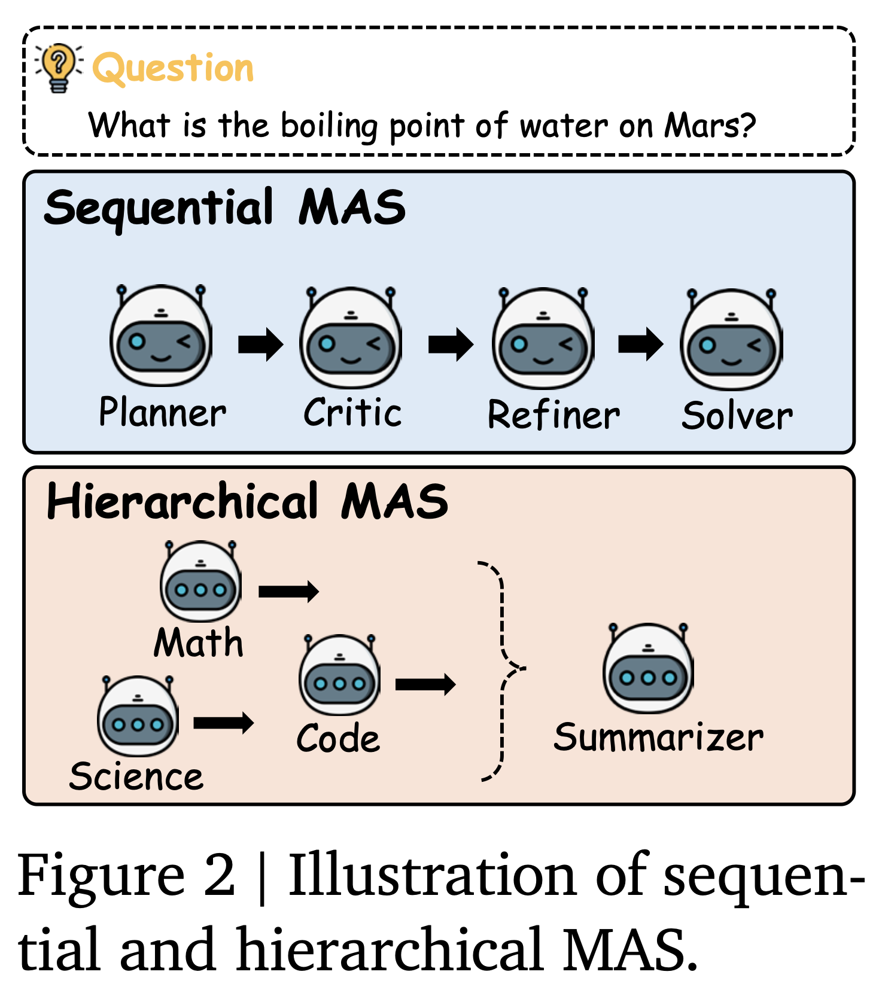
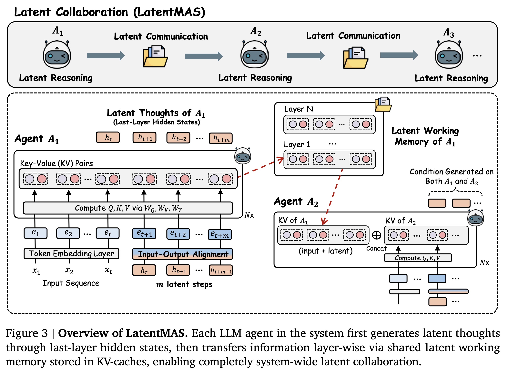
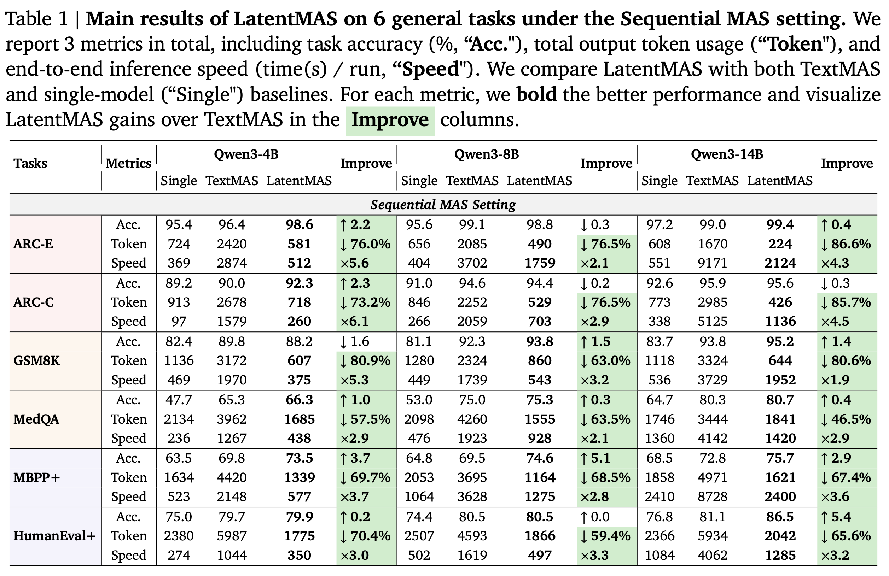
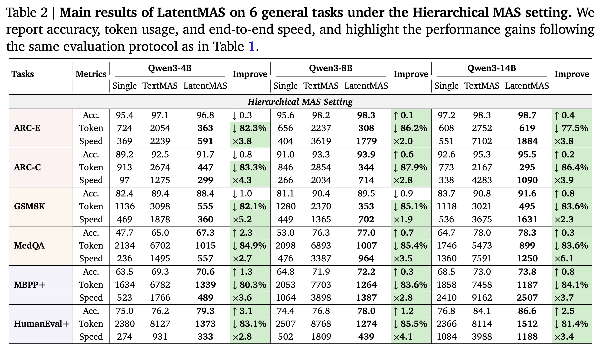
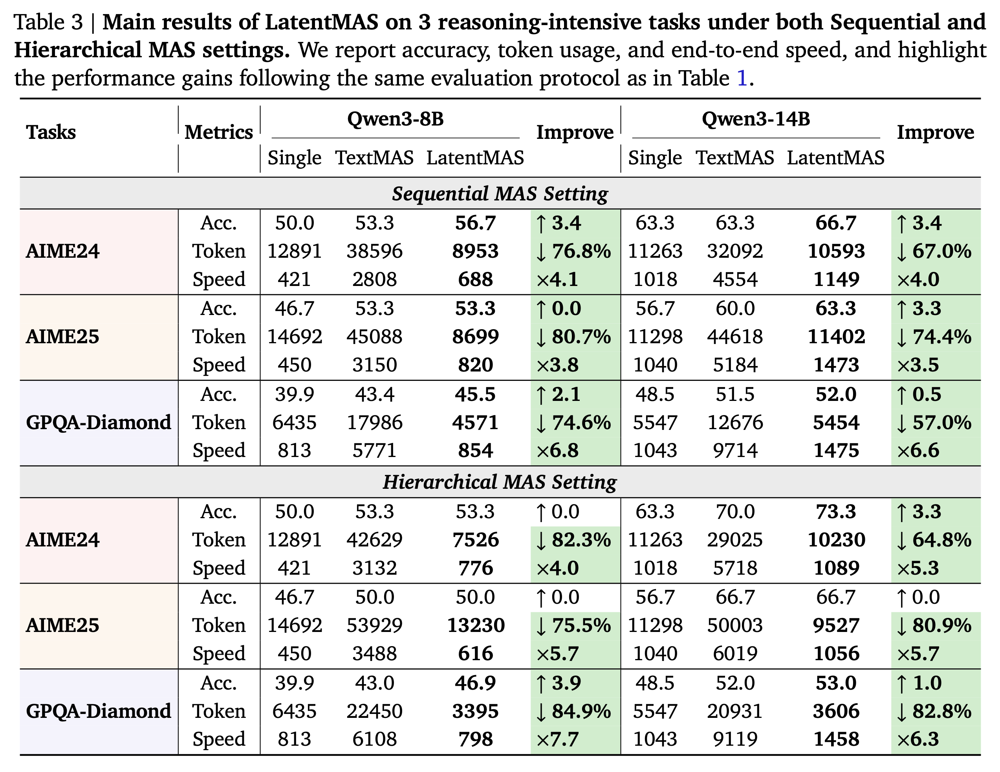
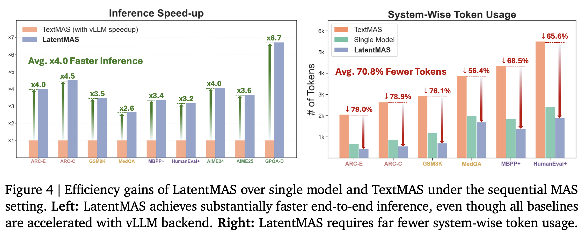
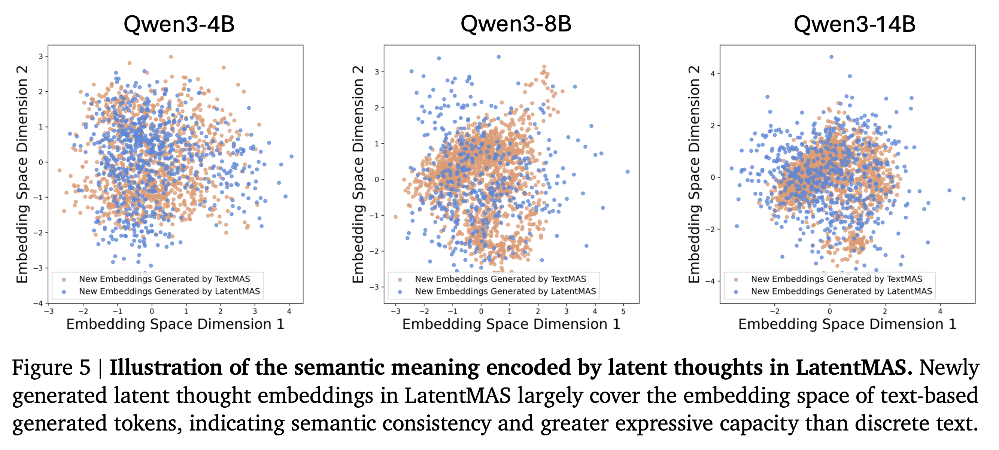

## Introduction
**[ Problem Definition ]**  
- LLM 기반의 Multi-Agent System (MAS)에서, 서로 다른 agent 간의 소통의 매개체로 자연어가 사용됨
- LLM의 연속적인 latent space를 언어 모델의 새로운 "model language"로써 탐구한 연구가 존재
  - `latent reasoning` 단일 모델의 latent CoT를 수행하기 위해 hidden representation을 사용
  - `latent communication` KV cache나 임베딩을 사용해서 두 개 이상의 모델 간 정보 교류를 수행
  - 두 방식을 결합하여 한 번에 적용한 연구는 진행되지 않았음

```markdown
Can multi-agent systems achieve pure latent collaboration?
```

**[ Solution ]**  
`LatentMAS`  
- latent reasoning: 추론 과정이 모델의 마지막 레이어의 hidden representation에 대한 디코딩 단계 없이 수행됨
- latent communication: agent 간 정보 교환이 latent working memory를 공유함으로써 수행됨
  - layer-wise KV cache를 사용하여 latent working memory를 저장
  - 입력 맥락과 새롭게 생성된 latent thoughts를 포함
- 완벽한 training-free 방식

`Foundational Principles`  
- **Reasoning Expressiveness**: hidden representations는 모델의 연속적인 생각을 인코딩하며, 이산적인 토큰에 비해 더 풍부한 정보를 전달할 수 있음
- **Communication Fidelity**: latent working memory는 모델의 입력 표현과 latent thought을 보존하며, agent 간 손실 없는 정보 전달을 가능하게 함
- **Collaboration Complexity**: TextMAS에 비해 낮은 추론 복잡도를 유지하면서 높은 collaborative 표현력을 달성

## Preliminary and Notations
**[ Auto-regressive Generation in Transformer ]**  
- step 1: 파라미터 $\theta$ 를 가진 모델의 함수 $f_\theta(\cdot)$ 가 입력 시퀀스 $x = (x_1, x_2, ..., x_T)$ 를 임베딩 벡터 $W_{in}$ 를 사용해서 timestep $t$ 까지 임베딩 → $E = [e_1, e_2, ..., e_t] \in \mathbb{R}^{t \times d_h}$
  - $d_h$: 모델 은닉층의 차원 수
- step 2: 입력 토큰 임베딩 $E$ 가 트랜스포머의 $L$ 개의 레이어를 residual한 방식으로 forward pass → 마지막 hidden representation $H = [h_1, h_2, ..., h_t] \in \mathbb{R}^{t \times d_h}$ 로 변환됨
- next token generation을 수행할 때의 표현식:

$$
f_\theta(x_{t+1} \mid x_{\le t}) = \text{softmax}(h_t, W_{\text{out}})
$$

- $W_{\text{out}}$: hidden representation을 vocabulary space로 연결하는 언어 모델의 헤드

**[ KV Cache as Working Memory ]**  

<details>
  <summary>KV cache란?</summary>
  self-attention을 연산하는 과정에서, 현재 timestep $t$ 에 대해 변환된 query $Q_t$ 는 모든 timestep의 Key, Value와 결합된다. <br>
  이때, 모든 레이어에서 layer-wise하게 Query, Key, Value 변환 행렬 $W_Q$, $W_K$, $W_V$ 를 공유하기 때문에 여러 번 반복 연산되는 Key와 Value 값은 cache에 저장해두고 사용하면 연산량과 연산 시간을 감소할 수 있다. <br>
  이때 저장되는 KV cache의 크기는, <br>

  (TBU, 수식 써둔 그림 캡쳐해서 올리기)
</details>

- auto-regressive generation을 수행하는 decoder-only 트랜스포머에서, Key-Value cache 함수는 동적 working memory로 계산됨
  - KV cache가 timestep에 따라 동적으로 업데이트 되기 때문에 동적 working memory라고 부름
- $(K_\text{cache}, V_{\text{cache}})$ 업데이트 계산식:

$$
K_{\text{cache}} \gets [K_{\le t};K_{t+1}], \ V_{\text{cache}} \gets [V_{\le t};V_{t+1}]
$$

- $K_{\le t}, V_{\le t}$: 현재 timestep까지 축적된 key, value 행렬
- $K_{t+1}, V_{t+1}$: 현재 timestep의 hidden state로부터 계산된 key, value 행렬

**[ LLM-based MAS Setting ]**  

<div align="center">

</div>

- $N$ 개의 agent로 구성된 multi-agent system $\mathcal{S}$ 를 설정하고 $\mathcal{A} = \lbrace A_1, A_2, ..., A_N \rbrace$ 라고 표기
  - $A_i$ 는 $f_{\theta_i}$ 에 대응하는 LLM을 의미
- 추론 시간에 대해, 질문 $q$ 가 시스템 $\mathcal{S}$ 에 입력되면, agent의 상호작용을 조율하여 최종 응답 $a$ 를 출력하도록 함
- MAS를 구성하는 다양한 방법이 있으며 본 연구에서 특정 방법을 제한하고 진행한 것은 아니지만, 실험을 위해서 가장 일반적으로 사용되는 구성 두 개(*sequential*, *hierarchical*)를 설정
  - sequential MAS
    - chain-of-thought 디자인을 차용하여 `planner, critic, refiner, solver`를 설정
    - 질문 $q$ 에 대한 각 agent의 CoT 출력을 다음 agent로 전달
  - hierarchical MAS
    - 도메인 전문가 디자인을 차용하여 `code, math, science` 등의 분야와 관련된 전문가들을 설정
    - 각 전문가 agent가 질문 $q$ 에 대한 답변을 생성하면, `summarizer` agent가 모든 답변을 종합적으로 검토하여 최종 답변을 도출

## Building a Latent Collaborative Multi-Agent System
- LatentMAS
  - 모든 agent들이 latent space 내에서 정보 손실 없이, 빠른 속도로 소통하게 함
  - 이점 1: latent space 내에서 초효율적으로 thoughts generation을 가능하게 함
  - 이점 2: 각 agent가 latent space 내에서 수행한 사고의 과정을 손실 없이 전달할 수 있음
  - 이점 3: vanilla text MAS과 동일한 수준의 표현력을 유지하며 매우 낮은 복잡도를 가짐

<div align="center">

</div>

**[ Auto-regressive Latent Thoughts Generation in Agents ]**  
- step 1: 입력된 query와 프롬프트에 대해, 임베딩 벡터 $E = [ e_1, e_2, ..., e_3 ]$ 로 변환
- step 2: timestep t에 각 LLM agent $A_i \in \mathcal{A}$ 는 $E$를 $L$개의 레이어를 거쳐 최종 hidden state h_t로 변환
- step 3: 다음 timestep $t+1$ 에 $h_t$ 자체를 입력 임베딩으로 사용
  - 즉, 디코딩 없이 hidden state의 벡터 자체를 입력으로 사용하는 것
- 해당 과정을 $m$ 번의 step 동안 반복하고, 최종적으로 마지막 hidden state에 $H = [h_{t+1}, h_{t+2}, ..., h_{t+m}]$ 이 생성

`Input-Output Distribution Alignment`  
- 새롭게 생성된 $H$ 은 dense, high-level representation이기 때문에 shallow layer에 그대로 입력하는 것은 out-of-distribution activations을 야기할 수 있음
  - out-of-distribution activations: 모델이 학습 때 보던 분포와 다른 형태의 입력을 받았을 때 내부에서 발생하는 비정상적이거나 예기치 않은 활성화 패턴
- 단순한 선형 변환을 통해 마지막 층의 hidden state를 input embedding으로 변환
- $A_i$ 의 $W_{\text{in}}$, $W_{\text{out}}$ 가 있을 때, $h \in H$ 를 새로운 입력 벡터 $e$ 로 변환하는 projection matrix $W_a \in \mathbb{R}^{d_h \times d_h}$ 를 탐색

$$
e = hW_a, \ \text{where} \ W_a \approx W_{\text{out}}^{-1}W_{\text{in}}
$$

- $W_{\text{out}}^{-1}$: $W_{\text{out}}$ 의 pseudo-inverse, 모델의 은닉 층에 대한 차원 $d_h \times d_h$ 의 크기를 가짐

`Expressiveness on Continuous Latent Thoughts`  
- latent space에서의 thought generation이 풍부한 표현력은 유지하면서도 복잡도가 낮다는 것을 증명하는 파트

*Theorem 3.1 (Expressive of Latent Thoughts)*  
$h$ 에 대한 선형 변환 가설(Assumption B.1 참고)에 기반하여 만약 길이 $m$ 의 모든 latent thoughts가 텍스트 기반으로 손실 없이 표현될 수 있다면, 필요한 텍스트(토큰)의 길이는 최소 $\Omega(d_hm/\log(\mid \mathcal{V} \mid)$ 이다. 이때, $\mid \mathcal{V} \mid > 1$ 이며, 이는 vocabulary size를 의미한다.  

*Remark 3.2*  
Theorem 3.1은 latent thoughts generation이 텍스트 기반의 추론보다 $O(d_h/\log \mid \mathcal{V} \mid)$ 배 더 효율적임을 의미한다. 추가로, 표현력은 $d_h$ 만큼 선형적으로 비례한데, 이는 모델의 크기가 클수록 표현력에 대한 수용력이 크다는 것을 의미한다.

- Remark 3.2에 의해 Qwen3-4B/8B/14B 모델들의 thoughts generation은 각각 235.7 / 377.1 / 471.4 배 더 효율적임

**[ Working Memory Preservation and Thoughts Transfer across Agents ]**  
- 본 연구에서 개발한 LatentMAS는 latent space에서 추론이 진행되기 때문에 latent working memory transfer mechanism을 제안함
- 이전 agent $A_1$가 $m$ step의 latent step generation을 수행하면, 해당 agent에서 $L$ 개의 모든 레이어에 대한 KV cache를 추출하여 *latent working memory*로 정의함

$$
\mathcal{M}_{A_1} = \lbrace (K^{(l)}_{A_1, \text{cache}}, V^{(l)}_{A_1, \text{cache}}) | l = 1, 2, ..., L \rbrace, \\
\text{where} \ K^{(l)}_{A_1, \text{cache}} = [K^{(l)}_{A_1, 1}, K^{(l)}_{A_1, t+m}], \ V^{(l)}_{A_1, \text{cache}} = [V^{(l)}_{A_1, 1}, V^{(l)}_{A_1, t+m}].
$$

- 이때, 기존의 KV cache와는 다르게 timestep $t=1$ 부터 즉, 입력 query와 prompt를 모두 포함하여 새롭게 생성된 hidden state까지 전부 저장하여 총 $t+m$ 개의 원소가 KV cache에 저장됨
- 해당 latent working memory를 다음 순서의 agent의 KV cache 앞에 concat하여 결과적으로 뒤따르는 agent의 prefix/prompt처럼 간주되도록 함
- 뒤따르는 agent는 이전 agent의 생각에 기반하여 추론을 수행하게 됨 (conditioned reasnoing)

`Lossless Information Transfer`  
- 해당 방식(latent working memory transfer)으로 정보 교환을 수행하는 것이 텍스트로 변환하여 정보를 전달하는 것과 동등
> 더 풍부한 표현력을 가지는데 텍스트 기반의 전달과 동등하면 안 되는 것 아님?

*Theorem 3.3 (Information Preservation via Latent Working Memory)*  
latent과 텍스트 기반의 추론 모두에 대하여, latent working memory를 전달 받은 agent의 출력과 텍스트를 입력 받은 agent의 출력은 동등함

- 해당 이론에 대한 증명은 Appendix B.2에 있음

**[ End-to-End Pipeline with Complexity Analyses ]**  
- 프레임워크의 복잡도를 이론적으로 계산한 파트

*Theorem 3.4 (LatentMAS Complexity)*  
LatentMAS의 시간 복잡도는 $O((d^2_hm + d_hm^2 + d_htm)L)$ 이고, 이때 $t$ 는 agent의 입력 시퀀스의 길이, $m$ 은 latent thoughts의 길이를 의미한다. 반면에 Theorem 3.1에 의해 vanilla text-based MAS의 각 agent가 동일한 표현력을 내기 위한 시간 복잡도는 $O((d^3_hm\frac{1}{\log|\mathcal{V}|} + d^3_hm^2\frac{1}{\log^2|\mathcal{V}|} + d^2tm\frac{1}{\log|\mathcal{V}|})L + d^2_h|\mathcal{V}|m\frac{1}{\log|\mathcal{V}|})$ 이다.

- 해당 이론에 대한 증명은 Appendix B.3에 있음
- LatentMAS는 MAS의 어떠한 설정에서도 적용될 수 있으며, 특정 형태의 프레임워크에 국한되지 않음

## Empirical Evaluations

`Tasks and Designs`  
- 일반적인 태스크와 추론 중점의 태스크를 포함한 9개의 벤치마크 데이터
- *Math & Science Reasnoing*: GSM8K, AIME24, AIME25, GPQA-Diamond, MedQA
- *Commonsense Reasoning*: ARC-Easy, ARC-Challenge
- *Code Generation*: MBPP-Plus, HumanEval-Plus

`Models and Baselines`  
- Qwen3 family (4B, 8B, 14B) 모델을 튜닝 없이 그대로 사용
- *Single LLM agents (Single)*: token-level 디코딩과 함께 표준적인 auto-regressive generation을 수행하는 단일 LLM agent
- *Sequential text-based MAS (Sequential TextMAS)*: CoT 디자인을 따르는, 텍스트 기반의 추론과 소통을 하는 MAS
- *Hierarchical text-based MAS (Hierarchical TextMAS)*: summarizer를 통해 도메인 전문가 agent collaboration을 수행하는, 텍스트 기반의 추론과 소통을 하는 MAS

`Implementation Detailes`  
- latent thoughts generation 과정에서 $W_a$ 는 한 번만 계산하고, 모든 추론 단계에서 공유하도록 함
- 각 LLM agent는 $m \in \lbrace 0, 10, 20, 40, 80 \rbrace$ 의 latent step을 생성함
- working memory transfer를 위해 Hugging Face Transformers의 past_key_values를 사용해서 KV cache를 전달함
- vLLM을 사용하여 모델을 배포 후 추론에 사용함
  - prefix caching과 텐서 병렬 연산을 가능하게 함
- 하이퍼파라미터 튜닝 후 3번의 독립적인 실행에 대한 평균값으로 성능을 측정함
- temperature 0.6, top-$p$ 0.95로 설정
- 일반적인 태스크에서는 maximum output length를 2,048개로, 추론 중점 태스크에서는 8,096개로 제한함
  - 추론 중점 태스크: GPQA-Diamond, MedQA, AIME 2025
- GPUs: 8 x NVIDIA A100-80G

**[ LatentMAS Delivers Higher Accuracy with Efficient Collaboration ]**  

<div align="center">

<figcaption style="text-align:center; font-size:15px; color:#808080; margin-top:0px">[Table 1] 6개의 일반 태스크에 대한 Sequential MAS setting에서의 비교</figcaption>  
</div>

<div align="center">

<figcaption style="text-align:center; font-size:15px; color:#808080; margin-top:0px">[Table 2] 6개의 일반 태스크에 대한 Hierarchical MAS setting에서의 비교</figcaption>  
</div>

<div align="center">

<figcaption style="text-align:center; font-size:15px; color:#808080; margin-top:0px">[Table 3] 3개의 추론 중점적인 태스크에 대한 Sequential과 Hierarchical MAS setting에서의 비교</figcaption>  
</div>

`Main Result`  
- 평가 메트릭: (i) *task accuracy*, (ii) *system throughput (total output tokens)*, (iii) *end-to-end inference speed*

(i) *task accuracy*  
- 단일 모델 대비 정확도: sequential MAS에서 평균 +14.6%p, hierarchical MAS에서 평균 +13.3%p 향상
- 텍스트 기반 MAS 대비 정확도: sequential MAS에서 평균 +2.8%p, hierarchical MAS에서 평균 +4.6%p 향상

(ii) *system throughput*  
- 텍스트 기반 MAS 대비 크게 감소
- sequential MAS 70.8% 감소, hierarchical MAS 83.7% 감소

(iii) *inference speed*
- 텍스트 기반 MAS 대비 평균 속도 향상
- 순차형 4×, 계층형 4.3× 더 빠름

`Superior Efficiency on Latent Collaboration`  

<div align="center">

</div>

- LatentMAS는 이론과 실험 모두에서 텍스트 기반 MAS보다 훨씬 높은 효율을 달성
  - 텍스트 디코딩 대신 소수의 잠재 스텝만 생성하면 됨
- vLLM으로 가속한 TextMAS와 비교해도 2.6×~7×, 평균 약 4× 속도 향상
- 스텝 대비 효율
  - AIME24/25 같은 고난도 과제에서도 50 스텝 미만의 잠재 스텝으로 동등하거나 우수한 성능을 달성
  - TextMAS는 2만 토큰 이상을 요구하는 경우가 많음
- 토큰 비용 절감: agent 간 정보를 텍스트가 아닌 KV 기반 latent working memory로 전달
  - TextMAS 대비 59.4%~87.9% 토큰이 감소함
  - 단일 모델과 비교했을 때에도 15.0%~60.3% 감소
- 원인 분석
  - latent thoughts는 표현력이 높아 필요한 스텝 수가 적음
  - 중간 결과를 텍스트로 풀어 쓰지 않으므로 디코딩·재인코딩 오버헤드가 제거됨
  - 최종 에이전트는 집약된 latent expression만을 받아 소량의 텍스트만 디코딩하면 됨

**[ In-depth Analyses on LatentMAS ]**  

`Do Latent Thoughts Reflect Text Reasoning?`  

<div align="center">

</div>

- LatentMAS에서 생성한 latent thoughts가 유의미한 표현을 제공하는지를 검증하는 파트
- LatentMAS와 TextMAS의 마지막 은닉층의 임베딩을 비교 분석함
- 300개의 MedQA 질문들에 대해서 40개의 latent step을 생성하도록 하고, TextMAS 베이스라인에 대하여 4096개의 max-token을 생성하도록 함
  - LatentMAS의 마지막 은닉층의 임베딩이 TextMAS의 토큰 임베딩과 거의 동일한 영역을 공유함
  - 마지막 은닉층의 임베딩이 TextMAS의 임베딩 영역보다 넓은 영역을 커버함
> latent space에서의 표현이 텍스트 기반의 표현보다 풍부한 표현을 제공한다고 하는데, 동일한 영역을 커버한다는 것이 그 근거가 될 수 있는가?  
또한, 더 넓은 영역을 커버한다고 해서 풍부한 표현을 유지한다는 근거가 되는가? 텍스트 임베딩으로 표현되지 않는 영역이 무엇을 의미하는지 궁금함