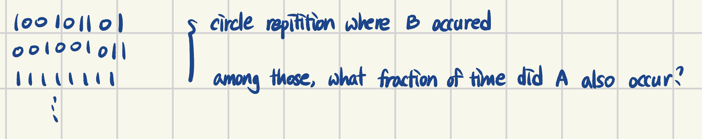

> 이 포스팅은 Harvard에서 진행된 Joe Blitzstein의 Statics 110 강좌를 기반으로 작성되었습니다.  
- [강의 및 자료 링크](https://stat110.hsites.harvard.edu)

### Independent (독립 사건)

> Note: completely different from disjointness (배반 사건)  
독립 사건: 사건 A가 사건 B에 전혀 영향을 미치지 않음  
배반 사건: 사건 A와 사건 B가 동시에 일어날 확률이 0  

`Definition`  
Events A, B are independent if $P(A \cap B) = P(A)P(B)$.  
Events A, B, C are independent if $P(A, B) = P(A)P(B)$, $P(B, C) = P(B)P(C)$, $P(C, A) = P(C)P(A)$, $P(A, B, C) = P(A)P(B)P(C)$.  
Similarly for events $A_1, A_2, ..., A_n$. `"independent means multiply"`  

### Newton-Pepys Problem (1693)
Have fair dice; which is most likely?  
(A) at least one 6 with 6 dice  
(B) at least two 6s with 12 dice  
(C) at least three 6s with 18 dice  

$P(A) = 1 - (\frac{5}{6})^6 \approx 0.665$  
$P(B) = 1 - (\frac{5}{6})^{12} - \binom{12}{1}\frac{1}{12}(\frac{5}{6})^{11} \approx 0.619$  
$P(C) = 1 - \sum^2_{k=0}\binom{18}{k}\frac{1}{6}^k(\frac{5}{6})^{18-k} \approx 0.597$

### Conditional Probability
How should you update prob./beliefs/uncertainty based on new evidence?  
`Conditioning is the soul of statistics.`  

`Definition`  

$$
P(A|B) = \frac{P(A \cap B)}{P(B)}, \ \text{if } P(B) > 0
$$  

**[Intuition 1] Pebble World**  

**[Intuition 2] Frequentist World**: repeat experiments many times  

### Theorems of Conditional Probability

**[Theorem 1]**  

$$
P(A \cap B) = P(B)P(A|B) = P(A)P(B|A)
$$

**[Theorem 2]**  

$$
P(A_1, ..., A_n) = P(A_1)P(A_2|A_1)P(A_3|A_1, A_2) \cdots P(A_n|A_1, A_2, ..., A_n)
$$

**[Theorem 3]**  

$$
P(A|B) = \frac{P(B|A)P(A)}{P(B)} \ \text{Bayes' Rule} \ (\because \text{Theorem 1})
$$
