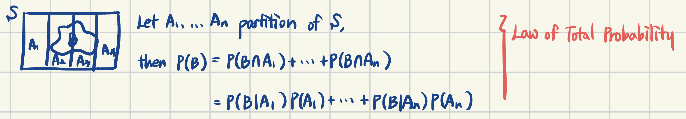
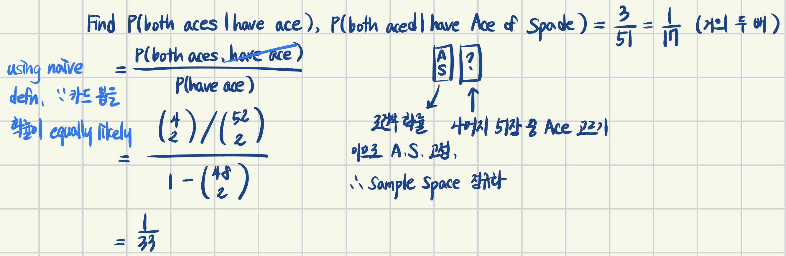
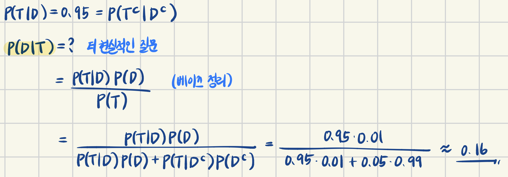

> 이 포스팅은 Harvard에서 진행된 Joe Blitzstein의 Statics 110 강좌를 기반으로 작성되었습니다.  
- [강의 및 자료 링크](https://stat110.hsites.harvard.edu)

### Conditioning Continued

> "Thinking Conditionally" is a condition for thinking

**[How do you solve a problem]**  
(1) try simple and extreme cases  
(2) break up problems into simpler pieces  

**[Example 1]** get random 2-card hand from standard deck, and find $P(\text{both aces} | \text{have ace})$, $P(\text{both aces} | \text{have ace of spade})$  

**[Example 2]** Patient gets certain disease tested for disease afflicts 1% of population. Suppose the test advertised as "95% accurate".  
- $D$: patient has disease  
- $T$: patient tests positive  

### Biohazards  

> 조건부 확률에 대해서 헷갈리는 개념들

(1) `prosecutor's fallacy` Confusing $P(B|A)$, $P(A|B)$  
Ex. Sally Clark case  
두 명의 아기가 우연히 죽었으나, 법정에서는 "그녀가 결백할 때 아기가 둘이나 죽을 확률"을 통해 그녀가 유죄라고 주장함  
$P(\text{babies dies} | \text{she's innocent}) = \frac{1}{8500}\cdot \frac{1}{8500} \approx \frac{1}{73 \times 10^6}$ 를 구했지만, 사실상 알아야 하는 것은 $P(\text{innocence} | \text{evidence})$ 이다.  
심지어 아이가 둘 다 죽을 확률이 각각 독립이 아니(유전병 등의 원인으로)기 때문에 위 계산법조차 잘못되었다.  

(2) Confusing $P(A)$ "prior" with $P(A|B)$ "posterior"  

(3) Confuing **independence** with **conditional independence**  
`Defn.` 사건 A, B는 C의 조건 하에 독립이다.  

만약 $P(A \cap B | C ) = P(A|C)P(B|C)$ 라면,  
- C의 조건 하에 독립이라는 것은, A와 B가 독립이라는 것을 반드시 보장하는가?
  - No. Chess Opponent of Unknown Strength: 상대의 수준을 알고, 해당 수준이 고정이라는 **조건 하에** 매 경기는 독립일 수 있으나, 그렇지 않다면, 이전 경기의 결과로 승률을 결정하고, 이는 다음 경기에 영향을 미치기 때문에 각 경기가 독립이라고 할 수 없다.  
- A, B가 독립이라는 것은, C의 조건 하에 독립임을 반드시 보장하는가?
  - No. A가 '화재 경보가 울림', B가 '화재 발생', C가 '팝콘 튀김'이라는 사건일 때, A와 C는 독립이지만, $P(F|A,C^C)=1$ 이기 때문에 반드시 독립이라고 할 수 없다.