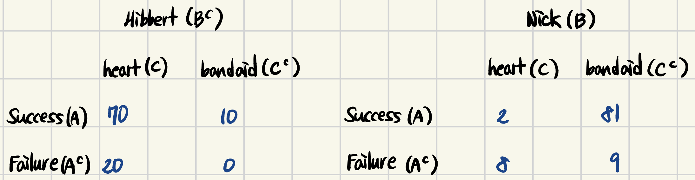

> 이 포스팅은 Harvard에서 진행된 Joe Blitzstein의 Statics 110 강좌를 기반으로 작성되었습니다.  
- [강의 및 자료 링크](https://stat110.hsites.harvard.edu)

### Monty Hall (Three Doors) Problem

1 door has a car (which you desire), 2 doors have goats (which you don't), **Monty knows which**.  
You pick one, Monty **always** opens a goat door. (If he has choice, he picks with equal prob.)  
Should you switch your first choice?  
> Note: if Monty oopens Door 2, we know Door 2 has a goat, and Monty opened Door 2.  

**[Solution 1: Tree]**  
> Suppose we always choose Door 1.  

<div align="center">

</div>

**[Solution 2: LoTP (Law of Total Probability)]**  
> LoTP could be rewritten as "wish we new where the car is"  

- $S$: succeed when switch
- $D_j$: j-th door has a car ($1 \leqslant j \leqslant 3$)  

$$
P(S) = P(S|D_1) \cdot \frac{1}{3} + P(S|D_2) \cdot \frac{1}{3} + P(S|D_3) \cdot \frac{1}{3} \\
= 0 + 1 \cdot \frac{1}{3} + 1 \cdot \frac{1}{3} = \frac{2}{3}
$$

By symmetry, $P(S \vert \text{Monty opens 2}) = \frac{2}{3}$


### Simpson's Paradox

```markdown
부분 확률의 대소 관계는 전확률 관점에서 뒤집힐 수 있다.
```

아래와 같이, Hibbert와 Nick의 각 수술에 대한 확률이 다음과 같다고 하자.  

<div align="center">

</div>

모든 수술을 종합하여 봤을 때의 성공률 (전확률): 80% (success $\vert$ Hibbert) < 83% (success $\vert$ Nick)  
심장 수술을 한다는 조건: $\frac{70}{90}$ (success $\vert$ Hibbert, heart surgery) > $\frac{2}{10}$ (success $\vert$ Nick, heart surgery)  

**[Simpson's Paradox의 기본적인 형태]**  
- $A$: successful surgery
- $B$: treated by Dr. Nick
- $C$: having heart surgery (confounder, 교란자)

$$
P(A|B,C) \lt P(A|B^C,C) \\
P(A|B,C) \lt P(A|B^C,C^C) \\
\text{but, } P(A|B) \gt P(A|B^C)
$$  

**[LoTP로 Simpson's Paradox가 틀렸음을 증명할 수 없음]**  
$P(A|B) = P(A|B,C)P(C|B) + P(A|B,C^C)P(C^C|B)$ 에서,  
$P(A|B,C) \lt P(A|B^C,C)$, $P(A|B,C^C) \lt P(A|B^C,C^C)$는 위 테이블을 통해 알 수 있지만,  
$P(C|B), P(C^C|B)$가 총합이 1인 서로 다른 값의 가중치로 작용하기 때문에 Simpson's Paradox가 발생 가능하다.  

> 추가 설명  
$P(C|B), P(C^C|B)$는 각각 Nick이 heart surgery를 할 확률과 bandaid removal을 할 확률을 말한다.  
여기서, 전확률의 관점에서 "Nick의 총 수술 횟수"를 알 수 없기 때문에 부분 확률과의 대소 관계가 달라질 수 있다.