> **citation**  
Chen, Qiguang et al. “The Molecular Structure of Thought: Mapping the Topology of Long Chain-of-Thought Reasoning.” (2026).  
(ByteDance에서 작성한 논문이다.)

## Introduction  

`How do Large Language Models learn and represent effective Long Chain-of-Thought?`  

**[First]** LongCoT에서 공통적으로 발견되는 특성을 찾아 분석 및 화학에서의 분자 구조에 빗대어 설명  
**[Second]** Supervised Fine-Tuning(SFT)을 통해 단순히 반복적으로 등장하는 단어를 모방하는 것이 아니라, reasoning structure 자체를 파악하는 것임을 실험적으로 증명  
**[Third]** distillation 말고 In-Context Learning(ICL)을 통해 잘 구조화된 LongCoT를 생성하는 방법(MoleSyn)을 소개  
**[Fourth]** 강력한 reasoning structure 외 변형된 구조들의 특징들과 성능 저하

## Preliminary

> 적절한 LongCoT에 대해 분석하기 전에, LLM들이 적절한 LongCoT를 학습하고 생성할 수 있는지 확인  

- 강력한 reasoning LLM으로부터의 trace들은 적절한 성능 향상을 이끌어냄
- human annotated tace들조차 성능 향상을 도모하지 못함

## Molecular Structure

> 본 연구에서 발견한 strong LongCoT의 핵심 요소와 그 구조, 특성을 소개한다. 하지만 굳이 분자 구조에 빗대지 않아도 될 것 같고, 나는 화학을 잘 모르기 때문에 분자 구조를 활용한 묘사는 최소화했다.

### Components of Molecular Structure in LongCoT

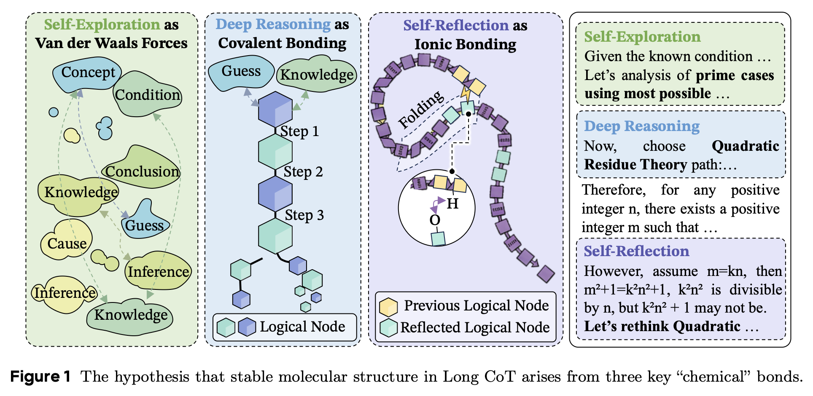

**Deep Reasoning**  
- reasoning 과정 내에서 이전 step과 이후 step의 강력한 타당성
- Ex. "step A이므로 step B가 도출된다."

**Self Reflection**  
- 멀리 있는 이후의 step이 비교적 초반에 등장한 step과 연관지어지는 것
- Ex. "지금까지의 계산을 검증해볼까?"

**Self-Exploration**  
- 탐색의 영역으로, 연결이 약한 추론들에 대해 탐색해보는 것
- Ex. "다른 방식으로도 풀어보자."

이 외에도 **Normal Explanation**이라고 표현된 일반적인 추론 및 설명(Ex. 2+4=6)이 있지만, LongCoT의 특성은 아니기에 설명에서 제외된 듯하다.

### Stable Bond Distribution in LongCoT

강력한 reasoning을 제공한 LLM들의 LongCoT는 LLM마다 다른 종류의 구성요소를 갖거나 다른 분포로 요소들을 조합하는 것이 아니라, 일관되고 유사한 분포를 따른다는 특징을 발견했다.  

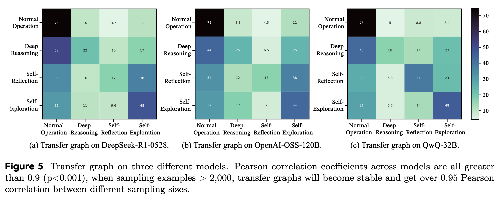

위 Fig. 5의 transfer table은 특정 step에서 다음 step으로의 전이 확률을 나타낸다.  
- 서로 다른 모델 DeepSeek-R1-0528, OpenAI-OSS-120B, QwQ-32B에 대해서 전이 확률 간의 Pearson correlation은 0.9 이상 → 강력한 LongCoT에서는 공통된 특성을 보인다는 것을 증명

### Learning Structures Rather Than Keywords

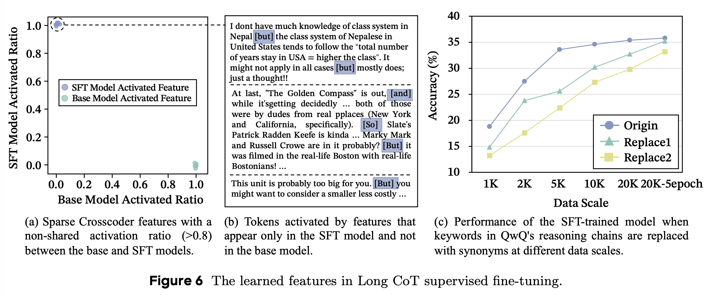

강력한 LongCoT에서 `but`, `and`, `so`와 같은 단어들이 특히 더 많이 관찰되는 경향이 있다. SFT를 통해 distillation을 수행했을 때, 단순히 단어만 모방하는 것이 아닌지에 대해 확인하기 위한 실험을 진행했다.  
- 특히 더 많이 발견되는 단어를 파악한 방법: cross-coder sparse auto-encoder를 활용해서 베이스 모델과 distillation 적용 이후의 모델의 reasoning path를 비교(Fig. 6-a), distillation 이후에 더 많이 발견되는 특징적인 단어들 파악(Fig. 6-b)
- reasoning path에서 해당 단어들을 없애거나 랜덤한 다른 단어로 대체하여 성능 변화를 비교한 결과, 수렴 속도의 차이는 있었지만 결과적으로 유사한 성능 향상율을 보임(Fig. 6-c)
  - 해당 단어들이 reasoning path를 모방하는 데 영향을 미친 것이 아님

> **궁금한 점**  
특정 단어가 아니라 reasoning structure를 학습하는 것을 증명하려면 모델의 벤치마크 데이터셋에 대한 성능이 아니라 Fig. 5와 같은 transfer distribution을 확인해야 하는 것 아닌지?

### Attention $\Leftrightarrow$ Energy Level of Bonds

> reasoning 과정에서 다음 token과의 attention score를 통해 token 간 결합 관계를 파악했다.  
(사실 이 파트를 왜 넣었는지는 잘 모르겠음)

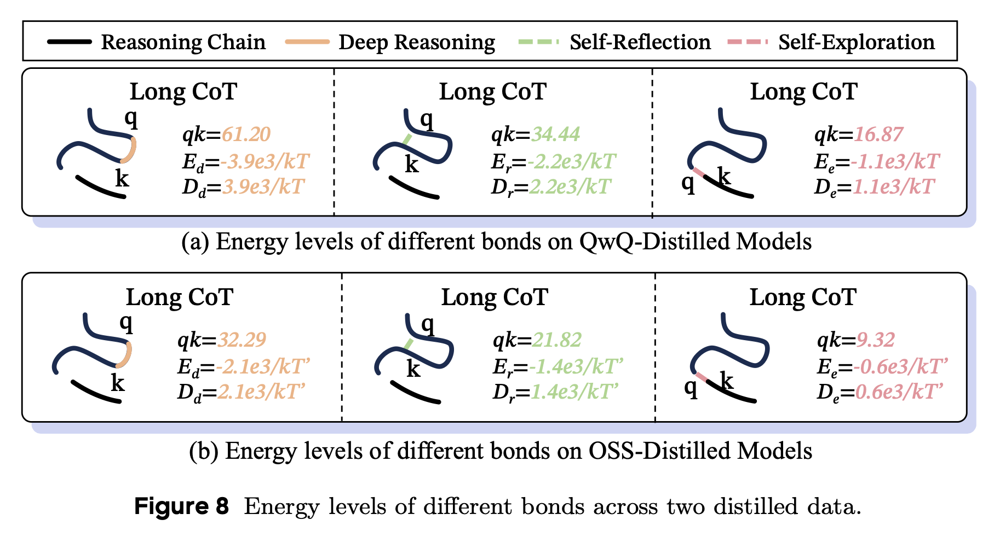

$$
P(\text{state}_i) = \frac{\exp(-E_i/k_BT)}{\Sigma_j\exp(-E_j/k_BT)} \\
a_{ij} = \frac{q_i \cdot k_j/\sqrt{d_k}}{\Sigma_l\exp(Q_i \cdot k_l \sqrt{d_k})}
$$

위 두 식을 통해 $a_ij$가 $i$ 번째 token과 $j$ 번째 token 간의 결합을 파악했다.
- Fig. 8에서 보는 것과 같이 Deep Reasoning이 가장 큰 bond energy $D_d$를 보여줌
- Self-Exploration은 가장 약한 결합을 보여줌

> **궁금한 점**
- attn. score이 높으면 confidence lv.도 클지 (confidence lv.을 token 단위로 파악할 수 있나..?)
- Self-Exploration이 타당할 경우에 더 높은 confidence lv.을 가질 수 있는지

## ⭐️ MoleSyn

### Methodology
teacher 모델로부터 LongCoT를 생성해서 SFT 방식으로 학습하는 것은 많은 비용과 시간이 소요되기 때문에 비효율적이다. 따라서 ICL의 방식으로도 LongCoT를 생성해낼 수 있는 방법론을 제안한다.  

> 디테일한 방법론은 본문이 아니라 Appendix E에 기재되어 있다.  
이것 때문에 읽고 싶었는데 어펜딕스라니.. 흑흑

`step 1` reasoning step transition distribution을 파악하기 위해 teacher model로부터 2만 개의 LongCoT trajectory들을 확보한다.  
`step 2` LLM을 활용해서 각 reasoning step이 Normal Operation, Deep Reasoning, Self-Reflection, Self-Exploration 중 어디에 속하는지 파악한다. 그 뒤, reasoning step transfer distribution을 만든다.
`step 3` DR, SR, SE 중 각 step마다 생성할 요소를 파악한 distribution에 따라 선택하다.  
`step 4` 각 step마다의 프롬프트를 적용하여 reasoning path를 생성해낸다. 

각 요소에 대한 프롬프트

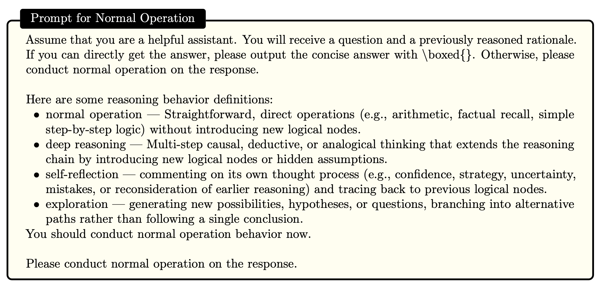

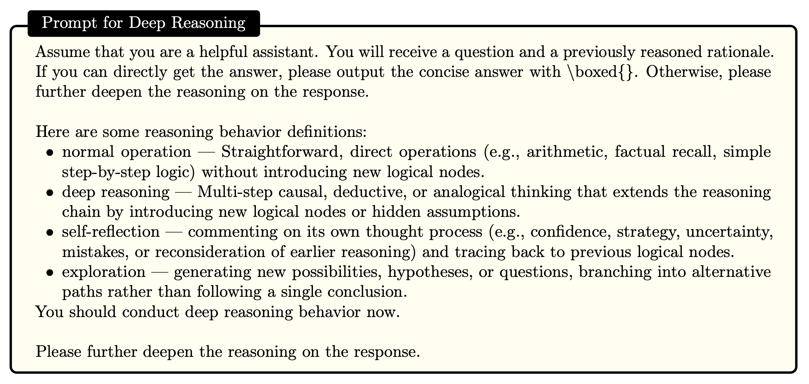

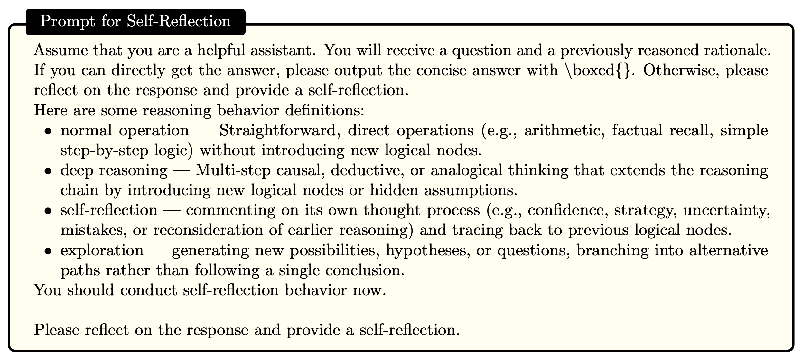

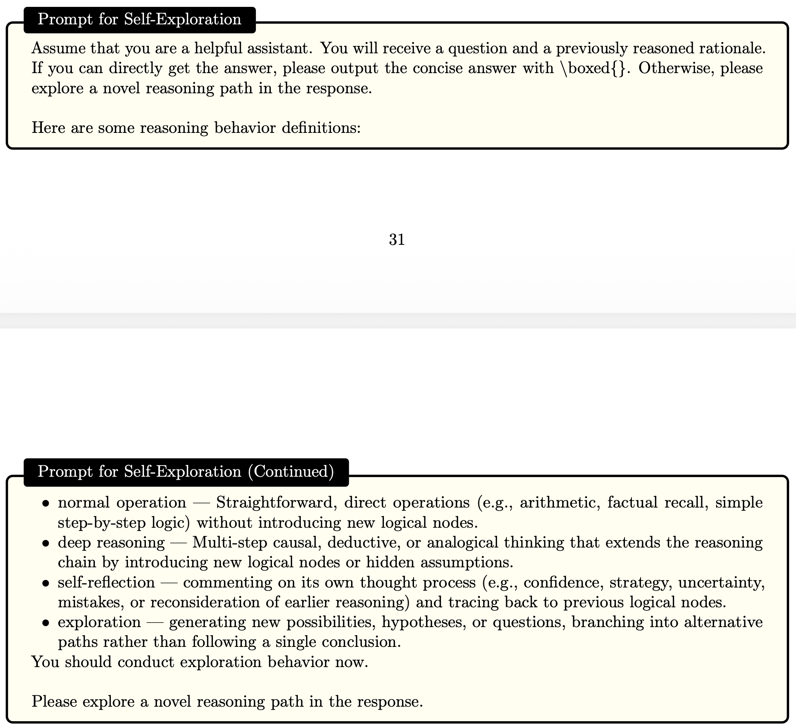

### MoleSyn으로 생성한 데이터의 타당성

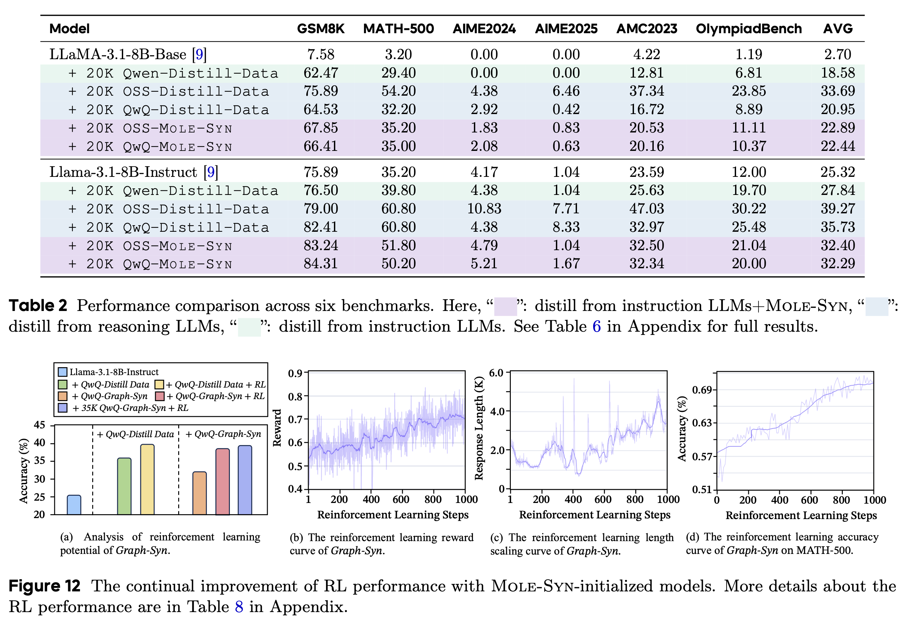

MoleSyn으로 생성한 데이터를 활용해서 베이스 모델들에 SFT와 RL를 적용했다.
- teacher model의 trajectory로 distillation한 결과와 유사한 성능 향상을 보이며, MoleSyn의 타당성을 증명 (Table 2)
- MoleSyn 데이터로 학습된 모델들에 대해 RL 적용, 꾸준한 성능 향상을 보이며 효율성을 증명 (Fig. 12)

> **궁금한 점**  
teacher model의 reasoning step transition distribution을 위해 teacher model로부터 2만 개의 trajectory를 추출하는데, 이렇게 생성한 데이터로 distillation을 한다면 오히려 비용이 더 들게 되는 것 아닌지?  
→ 차라리 MoleSyn 방식으로 벤치마크 데이터셋에 대한 성능 검증 결과가 궁금함.

## 성능 저하를 일으키는 변형된 구조들

### Isomers

> 이성질체라고 표현했는데, 동일한 요소(DR, SR, SE)를 다른 구조로 연결했을 때도 성능이 좋을지를 분석했다.

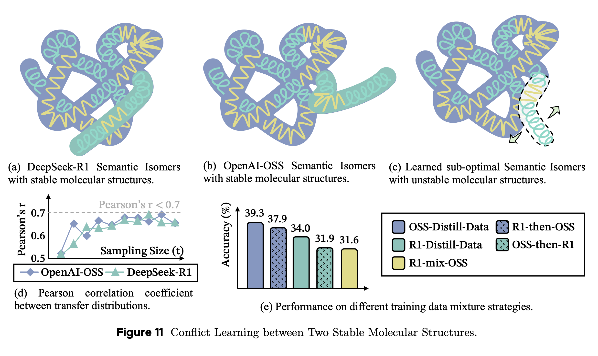

LongCoT의 reasoning structure에서 같은 구성 요소(DR, SR, SE)들을 갖고 있더라도, 다른 방식으로 조합되면 성능 저하를 발생시킨다.  
- Fig. 11처럼 R1과 OSS의 reasoning structure를 섞어서 학습햇을 때, Fig. 11-c와 같은 형태가 될 수 있다.  
- Fig. 11-e를 통해 두 가지 모델을 합쳐서 학습했을 때 성능 저하를 확인할 수 있다.  

> **궁금한 점**  
- semantic isomer에 대해서 설명할 때 수용 가능한 특정 분포 내에 위치한 reasoning들을 말한다고 했는데, reasoning structure을 알 수 있는 분포를 수식이나 figure들이 있을까?
- strong reasoning model의 LongCoT는 유사한 transfer table을 갖기 때문에 공통적인 구조가 존재한다고 이해했는데, 이 실험을 통해서라면 모델마다의 reasoning pattern이 다른 듯하다. 그 차이점이 무엇인지 궁금하고, 왜 성능 저하를 발생시키는지 궁금하다.
  - 단순히 구조만 섞인 게 아니라 서로 관련 없는 추론들이 섞인 것은 아닐까?

### Deteriorated Molecular Structure

LongCoT의 reasoning structure를 원상태로 유지하지 않고, compression(Table 3)하거나 summarize(Table 4) 방식은 distillation 시 성능 저하를 일으킨다.

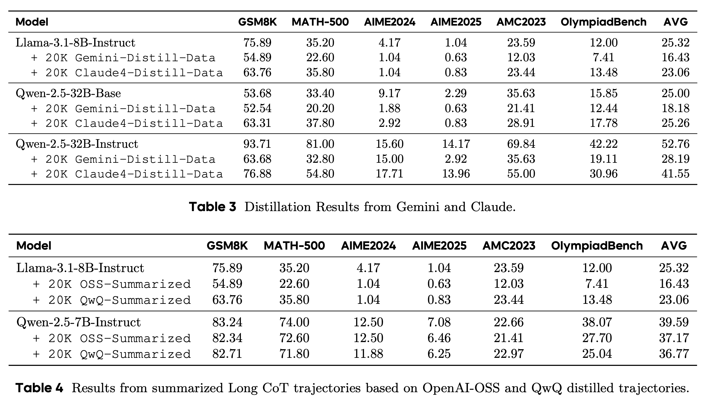

특히, Table 3에 나타난 private model들의 distillation에 대해서, private model들은 reasoning 과정을 전부 보여주는 것이 아니라 compression해서 제공하기 때문에, 허용되지 않은 distillation을 막을 수 있다고 한다.

## Comment

이 논문의 핵심 기여는 LongCoT를 구조적으로 정리하여 핵심 요소들을 파악하고, transfer table로 그 요소들의 조합 사이의 규칙을 파악했다는 점이라고 생각한다. 특히 reasoning step 간의 transition distribution이 강력한 reasoning 모델들 사이에서 높은 상관관계를 보인다는 관찰을 통해 공통적인 특징을 공유한다는 발견 또한 강력한 LongCoT reasoning을 만들 수 있는 방법을 발견했다는 점에서 핵심적인 실험이었다고 생각한다.  
다만, reasoning structure를 학습한다는 주장을 실험적으로 검증하는 방식에는 아쉬움이 남는다. Fig. 6에서는 특정 단어를 제거해도 성능이 유지된다는 결과를 통해 keyword imitation이 아님을 주장하지만, 정말로 structure를 학습했는지 확인하려면 distilled model의 transition distribution이 teacher와 얼마나 유사한지를 직접 비교하는 실험이 더 설득력 있었을 것 같다.  
또한 attention score를 bond energy에 대응시키는 분석은 흥미롭지만, attention이 reasoning의 신뢰도(confidence)나 타당성을 반영한다고 보기에는 해석이 다소 과감해 보인다. 특히 Self-Exploration 단계는 의도적으로 불확실성을 포함하는 과정인데, 이를 낮은 bond energy로 해석하는 것이 reasoning 품질과 어떻게 연결되는지가 추가적으로 궁금했다.
MoleSyn은 비용 효율적인 LongCoT 생성이라는 실용적 동기를 잘 포착한 방법론이지만, teacher model로부터 대규모 trajectory를 먼저 추출해야 하며 레이블링과 같은 과정이 오히려 추가로 포함된다는 점에서 해당 방법론에 제안에 대한 동기와 맞지 않는다고 느꼈다. 개인적으로는 MoleSyn으로 생성한 CoT만을 사용해 zero-shot 또는 few-shot reasoning 성능이 어디까지 가능한지가 더 궁금하다.