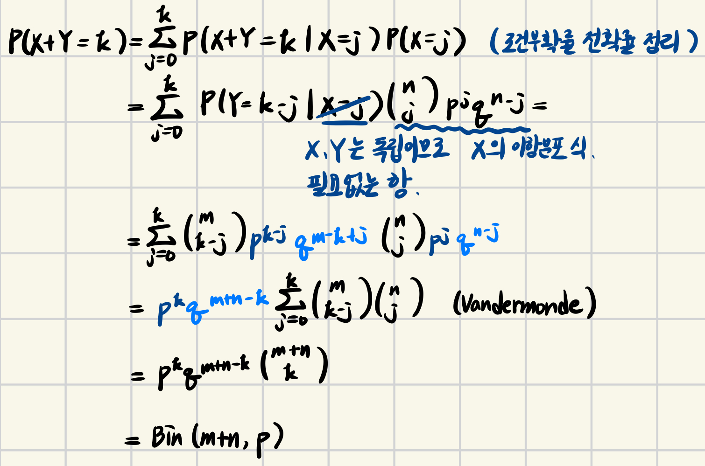

> 이 포스팅은 Harvard에서 진행된 Joe Blitzstein의 Statics 110 강좌를 기반으로 작성되었습니다.  
- [강의 및 자료 링크](https://stat110.hsites.harvard.edu)

### Binomial distributions $Bin(n,p)$

(1) story: $X$ is a #. of successes in $n$ independent $Bern(p)$ trials, where $p$ is a probability of success.  
(2) sum of indicator random variables (지시확률변수)):  

$$
X = X_1 + X_2 + \dots + X_n, X_j = \begin{cases} 1 \text{, if j-th trial succeeds} \\
0 \text{, otherwise.} \end{cases}
$$

(2)는 (1)을 수식화한 것과 같다. 또한, $X_1, \dots, X_n$를 i.i.d. $Bern(p)$라고 표현하는데, i.i.d.란, indep., identically distribution을 뜻한다.

(3) PMF: $P(X=k) = \binom{n}{k}p^kq^{n-k}, \ q=1-p$

### Cumulative Distribution Function (CDF)

> R.V.s: Random Variables

$X \leqslant x$ is an event.  
If $F(x) = P(X \leqslant x)$ then, $F$ is the `CDF` of $X$.  

### Probability Mass Function (PMF) for discrete r.v.s

- discrete: possible values $a_1, a_2, \dots, a_n$ or $a_1, a_2, \dots$ (유한하거나 무한한 정수값을 가지는 것)  

`Defn.` $P(X=a_j)$ for all $j$.  
$P(X=a_j) = p_j$ 라고 할 때, $p_j \geqslant 0, \ \sum_jp_j = 1$를 만족한다.  

> PMF는 정수를 나타내는 이산확률변수에서만 가능하기 때문에 일반적으로는 CDF가 더 유용할 수 있으나, 이산확률변수인 경우에는 PMF가 구하기 더 쉬운 경우가 많다.

**[PMF 식이 옳은지 증명]**  

$$
P(X=k) = \binom{n}{k}p^kq^{n-k}, \ q=1-p, \ k \in \{0, 1, \dots, n\}
$$

- $\binom{n}{k}p^kq^{n-k} \geqslant 0$ 는 명백함
- $\sum_j \binom{n}{k}p^kq^{n-k} = (p+q)^n = 1^n = 1$ (이항정리에 의해 증명)

**[독립인 두 PMF의 합]**  

$$
X \sim Bin(n, p), \ Y \sim Bin(m, p) \ \text{indep.} \Rightarrow X+Y \sim Bin(n+m, p)
$$

(1) immediate from story: 첫 $n$개는 $X$의 성공 횟수, 이후 $m$개는 $Y$의 성공 횟수  
(2) 지시확률변수: $X = X_1 + X_2 + \dots + X_n, \ Y = Y_1 + Y_2 + \dots + Y_m \Rightarrow X + Y = \sum_j^n X_j + \sum_j^m Y_j$  
sum of $n+m$ i.i.d. $Bern(p) \Rightarrow Bin(n+m, p)$  
(3) PMF

### PMF에 대해 흔히 하는 실수 

> 이항분포가 아닌데 이항분포라고 생각하는 경우  

**[Example 1]** 5 card hand, find distribution of #. Aces.  
CDF를 구할 수도 있지만, Ace의 개수는 0, 1, 2, 3, 4이므로 이산적이기 때문에 PMF를 구하는 것이 더 편하다.  

Let $X = (\text{\#. aces})$, Find $P(X=k)$. (This is 0 except if $k \in \{0,1,2,3\}$)  

Not Binomial 증명  
(1) story: 다섯 장의 카드 각각이 독립이 아니기 때문이다. 처음 두 장이 에이스인 경우, 다음 세 장이 에이스일 확률이 달라진다.  
(2) PMF처럼 일단 구해보자.  

$$
P(X=k) = \frac{\binom{4}{k}\binom{48}{5-k}}{\binom{52}{5}}, \ \text{for } k \in \{0, 1, \dots, 4\}
$$

**[Example 2]**  

**[Example 3]**  

$b$ 개의 검은 구슬, $w$ 개의 흰색 구슬 중에 $n$ 개를 뽑았을 때, 흰색 구슬이 나올 확률 분포를 구하여라.  
$X$ = (#. of white marbles)

$$
P(X=k) = \frac{\binom{w}{k}\binom{b}{n-k}}{\binom{w+b}{n}}, \ 0 \leqslant k \leqslant w, \ 0 \leqslant n-k \leqslant b
$$

`Hypergeometric(초기하분포)` **복원을 하지 않은 추출**이기 때문에 각 시행이 독립이 되지 않는다. 따라서, 일반적인 PMF와 다르다.  
→ 표본공간이 충분히 커서 복원 여부가 확률에 영향을 미치지 않을 정도로 작을 때, 초기하분포는 이항분포에 근사한다.  

**[유효한 PMF인지 확인]**  

- $\displaystyle P(X=k) = \frac{\binom{w}{k}\binom{b}{n-k}}{\binom{w+b}{n}}$ 는 음수가 아님
- $\displaystyle \sum^w_{k=0} \frac{\binom{w}{k}\binom{b}{n-k}}{\binom{w+b}{n}} = \frac{1}{\binom{w+b}{n}} \sum^w_{k=0} \binom{w}{k}\binom{b}{n-k} = 1 \ \text{(by Vandermonde)}$  

### CDF $P(X \leqslant x)$ 함수의 형태   

**[continuous variables]**  

**[discrete variables]**  

