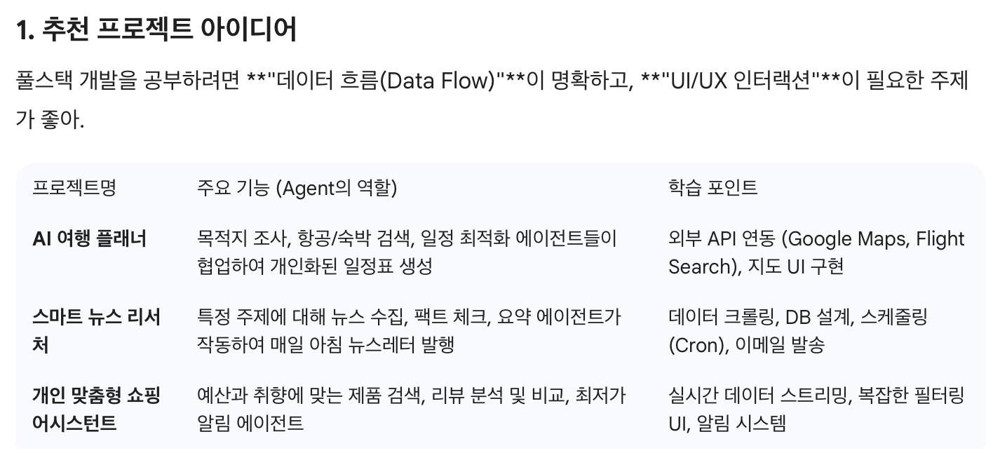
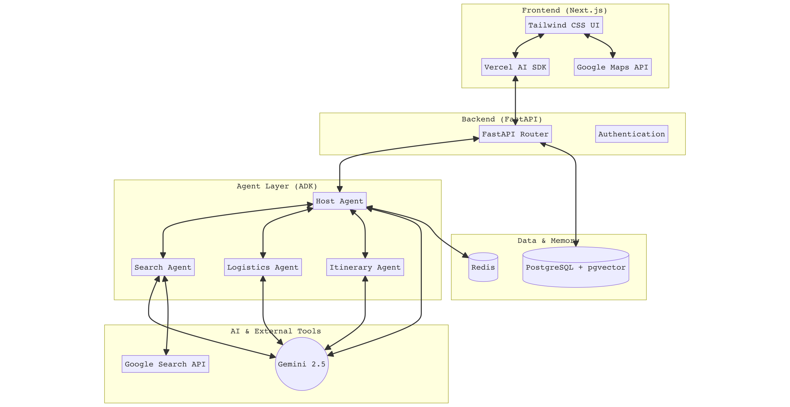
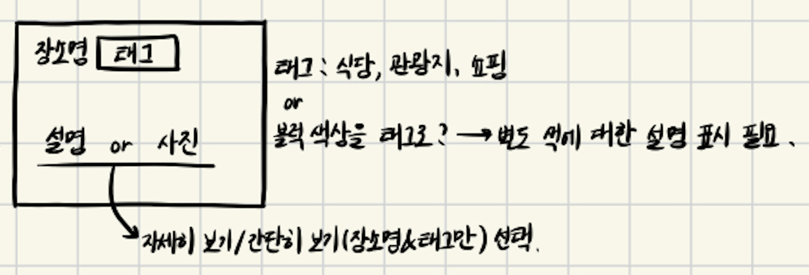

> 논문 보고 강의 듣는 이론 공부만 하다가는 개발에 대해서는 똥손이 될 것 같아 토이 프로젝트를 하나 진행해보려고 한다.  
AI를 공부하고 있는 만큼 화두인 agent를 활용하고자 Google의 ADK를 활용할 수 있는 풀스택 개발을 해보고자 하는데, 얼만큼 잘 진행될지는 미지수...  
개발 흐름을 익히고자 하는 것이라 바이브 코딩으로 도전해보고자 한다.
(그리고 포스팅 제목은 언제 바뀔지 모릅니다 ㅎㅅㅎ)  

## 1. Ideation

### 주제 선정

Google의 ADK를 활용할 예정이기 때문에 Gemini를 활용해서 아이디에이션을 해봤다.  
공부용이기 때문에 특별한 것보단 참고 자료가 많은 것이 좋을 것 같아 AI 여행 플래너를 선택했다.  
(사실 내가 여행 가고 싶기도 해서 ㅠㅠ)

<div align="center">

</div>

### 프레임워크 선정

`Frontend`  
- Next.js (TypeScript): 사실상 프론트의 표준처럼 됐다고 하는데, 개발하면서 공부해도록 하자.
- Tailwind CSS: 반응형 웹을 만들기 편하다고 한다. 이것도 개발하면서 공부해보도록 하자.
- Vercel AI SDK: AI 스트리밍 응답을 구현할 때 유용하다고 한다. 여기까지 쓸 수 있을지는 모르겠다.  

`Backend`
- ADK: 핵심!
- FastAPI: 파이썬 기반의 백엔드 프레임워크로, 비동기 처리에 강하다.

`Database & Tooling`  
- PostgreSQL: 사용자 정보 저장과 함께 벡터 검색이 가능하여 RAG를 사용할 수 있다.  
- Redis: agent 대화 컨텍스트 즉, 메모리를 임시 저장하는 용도로 사용한다.

### Project Architecture

<div align="center">

</div>

`Frotend ↔ Backend`  
- 프론트에서 사용자가 백엔드로 요청을 보내면 FastAPI를 통해 DB 또는 Agent로 처리할 요청을 전달한다.  

`Agent Layer (ADK) & `AI & External Tools``  
- 사용자가 전송한 요청을 받으면 orchestrator가 호출할 tool을 결정한다.  
- 방문할 장소 등에 대해 구글 검색을 하거나, Gemini를 호출해서 일정을 조정하는 등의 작업을 수행한다.
  - Ex. 식당들을 검색해온 뒤 사용자와 상호작용 하며 방문할 장소와 일정을 조율한다.
- 사용자의 대화 컨텍스트를 `Data & Backend`의 Redis를 활용해 저장한다.  
  - 우선 기본 틀을 개발해놓고, 메모리 관리 전략을 추후에 적용해볼 수도 있을 것 같다.  

`Data & Memory`  
- 사용자의 기본 정보, 사용자의 여행 플랜 등을 DB에 저장한다.
- Redis는 위에서 언급했으니 패스

## 2. 주요 기능 구체화

> 회원가입, 로그인, 사용자 정보 조회 등 기본 기능은 제외하고 주요 기능만 구상해봤다.

`기능 1` 대화형 여행 생성
- agent와 사용자가 실시간으로 대화하며 여행 일정을 수립한다.
- agent가 수집할 정보: 여행 날짜, 여행 취향 → 사용자의 해당 여행 DB에 저장
  - 여행 취향: 관광 vs. 휴식, 식도락 vs. 쇼핑

> 수집할 정보와 사용자의 취향에 대한 파악은 추후 확장 가능성이 있다.

`기능 2` 장소 추천 및 선택
- (1) 수집하여 저장한 정보를 활용해서 장소들을 추천한다.
  - 추천 포인트
    - 관광 선호: 관광지, 액티비티 등 활동적인 장소
    - 휴식 선호: 일부 관광지, 온천 등 휴식할 수 있는 장소
    - 식도락 선호: 유명한 식당과 디저트 카페 등 음식과 관련된 장소
    - 쇼핑 선호: 일부 식당과 백화점, 아울렛 등의 쇼핑몰 (관광객들이 기념품으로 많이 사가는 장소를 찾을 수 있으면 좋을 듯함)
  - 장소 탐색 시 알고리즘에 대해서 생각해봐야 한다.
  - 항목별로 다른 색과 아이콘을 적용해서 지도에 띄워준다.

> 지도뷰 말고 리스트형 뷰로도 확장 가능하다.

- (2) 추천 장소들로부터 사용자가 원하는 장소들을 선택한다.
  - 이 단계는 스킵 가능하다. 이 때는 AI가 적절한 장소들을 임의로 선택한다.

> 추천 장소로부터 또 추천하는 항목들을 선택하는 알고리즘이 필요할까?

`기능 3` 동선 및 일정 계획
- 선택한 항목들을 바탕으로 날짜별로 동선과 일정을 계획한다.
- 최적 루트 알고리즘 or 생성형 AI 사용에 대한 확인이 필요하다.
- 지도뷰와 리스트뷰를 제공한다.
  - 지도뷰: 날짜별로 다른 색을 사용하고, 항목별로 다른 아이콘을 사용해서 동선을 그려준다.
  - 리스트뷰: 날짜별로 방문할 장소들을 블록형으로, 시간 순서대로 보여준다.  
    - 사용자가 드래그 앤 드롭으로 순서를 바꿀 수 있다.
    - 아래와 같은 형태의 블록을 사용한다. 이때 어떤 장소인지를 태그로 부착할지, 블록의 색으로 표현할지는 만들어보고 더 예쁜 걸 써보자.

<div align="center">

</div>

> 일정을 바꿨을 때 저장 버튼이 활성화되는 반응형 UI/UX가 가능할까?

`기능 4` 나의 여행 확인하기
- 사용자의 마이페이지처럼 `기능 1`~`기능 3`에서 계획한 여행을 확인할 수 있는 페이지이다.
- 여행 제목은 `[여행 시작일(YY-MM-DD)] 여행 장소`를 디폴트로 하고, 추후 변경 가능하게 수정해보자.
- `기능 3`에서 완성된 뷰를 그대로 사용할 수 있도록 해보자.
  - 리스트뷰에서 수정 또한 가능하게 해보자.

## 3. API 명세서

> 우선 여기에 구상하며 작성해두고, Notion Database를 하나 파야겠다.

### `기능 1` 대화형 여행 생성  

(1) 대화 시작  

**Endpoint**: `POST /api/v1/chat` (api를 호출할 것이며, 첫 번째 버전임을 표시하기 위해 /api/v1 사용)  
**Description**: ADK를 활용해서 사용자와 여행 일정에 관련 대화를 한다. 실시간으로 답변을 스트리밍 하며, 여행에 대한 정보가 파악되면 세션에 임시 저장한다.

**Request Body**  

| 필드명 | 타입 | 필수 | 설명 |
| :--- | :--- | :---: | :--- |
| messages | Array | O | 이전 대화 내역 (Role: 'user'/'assistant') |
| sessionId | String | O | 대화 세션을 식별하기 위한 ID (Redis 캐싱용) |

**Response**  
- Type: text/event-stream (Vercel SDK의 실시간 스트리밍을 위한 타입이다.)
- Content: agent가 생성하는 텍스트 청크 및 중간 과정(Tool Call 등)

---

(2) 정보 저장: 대화가 충분히 진행되어 여행 날짜와 취향을 모두 파악했을 때, 사용자가 "이대로 생성해줘"라고 말했을 때 수행

**Endpoint**: `POST /api/v1/travel/init`  
**Description**: 파악된 정보를 기반으로 PostgreSQL에 새로운 여행 레코드를 생성한다.  

**Request Body**  

| 필드명 | 타입 | 필수 | 설명 |
| :--- | :--- | :---: | :--- |
| userId | String | O | 사용자 식별자 |
| destination | String | O | 목적지 (예: "제주도", "파리") |
| startDate | String | O | 여행 시작일 (YYYY-MM-DD) |
| endDate | String | O | 여행 종료일 (YYYY-MM-DD) |
| preferences | Object | O | 여행 취향 데이터 (확장 가능한 구조) |
| preferences.activity | String | O | 관광(Sightseeing) vs 휴식(Relax) |
| preferences.focus | String | O | 식도락(Food) vs 쇼핑(Shopping) |

**Response (201 Created)**  

```JSON
{
  "travelId: "uuid-1234-5678",
  "status": "initialized",
  "message": "여행 기본 정보가 성공적으로 저장되었습니다."
}
```

---

(3) 저장된 정보 확인

대화 중에는 해당 대화 창을 참고하면 되고, 이후에는 DB에 저장된 정보를 '펼쳐서 확인'과 같은 형태로 제공한다.  
현재 단계에서 별도로 확인 페이지를 만들지 않는 이유는, 수집한 정보가 간단하기 때문에 굳이 조회의 의미가 없기 때문이다.  
다만, 추후에 수집 항목과 정보들이 다양해지면 기능을 확장하도록 한다.  

### `기능 2` 장소 추천 및 선택

(1) 취향 기반 장소 추천 목록 조회

**Endpoint**: `GET /api/v1/travel/{travelId}/recommendations`  
**Description**: 저장된 여행 정보를 바탕으로 에이전트 추천 장소 리스트를 생성한다.  

**Response**  

```JSON
{
  "recommendations": [
    {
      "placeId": "google-chIJ-...", 
      "name": "에펠탑",
      "category": "관광", // 프론트에서 이 값에 따라 아이콘/색상 변경
      "lat": 48.8584,
      "lng": 2.2945,
      "description": "파리의 상징적인 랜드마크입니다.",
      "tags": ["랜드마크", "야경"],
      "matchScore": 0.98 // 사용자 취향과의 일치도
    },
    {
      "placeId": "place-002",
      "name": "라파예트 백화점",
      "category": "쇼핑",
      "lat": 48.8737,
      "lng": 2.3320,
      "description": "기념품 쇼핑에 최적화된 백화점입니다.",
      "tags": ["기념품", "명품"],
      "matchScore": 0.73
    },
    ...
  ]
}
```

---

(2) 사용자가 선택한 장소 저장

**Endpoint**: `POST /api/v1/travel/{travelId}/select-places`  
**Description**: 사용자가 직접 선택한 장소 목록을 저장한다. 만약 빈 배열을 보내면 agent가 알아서 최적의 장소를 선택하는 로직으로 넘어간다.  

**Request Body**  

| 필드명 | 타입 | 필수 | 설명 |
| :--- | :--- | :---: | :--- |
| selectedPlaceIds | Array<String> | O | 사용자가 선택한 장소 ID 리스트 (빈 배열 가능) |

**Response (200 OK)**  

```JSON
{
  "status": "success",
  "isAutoSelected": false, // 빈 배열일 경우 true로 반환
  "count": 5,
  "message": "선택된 장소들이 여행 일정 후보에 등록되었습니다."
}
```

### `기능 3` 동선 및 일정 계획

(1) 일정 자동 생성

**Endpoint**: `POST /api/v1/travel/{travelId}/itinerary/generate`  
**Description**: agent가 이동 거리와 장소의 특성을 고려하여 최적의 타임라인을 생성한다.  

**Response (200 OK)**  

```JSON
{
  "itinerary": [
    {
      "day": 1,
      "date": "2026-05-10",
      "color": "#FF5733", // 날짜별 테마 색상
      "schedule": [
        {
          "order": 1,
          "time": "10:00",
          "placeId": "place-001",
          "name": "에펠탑",
          "category": "관광",
          "lat": 48.8584, "lng": 2.2945
        },
        {
          "order": 2,
          "time": "13:00",
          "placeId": "place-002",
          "name": "현지 맛집",
          "category": "식도락",
          "lat": 48.8600, "lng": 2.3000
        }
      ]
    }
  ]
}
```

---

(2) 일정 수정 및 저장  

**Endpoint**: `PUT /api/v1/travel/{travelId }/itinerary`  
**Description**: 변경된 순서와 시간 정보를 DB에 저장한다.  

**Request Body**  

| 필드명 | 타입 | 필수 | 설명 |
| :--- | :--- | :---: | :--- |
| itinerary | Array | O | 전체 날짜별 수정된 일정 리스트 |

**Response (200 OK)**  

```JSON
{
  "status": "success",
  "message": "일정이 성공적으로 업데이트되었습니다."
}
```

### `기능 4` 나의 여행 확인하기  

(1) 내 여행 리스트 조회  

**Endpoint**: `GET /api/v1/travels`  
**Description**: 현재 로그인한 사용자의 전체 여행 목록을 최신순으로 반환  

**Response**  

```JSON
{
  "travels": [
    {
      "travelId": "uuid-123",
      "title": "[26-05-10] 파리", // 디폴트 제목
      "destination": "파리",
      "startDate": "2026-05-10",
      "endDate": "2026-05-15",
      "status": "completed" 
    },
    ...
  ]
}
```

---

(2) 여행 제목 수정  

**Endpoint**: `PATCH /api/v1/travel/{travelId}/title`
**Description**: 특정 여행의 제목만 업데이트함.

**Request Body**

| 필드명 | 타입 | 필수 | 설명 |
| :--- | :--- | :---: | :--- |
| title | String | O | 새로운 여행 제목 (예: "가족과 함께하는 프랑스 여행") |

---

(3) 여행 상세 정보 조회  

**Endpoint**: `GET /api/v1/travel/{travelId}/full-details`
**Description**: 여행의 메타데이터 + 선택한 장소 + 날짜별 일정(Itinerary) 정보를 한 번에 가져와서 화면을 그려준다.  

> 상세 정보 조회 시에는 기능 3에서 만들어둔 페이지를 그대로 불러오도록 한다.

## 다음 할 일

- DB 아키텍처 설계
- 프로젝트 생성, 환경설정 해두기