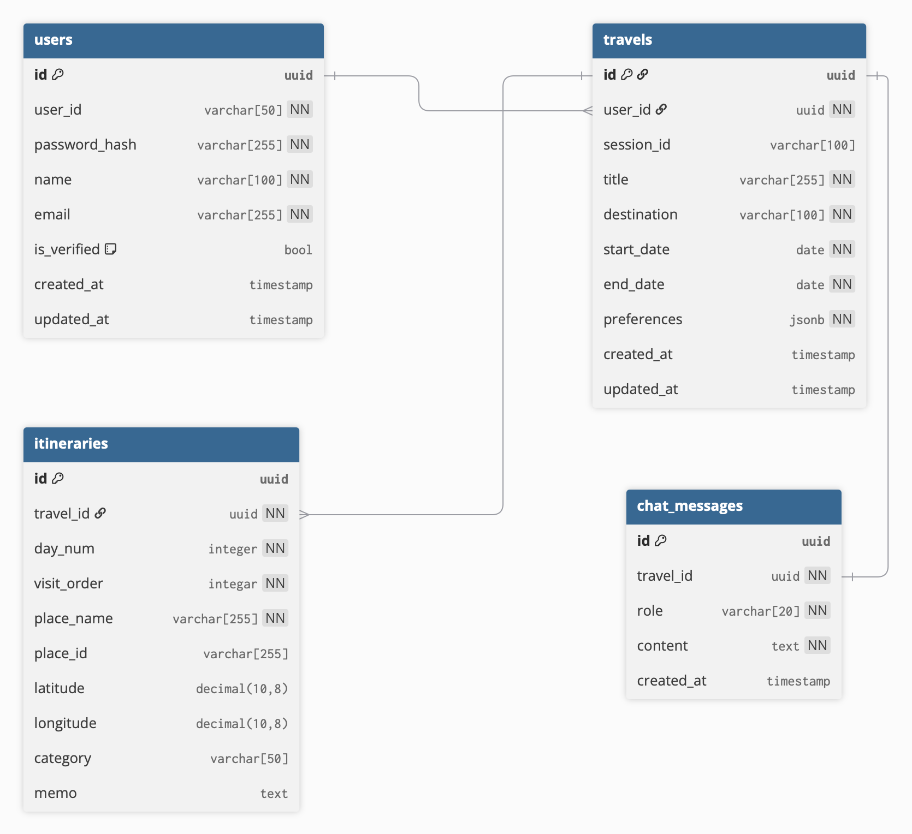
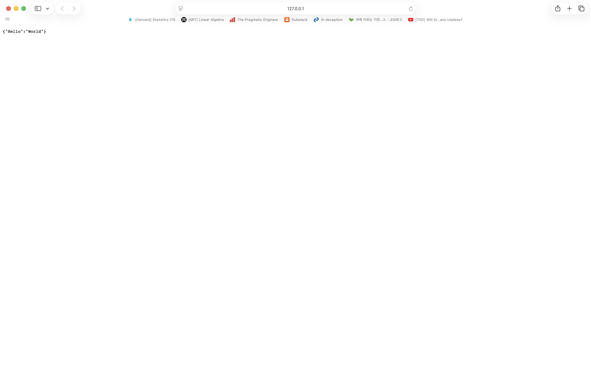
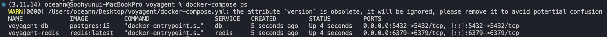
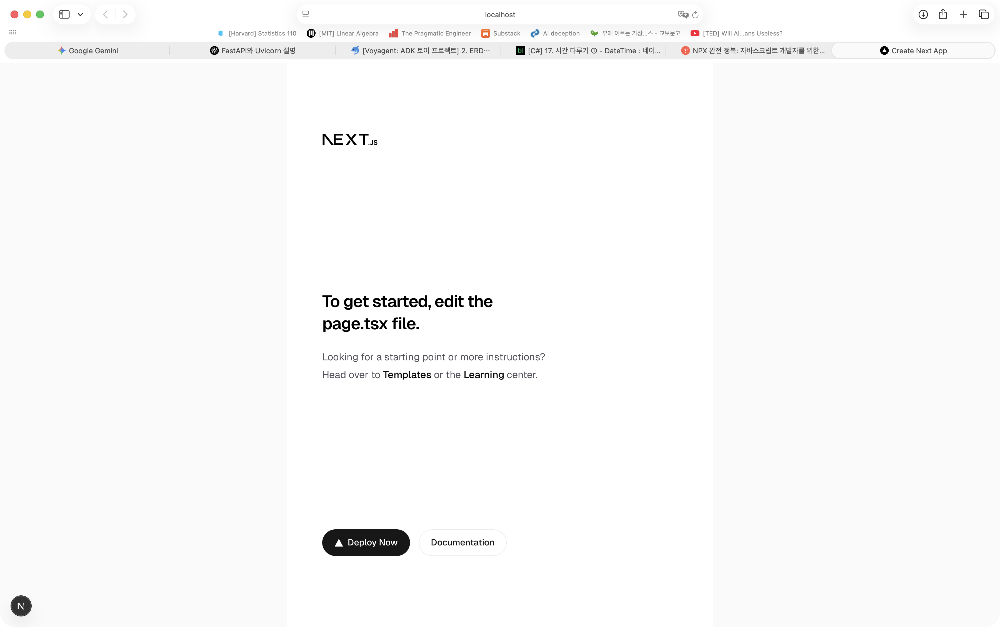

# 1. ERD 설계

초기 설정이므로 간단하게만 구상해보도록 하자.  
- `users`: 회원가입, 로그인, 마이페이지 등에 사용할 테이블
- `travels`: 사용자의 여행과 해당 여행의 취향을 저장하는 테이블
- `itineraries`: 해당 여행의 일정들을 저장하는 테이블

<div align="center">

</div>

erd diagram에는 [dbdiagram.io](https://dbdiagram.io/home)을 활용했고, 코드는 아래와 같이 작성했다.  

<details>
<summary>ERD diagram 코드</summary>

<pre><code>
Table users {
  id uuid [primary key]
  
  user_id varchar[50] [not null]
  password_hash varchar[255] [not null]

  name varchar[100] [not null]
  email varchar[255] [unique, not null]

  is_verified bool [default: False]
  created_at timestamp
  updated_at timestamp
}

Table travels {
  id uuid [primary key]
  user_id uuid [not null]

  session_id varchar[100] // Redis에 저장된 agent와의 대화
  // chat_summary text

  title varchar[255] [not null]
  destination varchar[100] [not null]
  start_date date [not null]
  end_date date [not null]

  preferences jsonb [not null]

  created_at timestamp
  updated_at timestamp
}

Table itineraries {
  id uuid [primary key]
  travel_id uuid [not null]
  day_num integer [not null]
  visit_order integar [not null]

  place_name varchar[255] [not null]
  place_id varchar[255]
  latitude decimal(10, 8)
  longitude decimal(10, 8)
  category varchar[50]

  memo text
}

Table chat_messages {
  id uuid [primary key]
  travel_id uuid [not null]
  
  role varchar[20] [not null] // users, assistant
  content text [not null]
  created_at timestamp
}

Ref: users.id < travels.user_id
Ref: itineraries.travel_id > travels.id
Ref: chat_messages.travel_id - travels.id
</code></pre>

</details>

# 2. 프로젝트 환경설정

> 프로젝트 이름은 voyage와 agent를 결합하여 Voyagent로 정했다.

스터디용이기 때문에 관리의 편리함을 위해 프로젝트 폴더 하나에 frontend와 backend를 모두 넣어놨다.

## Backend

### (1) 백엔드 폴더 구조 설정

```
voyagent/
├── frontend/             # Next.js 프로젝트
├── backend/              # FastAPI 프로젝트
│   ├── app/
│   │   ├── api/          # API 엔드포인트 (v1/chat 등)
│   │   ├── core/         # DB 설정, 환경 변수
│   │   ├── models/       # SQLModel (Users, Travels)
│   │   ├── services/     # 비즈니스 로직
│   │   └── agents/       # ADK 관련 로직
│   │       ├── hotel_agent.py
│   │       ├── search_agent.py
│   │       └── coordinator.py
├── docker-compose.yml    # DB, Redis 실행
└── .gitignore            # venv, node_modules, .env 제외
```

### (2) pyenv 설치

나는 anaconda를 사용해서 파이썬 환경 관리를 했었는데 FastAPI는 무거운 가상환경을 쓸 필요가 없고, 다른 환경들도 사용해보고 싶었기 때문에 pyenv를 사용했다.

```bash
### pyenv 설치
brew update
brew install pyenv

### 쉘이 pyenv를 볼 수 있도록 설정해주기
echo 'export PYENV_ROOT="$HOME/.pyenv"' >> ~/.zshrc
echo '[[ -d $PYENV_ROOT/bin ]] && export PATH="$PYENV_ROOT/bin:$PATH"' >> ~/.zshrc
echo 'eval "$(pyenv init -)"' >> ~/.zshrc

### 설정 적용
source ~/.zshrc
```

### (3) 원하는 버전의 가상 환경 생성

```bash
### 3.11 설치 (자동으로 3.11.14가 설치된다)
pyenv install 3.11

### Voyagent/backend 폴더로 이동
cd path/to/Voyagent/backend

### 이 폴더에서만 3.11.14를 쓰도록 설정
pyenv local 3.11

### 가상환경 생성 (3.11.14 기반의 venv가 만들어짐)
python -m venv venv

### 가상환경 활성화
source venv/bin/activate
```

가상 환경을 생성했으면 아래 필수 모듈들을 설치한다.

```bash
pip install fastapi uvicorn sqlmodel
```

### (4) FastAPI 실행 확인

`voyagent/backend/app/main.py`를 만들고 아래 내용을 작성한다.

```python
# voyagent/backend/app/main.py

from fastapi import FastAPI


app = FastAPI(title="Voyagent Backend API")

@app.get("/")
def read_root():
    return {"Hello": "World"}
```

터미널에서 아래를 입력하여 실행해본다.

```bash
uvicorn app.main:app --reload
```

이제 127.0.0.1:8000에 접속해서 아래와 같은 화면이 뜨면 성공이다.

<div align="center">

</div>

> **[`FastAPI`와 `uvicorn`이란?]**  
> 
> `FastAPI`  
> 파이썬으로 REST API나 백엔드 서버를 개발할 수 있는 프레임워크이다. 비동기 처리를 지원한다.  
> 
> `Uvicorn`  
> FastAPI를 실행할 수 있는 서버이다. 즉, 클라이언트의 요청을 받고 WebApplicationServer에 전달해주는 역할을 한다.  
> ASGI 서버이기 때문에 비동기를 지원하고 HTTP와 WebSocket에 대한 처리가 가능하다.  
> Gunicorn과 같은 서버보다 가볍고 빠르다는 장점이 있다.  

> (WSGI는 동기 처리만 가능하기 때문에 요청 한 번에 하나의 함수만 처리할 수 있다. HTTP 처리밖에 할 수 없다.  
> Gunicorn은 대표적인 WSGI 서버인데, 멀티 프로세스 관리를 잘하기 때문에 ASGI 서버를 worker로 두어 관리할 수는 있다.)

## PostgreSQL과 Backend 연결

### (1) PostgreSQL 도커 띄우기  

PostgreSQL을 로컬에 깔지도 않았고 별로 깔고 싶지 않아서(?) 도커를 띄우기로 한다.  
나는 도커도 안 깔려있었기 때문에 [docker 설치 사이트](https://docs.docker.com/desktop/setup/install/mac-install/) 사이트에 들어가서 도커를 깔아줬다.  
도커를 잘 모르기 때문에 우선 recommended 설정으로 시작했고, 회원가입을 해준 뒤, 백그라운드에서 실행 가능하도록 설정해뒀다.  

> **[Docker란?]**  
> 코드, 라이브러리, 런타임, 설정 등 프로그램 실행 환경을 컨테이너(container)라는 단위로 패키징해서 실행하는 도구이다.  

이제 docker-compose.yml을 작성한다. docker-compose는 여러 개의 컨테이너를 한 번에 정의하고 실행할 수 있는 설정 파일이다. 나는 기본 DB와 채팅 기록을 저장할 수 있는 Redis를 띄워보도록 하겠다.  
여기서 참고할 부분은, `env_file`이라고 써있는 곳인데, `.env` 파일이 프로젝트 루트 경로에 있는 것이 아니라 `./backend`에 위치해 있기 때문에 해당 경로에 있는 `.env` 파일을 가져오기 위해 설정해둔 것이다.  
- 해당 `.env` 파일에서 POSTGRES_USER, POSTGRES_PASSWORD, POSTGRES_DB 정보들을 자동으로 인식하여 environment를 알아서 설정해준다.

```yaml
version: "3.8"

services:
  db:
    image: postgres:15
    container_name: voyagent-db
    restart: always
    env_file:
      - ./backend/.env
    ports:
      - "5432:5432"
    volumes:
      - ./postgres_data:/var/lib/postgresql/data

  redis:
    image: redis:latest
    container_name: voyagent-redis
    ports:
      - "6379:6379"
```

### (2) 컨테이너 실행  

이제 프로젝트 루트 경로로 이동해서 아래 명령어를 통해 컨테이너를 실행한다. `-d`는 백그라운드에서 실행하겠다는 명령어이다.

```bash
docker-compose up -d
```

순서대로 `docker-compose.yml` 읽기 → `env_file: ./backend/.env` 읽기 → 환경변수 로딩 → `postgre:15`, `redis` 없으면 이미지 pull → 컨테이너 생성 후 환경변수 주입 → 포트 바인딩 → 볼륨 마운트 → 백그라운드 실행 `-d`

이제 아래 명령어로 실행된 컨테이너를 확인해보자.

```bash
docker-compose ps
```

아래와 같이 STATUS에 Up이라고 뜨면 잘 된 거다.

<div align="center">

</div>

이 명령어 `docker exec -it voyagent-db psql -U voyagent_user voyagent_db`를 쳐서 아래와 같이 psql에 접속해볼 수도 있다.  
접속하면 명령어 입력 쪽에 `voyagent_db=#`과 같이 뜬다.

### (3) 테이블 설정  

먼저 models.py에 가장 일반적인 테이블인 user 테이블을 만들어보자.  
미리 만들어뒀던 ERD를 코드로 그대로 구현한다.

```python
# ./backend/app/models/user.py

from uuid import UUID, uuid4
from datetime import datetime, timezone, timedelta
from sqlmodel import SQLModel, Field
from typing import Optional


KST = timezone(timedelta(hours=9))  # 한국 표준시 (KST)

class User(SQLModel, table=True):
    # Primary Key로 UUID 사용
    id: UUID = Field(default_factory=uuid4, primary_key=True)  # default_factory: 실행 시점에 동적으로 값 생성

    user_id: str = Field(unique=True, index=True, nullable=False)
    password_hash: str = Field(nullable=False)
    name: str = Field(nullable=False)
    email: str = Field(unique=True, nullable=False)

    is_verifieid: bool = Field(default=False)  # default: 고정된 값
    created_at: datetime = Field(default_factory=lambda: datetime.now(KST))
    updated_at: Optional[datetime] = Field(default=None)
```

다음으로 서버를 실행할 때 table을 초기화하는 코드를 작성한다.  

```python
# ./backend/app/main.py

from fastapi import FastAPI
from app.core.db import init_db
from contextlib import asynccontextmanager

from app.models.user import User


@asynccontextmanager
async def lifespan(app: FastAPI):
    # 서버 시작 시 테이블 생성 (이미 있으면 생성 안 함)
    init_db()
    yield

app = FastAPI(title="Voyagent Backend API", lifespan=lifespan)

@app.get("/")
def read_root():
    return {"message": "Welcome to the Voyagent Backend API!"}
```

이때 `./backend/app/core/db.py`에서 `init_db` 함수를 호출하는데, 이게 db 초기화 함수이다. 그럼 `init_db` 함수를 만들러 가보자.  

```python
# ./backend/app/core/db.py

import os
from pathlib import Path
from dotenv import load_dotenv
from sqlmodel import create_engine, SQLModel, Session

from app.core.config import settings


# DB engine 생성 (echo=True를 통해 개발단에서 보내는 쿼리 로깅 가능)
engine = create_engine(settings.DATABASE_URL, echo=True)

def init_db():
    """DB 초기화 함수: 모델 기반으로 테이블 생성"""
    SQLModel.metadata.create_all(engine)

def get_session():
    """DB 세션 생성 함수: 의존성 주입에 사용, API에서 DB를 쓸 때 세션을 빌려줌"""
    with Session(engine) as session:
        yield session
```

이때 또 create_engine할 때 config에서 settings를 가져와 database_url을 가져오는 부분이 보인다.  
설정 단일화와 책임 분리를 위해 `config.py`도 만들어보도록 하자.  

```python
# ./backend/app/core/config.py

from pydantic_settings import BaseSettings, SettingsConfigDict
from pathlib import Path


class Settings(BaseSettings):
    # .env에 적은 변수명과 일치해야 함
    DATABASE_URL: str

    # backend/.env 파일을 찾도록 설정
    model_config = SettingsConfigDict(
        env_file=Path(__file__).resolve().parent.parent.parent / ".env",
        env_file_encoding="utf-8",
        extra="ignore",
    )

settings = Settings()
```

### (4) 서버 실행  

이제 main.py를 실행해서 table이 생성되는 것을 확인해보자.  

```bash
uvicorn app.main:app --reload
```

잊지 말고 backend 경로에서 실행하자.  
`docker exec -it voyagent-db psql -U voyagent_user -d voyagent_db`를 입력하면 psql에 접속할 수 있고, `\dt`를 입력하면 생성한 table이 보인다.  
`\d user`를 입력하면 생성한 column들과 그 특징이 보이고, `SELECT * FROM "user";`를 입력하면 테이블에 들어간 데이터를 확인할 수 있다(지금은 입력한 게 없으니 아무것도 없는 게 당연하다).

## Frontend

### (1) node 설치

난 npx, npm을 깐 적이 없기 때문에 brew로 설치해준다.  

```bash
# 설치
brew install node

# 설치 확인 (각각의 버전이 뜨면 성공)
node -v
npm -v
npx -v
```

### (2) 프로젝트 생성

프로젝트 루트 경로에서 아래를 실행한다.

```
npx create-next-app@latest frontend
```

### (3) .gitignore 정리

프로젝트를 생성하면 frontend 안에 .gitignore가 자동으로 생성되어 들어가있다. 나는 프론트엔드가 독립적인 프로젝트가 아니라 voyagent 루트 폴더 안에 있기 때문에 .gitignore를 정리해줘야 한다.  

내용을 긁어서 루트 경로 아래의 .gitignore에 붙여넣어주고 앞에 `frontend/`를 추가해준다.

### (4) 프론트엔드용 환경 변수 설정

`./frontend/.env.local`을 생성하고 아래 내용을 입력하여 backend api 주소를 넣어준다.  

```
NEXT_PUBLIC_API_URL=http://localhost:8000
```

### (5) 실행 확인

터미널에서 아래를 실행하고 http://localhost:3000에 접속하여 아래 이미지와 같은 화면이 뜨는지 확인한다.

```bash
npm run dev
```

<div align="center">

</div>

# 다음에 할 일

- 회원가입 구성해보기
- 나머지 테이블 생성 후 CRUD 만들기
- 프론트엔드 UI/UX 구상하기