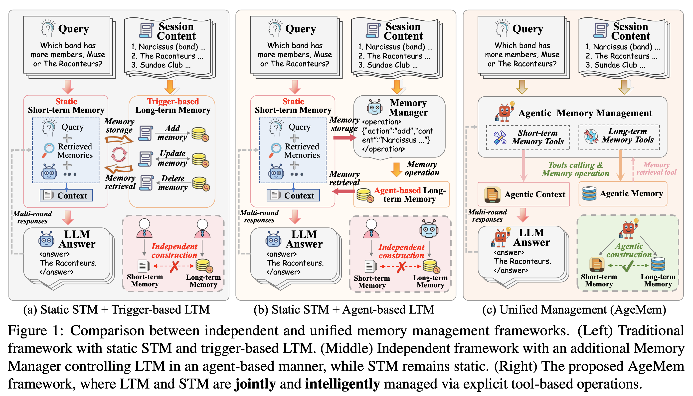
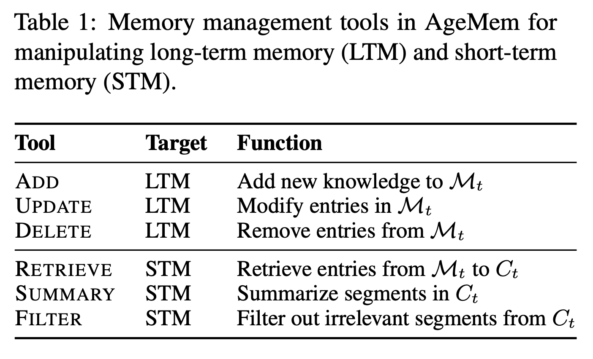

> **citation**  
Yu, Yi, et al. "Agentic Memory: Learning Unified Long-Term and Short-Term Memory Management for Large Language Model Agents." arXiv preprint arXiv:2601.01885 (2026).  
(Alibaba와 Yuhan Uiniversity에서 작성한 논문이다.)

논문 전체를 자세히 톺아보기 보다 agent의 장단기 메모리를 어떻게 통합적으로 관리하는지에 대한 방법론을 중점적으로 확인했다.  

## Problem Definition

### Agent의 메모리
- long-term memory (LTM): 사용자 또는 태스크에 특화된 데이터들을 저장한다.
  - 고퀄리티의 LTM은 축적된 지식의 효율적인 retrieval을 가능하게 한다.
- short-term memory (STM): 현재의 입력 맥락에 포함된 요소들을 저장한다.  
  - 불필요한 retrieval을 줄이고 맥락을 유지하는 역할을 한다.  

LTM과 STM은 함께 사용됐을 때 유한한 길이의 context window의 한계를 이겨낼 수 있고, agent의 복잡한 reasoning 성능을 보다 향상시킬 수 있다.

### 기존의 Agentic Memory 구조들

**[ STM 전략 ]**  
- 주로 RAG 기법을 사용
- 사전 정의된 규칙 기반으로 동작함

**[ LTM 전략 ]**  
- trigger-based: 사전 정의된 순간에 메모리 관리 동작이 실행됨
- agent-based: 메모리 관리 agent를 두어 언제 어떤 정보를 저장할지를 판단함

위 STM, LTM에 따라 기존의 메모리 관리 방식은 fig. 1에서 보는 것처럼 두 종류(a, b)의 agent로 구분된다.  
(a) static STM + trigger-based LTM  
(b) static STM + agent-based LTM  
두 방식 모두 STM과 LTM을 개별적으로 최적화한 뒤 통합하는 과정이기 때문에 long-horizon reasoning task의 상황에서 최적의 성능을 이끌어낼 수 없다.

### 통합 메모리 구조를 설계하기 위한 문제 정의

본 논문에서는 STM과 LTM을 통합적으로 관리하는 (c)와 같은 형태를 제안하며, 다음의 문제들을 해결한다.  

`(C1) functional heterogeneity coordination`  
LTM은 정보에 대해서 store, update, discard를 결정하며, STM은 현재 활성화된 맥락에 대해서 retrieve, summarize, remove할 사항들을 결정한다.  

`(C2) training paradigm mismatch`  
LTM과 STM 훈련 전략의 차이점
- LTM: 주로 상호작용이 시작되기 전에 이미 존재하는 세션 수준의 정보를 활용하여 학습
- STM: long-horizon을 시뮬레이션 하기 위해 인위적인 방해 요소를 주입하는 방식을 사용

표준 RL과 메모리 작업 간의 충돌
- 불연속적 경험: 메모리를 저장하고 탐색하는 작업은 파편화되어 있고, 불연속적인 경험을 만들어냄
- 최적화의 어려움: 표준 RL 방법들로는 end-to-end로 최적화하는 것이 어려움

`(C3) practical  deplyment constraints`  
외부 전문적인 모델에 의존하는 것 없이 하나의 agent에 메모리 구조를 통합하는 방법이 있어야 함

### AgenticMemory (AgeMem)

STM과 LTM을 agent의 의사결정 단계에 포함시킨다.  
세 단계의 RL 학습을 설계했으며, GRPO 방식을 사용했다.
- the model acquires LTM storage capabilities
- learns STM context management
- coordinates both forms of memory

## Method

STM과 LTM을 통합적으로 관리하기 위해 agent가 활용할 수 있는 tool들을 아래와 같이 설계했다.

> agent와 강화학습을 다루고 있기 때문에 수식 표기는 아래 접힌 내용을 참고하면 좋을 것이다.

Problem Formulation

**[Unified RL formulation for AgeMem]**

$$
\mathcal{T}: s_t = (\mathcal{C}_t, \mathcal{M}_t, \mathcal{T})
$$  

- $\mathcal{T}$: input query $q$, contextual information $I_q$, expected answer $A_q$
- $\mathcal{C}_t$: conversation context, a.k.a. short-term memory
- $\mathcal{M}_t$: long-term memory store

$s_t$가 주어지면, agent는 action $a_t \in A$를 선택하며, 결정은 다음과 같은 정책을 따른다.  

$$
\pi_\theta(a_t|s_t) = P(a_t|s_t;\theta)
$$

- $\theta$: LLM parameters  
- $a_t = \pi_{\theta}(\cdot \mid s_t)$  

누적되는 trajectory $\tau = (s_1, a_1, \dots, s_T, a_T)$에 대하여 아래와 같은 cumulative reward를 정의할 수 있다.

$$
R(\tau) = \sum w_i \cdot R_i(\tau) + P_{penalty}(\tau)
$$

- $R_i$: task performance, memory quality 평가
- $P_{penalty}(\tau)$: redundant storage, excessive tool usage, uncontrolled context expansion에 패널티 부여

목적 함수는 다음과 같으며, memory 관리를 사람이 수동적으로 관리하는 것이 아니라, agent의 정책 중에 하나로 통합시킨 것이다.

$$
\theta^* = \arg\max_{\theta} \mathbb{E}_{\tau \sim \pi_\theta}[R(\tau)]
$$

**[Three-stage trajectory structure]**  

long-horizon task에 대해 최적화하기 위해 각 trajectory $\tau$를 세 개의 step으로 쪼갰다. 각각의 trajectory의 총 길이는 $T = T_1 + T_2 + T_3$이다. 

$$
\tau = (\tau^{(1)}, \tau^{(2)}, \tau^{(3)})
$$

`stage 1` LTM에 유용한 정보 저장  
`stage 2` 부적절하거나 관련 없는 정보를 제공함으로써 STM 관리를 효율적으로 수행해도록 함  
`stage 3` LTM과 STM을 적절히 결합해야 하는 task를 수행

각각의 trajectory를 수집하는 step에서는 아래와 같은 형태의 tuple을 experience로 정의한다.  

$$
e_t = (s_t, a_t, r_t, \log\pi_{\theta_{old}}(a_t \mid s_t))
$$

- $r_t$: 지연 보상을 위해 중간 단계에서는 0이지만, 최종적으로 계산되어 broadcasting된다.  
- $\log\pi_{\theta_{old}}(a_t|s_t)$: GRPO를 위해 이전 policy를 대상으로 log probability를 구한다.

### 3단계 학습 방식

`stage 1` LTM construction  
- agent가 일반적인 대화 상황 $I_q$에 노출되면, LTM($\mathcal{M}_t$)에 유용한 정보를 저장한다.
- 이때, short-term context($\mathcal{C}_t$)는 자연스럽게 발생하고, 해당 맥락에서 LTM-related tools를 호출할 수 있다.
- sub-trajectory $\tau_k^{(1)} = \{e_t\}_{t=1}^{T_1}$를 생성한다.

`stage 2` STM control under distractors  
- stage 1 이후 agent는 의미적으로 관련있지만, 부적절한 distractor들에 노출되며, 목표는 tool-based operation을 통해 적절한 STM control을 학습하는 것이다.
  - tool-based operation: filtering, summarizing Emd
- sub-trajectory $\tau_k^{(2)} = \{e_t\}_{t=T_1+1}^{T_1+T_2}$를 생성한다.

`stage 3` Integrated reasoning and memory coordination  
- agent는 적절한 추론과 효율적인 memory retrieval을 요구하는 query $q$를 입력받는다.
- $\mathcal{M}_t$로부터 적절한 메모리를 탐색해오고, context $C_t$를 적절히 관리하여 최종적으로 응답을 출력해낸다.  
- trajectory $\tau_k^{(3)} = \{e_t\}_{t=T_1+T_2+1}^{T}$를 생성한다.
  - LTM, STM의 통합적인 행동과 task의 응답을 내는 능력을 end-to-end로 평가할 수 있게 된다.  

최종적으로 complete trajectory $\tau_k^{(q)} = (e_1,e_2,\dots,e_T), \ T=T_1+T_2+T_3$를 생성해내며, GRPO에 사용된다. 본 논문에서는 trajectory들을 모아 배치로 작업했다고 한다.  

### Step-wise GRPO

각 태스크 $q$에 대해서 $G_q = \{\tau_1^{(q)}, \dots, \tau_K^{(q)}\}$는 병렬적으로 수집된 trajectory들이며, 각 trajectory마다 terminal reward $r_T^{(k,q)} = R(\tau_k^{(q)})$를 이끌어낸다. 각 리워드에 대해서 정규화하는 작업을 수행하여 아래와 같은 group-normalized advatage $A_T$를 얻게된다.

$$
A_T^{(k,q)} = \frac{r_T^{k,q} - \mu G_q}{\sigma G_q + \epsilon}
$$

이렇게 구한 그룹별 advantage는 stage 1, 2를 포함하여 해당 trajectory 전체 advantage를 대표하는 역할을 한다.
- 지연 보상 효과: stage 1, 2를 수행할 때와 초반 trajectory를 얻는 과정에서 즉각적으로 보상을 얻지 못하지만, 결과를 통해 이전의 행동들이 좋았는지, 나빴는지를 평가

이때 reward function은 아래와 같이 정의된다.

### Reward Function

$$
R(\tau) = \text{w}^T \cdot R + P_{penalty}
$$

- $w = [w_{task}, w_{context}, w_{memory}]^T$: 조정 가능한 가중치
- $R = [R_{task}, R_{context}, R_{memory}]$: 각각 task 수행, context(단기 메모리) 관리, 장기 메모리 관리에 해당
- $P_{penalty}$: context overflow, exceeding the interaction limits 등

**[Task Completion Reward $R_{task}$]**  
$S_{judge}(A_{pred}, A_q) \in [0, 1]$: LLM-as-a-Judge를 사용해서 task 정답 여부를 판단

**[Context Management Resard $R_{context}$]**  
아래 조건에 따라 STM 행동을 최적화한다.  
(i) 토큰 사용량을 측정하여 효율적인 메모리 관리를 도모  
(ii) 오버플로우를 막기 위해 빠른 filtering이나 summarization에 리워드를 제공
(iii) 주요 정보 보호를 위해 필요한 정보가 삭제되었을 때는 패널티 부여

**[Memory Management Reward $R_{memory}$]**  
아래 조건에 따라 LTM 행동을 최적화한다.  
(i) 메모리의 품질을 평가하기 위해 high-quality, reusable로 마킹된 메모리에 리워드를 제공  
(ii) 메모리 내 불필요한 정보를 막기 위해 유의미한 update, delete에 리워드를 제공  
(iii) LLM을 기반으로 retrieved memory와 query간의 유사도를 측정  
