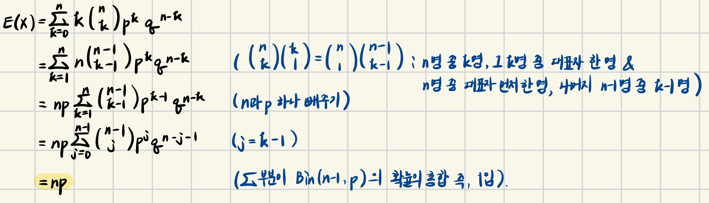
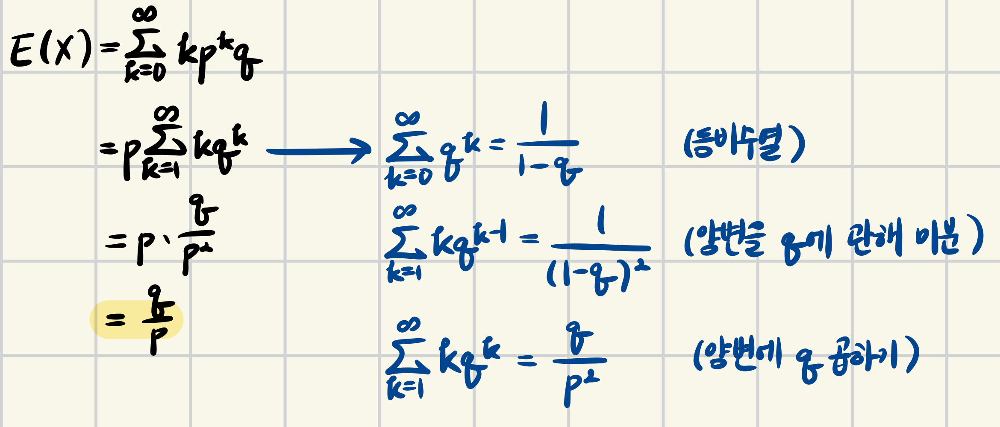

> 이 포스팅은 Harvard에서 진행된 Joe Blitzstein의 Statics 110 강좌를 기반으로 작성되었습니다.  
- [강의 및 자료 링크](https://stat110.hsites.harvard.edu)

## CDF (누적분포함수)  

$$ F(X) = P(X \leqslant x) \text{, as a function of real } x$$  

- $x=0$일 때 점의 위치가 $P(x=0)$
- 각 위치에서의 jump 간격이 각 값일 때의 확률이 된다.  

**[Example] Find $P(1 < X \leqslant 3)$ using $F$**  
$P(X \leqslant 1) + P(1 < X \leqslant 3) = P(X \leqslant 3)$  
$\Rightarrow P(1 < X \leqslant 3) = F(3) - F(1)$  

$$
\therefore P(a < X \leqslant b) = F(b) - F(a)
$$

### Properties of CDF (필요충분조건, if and only if)

(1) increasing  
(2) right continuous (우연속 계단 함수: 우극한을 가짐)  
(3) $F(X) \to 0$ as $X \to -\infty$, $F(X) \to 1$ as $X \to \infty$

## Independence of Random Variables  

`Defn.` $X$, $Y$ are indep. r.v.s. if $P(X \leqslant x, Y \leqslant y) = P(X \leqslant x)P(Y \leqslant y)$ for all $x$, $y$.

Discrete case: $P(X = x, Y = y) = P(X = x)P(Y = y)$  

## Averages (Means, Expected Values)  

**[Example] Find avg. of 1, 1, 1, 1, 3, 3, 5**  
(1) add, divide: $\displaystyle \frac{1+1+1+1+3+3+5}{8}$  
(2) use weighted avg.: $\displaystyle \frac{5}{8} \cdot 1 + \frac{2}{8} \cdot 3 + \frac{1}{8} \cdot 5$

$\frac{5}{8}$, $\frac{2}{8}$, $\frac{1}{8}$을 각각 가중치라고 부른다.

**[Avg. of a discrete r.v. $X$]**  

$$
E(X) = \sum_x xP(X=x)
$$

- summed over $x$ with $P(X=x) > 0$

### [Example 1] Bernoulli

**[일반화] $X \sim Bern(p)$에 대해**  

$$
E(X) = 1 \cdot P(X=1) + 0 \cdot P(X=0) = p
$$

**[예시] indicator r.v.에 대해**  

$$
X = 
\begin{cases}
1, \text{if A occurs} \\
0, \text{otherwise}
\end{cases}, \text{then } E(X) = P(A)
$$

> 교수님은 이를 fudamental bridge라고 부른다고 함 (종종 언급하심)

### [Example 2] Binomial Distribution

$X \sim Bin(n, p)$에 대해서,  

> 아래 Linearity 파트에 더 쉬운 방법도 있다.

### [Example 3] Hypergeometric

5 card hand, $X = (\text{no. of} \ aces)$. Let $X_j$ be the indicator of j-th card being an ace. ($1 \leqslant j \leqslant 5$)  

$$
\begin{align*}
E(X) &= E(X_1 + X_2 + X_3 + X_4 + X_5) && \text{(by indicator r.v.s)} \\
     &= E(X_1) + \cdots + E(X_5)      && \text{(by linearity)} \\
     &= 5 \cdot E(X_1)                && \text{(by symmetry)} \\
     &= 5 \cdot P(\text{1st card ace})&& \text{(by fundamental bridge)} \\
     &= \frac{5}{13}
\end{align*}
$$

even though $X_j$ s are dependet.  
This gives expected value of any Hypergeometric.

> Question  
indicator r.v.s로 나타낼 때 ace는 총 4개 있어서 모든 위치에 j=1부터 j=5까지 모든 위치에 ace가 있는 경우가 포함되진 않는지..?  

> Answer  
$X_j = 1$: j번째 카드가 ace  
$X_j = 0$: j번째 카드가 ace가 아님  
즉, $X = X_1 + X_2 + X_3 + X_4 + X_5$는 실제로 뽑힌 5장 중 ace의 개수를 세는 식이다.  
- 예를 들어, 4장의 ace가 나왔을 때, 이는 1+1+1+0+1처럼 표현할 수 있다.  
결국, 모든 위치에 ace가 있는 경우 즉, $P(X_1=1, X_2=1, ..., X_5=1) = 0$이 되기 때문에 그러한 경우가 포함되지 않는다.

### [Example 4] Geometric Distribution

**[Defn.]**  
$Geom(p)$: indep. $Bern(p)$ trials, count #. of failures before 1st success.  
Let $X \sim Geom(p), q = 1-p$.  

PMF: $P(X=k) = q^kp, \ k \in \{0, 1, 2, \dots \}$  
- 유효한 PMF인지 확인
- $\displaystyle \sum^{\infty}_{k=0}pq^k = \frac{p}{1-q} = 1$

**[Expectation]**  
(1) 수식 사용

(2) Story Proof  
Let $C = E(X)$.  
앞면이 나올 확률이 $p$인 동전을 반복해서 던지는 상황 가정  

$$
\begin{align*}
C &= 0 \cdot p + (1 + C) \cdot q \\
  &= q + Cq  \\
  &\Rightarrow C = \frac{q}{p}
\end{align*}
$$

## Linearity

(1) $E(X+Y) = E(X) + E(Y)$ even if $X$, $Y$ are dependent.  
(2) $E(CX) = CE(X)$ if $C$ is a constant.  

**[위 $Bin(n, p)$의 평균을 linearity로 증명]**  

$Bin(n, p)$는 <u>$n$개의 확률이 $p$인 Bernoulli 시행</u>을 했을 때의 분포이다.  
즉, 각각의 $Bern(p)$는 기댓값 $p$를 갖고있고, 총 $n$ 개가 있으므로, 총 기댓값은 $np$이다.  
(since $X = X_1 + X_2 + \cdots + X_n$, $X_j \sim Bern(p)$)