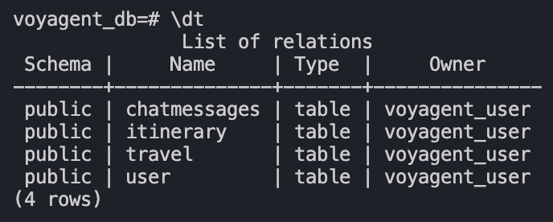
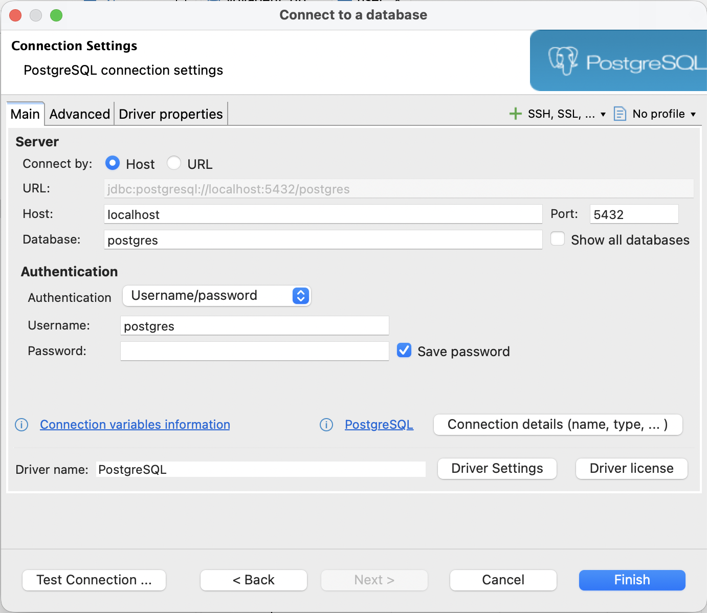
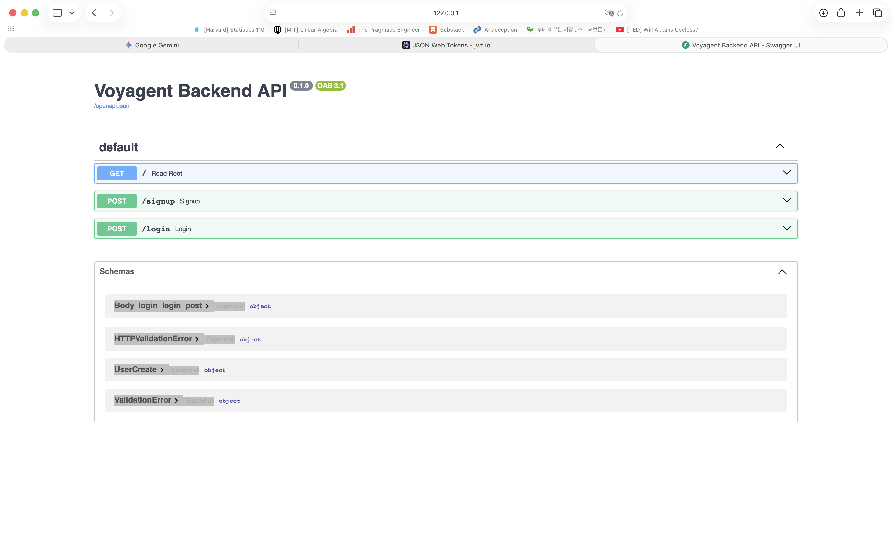
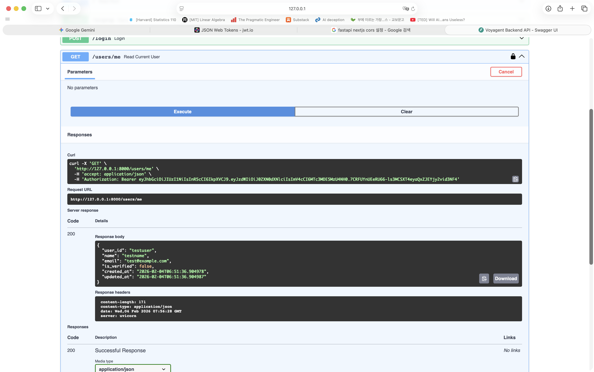

## 1. Continue: 테이블 생성

지난번에 User 테이블만 만들어놨기 때문에 나머지 테이블을 완성해보자.

`Travel`, `Itinerary`, `ChatMessages` 테이블을 만들 건데, 각각 relationship이 있기 때문에 유의해서 만들어야 한다.

### Travel

먼저 `User` 테이블과 일대다 관계인 `Travel` 테이블부터 만들어보자.  

```python
# ./backend/app/models/travel.py

from uuid import UUID, uuid4
from datetime import datetime, timedelta, timezone
from sqlmodel import SQLModel, Field, Relationship
from typing import List, TYPE_CHECKING

if TYPE_CHECKING: # 순환 참조 방지
    from app.models.itinerary import Itinerary
    from app.models.chat import ChatMessages


KST = timezone(timedelta(hours=9)) # 한국 표준시 (KST)

class Travel(SQLModel, table=True):
    id: UUID = Field(default_factory=uuid4, primary_key=True)
    
    user_id: UUID = Field(foreign_key="user.id")
    
    title: str = Field(nullable=False, max_length=255)
    destination: str = Field(nullable=False, max_length=100)
    start_date: datetime
    end_date: datetime

    created_at: datetime = Field(default_factory=lambda: datetime.now(KST))
    updated_at: datetime = Field(default_factory=lambda: datetime.now(KST))

    # travel.itineraries, travel.chats 로 접근 가능
    itineraries: List["Itinerary"] = Relationship(back_populates="travel") # back_populates: 양방향 관계 설정
    chats: List["ChatMessages"] = Relationship(back_populates="travel")
```

- **foreign_key="user.id"**: User 테이블의 column `id`와 연관지어 일대다 관계를 형성한다. 하나의 사용자가 여러 개의 travel을 가질 수 있다.
- **TYPE_CHECKING**: 실행 시에는 항상 False, 에디터가 코드를 검사할 때는 항상 True로 설정되어 순환 참조를 방지한다.
- **Relationship**: 다른 테이블을 참조할 때 사용한다.
  - `itineraries`: Itinerary 테이블을 정의할 때 back_populates에 지정한 이름을 변수명으로 사용한다.
  - `List["Itinerary"]`: 테이블명을 따옴표로 감싸 변수처럼 사용한다. 해당 테이블을 원소로 하여 List로 사용하겠다는 뜻이다.
  - `back_populates="travel"`: Itinerary 테이블에서 Travel 테이블을 참조할 때 변수명을 "travel"로 사용하겠다는 뜻이다.

### Itinerary

> 설명은 Travel 테이블과 동일하기 때문에 생략

```python
# ./backend/app/models/itinerary.py

from uuid import UUID, uuid4
from sqlmodel import SQLModel, Field, Relationship

from app.models.travel import Travel


class Itinerary(SQLModel, table=True):
    id: UUID = Field(default_factory=uuid4, primary_key=True)

    travel_id: UUID = Field(foreign_key="travel.id")

    day_number: int = Field()
    visit_order: int = Field()
    category: str = Field(nullable=True, max_length=100) # 관광지, 음식점, 쇼핑, 숙박 등
    
    place_name: str = Field(nullable=False, max_length=255)
    latitude: float = Field(nullable=False)
    longitude: float = Field(nullable=False)

    memo: str = Field(nullable=True, max_length=1000) # AI가 생성한 설명 or 사용자 메모

    # 관계 설정
    travel: "Travel" = Relationship(back_populates="itineraries")  # back_populates: 양방향 관계 설정
```

### Chat

```python
from uuid import UUID, uuid4
from datetime import datetime, timezone, timedelta
from sqlmodel import SQLModel, Field, Relationship
from typing import Optional

from app.models.travel import Travel


KST = timezone(timedelta(hours=9))  # 한국 표준시 (KST)

class ChatMessages(SQLModel, table=True):
    id: UUID = Field(default_factory=uuid4, primary_key=True)

    user_id: UUID = Field(foreign_key="user.id")
    travel_id: Optional[UUID] = Field(foreign_key="travel.id", default=None) # 대화 진행 시점이 여행 확정 전임

    role: str = Field(nullable=False, max_length=50)  # user, assistant
    content: str = Field(nullable=False, max_length=5000)
    timestamp: datetime = Field(default_factory=lambda: datetime.now(KST))

    travel: Optional["Travel"] = Relationship(back_populates="chats")
```

### Main

이제 작성한 테이블들을 읽고, uvicorn 서버를 실행했을 때 테이블을 생성해주기 위해 main.py에 import 해주도록 하자.

```python
# ./backend/app/main.py

from fastapi import FastAPI
from app.core.db import init_db
from contextlib import asynccontextmanager

from app.models.user import User
from app.models.travel import Travel
from app.models.chat import ChatMessages
from app.models.itinerary import Itinerary


@asynccontextmanager
async def lifespan(app: FastAPI):
    # 서버 시작 시 테이블 생성 (이미 있으면 생성 안 함)
    init_db()
    yield

app = FastAPI(title="Voyagent Backend API", lifespan=lifespan)

@app.get("/")
def read_root():
    return {"message": "Welcome to the Voyagent Backend API!"}
```

아래 코드를 통해 uvicorn을 실행한다. 이미 실행 중이라면 저장 시에 새로고침 될 것!

```bash
uvicorn app.main:app --reload
```

생성한 테이블을 확인하고 싶으면 아래 명령어를 사용해서 docker로 띄운 postgresql로 접속한다.  

```bash
docker exec -it voyagent-db psql -U voyagent_user -d voyagent_db
\dt # 생성한 테이블들 확인
\q # 도커 컨테이너 나가기
```

아래처럼 생성이 확인됐으면 완성!

<div align="center">

</div>

## 2. 회원가입, 로그인 구현

### (1) DBeaver, 필요한 모듈 설치

데이터베이스에 저장되는 내용들을 확인해야 하는데 매번 터미널을 통해 docker container에 접속하고 psql에서 조회하기 귀찮으니 DBeaver를 깔아보도록 하자. 👉 [DBeaver 설치 링크](https://dbeaver.io/download/)
- 왼쪽 상단에 plug 모양 클릭 → PostgreSQL 선택
- 아래 이미지에서 보이는 Host, Port, Database, Username, Password를 입력한다. 이 내용들은 프로젝트 구축 시 `.env` 파일에 적어뒀던 내용과 동일하게 입력해야 한다(당연하게도...).

<div align="center">

</div>

이제 암호화에 필요한 pip 모듈들을 설치한다.  

> 아무거나 설치했다가 버전 이슈로 회원가입이 안 되길래 다시 설치한 버전을 기재한다.

```bash
pip install "bcrypt==4.0.1" "passlib[bcrypt]"
```

### (2) .env, config에 보안 알고리즘 추가

JWT token을 사용할 것이기 때문에 .env에 암호화 알고리즘을 추가해준다.  
먼저 SECRET_KEY, ALGORITHM, ACCESS_TOKEN_EXPIRE_MINUTES를 추가한다.  
- SECRET_KEY: 터미널에서 `openssl rand -hex 32`라고 입력하면 랜덤 키가 생성된다.
- ALGORITHM: HS256 (대칭키 알고리즘)
- ACCESS_TOKEN_EXPIRE_MINUTES: 임의로 30분으로 설정해뒀다.

config에서 .env를 읽어와 settings 객체를 생성해주기 때문에 config.py도 업데이트한다.

```python
# ./backend/app/core/config.py

from pydantic_settings import BaseSettings, SettingsConfigDict
from pathlib import Path


class Settings(BaseSettings):
    # .env에 적은 변수명과 일치해야 함
    DATABASE_URL: str
    SECRET_KEY: str
    ALGORITHM: str = "HS256"
    ACCESS_TOKEN_EXPIRE_MINUTES: int = 30

    # backend/.env 파일을 찾도록 설정
    model_config = SettingsConfigDict(
        env_file=Path(__file__).resolve().parent.parent.parent / ".env",
        env_file_encoding="utf-8",
        extra="ignore",
    )

settings = Settings()
```

### (3) security.py 작성

비밀번호 암호화, 암호화된 비밀번호 확인, jwt token 발급 로직을 담당하는 파일이다.  

```python
# ./backend/app/core/security.py

from datetime import datetime, timedelta, timezone
from typing import Optional
from jose import jwt
from passlib.context import CryptContext
from app.core.config import settings


# 비밀번호 해싱 설정
pwd_context = CryptContext(schemes=["bcrypt"], deprecated="auto")

def verify_password(plain_password: str, hashed_password: str) -> bool:
    """사용자가 입력한 비밀번호와 해싱된 비밀번호를 비교"""
    return pwd_context.verify(plain_password, hashed_password)

def get_password_hash(password: str) -> str:
    return pwd_context.hash(password)

def create_access_token(data: dict, expires_delta: Optional[timedelta] = None) -> str:
    to_encode = data.copy()
    if expires_delta:
        expire = datetime.now(timezone.utc) + expires_delta
    else:
        expire = datetime.now(timezone.utc) + timedelta(minutes=settings.ACESS_TOKEN_EXPIRE_MINUTES)
    
    to_encode.update({"exp": expire})
    encoded_jwt = jwt.encode(to_encode, settings.SECRET_KEY, algorithm=settings.ALGORITHM)
    
    return encoded_jwt
```

### (4) user.py 수정

현재 User table에는 user_id, name, email, password와 같은 필수적인 정보 외에도 id, is_verified, created_at, updated_at과 같이 사용자가 직접 입력하지 않는 정보들이 들어가있다.  
따라서 `UserCreate` 클래스를 만들어 회원가입 시 입력 받은 정보를 담을 클래스를 만든다. 또한 UserCreate와 User에 공통적으로 포함되는 정보를 `UserBase` 클래스에 담아 코드 중복을 제거하고 확장의 유연성을 확보하도록 했다.  

```python
# ./backend/app/models/user.py

from uuid import UUID, uuid4
from datetime import datetime, timezone
from sqlmodel import SQLModel, Field
from typing import Optional


class UserBase(SQLModel):
    """사용자 기본 정보 모델"""
    
    user_id: str = Field(index=True)
    name: str
    email: str = Field(index=True)


class User(UserBase, table=True):
    """사용자 테이블 모델"""
    
    # Primary Key로 UUID 사용
    id: UUID = Field(default_factory=uuid4, primary_key=True)  # default_factory: 실행 시점에 동적으로 값 생성

    # user_id: str = Field(unique=True, index=True, nullable=False)
    password_hash: str = Field(nullable=False)
    # name: str = Field(nullable=False)
    # email: str = Field(unique=True, nullable=False)

    is_verified: bool = Field(default=False)  # default: 고정된 값
    created_at: datetime = Field(default_factory=lambda: datetime.now(timezone.utc))
    updated_at: Optional[datetime] = Field(default_factory=lambda: datetime.now(timezone.utc))


class UserCreate(UserBase):
    """사용자 생성 시 필요한 입력 모델"""
    
    password: str
```

### (5) main.py 작성

이제 signup, login을 본격적으로 작성해보자!  
필요한 모듈들을 임포트해주고, 사용자가 입력한 정보들을 클래스에 담아 객체화하여 테이블을 조회하고 생성해준다.  

```python
# ./backend/app/main.py

from datetime import timedelta
from sqlmodel import Session, select
from contextlib import asynccontextmanager
from fastapi.security import OAuth2PasswordRequestForm
from fastapi import FastAPI, Depends, HTTPException, status

from app.core.config import settings
from app.core.db import init_db, get_session
from app.core.security import verify_password, get_password_hash, create_access_token

from app.models.user import User, UserBase, UserCreate
from app.models.travel import Travel
from app.models.chat import ChatMessages
from app.models.itinerary import Itinerary


@asynccontextmanager
async def lifespan(app: FastAPI):
    # 서버 시작 시 테이블 생성 (이미 있으면 생성 안 함)
    init_db()
    yield

app = FastAPI(title="Voyagent Backend API", lifespan=lifespan)

@app.get("/")
def read_root():
    return {"message": "Welcome to the Voyagent Backend API!"}

@app.post("/signup", status_code=status.HTTP_201_CREATED)
def signup(user: UserCreate, session: Session = Depends(get_session)):
    existing_user = session.exec(select(User).where((User.user_id == user.user_id) | (User.email == user.email))).first()
    if existing_user:
        raise HTTPException(
            status_code=status.HTTP_400_BAD_REQUEST,
            detail="User ID or email already exists"
        )
    
    hashed_password = get_password_hash(user.password)

    new_user = User(
        user_id=user.user_id,
        name=user.name,
        email=user.email,
        password_hash=hashed_password
    )

    # DB에 사용자 정보 저장
    session.add(new_user)
    session.commit()
    session.refresh(new_user) # 새로 생성된 사용자 정보로 갱신
    
    return {"message": "User created successfully", "user_id": new_user.user_id}

@app.post("/login")
def login(form_data: OAuth2PasswordRequestForm = Depends(), session: Session = Depends(get_session)):
    user = session.exec(select(User).where(User.user_id == form_data.username)).first() # form_data는 username, password 속성을 가짐
    if not user or not verify_password(form_data.password, user.password_hash):
        raise HTTPException(
            status_code=status.HTTP_401_UNAUTHORIZED,
            detail="Invalid credentials",
            headers={"WWW-Authenticate": "Bearer"},
        )
    
    access_token_expires = timedelta(minutes=settings.ACCESS_TOKEN_EXPIRE_MINUTES)
    access_token = create_access_token(
        data={"sub": user.user_id}, expires_delta=access_token_expires
    )

    return {"access_token": access_token, "token_type": "bearer"}
```

### (6) signup, login 테스트

터미널에서 uvicorn 서버를 켜준다.  

```bash
uvicorn app.main:app --reload
```

`localhost:8000/docs`에 접속하면 아래와 같은 swagger UI를 사용해서 테스트 해볼 수 있다.  

<div align="center">

</div>

`/signup` → Try it out → JSON 입력 → Execute → 201 Created 뜨면 성공  
`/login` → Try it out → JSON 입력 → Execute → 200 OK, jwt token 발급되면 성공  

> [jwt.io](https://www.jwt.io)에서 token validation 확인하기  
발급받은 토큰을 입력하고 우측 하단에 SECRET이라고 써있는 칸에 .env에 적은 SECRET_KEY를 입력하면 Valid JWT인지, Signature Verified인지 여부를 알 수 있다.

### (7) Refresh Token

현재 발급 받은 토큰은 access token이고, expired minutes를 30분으로 설정해뒀기 때문에 30분이 지나면 사용자가 다시 로그인을 해야 한다.  
이를 방지하기 위해 30분이 지나면 자동으로 토큰을 새로 발급할 수 있는 refresh token을 함께 구현할 수 있다.  

하지만 지금은 개발 단계이고, 별도의 테이블이 또 필요하고, 약간 귀찮..으므로 어느정도 프로젝트 구조가 갖춰지면 나중에 다시 구현하도록 하자 ㅎ...

## 3. CORS 설정, 사용자 의존성 구현

### (1) CORS 설정

브라우저는 보안 상 도메인이 다르면 연결을 막는다. localhost 기준으로 프론트엔드는 `localhost:3000`에서, 백엔드는 `localhost:8000`에서 돌기 때문에 이 둘의 통신을 가능하게 해야 한다.  

```python
# ./backend/app/main.py

from fastapi.middleware.cors import CORSMiddleware

# ... app = FastAPI() 선언 이후에 작성

origins = [
    "http://localhost:3000",    # Next.js 기본 주소
    "http://127.0.0.1:3000",
]

app.add_middleware(
    CORSMiddleware,
    allow_origins=origins,            # 허용할 도메인 목록
    allow_credentials=True,           # 쿠키, 인증헤더 허용 여부
    allow_methods=["*"],              # 모든 HTTP 메서드 허용 (GET, POST 등)
    allow_headers=["*"],              # 모든 헤더 허용
)
```

### (2) 사용자 의존성 구현

create_travel과 같이 사용자마다 채팅을 하고, 여행을 저장 및 조회하고, 일정을 생성, 수정, 삭제할 때 접근한 사람이 본인이 맞는지를 확인하는 로직이 필요하다. 이를 `get_current_user` 함수로 구현해줄 것이다.

먼저 security.py에 아래 코드를 추가해준다.  

```python 
# ./backend/app/core/security.py

from fastapi import Depends, HTTPException, status
from fastapi.security import OAuth2PasswordBearer
from jose import JWTError, jwt
from sqlmodel import Session, select
from app.core.db import get_session
from app.core.config import settings
from app.models.user import User

oauth2_scheme = OAuth2PasswordBearer(tokenUrl="login")

def get_current_user(token: str = Depends(oauth2_scheme), session: Session = Depends(get_session)) -> User:
    """토큰에서 유저 정보를 추출하여 현재 유저를 반환하는 함수"""
    credentials_exception = HTTPException(
        status_code=status.HTTP_401_UNAUTHORIZED,
        detail="Could not validate credentials",
        headers={"WWW-Authenticate": "Bearer"},
    )
    
    try: # 토큰 디코딩 및 유저 조회
        payload = jwt.decode(token, settings.SECRET_KEY, algorithms=[settings.ALGORITHM])
        user_id: str = payload.get("sub")
        if user_id is None:
            raise credentials_exception
    except JWTError:
        raise credentials_exception
    
    user = session.exec(select(User).where(User.user_id == user_id)).first()
    if user is None:
        raise credentials_exception
    
    return user
```

사용자 인증을 확인해보고 싶다면 main.py에 테스트 코드를 작성한다.  

```python
# ./backend/app/main.py

@app.get("/users/me", response_model=UserRead)
def read_current_user(current_user: User = Depends(get_current_user)):
    return current_user
```

여기서 `response_model=UserRead`라고 하는 코드가 보일 것이다. 반환할 타입을 UserRead 클래스의 형태로 제한하겠다는 것인데, User 클래스의 형태를 그대로 반환했다가는 비밀번호까지 전부 전달되기 때문에 user.py에 UserRead 클래스를 정의해준다.

```python
# ./backend/app/models/user.py

class UserRead(UserBase):
    """사용자 조회 시 반환 모델"""
    
    is_verified: bool
    created_at: datetime
    updated_at: Optional[datetime]
```

이제 Swagger UI로 접속해서 작동이 잘 되는지 테스트 해볼 수 있다.  

<div align="center">

</div>

- `/users/me` 항목에 오른쪽에 자물쇠가 풀려있는 아이콘을 누른다.  
- 테스트로 생성해둔 아이디와 비밀번호를 입력해서 임시 로그인을 수행한다.  
- OAuth 인증 화면이 나오고 창을 닫으면 아래와 같이 Header에는 token이, Body에는 UserRead의 객체가 반환된 모습을 확인할 수 있다.

# 끝!!!!!!!!!

다음엔 CRUD를 만들고, AI agent를 연동해보도록 하자.  
가능하다면 프론트엔드 - 백엔드 연동까지,,,