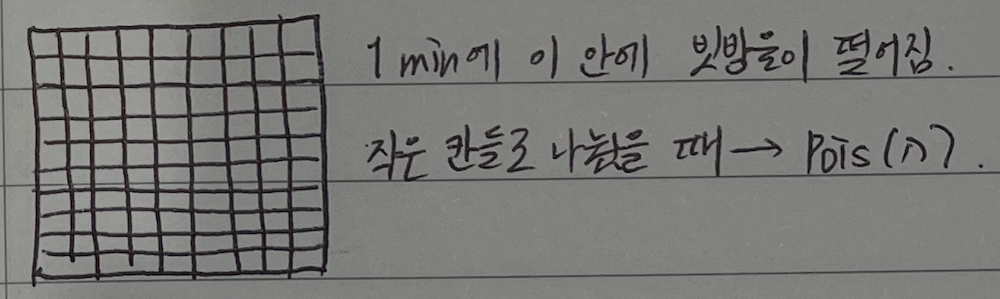

> 이 포스팅은 Harvard에서 진행된 Joe Blitzstein의 Statics 110 강좌를 기반으로 작성되었습니다.  
- [강의 및 자료 링크](https://stat110.hsites.harvard.edu)

### Sympathetic Magic

확률 변수와 분포를 헷갈리지 말 것  
즉, 변수의 합 $X+Y$와 각각의 확률질량함수의 합 $P(X=x) + P(Y=y)$은 같지 않다.  
`확률변수`는 어떠한 집이든 될 수 있고, `확률질량함수`는 특정 집을 결정할 집의 설계도와 같은 역할이다.

## The Poisson Distribution (포아송 분포)

### Definition

표기: $X \sim \text{Pois}(\lambda)$  

$$
P(X=k) = \frac{e^{-\lambda}\lambda^k}{k!}, k \in \{0,1,2, ...\}
$$

$\lambda$는 0 이상의 양수인 상수이며, 속도를 나타내는 모수이다.

### P.M.F.로서의 Validation

1. $\lambda$와 $k$의 조건으로 인해 음수는 아니다.  
2. 합이 1?  

$$
\begin{align*}
\sum^\infty_{k=0} \frac{e^{-\lambda}\lambda^k}{k!} &= e^{-\lambda} \sum^{\infty}_{k=0} \frac{\lambda^k}{k!} \ \text{(테일러 급수)} \\
&= e^{-\lambda}e^{\lambda} \\
&= \lambda
\end{align*}
$$

### 기댓값

$$
\begin{align*}
\sum^{\infty}_{k=0} k \frac{e^{-\lambda}\lambda^k}{k!} &= \lambda e^{-\lambda} \sum^{\infty}_{k=1} \frac{\lambda^{k-1}}{(k-1)!} \\
&= \lambda e^{-\lambda} e^{\lambda} \ \text{(테일러 급수)} \\
&= \lambda
\end{align*}
$$

### 예시들

> 매우 큰 수의 시도 횟수 $n$에서, 각 시도별 성공 확률이 매우 작은 값일 때, 총 성공 횟수에 대한 분포가 포아송 분포를 따른다.  

1. #. of emails in an hour  
2. #. of chips in a chocolate chip cookie  
3. #. of earthquakes in a year in some region  

## Pois. Paradigm

> 위 예시들을 수학적으로 표현

매우 큰 수 $n$과 매우 작은 값 $p_j$에 대해 사건 $A_1, A_2, ..., A_n$와 확률 $P(A_j) = p_j$이 있다. 각 사건이 독립(이거나 weakly dependent)일 때 $A_j$가 발생할 횟수가 포아송 분포 $Pois(\lambda)$를 따르며, $\lambda = \sum^{n}_{j=1}p_j$이다.

## Pois. Approximation

> 이항 분포가 포아송 분포를 따르는 경우

$X \sim Bin(n, p)$에서 $n \to \infty$, $p \to 0$, $np = \lambda$($\lambda$는 고정 상수)일 때, 해당 이항분포의 확률질량함수는 포아송 분포에 근사된다.  
증명하기 전에, $np = \lambda$이기 때문에 $\displaystyle p = \frac{\lambda}{n}$임을 기억하자.

$$
\begin{align*}
P(X=k) &= \binom{n}{k} p^k (1-p)^{n-k} \\
&= \frac{n(n-1)\cdots(n-k+1)}{k!} \bigg(\frac{\lambda}{n}\bigg)^k \bigg(1-\frac{\lambda}{n}\bigg)^{n} \bigg(1-\frac{\lambda}{n}\bigg)^{-k} \\
&= \frac{n(n-1)\cdots(n-k+1)\lambda^k}{k!n^k} \bigg(1-\frac{\lambda}{n}\bigg)^{n} \bigg(1-\frac{\lambda}{n}\bigg)^{-k} \\
&= \frac{\lambda^k}{k!} \frac{n(n-1)\cdots(n-k+1)}{n^k} \bigg(1-\frac{\lambda}{n}\bigg)^{n} \bigg(1-\frac{\lambda}{n}\bigg)^{-k}
\end{align*}
$$

여기서 $n \to \infty$일 때,  
$\displaystyle \lim_{n \to \infty} \frac{n(n-1)\cdots(n-k+1)}{n^k} = 1$, $\displaystyle \lim_{n \to \infty} \bigg(1-\frac{\lambda}{n}\bigg)^{-k} = 1$이기 때문에 정리한 식은 아래와 같다.  

$$
\begin{align*}
\frac{\lambda^k}{k!} \lim_{n \to \infty} \bigg(1 - \frac{\lambda}{n}\bigg)^n = \frac{\lambda^k}{k!} e^{-\lambda} \ _{\blacksquare}
\end{align*}
$$

### 예제 2

**[raindrops]**  
특정 공간에 몇 개의 빗방울이 떨어질지 생각해보자.  
아래 그림과 같이 해당 공간을 무수히 많은 작은 사각형들($n \to \infty$)로 나눴을 때, 각 칸에 떨어지는 빗방울은 서로 독립이며, 각각 매우 작은 확률($p \to 0$)을 갖고 있다.  
각 공간에 떨어진 빗방울들의 총합에 대한 분포가 포아송 분포가 된다.

**[birthday problem]**  
적당히 큰 수 $n$에 대해 $n$명이 있을 때, 3명의 생일 이 같을 확률을 "근사"해라.  
$\displaystyle \binom{n}{3}$개의 3명 그룹에서 indicator random variable $I_{ijk}$를 $i$-th, $j$-th, $k$-th 사람의 그룹이 생일이 같은 사람의 그룹인 사건이라고 해보자.  
$\displaystyle E(\text{생일이 같은 세 명의 그룹의 수}) = \binom{n}{3}\frac{1}{365^2}$  
$X = \text{생일이 같은 세 명의 그룹 수} \to Pois(\lambda)$  
$\displaystyle \ \ \ \ \lambda = E(X) = \binom{n}{3}\frac{1}{365^2}$  
$\displaystyle P(X \geqslant 1) = 1 - P(X=0) \approx 1 - \frac{e^{-\lambda}\lambda^0}{0!} = 1 - e^{-\lambda}$

이로써 이산형 분포의 종류를 전부 알아보았는데, 한 번 총정리를 해보는 것도 좋을 것 같다.