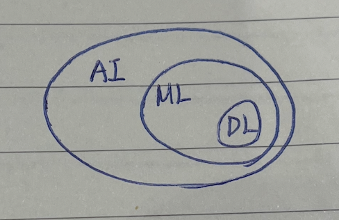

> David Silver의 RL 강의를 듣다가 정리를 안 해버렸다.. 기본적인 정보들은 어느정도 습득했으니 LLM의 RL로 넘어가볼까 한다. 기본 개념, RL 알고리즘 종류, LLM의 RL, 코드 예제 순서대로 포스팅 할 계획인데, 진행하면서 부족한 부분들을 보완하도록 하겠다.  

## 1. 강화학습이란?

### Definition

Reinforcement Learning은 Machine Learning의 한 분야이다.  
- 인공지능: 인간의 지적 능력을 컴퓨터와 같은 기계로 구현하는 것을 말한다.
- 머신러닝: 모델이 스스로 패턴을 탐구하고 인식하여 성능을 향상시킨다.
- 딥러닝: 인간의 뉴런과 비슷하게 인공 신경망 방식을 사용해서 정보를 처리한다.

`Agent`가 `Environment`와 상호작용하여 `Reward`라는 피드백을 받아 `trial and error`를 거쳐 최적의 행동 전략(`policy`)을 학습하는 방법이다. `Agent`의 최종 목적은 `Cumulative Reward(Return)`를 최대화하는 것이다.  

> 여기서 `cumulative`라고 한 것에서 알 수 있듯이, 매 time-step의 action마다 즉시 보상을 받는 것이 아니라, 전체 episode가 끝난 뒤에 보상을 받기도 한다. 따라서 현재 행동이 최선이었는지는 미래에 보상을 통해서 알 수 있고, 미래 보상을 실험을 통해 직접 탐색하여 확인할 수도 있지만 boostrapping과 같이 추정하는 방식을 이용하기도 한다.

`trial and error` 과정에서 `agent`는 `exploration`과 `exploitation`을 적절히 수행한다.  
- exploitation: 현재 정책이 알려주는 최적의 경로를 활용한다. 활용이 과해지면 새로운 경로에서 발견할 수 있는 최적 보상의 기회를 놓칠 수 있다.
- exploration: 최적의 경로가 아닌, 새로운 경로를 시도한다. 탐험이 과해지면 현재 받을 수 있는 확실한 보상을 놓칠 수 있다.

### 활용 범위

게임과 같이 명확한 보상을 얻을 수 있는 경우에 특히 유용하다. 최근에는 데이터가 고갈되고 있는 현재, 정제된 데이터를 제공하는 것이 어려워지고 있어 현실과 유사한 환경에 에이전트를 두어 직접 탐색하고 최적의 방식을 "스스로" 학습해가는 RL의 방식에 의의가 있다.

Ex. 알파고는 self-play를 통해 이기면 +1, 지면 0의 보상을 받으며 학습하였다. 자율주행, LLM의 fine-tuning 등에 널리 활용된다.

## 2. 강화학습의 기본 개념

> 알고리즘들을 살펴보기 전에 수식 표기와 함께 기본적인 개념들을 알아보자.  

### Markov Decision Process (MDP)

RL은 일반적으로 MDP로 공식화되며, MDP는 $(\mathcal{S}, \mathcal{A}, \mathcal{P}, \mathcal{R}, \gamma)$ 의 튜플로 구성된다.  
- 상태 $\mathcal{S}$: 에이전트가 인식할 수 있는 환경에 대한 상태들의 집합이다.
  - 한 상태 $s \in \mathcal{S}$ 는 현재 환경의 정황을 나타낸다.  
- 행동 $\mathcal{A}$: 에이전트가 취할 수 있는 행동들의 집합이다.  
  - 특정 상태 $s$에서 취할 수 있는 행동을 $a \in \mathcal{A}(s)$ 로 정의한다.  
- 전이 확률 $\mathcal{P}$: 특정 상태 $s$ 에서 어떤 행동 $a$ 를 취했을 때 다음 상태 $s'$ 으로 전이될 확률을 의미한다.  
  - $\mathcal{P}(s' \mid s, a)$ 로 표기한다.  
  - MDP는 Markov Property에 의해 다음 상태 $s'$ 이 현재 상태 $s$ 와 $a$ 에 의해서만 결정된다. 즉, 이전 상태들에 의존하지 않는다.
- 보상 함수 $\mathcal{R}$: 상태 $s$ 에서 행동 $a$ 를 취해 다음 상태 $s'$ 으로 전이되었을 때 주어지는 보상을 의미한다.
  - 일반적으로 실수값을 가진다.
  - 에이전트의 목적은 이 보상 함수의 "총합"을 최대화하는 것이다.
- 할인율 $\gamma$: 미래 보상의 현재 가치에 대한 할인율이다.  
  - $0 \leqslant \gamma \leqslant 1$
  - $\gamma$ 가 1에 가까울 수록 미래 가치와 현재 가치가 동등해진다.
  - $\gamma$ 가 0에 가까울 수록 눈앞의 보상만을 중요시한다.

여기서 상태 $s$ 에서 행동 $a$ 는 policy $\pi$ 에 의해서 결정된다. 즉, 정책 $\pi$ 는 agent가 주어진 상태에서 어떤 행동을 취할지 결정하는 전략이다.  
- 상태 $s$ 를 입력으로 받고, 가능한 모든 행동들의 확률 분포를 출력한다.  
- $\pi(a \mid s)$ 로 표기하며, 일반적으로 확률적 정책을 가정하고 신경망으로 표현하여 학습한다.

RL의 목적은 누적 보상(return)을 최대화하는 것이라고 했다. 이제 보상에 대한 개념 $G_t$를 살펴보자.  
$G_t$: time-step $t$ 로부터 미래에 받을 보상들에 대한 누적합이다.  
- 유한한 에피소드: $G_t = R_{t+1} + R_{t+2} + \cdots + R_T$
- 무한한/장기의 에피소드: $G_t = R_{t+1} + \gamma R_{t+2} + \gamma^2 R_{t+3} + \cdots$
이 $G_t$는 환경, 정책으로 인해 timestep마다 달라지는 랜덤 변수이고, 샘플 하나에 해당한다.

### Value Function

agent의 목표는 장기적으로 가장 많은 보상을 얻는 정책을 학습하는 것이다. 이때 가치 함수는 현재 정책을 따랐을 때 얻을 수 있는 보상을 예측하여 현재 정책의 가치를 판단한다.  
헷갈릴 수 있는 점은, 가치 함수는 정책을 직접 업데이트하지 않고 방향을 가르쳐준다는 것이다. (뒤에 수식으로 설명)  
가치 함수의 종류는 두 가지로 구분된다.
- state의 가치를 평가하는 state-value function
- state에서의 action의 가치를 평가하는 action-valute function

**[State-value function $V^\pi(s)$]**  
정책 $\pi$ 를 따를 때 상태 $s$ 에서 시작해서 미래에 받을 누적 보상에 대한 기댓값이다.  
아래와 같이 표기하며, 상태 $s$에 대한 가치를 계산하여 해당 "상태 $s$에 있는 것이 얼마나 좋은지"를 평가한다.

$$
V^\pi(s) = \mathbb{E}[G_t \mid S_t = s]
$$

**[Action-value function $Q^\pi(s, a)$]**  
정책 $\pi$ 를 따를 때 상태 $s$ 에서 특정 행동 $a$ 를 취한 이후에 받을 누적 보상에 대한 기댓값이다.  
아래와 같이 표기하며, "상태 $s$ 에서 행동 $a$ 를 하면 얼마나 좋은지"를 평가한다.

$$
Q^\pi(s, a) = \mathbb{E}[G_t \mid S_t = s, A_t = a]
$$

### $G_t$, $V^\pi$, $Q^\pi$ 의 관계

보상 $G_t$ 는 한 에피소드 안에서 실제로 관측된 누적 보상이다. 환경과 정책으로 인해 매 timestep마다 그 값이 달라지는 랜덤 변수이고, 샘플 하나에 해당한다.  
가치함수는 해당 샘플들을 사용해서 기댓값을 구한다.

## 3. 가치함수에 대해서

### Bellman Expectation Equation

가치 함수는 Bellman Equation이라는 자기 참조적 관계를 만족한다. 예시로 상태-가치 함수에 대한 Bellman Expectation Equation을 살펴보자.  

$$
V^\pi(s) = \sum_{a \in \mathcal{A}} \pi (a \mid s) \sum_{s' \in \mathcal{S}} P(s' \mid s, a)[R(s, a, s') + \gamma V^\pi(s')]
$$

- $V^\pi(s)$: 현재 상태의 가치
- $\sum_{a \in \mathcal{A}} \pi (a \mid s)$: state $s$ 에서 가능한 모든 행동들에 대해 기대되는 보상
- $P(s' \mid s, a)$: state $s$ 에서 어떤 행동 $a$ 를 선택했을 때 $s'$ 로 전이될 확률
- $R(s, a, s')$: state $s$ 에서 행동 $a$ 를 취해 $s'$ 로 전이되었을 때 받는 즉시 보상
- $V^\pi(s')$: 전이된 상태 $s'$ 에 대한 미래 가치의 기댓값

현재 상태의 가치 $V^\pi(s)$ 가 $V^\pi(s')$ 에 의해 결정되는 자기 참조적 관계를 가진다.

최적 정책 $\pi^*$ 에 대한 Bellman Optimal Equation을 살펴보자.

$$
V^*(s) = \max_{a \in \mathcal{A}} \{R(s, a) + \gamma \sum_{s' \in \mathcal{S}} P(s' \mid s, a) V^*(s')\}
$$

위 식은 어떤 상태에서 최적으로 행동할 때 얻을 가치 $V^*(s)$ 를 가능한 "모든" 행동들에 대한 즉시 보상과 미래 가치의 합을 계산한 뒤, 그 중 최댓값을 선택하는 것으로 표현한다.  

### Principle of Optimality

위 Bellman Optimal Equationd을 통해 Principle of Optimality라는 개념을 알 수 있다.
- 의미: 전체 정책이 최적이라면, 해당 정책의 어느 시점 이후 부분도 역시 최적이다.
- 즉, 지금까지 어떻게 진행되어 왔는지는 중요하지 않고 현재 상태에서 남은 부분을 푸는 방식 역시 최적이어야 한다는 것이다.  
- 위 Bellman Optimal Equation에서 현재 상태 $s$ 의 최적 가치는 현재 행동 $a$ 를 선택하고 이후 "최적으로 행동함을 가정"하여 계산된다.
  - $\displaystyle \sum_{s' \in \mathcal{S}} P(s' \mid s, a) V^*(s')$에서 마지막 항을 통해 다음 state에서 "최적으로 행동"한다는 것을 알 수 있다.
- 이 가정이 필요한 이유: 해당 가정이 없다면 지금 잘 선택하고 미래에는 일부러 최적이 아닌 행동을 해야 정책이 좋아지는 경우가 생겨버려 $\displaystyle V^*(s) = \max_{a \in \mathcal{A}} \dots$ 의 가정이 불가능해진다.

이러한 Bellman Equation은 Dynamic Programming을 통해 이론적으로 해결이 가능하다. 하지만 현실 세계에서는 state의 공간이 거대하기 때문에 근사적으로 해결하기 위해 sampling과 신경망을 사용한 함수 근사 등을 활용한다. 이 때 exploration과 exploitation의 균형이 필요하다.