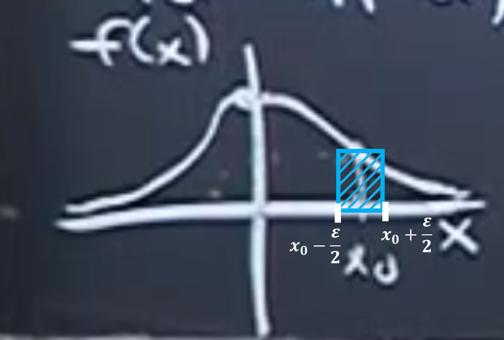

> 이 포스팅은 Harvard에서 진행된 Joe Blitzstein의 Statics 110 강좌를 기반으로 작성되었습니다.  
- [강의 및 자료 링크](https://stat110.hsites.harvard.edu)

### Discrete vs. Continuous

|Discrete (이산확률변수)|Continuous (연속확률변수)|
|:--:|:--:|
|PMF (확률밀도함수) $P(X=x)$|PDF (확률질량함수) $f_X(x)$|
|CDF $F_X(s) = P(X \leqslant s)$|CDF $F_X(s) = P(X \leqslant s)$|
|$\displaystyle E(X) = \sum_x xP(X=x)$|$E(X) = \int^\infty_{-\infty}xF_X(x)dx$|
|$Var(X) = E(X^2) - \{E(X)\}^2$|$Var(X) = E(X^2) - \{E(X)\}^2$|
|LOTUS $\displaystyle E(g(X)) = \sum_x g(x)P(X=x)$|LOTUS $E(g(X)) = \int^\infty_{-\infty} g(x)f_X(x)dx$|

## Probability Density Function (확률밀도함수)

### Definition

이산확률변수 $X$ 에 대해 PDF $f(x)$ 는 모든 $a$, $b$ 에 대해 $P(a \leqslant X \leqslant b) = \int^b_af(x)dx$ 를 만족한다.  
- 만약 $a=b$ 라면, $\int^b_af(x)dx = \int^a_af(x)dx = 0$ 이다.

**[Validation]**  
1. $f(x) \geqslant 0$
2. $\int^{\infty}_{-\infty} f(x) dx = 1$

**[What does "Density" mean?]**  
$f(x_0) \cdot \epsilon = P(X \in (x_0 - \epsilon/2, x_0 + \epsilon/2))$  
즉, 매우 작은 값 $\epsilon$ 길이의 구간에 대한 면적을 의미

### CDF

특정 $x$의 값까지의 누적 확률 값: $F(x) = P(X \leqslant x) = \int^x_{-\infty}f(t)dt$  
반대로, 미적분학의 기본 정리를 사용해서 $f(x) = F'(x)$ 이다. 

또한, 미적분학의 기본 정리를 사용해서 확률밀도함수를 다음과같이 구할 수도 있다.  
$P(a < X < b) = \int^b_a f(x)dx = F(b) - F(a)$

### 분산과 표준편차

> 각 값들이 평균으로부터 얼마나 멀리 떨어져 있는지  

$Var(X) = E(X - EX)^2$  
Standard Deviation: $SD(X) = \sqrt{Var(X)}$

분산을 나타내는 다른 방법:  

$$
\begin{align*}
Var(X) &= E(X - E(X))^2 \\
&= E(X^2 - 2XE(X) + E(X)^2) \\
&= E(X^2) - 2E(X)E(X) + E(X)^2 \\
&= E(X^2) - \{E(X)\}^2
\end{align*}
$$

> notation  
$EX^2 = E(X^2)$

## 균등분포

### Definition

$Unif(a, b)$ : $[a, b]$ 에서 무작위로 한 점을 추출  
- uniform(균등): 확률이 길이에 비례, 즉 해당 구간을 반으로 갈랐을 때 각 구역에서 한 점이 선택될 확률이 같아야 함

### PDF

$$
f(x) = 
\begin{cases}
c, \ \text{if} \ a \leqslant x \leqslant b \\
0, \ \text{otherwise}
\end{cases}
\Rightarrow 1 = \int^b_a cdx \Rightarrow c = \frac{1}{b-a} \\
$$

### CDF

$$
F(X) = \int^x_{-\infty} f(t)dt = \int^x_af(t)dt \Rightarrow
\begin{cases}
0 \ \text{if} \ x < a \\
\frac{x-a}{b-a} \ \text{if} \ a \leqslant x \leqslant b \\
1 \ \text{if} \ x > b
\end{cases}
$$

### 기댓값

$$
\begin{align*}
E(X) &= \int^b_a \frac{x}{b-a}dx \\
&= \bigg[\frac{x^2}{2(b-a)} \bigg]^b_a \\
&= \frac{1}{2(b-a)}(b-a)(b+a) \\
&= \frac{a+b}{2}
\end{align*}
$$

### 분산

$Y = X^2$라고 하면, $E(X^2) = E(Y)$라고 할 수 있고, 이제 $Y$의 PDF를 구해야 한다. 아래와 같은 식을 사용한다.

$$
E(X^2) = E(Y) = \int^\infty_{-\infty} x^2f_X(x)dx
$$

**[분산 구하기 예제]**  
$u \sim Unif(0, 1)$ 의 분산을 구해보자.  
$\displaystyle E(u) = \frac{0+1}{2} = \frac{1}{2}$  
$\displaystyle E(u^2) = \int^1_0 u^2f_u(u)du = \frac{1}{3}$ ($f_u(u)$ 의 총 적분값은 1)  
$\displaystyle Var(u) = E(u^2) - (E(u))^2 = \frac{1}{3} - \frac{1}{4} = \frac{1}{12}$

> 참고 개념: Law of Unconscious Statistician (LOTUS, 무의식적인 통계 법칙)  
$E(g(X)) = \int^\infty_{-\infty} g(x)f_X(x)dx$

### Universality of the Uniform  

> inverse transform sampling  
임의의 연속확률분포 $F$에 대해 $Unif(0, 1)$ 난수 하나만 있으면 해당 분포를 따르는 난수를 만들 수 있다.

`Setting`  
- $U \sim Unif(0, 1)$
- $F(x) = P(X \leqslant x)$: $F$ 라는 함수는 "어떤" 연속확률변수의 CDF ($U$의 CDF가 아님)
- 이 때, F는 단조 증가하는 연속 함수 → 역함수가 존재

`Definition`  
$X := F^{-1}(U)$ 일 때,  
$P(X \leqslant x) = F(x)$ 인지 확인한다.  

이때, $X := F^{-1}(U)$ 이면 $X \sim F$ 가 성립한다.  
> $X$라는 확률변수의 CDF가 $F$다 라는 뜻이며, $X \sim F$ 를 풀어서 쓰면 아래와 같다.  
$F_X(x) := P(X \leqslant x) = F(x)$

`Proof`  

$$
\begin{align*}
P(X \leqslant x) &= P(F^{-1}(U) \leqslant x) &\ (X := F^{-1}(U) \ \text{대입}) \\
&= P(U \leqslant F(x)) &\ (g(a) \leqslant b \to a \leqslant g^{-1}(b) \ \text{이용}) \\
&= F(x) &\ (P(U \leqslant t) = t (0 \leqslant t \leqslant 1))
\end{align*}
$$