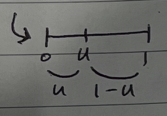
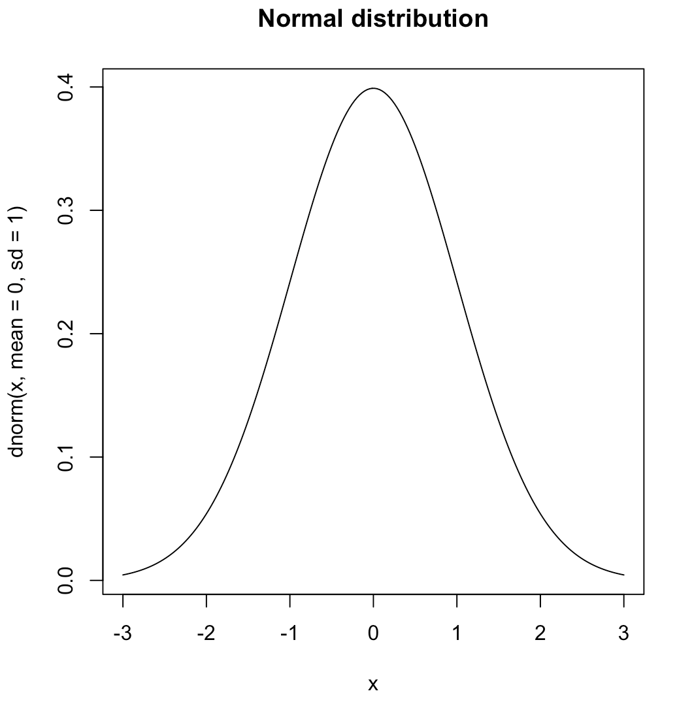

> 이 포스팅은 Harvard에서 진행된 Joe Blitzstein의 Statics 110 강좌를 기반으로 작성되었습니다.  
- [강의 및 자료 링크](https://stat110.hsites.harvard.edu)

## (continue) 균등분포의 보편성

$$
\begin{align}
U \sim Unif(0, 1) \Rightarrow X = F^{-1}(U) \sim F \\
X \sim F \Rightarrow F(X) \sim Unif(0, 1)
\end{align}
$$

여기서 $F$ 는 연속이며, 단조 증가하는 함수라고 가정하여 미분이 가능하도록 한다.  
수식 (1)과 (2)는 역방향 관계이고, 같은 의미를 가진다.  

(1)  
(좌항) 균등분포를 따르는 확률변수 $U$ 가 있다.  
(우항) 이때 어떤 확률변수 $X$ 와 누적분포함수 $F$ 가 있다. $X := F^{-1}(U)$ 로 정의하면, 해당 확률변수는 $F$ 를 누적분포함수로 갖는다.  
- $F^{-1}(U)$: 균등분포를 따르는 확률변수 $U$ 에서 임의로 한 변수 $u$ 를 추출하여 $F^{-1}$ 에 대입한다.
- 즉, $X := F^{-1}(U)$ 는 확률(균등분포에서 추출한 값 $u$)에 해당하는 지점의 값을 의미한다.
- 결국 위와 같이 정의한 확률변수 $X$ 는 누적분포함수로 $F$ 를 갖는 확률변수가 된다.

(2)  
(좌항) $X$ 가 누적분포함수로 $F$ 를 가진다.  
(우항) 확률변수를 자신의 누적분포함수에 입력하면, 그 출력값들은 균등분포를 따른다. 위 식에서 $F(X)$ 는 샘플이 자신의 분포 안에서 차지하는 상대적인 위치를 반환한다.  
수식적으로 아래와 같이 증명한다.  

$$
\begin{align*}
P(F(X) \leqslant u) &= P(X \leqslant F^{-1}(u)) \\
&= F(F^{-1}(u)) \\
&= u _\blacksquare
\end{align*}
$$

### Simulation 예제

$F(x) = 1 - e^{-x}, \ x > 0$ 인 누적분포함수가 있다고 하고, $U \sim Unif(0, 1)$ 인 분포가 있다고 하자.  
> 위 $F$ 함수를 Expo(1)이라고 부른다.

이때 $X \sim F$ 임을 보여라.

$F^{-1}(u) = -\ln (1-u) \sim F$  
또한, $(1-u) \sim Unif(0, 1)$ 이며, 아래 그림을 통해서 알 수 있다.  

### 확률변수의 독립

`Defn` 모든 $x_1, ...x_n$ 에 대해서 만약 $P(X_1 \leqslant x_1, ..., X_n \leqslant x_n) = P(X_1 \leqslant x_1) \cdots P(X_n \leqslant x_n)$ 이면  $X_1, ... X_n$ 이 독립이다.

이산확률변수의 경우, $P(X_1 = x_1, ..., X_n = x_n) = P(X_1 = x_1) \cdots P(X_n = x_n)$ 을 만족하면 독립이다.

**[Example]**  
$\displaystyle X_1, X_2 \sim Bern(\frac{1}{2})$, i.i.d.인 coin toss 사건이고, $\displaystyle X_3 = \begin{cases}1 \ \text{if} \ X_1 = X_2 \\ 0 \ \text{otherwise}\end{cases}$ 이라고 하자.  

$(X_1, X_2)$, $(X_2, X_3)$, $(X_3, X_1)$ 은 pairwise indep.이지만 각각 indep.는 아니다.  

## Normal Distribution (정규분포)

> Gaussian Distribution이라고도 한다.

### Central Limit Theorem (중심 극한 정리)

> 증명은 나중에 나온다고 한다. 개념만 짚고 넘어가자.  

아주 많은 독립적인 확률분포들을 더하면 정규 분포에 수렴한다고 한다.  
아래 그림은 가장 일반적인 종 형태의 정규분포를 나타낸다.

### $N(0, 1)$  

정규분포는 $N(\mu, \sigma^2)$ 으로 표현하며, $\mu$ 는 평균을, $\sigma$ 는 표준편차를 의미한다.  

가장 표준적인 정규분포 $N(0, 1)$ 에 대해서 알아보도록 하자.  
PDF: $f(z) = ce^{-z^2/2}$  
- $c$: normalizing factor(정규화 상수)로, CDF의 총합이 1이 되도록 맞춰주는 역할을 한다.  

### Normalizing Factor 구하기

식은 간단한다. 다음 식을 풀면 된다.  

$$
\int^\infty_{-\infty} ce^{-z^2/2} dz = 1
$$

하지만 적분은 간단하지 않다.. 아래와 같이 적분한다.  

$$
\begin{align*}
\int^\infty_{-\infty} e^{-z^2/2} dz \int^\infty_{-\infty} e^{-z^2/2} dz &= \int^\infty_{-\infty} e^{-x^2/2} dx \int^\infty_{-\infty} e^{-y^2/2} dy &\ \text{각각 x, y로 치환} \\
&= \int^\infty_{-\infty} \int^\infty_{-\infty} e^{-({x}^2 + {y}^2)/2} dx dy \\
&= \int^{2\pi}_0 \int^\infty_0 e^{-r^2/2} dr d\theta &\ \text{피타고라스의 정리} \\
&= \int^{2\pi}_0 \bigg( \int^\infty_0 e^{-r^2/2} dr \bigg) d\theta &\ u = r^2/2, du = rdr \\
&= \int^{2 \pi}_0 \bigg[ -e^{-u} \bigg]^\infty_0 d\theta \\
&= \int^{2 \pi}_0 1 d\theta \\
&= 2\pi
\end{align*}
$$

즉, $\displaystyle \int^\infty_{-\infty} e^{-z^2/2} dz = \sqrt{2\pi}$ 이고, $\displaystyle \int^\infty_{-\infty} ce^{-z^2/2} dz = c\sqrt{2\pi} = 1$ 이어야 하므로, $\displaystyle c = \frac{1}{\sqrt{2\pi}}$ 이다.

### 정규분포의 평균과 분산

$Z \sim N(0, 1)$ 인 확률변수 $Z$ 가 있다. $N(0, 1)$ 에서 이미 평균과 분산이 각각 0, 1임을 알 수 있지만 이를 수식을 통해 증명해보자.

**[평균]**  

$$
\begin{align*}
E(Z) &= \frac{1}{\sqrt{2\pi}} \int^\infty_{-\infty} z e^{-z^2/2} dz \\
&= 0 _\blacksquare
\end{align*}
$$

위 식은 기함수 * 우함수 = 기함수이기 때문에 대칭성에 의해 0이다.

**[분산]**  

$$
\begin{align*}
Var(Z) &= E(Z^2) - \{E(Z)\}^2 \\
&= E(Z^2) \\
&= \frac{1}{\sqrt{2\pi}} \int^\infty_{-\infty} z^2 e^{-z^2/2} dz \\
&= \frac{2}{\sqrt{2\pi}} \int^\infty_{0} z^2 e^{-z^2/2} dz &\ \text{by symmetry} \\
& \ \ \ \ u = z, du = dz \\
& \ \ \ \ dv = ze^{-z^2/2}dz, v = -e^{-z^2/2} \\
&= \frac{2}{\sqrt{2\pi}} \bigg( uv\mid^\infty_0 - \int^\infty_0 -e^{-z^2/2} dz \bigg) \\
& \ \ \ \ z \to \infty, uv \to 0 \ \text{지수 함수의 속도가 더 빠름} \\
& \ \ \ \ z \to 0, uv \to 0 \\
&= \frac{2}{\sqrt{2\pi}} \int^\infty_0 e^{-z^2/2} dz \\
&= \frac{2}{\sqrt{2\pi}} \frac{\sqrt{2\pi}}{2} \\
&= 1_\blacksquare
\end{align*}
$$